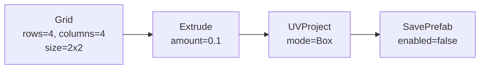
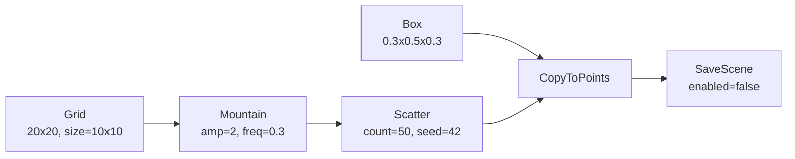
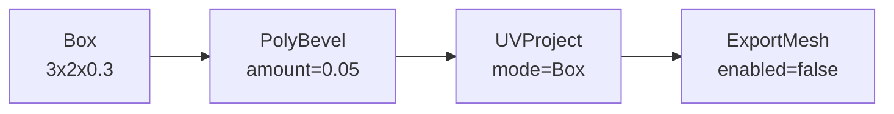

# PCG Toolkit 示例 SubGraph

本目录包含 3 个示例 SubGraph，展示 PCG Toolkit 的典型工作流。

---

## 使用方法

1. 在 Unity 中通过菜单 **PCG Toolkit > Generate Example SubGraphs** 生成示例 `.asset` 文件
2. 双击 `Assets/PCGToolkit/Examples/SubGraphs/` 下的 `.asset` 文件打开 PCGGraphEditorWindow
3. 点击工具栏的 **Execute** 按钮执行图
4. 可以修改节点参数后重新执行，观察输出变化

---

## 示例 1：ParametricTable（参数化桌面）

参数化桌面生成器，可调节网格密度和挤出高度。

| 节点 | 关键参数 | 说明 |
|------|----------|------|
| Grid | rows=4, columns=4, size=2x2 | 生成 4x4 网格平面 |
| Extrude | amount=0.1 | 沿法线挤出，形成桌面厚度 |
| UVProject | mode=Box | Box 映射方式生成 UV |
| SavePrefab | enabled=false | 设为 true 可输出 Prefab |

---

## 示例 2：TerrainScatter（地形散布）

在起伏地形上随机散布小方块，模拟环境物件分布。

| 节点 | 关键参数 | 说明 |
|------|----------|------|
| Grid | rows=20, columns=20, size=10x10 | 大面积地形底面 |
| Mountain | amplitude=2, frequency=0.3 | 生成起伏地形 |
| Scatter | count=50, seed=42 | 在地形上随机撒点 |
| Box | size=0.3x0.5x0.3 | 散布物件的原型几何体 |
| CopyToPoints | — | 将 Box 复制到 Scatter 产生的点上 |
| SaveScene | enabled=false | 设为 true 可输出场景 |

---

## 示例 3：BeveledWall（倒角墙体模块）

建筑模块化墙体，带边缘倒角和 UV 映射。

| 节点 | 关键参数 | 说明 |
|------|----------|------|
| Box | size=3x2x0.3 | 墙体基础形状 |
| PolyBevel | amount=0.05 | 边缘倒角，柔化硬边 |
| UVProject | mode=Box | Box 映射方式生成 UV |
| ExportMesh | enabled=false | 设为 true 可导出 FBX |

---

## 如何基于示例创建自己的 SubGraph

1. 打开任意示例 `.asset`
2. 使用 **Save As** 另存为新文件
3. 添加、删除或修改节点和连线
4. 调整参数直到满意
5. 点击 **Execute** 验证输出
