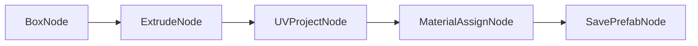
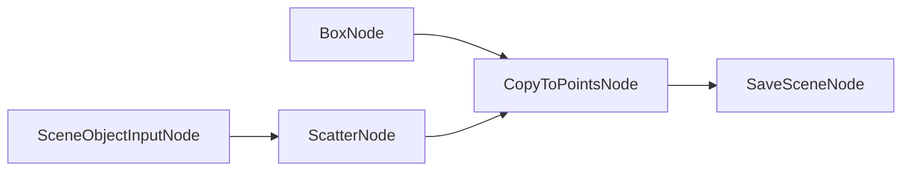

# PCG for Unity 节点编辑器 & PCG Graph 使用说明文档

---

## 一、概述

PCG Toolkit for Unity 是一套纯 **Editor-only** 的程序化内容生成框架，灵感来自 Houdini SOP 节点体系。它提供基于 Unity `GraphView` 的可视化节点编辑器，用户通过拖拽连线构建程序化几何体生产管线，最终输出 FBX、Prefab、Material、Scene 等 Unity 标准资产。所有代码位于 `Assets/PCGToolkit/Editor/` 下，不会编译进 Runtime build。 [0-cite-0](#0-cite-0)

---

## 二、安装与依赖

### 必需 Package

在 `Packages/manifest.json` 中确保包含：

```json
{
  "dependencies": {
    "com.unity.formats.fbx": "5.1.1",
    "com.unity.render-pipelines.universal": "...",
    "com.unity.test-framework": "..."
  }
}
``` [0-cite-1](#0-cite-1) 

### 第三方库（已内置于 `Editor/ThirdParty/`）

| 库 | 用途 |
|---|---|
| `geometry3Sharp` | 几何内核：Boolean、Remesh、Reduce、空间查询 |
| `LibTessDotNet` | 多边形三角化 |
| `xatlas` | UV 自动展开与打包 |
| `MIConvexHull` | 凸包、Delaunay、Voronoi |
| `Clipper2` | 2D 布尔运算 | [0-cite-2](#0-cite-2) 

---

## 三、打开节点编辑器

菜单栏 → **PCG Toolkit > Node Editor**

打开后会自动弹出 `PCGNodeInspectorWindow`（参数编辑面板）。 [0-cite-3](#0-cite-3) [0-cite-4](#0-cite-4) 

### 编辑器界面组成

| 区域 | 说明 |
|---|---|
| **主画布** (`PCGGraphView`) | 节点拖拽、连线、缩放/平移 |
| **工具栏** | New / Save / Save As / Load / Execute / Run To Selected / Stop / Export All / Inspector / 语言切换 |
| **Inspector 面板** (`PCGNodeInspectorWindow`) | 选中节点的参数编辑、几何体统计、属性列表 |
| **错误面板** (`PCGErrorPanel`) | 执行失败时显示错误节点和信息，点击可定位 |
| **预览窗口** (`PCGNodePreviewWindow`) | 双击节点查看几何体 3D 预览 |
| **进度条** | 工具栏右侧显示执行进度 | [0-cite-5](#0-cite-5) 

---

## 四、基本工作流

### 4.1 创建节点

在画布空白处按 **Space** 或 **Tab** 键打开搜索菜单 (`PCGNodeSearchWindow`)，按名称或分类搜索节点。也可以从已有端口拖线到空白处，会自动过滤兼容类型的节点。 [0-cite-6](#0-cite-6) 

### 4.2 连线

端口之间只有类型兼容才能连线（如 Geometry→Geometry、Float→Float），`Any` 类型可与任意类型连接。节点靠近时会自动对齐端口（Snap 功能，50 单位阈值）。 [0-cite-7](#0-cite-7) 

### 4.3 编辑参数

选中节点后在 **Inspector 面板** 中编辑参数。支持的参数类型：

| 类型 | Inspector 控件 |
|---|---|
| `Float` | FloatField / Slider |
| `Int` | IntField / Slider |
| `Bool` | Toggle |
| `String` | TextField |
| `Vector3` | Vector3Field |
| `Color` | ColorField |
| `Enum` | Dropdown（当 `EnumOptions` 非空时） |
| `SceneObject` | ObjectField（选择场景 GameObject）| [0-cite-8](#0-cite-8) [0-cite-9](#0-cite-9) 

### 4.4 执行图

| 按钮 | 功能 |
|---|---|
| **Execute** | 异步执行整个图（DAG 拓扑排序），节点逐个高亮并显示耗时 |
| **Run To Selected** | 执行到选中节点后暂停，可预览中间结果 |
| **Stop** | 中止执行 |
| **Export All** | 执行整个图，所有 `enabled=true` 的 Output 节点会实际输出资产 | [0-cite-10](#0-cite-10) 

执行引擎 `PCGAsyncGraphExecutor` 采用帧分布式执行，每帧处理一个节点，编辑器保持响应。每个节点执行经历三个阶段：**Highlight**（黄色高亮）→ **Execute**（执行逻辑）→ **ShowResult**（显示耗时）。 [0-cite-11](#0-cite-11) 

### 4.5 保存与加载

- **Ctrl+S**：保存（首次保存弹出路径选择）
- **Ctrl+Shift+S**：另存为
- 图保存为 `PCGGraphData` ScriptableObject（`.asset` 文件）
- 序列化内容包括：节点位置、连线、参数值、分组、便签 [0-cite-12](#0-cite-12) [0-cite-13](#0-cite-13) 

### 4.6 预设系统

在 Inspector 中可以为单个节点保存/加载参数预设，预设以 JSON 格式存储在 `Assets/PCGToolkit/Presets/` 目录下，文件名格式为 `{NodeType}_{PresetName}.json`。 [0-cite-14](#0-cite-14) 

---

## 五、核心数据模型

所有节点之间传递的核心数据类型是 `PCGGeometry`：

```csharp
public class PCGGeometry
{
    public List<Vector3> Points;          // 顶点位置
    public List<int[]>   Primitives;      // 面（支持 N-gon）
    public List<int[]>   Edges;           // 边（按需构建）
    public AttributeStore PointAttribs;   // 点级属性
    public AttributeStore VertexAttribs;  // 顶点级属性
    public AttributeStore PrimAttribs;    // 面级属性
    public AttributeStore DetailAttribs;  // 全局属性
    public Dictionary<string, HashSet<int>> PointGroups;  // 点分组
    public Dictionary<string, HashSet<int>> PrimGroups;   // 面分组
}
```

Unity `Mesh` 只在最终输出阶段由 `PCGGeometryToMesh` 转换生成。 [0-cite-15](#0-cite-15) [0-cite-16](#0-cite-16)

### 常用内置属性

| 属性名 | 层级 | 类型 | 说明 |
|---|---|---|---|
| `@P` | Point | Vector3 | 顶点位置（即 Points 列表） |
| `@N` | Point | Vector3 | 法线 |
| `@uv` | Point/Vertex | Vector2 | UV 坐标 |
| `@Cd` | Point | Color | 顶点颜色 |
| `@material` | Prim | String | 材质路径 |
| `@name` | Detail/Point | String | 名称 |
| `@orient` | Point | Vector3 | 朝向（欧拉角） |
| `@pscale` | Point | Float | 点缩放 | [0-cite-17](#0-cite-17) 

---

## 六、完整节点清单

### Tier 0 — 创建 / 基础 (`Create/`)

| 节点 | 说明 |
|---|---|
| `BoxNode` | 参数化长方体 |
| `SphereNode` | UV 球体 |
| `TubeNode` | 圆柱/管道 |
| `GridNode` | 平面网格 |
| `CircleNode` | 圆形 |
| `LineNode` | 线段 |
| `TorusNode` | 环面 |
| `PlatonicSolidsNode` | 柏拉图正多面体 |
| `HeightfieldNode` | 高度场 |
| `FontNode` | 文字转几何体 |
| `ImportMeshNode` | Unity Mesh → PCGGeometry |
| `MergeNode` | 合并多个几何体 |
| `DeleteNode` | 按条件删除点/面 |
| `TransformNode` | 平移/旋转/缩放 |
| `GroupCreateNode` | 按条件创建分组 |
| `GroupExpressionNode` | 表达式创建分组 |


### Tier 0 — 属性 (`Attribute/`)

| 节点 | 说明 |
|---|---|
| `AttributeCreateNode` | 创建新属性 |
| `AttributeSetNode` | 设置属性值 |
| `AttributeDeleteNode` | 删除属性 |
| `AttributeCopyNode` | 复制属性 |
| `AttributePromoteNode` | 属性层级提升/降级 |
| `AttributeRandomizeNode` | 随机化属性值 |
| `AttributeTransferNode` | 跨几何体传递属性 |
| `AttribWrangleNode` | VEX 风格表达式脚本 |


### Tier 0 — 场景输入 (`Input/`)（第6轮迭代新增）

| 节点 | 说明 |
|---|---|
| `SceneObjectInputNode` | 从场景 GameObject 的 MeshFilter 读取网格 |
| `ScenePointsInputNode` | 将场景 GameObject 子对象位置转为点云 | [0-cite-18](#0-cite-18) 

### Tier 1 — 几何操作 (`Geometry/`)

| 节点 | 说明 |
|---|---|
| `ExtrudeNode` | 面挤出 |
| `BooleanNode` | 布尔运算（Union/Subtract/Intersect） |
| `SubdivideNode` | 细分（Catmull-Clark/Loop） |
| `NormalNode` | 重算法线 |
| `FuseNode` | 合并重复点 |
| `ReverseNode` | 翻转面朝向 |
| `ClipNode` | 平面裁切 |
| `BlastNode` | 按 Group 删除 |
| `MeasureNode` | 计算面积/周长/曲率 |
| `SortNode` | 重排点/面顺序 |
| `InsetNode` | 面内缩 |
| `FacetNode` | 面片化 |
| `MirrorNode` | 镜像 |
| `PeakNode` | 沿法线偏移 |
| `TriangulateNode` | 三角化 |
| `ConnectivityNode` | 连通性分析 |
| `PackNode` / `UnpackNode` | 打包/解包 |
| `PolyExpand2DNode` | 2D 多边形偏移 |
| `MaterialAssignNode` | 材质分配 |


### Tier 2 — UV (`UV/`)

| 节点 | 说明 |
|---|---|
| `UVProjectNode` | 平面/柱面/球面/盒式投影 |
| `UVUnwrapNode` | 自动 UV 展开（xatlas） |
| `UVLayoutNode` | UV 岛排布打包 |
| `UVTransformNode` | UV 空间变换 |
| `UVTrimSheetNode` | Trim Sheet UV 映射（第5轮迭代新增） |


### Tier 3 — 分布与实例化 (`Distribute/`)

| 节点 | 说明 |
|---|---|
| `ScatterNode` | 表面随机/泊松盘分布 |
| `CopyToPointsNode` | 在点位置复制几何体 |
| `InstanceNode` | 按属性选择不同几何体实例化 |
| `RayNode` | 将点投射到表面 |
| `ArrayNode` | 阵列复制 |
| `PointsFromVolumeNode` | 体积内生成点 |


### Tier 4 — 曲线 (`Curve/`)

| 节点 | 说明 |
|---|---|
| `CurveCreateNode` | Bezier/Polyline 曲线 |
| `ResampleNode` | 重采样 |
| `SweepNode` | 沿曲线扫掠截面 |
| `CarveNode` | 裁切曲线 |
| `FilletNode` | 倒角 |
| `PolyWireNode` | 曲线转管道 |


### Tier 5 — 变形 (`Deform/`)

| 节点 | 说明 |
|---|---|
| `MountainNode` | Perlin/Simplex/Worley 噪声位移 |
| `BendNode` | 弯曲 |
| `TwistNode` | 扭曲 |
| `TaperNode` | 锥化 |
| `LatticeNode` | FFD 自由变形 |
| `SmoothNode` | 拉普拉斯平滑 |
| `NoiseNode` | 通用噪声 |
| `CreepNode` | 表面爬行变形 |


### Tier 6 — 高级拓扑 (`Topology/`)

| 节点 | 说明 |
|---|---|
| `PolyBevelNode` | 边/点倒角 |
| `PolyBridgeNode` | 桥接面 |
| `PolyFillNode` | 填充孔洞 |
| `RemeshNode` | 重新网格化 |
| `DecimateNode` | 减面 |
| `ConvexDecompositionNode` | 凸分解 |
| `EdgeDivideNode` | 边细分 |
| `PolySplitNode` | 多边形切割 |


### Tier 7 — 程序化规则 (`Procedural/`)

| 节点 | 说明 |
|---|---|
| `WFCNode` | Wave Function Collapse 模式生成 |
| `LSystemNode` | L-System 分形/植物生成 |
| `VoronoiFractureNode` | 泰森多边形碎裂 |


### Tier 8 — 输出 (`Output/`)

| 节点 | 说明 |
|---|---|
| `SavePrefabNode` | PCGGeometry → Prefab（含 Mesh .asset） |
| `ExportFBXNode` | 导出 FBX（无 FBX SDK 时回退为 OBJ） |
| `ExportMeshNode` | 保存原始 Mesh .asset |
| `AssemblePrefabNode` | 多输入组装层级 Prefab |
| `SaveMaterialNode` | 创建/配置 Material |
| `SaveSceneNode` | 实例化到 Unity Scene |
| `LODGenerateNode` | 自动生成 LOD 链 |

所有 Output 节点都有 `enabled` 参数，设为 `false` 时透传跳过不执行实际输出。 [0-cite-19](#0-cite-19)

### 工具 / 控制流 (`Utility/`)

| 节点 | 说明 |
|---|---|
| `ConstFloat/Int/Bool/String/Vector3/Color` | 常量节点 |
| `MathFloatNode` / `MathVectorNode` | 数学运算 |
| `SwitchNode` | 条件切换 |
| `SplitNode` | 按 Group 分流 |
| `ForEachNode` | 循环 |
| `CompareNode` | 比较 |
| `FitRangeNode` | 范围映射 |
| `RampNode` | 渐变曲线 |
| `RandomNode` | 随机数 |
| `NullNode` | 空节点（透传） |
| `GroupCombineNode` | 分组合并 |
| `SubGraphNode` / `SubGraphInputNode` / `SubGraphOutputNode` | 子图系统 |


---

## 七、SubGraph 子图系统

当单个图超过 **20~30 个节点** 时，建议封装为 SubGraph 管理复杂度。

### 使用方法

1. 创建一个新的 PCG Graph（`.asset`），在其中放置 `SubGraphInputNode`（入口）和 `SubGraphOutputNode`（出口）
2. 在父图中添加 `SubGraphNode`，将其 `subGraphData` 指向上述 `.asset`
3. `SubGraphNode` 会自动根据子图中的 Input/Output 节点动态生成对应端口

### 数据流

- 父图数据通过 `ctx.GlobalVariables["SubGraphInput.{portName}"]` 注入子图
- 子图结果通过 `ctx.GlobalVariables["SubGraphOutput.{portName}"]` 返回父图
- 子图使用独立的 `PCGContext`，不会污染父图缓存 [0-cite-20](#0-cite-20) [0-cite-21](#0-cite-21)

---

## 八、场景交互功能（第6轮迭代）

### 8.1 场景对象输入

新增 `SceneObject` 端口类型，在 Inspector 中渲染为 Unity `ObjectField`，可直接拖入场景中的 GameObject。

- **SceneObjectInputNode**：读取场景 GameObject 的 MeshFilter，转为 PCGGeometry。支持 `Apply Transform`（烘焙世界变换）和 `Read Materials`（读取材质路径写入 `@material` 属性）。
- **ScenePointsInputNode**：将 GameObject 子对象的位置转为点云，附带 `@name`、`@orient`、`@pscale` 属性，可直接接入 `CopyToPointsNode`。 [0-cite-22](#0-cite-22) [0-cite-23](#0-cite-23)

### 8.2 场景预览

- **线框预览**：`PCGScenePreview.Show(geo)` 在 SceneView 中绘制绿色线框和橙色点云
- **Inject to Scene**：Output 节点 Inspector 中的 "Inject to Scene" 按钮，将执行结果临时实例化为场景 GameObject（`HideFlags.DontSave`，不随场景保存） [0-cite-24](#0-cite-24)

### 8.3 PCGGraphRunner（HDA 风格场景组件）

`PCGGraphRunner` 是一个 `MonoBehaviour`，可挂载到场景 GameObject 上，类似 Houdini 的 HDA：

```
Inspector 面板：
├── Graph Asset        → 拖入 PCGGraphData .asset
├── Output Target      → 输出目标 GameObject
├── Run On Start       → 是否 Start() 时自动执行
├── Instantiate Output → 是否实例化输出 Mesh
├── [Sync Exposed Params from Graph]  → 同步暴露参数
├── Exposed Parameters → 可覆盖的参数列表
└── [Run Graph]        → 手动执行
```

**暴露参数**：在节点的 `PCGParamSchema` 中设置 `Exposed = true`，然后在 Runner Inspector 中点击 "Sync Exposed Params from Graph" 即可拉取。修改暴露参数后点击 "Run Graph"，Runner 会 Clone 一份 GraphData 并覆盖参数后执行，不会污染原始资产。 [0-cite-25](#0-cite-25) [0-cite-26](#0-cite-26) [0-cite-27](#0-cite-27)

---

## 九、典型工作流示例

### 示例 1：生成带 UV 的建筑模块并导出 Prefab



1. `BoxNode` 创建基础长方体
2. `ExtrudeNode` 挤出顶面形成屋顶
3. `UVProjectNode` 盒式投影生成 UV
4. `MaterialAssignNode` 分配材质
5. `SavePrefabNode` 输出为 `.prefab`

### 示例 2：从场景读取地形 → 散布物体



1. `SceneObjectInputNode` 读取场景中的地形 Mesh
2. `ScatterNode` 在表面泊松盘分布种子点
3. `CopyToPointsNode` 在每个点位置复制 Box
4. `SaveSceneNode` 实例化到场景

### 示例 3：使用 PCGGraphRunner 参数化生成

1. 在节点编辑器中构建图，将关键参数（如 `sizeX`）的 Schema 设为 `Exposed = true`
2. 保存为 `.asset`
3. 场景中创建空 GameObject → Add Component → `PCG Graph Runner`
4. 拖入 Graph Asset → 点击 "Sync Exposed Params" → 调整参数 → 点击 "Run Graph"

---

## 十、快捷键

| 快捷键 | 功能 |
|---|---|
| `Space` / `Tab` | 打开节点搜索菜单 |
| `Ctrl+S` | 保存 |
| `Ctrl+Shift+S` | 另存为 |
| 双击节点 | 打开 3D 预览窗口 |
| 点击错误面板条目 | 定位到出错节点 | [0-cite-12](#0-cite-12) 

---

## 十一、错误处理与调试

- 执行失败的节点会显示**红色边框**，错误信息出现在底部 `PCGErrorPanel`
- 点击错误条目自动聚焦到对应节点
- Inspector 面板显示节点执行耗时和输出几何体统计（点数、面数、属性列表）
- `Run To Selected` 可在任意节点暂停，检查中间结果
- 支持 Unity 原生 **Undo/Redo**