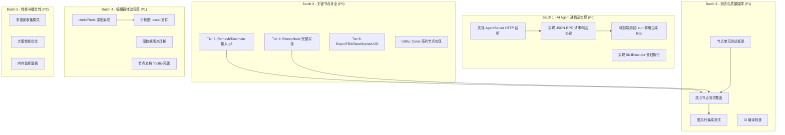

# PCG for Unity 项目评价与第7轮迭代规划

---

## 一、项目现状评价

### 1.1 已完成的核心能力

经过6轮迭代，项目已建立起一个**架构完整、功能覆盖面广**的程序化内容生成框架：

**核心数据层**：`PCGGeometry` + `AttributeStore` 四级属性系统（Point/Vertex/Prim/Detail）+ 分组系统，忠实对标 Houdini 的几何数据模型。 [0-cite-0](#0-cite-0)

**节点库规模**：12 个分类目录下约 **90+ 个节点文件**，覆盖从基础几何体创建到程序化生成（WFC/L-System/Voronoi）的完整管线。

**编辑器工具链**：
- GraphView 可视化编辑器，支持搜索菜单、MiniMap、分组、便签、复制粘贴、端口类型过滤 [0-cite-1](#0-cite-1)
- 分帧异步执行引擎 `PCGAsyncGraphExecutor`，支持断点、Run To Selected、脏标记增量执行 [0-cite-2](#0-cite-2)
- Inspector 参数面板、3D 预览窗口、错误面板、SceneView 线框预览 [0-cite-3](#0-cite-3)

**HDA 风格场景交互**（第6轮）：`PCGGraphRunner` MonoBehaviour + 反射 Bridge 模式 + Exposed Parameters + SceneObject 端口类型 [0-cite-4](#0-cite-4)

**辅助系统**：VEX 风格表达式解析器、中英文本地化、预设系统、SubGraph 子图封装 [0-cite-5](#0-cite-5)

**第三方库集成**：geometry3Sharp、LibTessDotNet、xatlas、MIConvexHull、Clipper2 全部到位

### 1.2 整体评分

| 维度 | 评分 | 说明 |
|------|------|------|
| **架构设计** | ★★★★☆ | 三层解耦清晰，IPCGNode 统一接口设计优秀，Runtime/Editor Bridge 模式合理 |
| **节点覆盖度** | ★★★★☆ | 文件数量充足，但部分节点 Execute 为 TODO 或简化实现 |
| **编辑器体验** | ★★★★☆ | 功能丰富（断点、预览、预设、本地化），但缺少 Undo/Redo 深度集成 |
| **代码质量** | ★★★☆☆ | 快速迭代痕迹明显，多次 fix commit 修复编译错误，部分代码有残留 TODO |
| **测试覆盖** | ★★☆☆☆ | 仅有 ExpressionParserTests，节点逻辑无测试 |
| **AI Agent 层** | ★☆☆☆☆ | 骨架代码，核心功能全部 TODO |

---

## 二、当前不足与缺点

### 2.1 关键缺陷（P0）

**1. AI Agent 通信层完全未实现**

`AgentServer.Start()` / `Stop()` / `HandleRequest()` 全部是 TODO 空壳，`SkillExecutor.ExecutePipeline()` 未实现。这是项目的核心目标之一（"AI Agent 驱动的 3D 资产生产管线"），但目前完全不可用。 [0-cite-6](#0-cite-6) [0-cite-7](#0-cite-7)

**2. 大量节点 Execute 为 TODO 或简化实现**

根据 `NODE_TODO.md`，26 个追踪节点中有 **16 个待实现**：
- Tier 4 (Curve): SweepNode、CurveCreateNode、FilletNode — 3 个
- Tier 6 (Topology): 全部 6 个（PolyBevel/Bridge/Fill/Remesh/Decimate/ConvexDecomposition）
- Tier 7 (Procedural): 全部 3 个（WFC/LSystem/Voronoi）
- Tier 8 (Output): ExportFBX/SaveScene/LODGenerate — 3 个

此外，Const 系列节点（6 个）的 Execute 也标注为 TODO。 [0-cite-8](#0-cite-8)

**注意**：虽然文件存在且有代码，但部分节点（如 `RemeshNode`）使用的是**自写简化算法**而非 geometry3Sharp 的 `Remesher`，实际效果与 Houdini 对标差距较大。 [0-cite-9](#0-cite-9)

**3. WFC/LSystem/Voronoi 节点实现过于简化**

`WFCNode` 为每个瓦片生成简单立方体，没有实际的 tileSet 几何体实例化能力，与设计文档中"从 tileSet 的面组中读取邻接规则"的描述不符。 [0-cite-10](#0-cite-10)

### 2.2 重要缺陷（P1）

**4. 测试覆盖严重不足**

整个项目仅有 1 个测试文件 `ExpressionParserTests.cs`，没有任何节点执行逻辑的单元测试。对于一个几何处理工具库，缺少回归测试意味着每次迭代都可能引入隐蔽的几何错误。

**5. 迭代质量问题**

从 commit 历史看，几乎每轮迭代后都紧跟多个 `fix:` 提交修复编译错误（重复代码、孤立代码块、程序集引用错误等），说明代码提交前缺少编译验证和自检流程。 [0-cite-11](#0-cite-11)

**6. Undo/Redo 未深度集成**

文档声称支持 Unity Undo 系统，但代码中未见 `Undo.RecordObject` / `Undo.RegisterCompleteObjectUndo` 的调用，参数修改和节点操作可能无法撤销。

**7. 图数据版本迁移机制缺失**

`PCGGraphData` 没有版本号字段，随着迭代不断新增字段（如 `ExposedParameters`、`Groups`、`StickyNotes`），旧版 `.asset` 文件加载时可能出现兼容性问题。

### 2.3 改进空间（P2）

**8. 性能优化缺失**
- `PCGGeometry` 使用 `List<int[]>` 存储面，大量小数组分配会造成 GC 压力
- 没有空间索引（BVH/Octree）支持，Scatter 的松弛迭代使用简单空间哈希
- 没有节点执行的内存占用监控

**9. 错误处理不够健壮**
- 执行引擎遇到第一个错误就停止整个图，没有"跳过错误节点继续执行"的选项
- `PCGContext.HasError` 是单一布尔值，无法记录多个错误

**10. 缺少示例图和端到端验证**
- 没有任何 `.asset` 示例图文件
- HandBook 中的工作流示例是文字描述，没有可直接打开的 demo

---

## 三、第7轮迭代任务大纲与计划

### 核心思路

> **让 PCG Toolkit 从"架构 demo"进化为"可实际使用的工具"**——补齐 AI Agent 通信层、夯实节点实现质量、建立测试和验证体系。

---

### Batch 1 — AI Agent 通信层实现（P0，最高优先级）

这是项目的**核心差异化能力**，目前完全不可用。

| 任务 | 文件 | 说明 |
|------|------|------|
| **A1**: 实现 HTTP 服务器 | `AgentServer.cs` | 使用 `System.Net.HttpListener` 实现真实的 HTTP 服务器，监听 `localhost:8765`，在 `EditorApplication.update` 中轮询请求 |
| **A2**: 实现 JSON-RPC 协议 | `AgentProtocol.cs` | 完善请求/响应的 JSON 序列化，支持 `execute_skill`、`execute_pipeline`、`list_skills`、`get_schema` 四种 action |
| **A3**: 实现管线执行 | `SkillExecutor.cs` | `ExecutePipeline()` 实现链式调用：上一个 Skill 的 PCGGeometry 输出作为下一个的输入 |
| **A4**: 实现 SubGraph 作为 Skill | `PCGNodeSkillAdapter.cs` | 让保存的 SubGraph `.asset` 可以作为高层 Skill 被 AI 调用 |
| **A5**: 端到端验证 | 新建 `Tests/AgentIntegrationTest.cs` | 编写测试：启动 AgentServer → 发送 HTTP 请求生成 Box → 验证返回的几何体数据 |

**预期产出**：AI Agent 可以通过 HTTP 调用 PCG 节点生成几何体并获取结果。

---

### Batch 2 — 关键节点补全（P0）

优先补全影响实际使用的核心节点，用 geometry3Sharp 替换简化实现。

| 任务 | 文件 | 说明 |
|------|------|------|
| **B1**: RemeshNode 接入 g3 | `RemeshNode.cs` | 替换自写算法，使用 `g3.Remesher` 实现真正的各向同性重网格化 |
| **B2**: DecimateNode 接入 g3 | `DecimateNode.cs` | 使用 `g3.Reducer` 实现 QEM 减面 |
| **B3**: SweepNode 完整实现 | `SweepNode.cs` | 实现沿 backbone 曲线扫掠截面，使用 Frenet 坐标系定向 |
| **B4**: CurveCreateNode 实现 | `CurveCreateNode.cs` | 实现 Bezier/NURBS/Polyline 曲线创建 |
| **B5**: ExportFBXNode 实现 | `ExportFBXNode.cs` | 接入 `com.unity.formats.fbx` 的 `ModelExporter` API |
| **B6**: SaveSceneNode 实现 | `SaveSceneNode.cs` | 实现 `EditorSceneManager.SaveScene` 集成 |
| **B7**: LODGenerateNode 实现 | `LODGenerateNode.cs` | 基于 DecimateNode 逻辑生成多级 LOD，组装 `LODGroup` |
| **B8**: Const 系列节点 | `ConstFloat/Int/Bool/String/Vector3/ColorNode.cs` | 实现 Execute 方法，将值写入 `ctx.GlobalVariables` |

---

### Batch 3 — 测试与质量保障（P1）

| 任务 | 文件 | 说明 |
|------|------|------|
| **C1**: 节点测试框架 | 新建 `Tests/NodeTestBase.cs` | 提供 `CreateContext()`、`ExecuteNode()`、`AssertGeometry()` 等辅助方法，简化节点测试编写 |
| **C2**: Tier 0 节点测试 | 新建 `Tests/CreateNodeTests.cs` | 覆盖 Box/Sphere/Grid/Tube/Merge/Transform/Delete 的基本正确性（点数、面数、包围盒） |
| **C3**: Tier 1 节点测试 | 新建 `Tests/GeometryNodeTests.cs` | 覆盖 Extrude/Boolean/Subdivide/Fuse/Normal 的正确性 |
| **C4**: 图执行集成测试 | 新建 `Tests/GraphExecutionTests.cs` | 构建简单图（Box→Extrude→SavePrefab），验证端到端执行 |
| **C5**: CI 编译检查 | 新建 `.github/workflows/build.yml` | GitHub Actions 中使用 Unity 命令行编译，确保每次提交不引入编译错误 |

---

### Batch 4 — 编辑器体验完善（P1）

| 任务 | 文件 | 说明 |
|------|------|------|
| **D1**: Undo/Redo 集成 | `PCGGraphView.cs`、`PCGNodeInspectorWindow.cs` | 在节点创建/删除/连线/参数修改时调用 `Undo.RecordObject(graphData)`，支持 Ctrl+Z 撤销 |
| **D2**: 图数据版本迁移 | `PCGGraphData.cs` | 新增 `int Version` 字段，在 `OnEnable()` 中检测版本并执行迁移逻辑（如补充缺失的 `ExposedParameters` 列表） |
| **D3**: 示例图文件 | 新建 `Assets/PCGToolkit/Examples/` | 提供 3 个示例 `.asset` 图：(1) 基础建筑模块 (2) 散布工作流 (3) 曲线扫掠管道 |
| **D4**: 节点 Tooltip 完善 | 各节点文件 | 确保每个节点的 `Description` 和每个参数的 `Description` 都有清晰的中英文说明 |

---

### Batch 5 — 性能与健壮性（P2）

| 任务 | 文件 | 说明 |
|------|------|------|
| **E1**: 多错误收集 | `PCGContext.cs` | 将 `HasError`/`ErrorMessage` 改为 `List<PCGError>` 错误列表，支持"收集所有错误后统一报告"模式 |
| **E2**: 执行引擎容错 | `PCGGraphExecutor.cs` | 新增 `ContinueOnError` 选项，错误节点输出空几何体，下游继续执行 |
| **E3**: 性能 Profiler | 新建 `Graph/PCGPerformancePanel.cs` | 在编辑器中显示每个节点的执行耗时、输出点/面数、内存估算的表格视图 |

---

### 优先级与依赖关系

| 优先级 | Batch | 核心价值 | 前置依赖 |
|--------|-------|----------|----------|
| **P0** | Batch 1 | AI Agent 可用（项目核心目标） | 无 |
| **P0** | Batch 2 | 节点实际可用（工具基本功能） | 无（可与 Batch 1 并行） |
| **P1** | Batch 3 | 质量保障（防止回归） | Batch 2 部分完成后开始 |
| **P1** | Batch 4 | 用户体验（可交付状态） | 无（可与 Batch 1/2 并行） |
| **P2** | Batch 5 | 健壮性（生产级质量） | Batch 1+2+3 |

### 关键技术难点

1. **HttpListener 在 Unity Editor 中的线程安全**：`HttpListener` 运行在后台线程，回调中不能直接调用 Unity API。需要用 `EditorApplication.update` + `ConcurrentQueue` 将请求转发到主线程执行。

2. **geometry3Sharp 的 DMesh3 ↔ PCGGeometry 双向转换**：`GeometryBridge` 已存在但需要确保 UV、法线、分组等属性在转换中不丢失，特别是 Remesh/Decimate 后的属性插值。 [0-cite-12](#0-cite-12)

3. **SweepNode 的 Frenet 坐标系退化**：当曲线曲率为零（直线段）时 Frenet 坐标系退化，需要使用 Rotation Minimizing Frame (RMF) 替代。

4. **CI 中的 Unity 命令行编译**：需要 Unity License 激活，可使用 `GameCI/unity-builder` GitHub Action 或 Unity Build Server License。