# PCG for Unity 第4轮迭代方向评估与计划大纲

## 项目现状总结

当前项目 v0.5.0-alpha，共 **~90 个节点**，分布在 12 个类别中。经过 3 轮迭代，核心节点能力（表达式系统、多材质、实例化、ForEach）已基本完备。但编辑器体验层面存在明显短板： [1-cite-0](#1-cite-0)

---

## 第4轮迭代方向

本轮聚焦三个方向：**编辑器体验优化**、**节点参数规范化**、**第3轮遗留 Bug 修复**。

---

## 迭代计划大纲

### 方向 A: 编辑器体验优化

#### A1: 中英文本地化系统 (P1)

**现状**: 所有 UI 文本硬编码。`DisplayName` 是英文，`Description` 是中文，toolbar 按钮全英文（"New"、"Save"、"Execute"），Inspector 标签也是英文。没有统一的语言切换机制。 [1-cite-1](#1-cite-1) [1-cite-2](#1-cite-2)

**方案**:
1. 新建 `Assets/PCGToolkit/Editor/Core/PCGLocalization.cs`，实现 `PCGLocalization` 静态类
2. 使用 `Dictionary<string, Dictionary<string, string>>` 存储 `{ "en": { "key": "value" }, "zh": { "key": "value" } }`
3. 在 `PCGParamSchema` 中将 `DisplayName` 和 `Description` 改为 localization key，或新增 `DisplayNameZh` / `DescriptionZh` 字段
4. 在 `PCGGraphEditorWindow` toolbar 添加语言切换按钮（EN/中）
5. 语言偏好存储到 `EditorPrefs`

#### A2: 节点搜索窗口增强 (P2)

**现状**: `PCGNodeSearchWindow` 只按 `DisplayName` 匹配，不支持中文搜索、别名搜索、描述搜索。 [1-cite-3](#1-cite-3)

**方案**:
1. 搜索时同时匹配 `DisplayName`、`Description`、`Name`（类型名）
2. 支持拼音首字母搜索（如输入 "jc" 匹配 "挤出"）
3. 在搜索结果中显示节点描述作为副标题

#### A3: 节点预设/收藏系统 (P3)

**现状**: 用户无法保存常用的节点参数配置。每次创建节点都从默认值开始。

**方案**:
1. 在 Inspector 面板添加 "Save Preset" / "Load Preset" 按钮
2. 预设存储为 JSON 文件到 `Assets/PCGToolkit/Presets/` 目录
3. 右键节点菜单添加 "Apply Preset" 子菜单

#### A4: 节点注释/便签 (P3)

**现状**: 图编辑器中无法添加注释或便签来标注节点用途。

**方案**:
1. 在 `PCGGraphView` 中支持创建 `StickyNote` 元素（GraphView 原生支持）
2. 序列化到 `PCGGraphData` 中

---

### 方向 B: 节点参数规范化（String → EnumOptions）

#### B1: 批量为缺失 EnumOptions 的节点补全下拉框 (P1)

**现状**: 项目中已有 `EnumOptions` 机制（第4次迭代加入），`PCGNodeVisual` 和 `PCGNodeInspectorWindow` 都已支持渲染 `PopupField<string>` 下拉框。但大量节点仍然使用裸字符串参数，用户需要手动输入 "linear"/"radial" 等值，容易拼错。 [1-cite-4](#1-cite-4)

以下是需要补全 `EnumOptions` 的完整清单（共 **21 个节点，约 30 个参数**）：

| 节点 | 参数名 | 当前默认值 | 应补全的 EnumOptions |
|------|--------|-----------|---------------------|
| `ArrayNode` | `mode` | `"linear"` | `["linear", "radial"]` |
| `BooleanNode` | `operation` | `"union"` | `["union", "intersect", "subtract"]` |
| `ConnectivityNode` | `connectType` | `"point"` | `["point", "prim"]` |
| `GroupExpressionNode` | `class` | `"point"` | `["point", "primitive"]` |
| `FacetNode` | `mode` | `"unique"` | `["unique", "consolidate", "computeNormals"]` |
| `FacetNode` | `normalMode` | `"flat"` | `["flat", "smooth"]` |
| `ForEachNode` | `mode` | `"byGroup"` | `["byGroup", "byPiece", "count"]` |
| `BendNode` | `upAxis` | `"y"` | `["x", "y", "z"]` |
| `TwistNode` | `axis` | `"y"` | `["x", "y", "z"]` |
| `TaperNode` | `axis` | `"y"` | `["x", "y", "z"]` |
| `MountainNode` | `noiseType` | `"perlin"` | `["perlin", "simplex", "value"]` |
| `NoiseNode` | `noiseType` | `"perlin"` | `["perlin", "worley", "curl"]` |
| `NoiseNode` | `direction` | `"normal"` | `["normal", "axis", "3d"]` |
| `CurveCreateNode` | `curveType` | `"polyline"` | `["bezier", "polyline"]` |
| `CurveCreateNode` | `shape` | `"circle"` | `["circle", "line", "spiral", "random"]` |
| `ResampleNode` | `method` | `"length"` | `["length", "count"]` |
| `PolyExpand2DNode` | `joinType` | `"round"` | `["round", "miter", "square"]` |
| `PolyFillNode` | `fillMode` | `"triangulate"` | `["triangulate", "fan", "center"]` |
| `PlatonicSolidsNode` | `type` | `"icosahedron"` | `["tetrahedron", "octahedron", "icosahedron", "dodecahedron"]` |
| `GroupCombineNode` | `operation` | `"union"` | `["union", "intersect", "subtract"]` |
| `GroupCombineNode` | `groupType` | `"prim"` | `["point", "prim"]` |
| `CompareNode` | `operation` | `"equal"` | `["equal", "notEqual", "greater", "less", "greaterEqual", "lessEqual"]` |
| `RampNode` | `mode` | `"smooth"` | `["linear", "smooth", "step"]` |
| `SaveMaterialNode` | `renderMode` | `"opaque"` | `["opaque", "cutout", "transparent", "fade"]` |
| `AttributeRandomizeNode` | `class` | `"point"` | `["point", "primitive"]` |
| `AttributeRandomizeNode` | `type` | `"float"` | `["float", "vector3", "color"]` |
| `AttributeRandomizeNode` | `distribution` | `"uniform"` | `["uniform", "gaussian"]` |

已有 `EnumOptions` 的节点（无需修改）：`MathFloatNode`、`MathVectorNode`、`AttributePromoteNode`、`AttributeCopyNode`、`AttributeDeleteNode`。 [1-cite-5](#1-cite-5) [1-cite-6](#1-cite-6)

---

### 方向 C: 第3轮遗留 Bug 修复 (P0)

这部分是上一轮分析中发现的确认 Bug，必须在第4轮优先修复：

| ID | 文件 | 问题 |
|----|------|------|
| C1 | `ExpressionParser.cs` | 赋值检测误判 `!=`/`<=`/`>=` |
| C2 | `ExpressionParser.cs` | `ParseBlock` 与 vector literal `{}` 冲突 |
| C3 | `ExpressionParser.cs` | `MatchKeyword` 不检查下划线 |
| C4 | `ExpressionParser.cs` | `ParseUnary` 负号调用 `ParsePrimary` 而非 `ParseUnary` |
| C5 | `SavePrefabNode.cs` | 早期返回路径残留 `prefabPath` 键 |
| C6 | `InstanceNode.cs` | 端口声明只有 0-3，但 `MaxInstances=8` |
| C7 | `ForEachNode.cs` | 嵌套 ForEach 变量污染 `ctx.GlobalVariables` |
| C8 | `CopyToPointsNode.cs` | `pscale` 直接强转 float |
| C9 | `ConnectivityNode.cs` + `ForEachNode.cs` | Union-Find 代码重复 | [1-cite-7](#1-cite-7) [1-cite-8](#1-cite-8) [1-cite-9](#1-cite-9) [1-cite-10](#1-cite-10) 

---

### 方向 D: 自主发掘的改进项

#### D1: `PCGNodeBase` 增加参数验证框架 (P2)

**现状**: 每个节点的 `Execute` 方法开头都有大量重复的空值检查和参数范围校验代码。

**方案**: 在 `PCGNodeBase` 中新增 `ValidateInputs()` 方法，根据 `PCGParamSchema.Required`、`Min`/`Max`、`EnumOptions` 自动校验，减少节点代码冗余。

#### D2: `PCGGraphExecutor` 执行缓存优化 (P2)

**现状**: 每次执行整个图时，所有节点都重新计算。对于大型图，修改末端节点参数后仍需全图重算。

**方案**: 基于节点参数 hash 实现脏标记传播，只重新执行参数变化的节点及其下游。

#### D3: 节点 Tooltip 统一规范 (P3)

**现状**: `port.tooltip = schema.Description` 使用中文描述，但 `port.portName = schema.DisplayName` 使用英文。Tooltip 和 portName 语言不一致。 [1-cite-11](#1-cite-11)

**方案**: 纳入 A1 本地化系统统一处理。

#### D4: `PCGGeometry.Clone()` 深拷贝审计 (P2)

**现状**: 多个节点在 `Execute` 开头调用 `geo.Clone()`，但未验证 Clone 是否正确深拷贝了所有属性（PointAttribs、VertexAttribs、PrimAttribs、DetailAttribs、Groups）。如果 Clone 是浅拷贝，修改副本会影响原始数据。

**方案**: 审计 `PCGGeometry.Clone()` 实现，确保所有 `AttributeStore` 和 `Groups` 都是深拷贝。

#### D5: ExpressionParser 单元测试 (P1)

**现状**: ExpressionParser 经过 3 轮大幅增强，但没有单元测试。Bug C1-C4 都是在代码审查中发现的，说明缺乏测试覆盖。

**方案**: 新建 `Assets/PCGToolkit/Tests/ExpressionParserTests.cs`，覆盖：
- 比较运算符（`<=`, `>=`, `!=`, `==`）
- if/else 块内 vector literal
- 关键词边界（`float_value`, `if_cond`）
- 一元运算符嵌套（`-!x`, `--x`）
- 赋值语句 vs 表达式语句

---

## 执行任务分级规划

```mermaid
gantt
    title "第4轮迭代执行计划"
    dateFormat X
    axisFormat %s

    section "Batch 1 - Bug修复 (P0)"
    "C1-C5: ExpressionParser 5个Bug" :a1, 0, 2
    "C6-C9: 节点Bug修复" :a2, 0, 2

    section "Batch 2 - 参数规范化 (P1)"
    "B1: 21个节点补全EnumOptions" :b1, 2, 4
    "D5: ExpressionParser单元测试" :b2, 2, 4

    section "Batch 3 - 本地化 (P1)"
    "A1: 本地化系统核心" :c1, 4, 7
    "D3: Tooltip统一" :c2, 7, 8

    section "Batch 4 - 体验优化 (P2)"
    "D1: 参数验证框架" :d1, 8, 10
    "D4: Clone深拷贝审计" :d2, 8, 9
    "A2: 搜索窗口增强" :d3, 9, 11
    "D2: 执行缓存优化" :d4, 10, 12

    section "Batch 5 - 锦上添花 (P3)"
    "A3: 节点预设系统" :e1, 12, 14
    "A4: 便签注释" :e2, 12, 13
```

### Batch 1 — Bug 修复 (P0，最高优先级)

| 任务 | 文件 | 工作量 |
|------|------|--------|
| C1: `<=`/`>=`/`!=` 赋值误判 | `ExpressionParser.cs` | 小 |
| C2: `ParseBlock` 与 `{}` 冲突 | `ExpressionParser.cs` | 中 |
| C3: `MatchKeyword` 下划线 | `ExpressionParser.cs` | 小 |
| C4: `ParseUnary` 递归错误 | `ExpressionParser.cs` | 小 |
| C5: SavePrefabNode 残留键 | `SavePrefabNode.cs` | 小 |
| C6: InstanceNode 端口不匹配 | `InstanceNode.cs` | 小 |
| C7: ForEach 变量污染 | `ForEachNode.cs` | 小 |
| C8: CopyToPoints 强转 | `CopyToPointsNode.cs` | 小 |
| C9: Union-Find 提取公共方法 | 新建 `PCGGeometryUtils.cs` | 中 |

### Batch 2 — 参数规范化 + 测试 (P1)

| 任务 | 文件 | 工作量 |
|------|------|--------|
| B1: 21 个节点补全 EnumOptions | 21 个节点文件 | 中（机械性工作） |
| D5: ExpressionParser 单元测试 | 新建测试文件 | 中 |

### Batch 3 — 本地化系统 (P1)

| 任务 | 文件 | 工作量 |
|------|------|--------|
| A1: 本地化核心 | 新建 `PCGLocalization.cs` | 大 |
| A1: PCGParamSchema 适配 | `PCGParamSchema.cs` | 中 |
| A1: 编辑器 UI 适配 | `PCGGraphEditorWindow.cs`, `PCGNodeVisual.cs`, `PCGNodeInspectorWindow.cs`, `PCGNodeSearchWindow.cs` | 大 |
| D3: Tooltip 统一 | 随 A1 一起完成 | 小 |

### Batch 4 — 体验优化 (P2)

| 任务 | 文件 | 工作量 |
|------|------|--------|
| D1: 参数验证框架 | `PCGNodeBase.cs` | 中 |
| D4: Clone 深拷贝审计 | `PCGGeometry.cs` | 小 |
| A2: 搜索窗口增强 | `PCGNodeSearchWindow.cs` | 中 |
| D2: 执行缓存优化 | `PCGGraphExecutor.cs` | 大 |

### Batch 5 — 锦上添花 (P3)

| 任务 | 文件 | 工作量 |
|------|------|--------|
| A3: 节点预设系统 | 新建 `PCGPresetManager.cs` | 中 |
| A4: 便签注释 | `PCGGraphView.cs`, `PCGGraphSerializer.cs` | 中 |

---

## 预期成果

完成第4轮迭代后：
- 所有第3轮遗留 Bug 清零
- 30 个裸字符串参数全部变为下拉框，用户不再需要记忆/手输选项值
- 编辑器支持中英文一键切换
- ExpressionParser 有完整的单元测试保障
- 节点搜索支持中文和模糊匹配
- 执行引擎支持增量计算