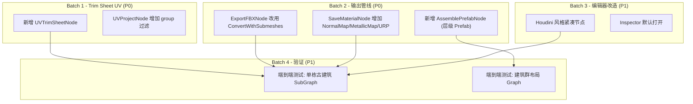

## 第一大阶段差距分析

你的目标是：**仅依赖 PCG for Unity 就能生产"中国古建筑群程序化生成器"**，输出 FBX、材质、贴图、UV（Trim Sheet）、建筑群布局（Prefab）。

我逐项对照当前代码库的能力做了审计。

---

### 当前已有能力

| 能力 | 状态 | 关键文件 |
|------|------|----------|
| 基础几何体生成 | 完备（Box/Tube/Grid/Torus 等 16 个 Create 节点） | `Assets/PCGToolkit/Editor/Nodes/Create/` |
| 几何操作 | 完备（Extrude/Boolean/Inset/Bevel/Bridge 等 20+ 节点） | `Assets/PCGToolkit/Editor/Nodes/Geometry/` + `Topology/` |
| 曲线操作 | 完备（CurveCreate/Sweep/Resample/Carve/Fillet/PolyWire） | `Assets/PCGToolkit/Editor/Nodes/Curve/` |
| 分布实例化 | 完备（Scatter/CopyToPoints/Instance/Array/Ray） | `Assets/PCGToolkit/Editor/Nodes/Distribute/` |
| 变形 | 完备（Bend/Twist/Taper/Mountain/Noise/Smooth/Lattice/Creep） | `Assets/PCGToolkit/Editor/Nodes/Deform/` |
| 基础 UV | 有（UVProject/UVUnwrap/UVLayout/UVTransform） | `Assets/PCGToolkit/Editor/Nodes/UV/` |
| 材质分配 | 有（MaterialAssign + 多 Submesh 输出） | `MaterialAssignNode.cs` + `PCGGeometryToMesh.cs` |
| 材质创建 | 有（SaveMaterialNode，支持 Standard shader） | `SaveMaterialNode.cs` |
| FBX 导出 | 有（ExportFBXNode，com.unity.formats.fbx + OBJ fallback） | `ExportFBXNode.cs` |
| Prefab 保存 | 有（SavePrefabNode，支持多 Submesh + 材质） | `SavePrefabNode.cs` |
| 控制流 | 有（ForEach/Switch/Split/SubGraph） | `Assets/PCGToolkit/Editor/Nodes/Utility/` |
| 表达式系统 | 有（AttribWrangle + ExpressionParser） | `ExpressionParser.cs` | [3-cite-0](#3-cite-0) 

---

### 缺失能力（按阻塞程度排序）

#### 1. Trim Sheet UV 工作流 — 阻塞级

这是最大的缺口。Trim Sheet 的核心操作是：**将不同面组的 UV 精确映射到贴图图集的指定矩形区域**。

当前 `UVProjectNode` 做的是全局投影（planar/cylindrical/spherical/cubic），`UVTransformNode` 做的是全局平移/旋转/缩放。两者都**不支持按面组将 UV 重映射到指定的 [u_min, u_max] × [v_min, v_max] 矩形区域**。 [3-cite-1](#3-cite-1) [3-cite-2](#3-cite-2)

**需要新增**：`UVTrimSheetNode`（或叫 `UVRectMapNode`），功能：
- 输入：Geometry + Group 名 + 目标 UV 矩形（u_min, u_max, v_min, v_max）
- 将指定 Group 的面的 UV 归一化后重映射到目标矩形
- 支持旋转 90° 选项（横竖条切换）
- 这是 Trim Sheet 技术的核心节点

#### 2. 层级 Prefab 组装 — 阻塞级

当前 `SavePrefabNode` 只能保存**单个 MeshFilter + MeshRenderer** 的扁平 Prefab。中国古建筑群需要：
- 一栋建筑 = 多个子物体（屋顶、墙体、柱子、斗拱、台基），每个子物体有独立的 Mesh 和材质
- 一个建筑群 = 多栋建筑 Prefab 按布局摆放 [3-cite-3](#3-cite-3)

**需要新增**：
- `AssemblePrefabNode`：接收多个 Geometry 输入（每个带名称和 Transform），组装为带层级结构的 Prefab（parent GameObject + 多个 child，每个 child 有独立 MeshFilter/MeshRenderer）
- 或者增强 `SavePrefabNode` 支持 `@name` 属性按面组拆分为子物体

#### 3. 布局分布系统 — 重要

Scatter + CopyToPoints 可以做随机/点位分布，但中国古建筑群的布局是**规则性的**：
- 中轴对称
- 院落围合
- 前殿后寝
- 廊庑连接

**需要新增**：
- `GridLayoutNode`：生成规则网格点位，支持间距、对称轴、排除区域
- 或者用现有 `Grid` + `AttribWrangle` + `Delete` 组合实现（可行但繁琐）
- `SymmetryNode`（或 `MirrorNode` 增强）：沿轴镜像复制几何体/点位，保持对称布局

当前 `MirrorNode` 已存在，可以做几何体镜像。布局分布可以通过 SubGraph 组合现有节点实现，不一定需要新节点，但需要**验证 CopyToPoints 在大规模实例化时的性能和正确性**。 [3-cite-4](#3-cite-4)

#### 4. SaveMaterialNode 增强 — 重要

当前 `SaveMaterialNode` 只支持 Standard shader 的基础属性（albedo color/texture, metallic, smoothness, emission）。Trim Sheet 工作流还需要：
- Normal Map 贴图路径
- Metallic/Roughness Map
- Tiling/Offset 参数（用于 Trim Sheet 的全局 tiling）
- 支持 URP/HDRP shader（不只是 Built-in Standard） [3-cite-5](#3-cite-5)

#### 5. ExportFBXNode 多材质支持 — 重要

当前 `ExportFBXNode` 使用 `PCGGeometryToMesh.Convert()`（单 Submesh），而不是 `ConvertWithSubmeshes()`。这意味着 FBX 导出时**丢失了多材质信息**。需要改为使用 `ConvertWithSubmeshes()` 并正确设置多材质。 [3-cite-6](#3-cite-6)

#### 6. 第4轮遗留 — 中等

- `D2` 执行缓存优化未完成（大型建筑群图会很慢）
- `A4` 便签注释未完成（复杂图需要注释）
- Houdini 风格紧凑节点改造（上一轮讨论的方案） [3-cite-7](#3-cite-7)

---

### 第5轮迭代规划建议

考虑到你的目标是尽快达到第一大阶段完成，第5轮应该**聚焦 Trim Sheet 工作流和输出管线完善**，而不是继续做编辑器体验优化。

#### Batch 1 — Trim Sheet UV 核心（P0，最高优先级）

| 任务 | 文件 | 说明 |
|------|------|------|
| 新增 `UVTrimSheetNode` | `Assets/PCGToolkit/Editor/Nodes/UV/UVTrimSheetNode.cs` | 核心功能：输入 Group + UV Rect (u_min, v_min, u_max, v_max)，将该 Group 面的 UV 归一化后映射到指定矩形。支持 `projectionAxis` 参数（选择投影方向）和 `rotate90` 选项 |
| `UVProjectNode` 增加 Group 过滤 | `UVProjectNode.cs` | 当前 `group` 参数存在但未实现过滤逻辑（投影时忽略了 group 参数），需要补全 |

#### Batch 2 — 输出管线完善（P0）

| 任务 | 文件 | 说明 |
|------|------|------|
| `ExportFBXNode` 多材质修复 | `ExportFBXNode.cs` | 将 `PCGGeometryToMesh.Convert()` 改为 `ConvertWithSubmeshes()`，正确设置多 Submesh 和材质 |
| `SaveMaterialNode` 增强 | `SaveMaterialNode.cs` | 新增 `normalMapPath`、`metallicMapPath`、`occlusionMapPath` 参数；新增 `shaderType` 枚举（Standard/URP_Lit/HDRP_Lit）；新增 `tiling`/`offset` Vector2 参数 |
| 新增 `AssemblePrefabNode` | `Assets/PCGToolkit/Editor/Nodes/Output/AssemblePrefabNode.cs` | 接收多个 Geometry 输入（input0~inputN），每个 Geometry 的 `@name` Detail 属性作为子物体名，组装为层级 Prefab。支持 `@transform` 属性控制子物体的局部 Transform |

#### Batch 3 — 编辑器改造（P1）

| 任务 | 文件 | 说明 |
|------|------|------|
| Houdini 风格紧凑节点 | `PCGNodeVisual.cs` + `PCGGraphView.cs` + `PCGGraphEditorWindow.cs` | 上一轮讨论的方案：删除内联编辑器，Inspector 默认打开 |
| 便签注释 | `PCGGraphView.cs` + `PCGGraphSerializer.cs` | 第4轮遗留的 A4 |

#### Batch 4 — 端到端验证（P1）

| 任务 | 说明 |
|------|------|
| 单栋古建筑 SubGraph | 用现有节点 + 新增的 UVTrimSheet 构建一个完整的单栋建筑（台基 + 柱子 + 墙体 + 屋顶），验证 Trim Sheet UV → 材质 → FBX/Prefab 全流程 |
| 建筑群布局 Graph | 用 Grid + AttribWrangle + CopyToPoints + AssemblePrefab 构建一个 3×3 院落布局，验证多建筑实例化和 Prefab 层级输出 |

---

### 第5轮之后还差什么？

即使第5轮全部完成，到达第一大阶段还可能需要：

1. **贴图生成/引用管线**：目前没有节点能生成或合成贴图（Trim Sheet 贴图本身需要外部制作）。如果你接受"Trim Sheet 贴图由美术手工制作，PCG 只负责 UV 映射"，这不是阻塞项。但如果你希望 PCG 也能程序化生成 Trim Sheet 贴图，那需要额外的图像处理节点。

2. **屋顶曲线 Profile**：中国古建筑的屋顶曲线（举折、举架）是特殊的数学曲线，不是简单的 Bezier。可能需要一个专用的 `RoofProfileNode` 或用 `AttribWrangle` 表达式实现。

3. **执行性能**：建筑群图可能有 50+ 节点，当前没有执行缓存（D2 未完成），每次修改都全图重算。对于大型图这会很慢。

4. **SubGraph 模板库**：古建筑的各个构件（斗拱、柱础、瓦当、脊兽）应该封装为可复用的 SubGraph。这不是代码工作，而是内容制作工作。

**我的判断**：完成第5轮迭代后，PCG for Unity 在**节点能力层面**基本够用。剩余的差距主要在**内容制作**（SubGraph 模板）和**性能优化**（执行缓存）上，可以在实际制作古建筑的过程中逐步补齐。 [3-cite-8](#3-cite-8)