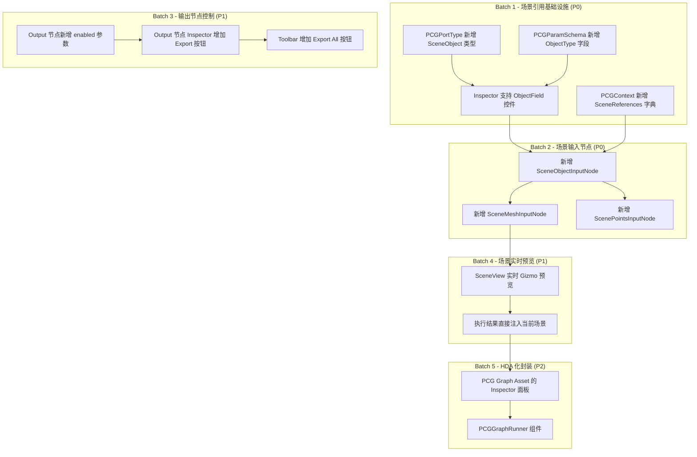

基于对代码库的全面审计，以下是第6轮迭代的任务大纲规划。核心思路是：**让 PCG Graph 从"封闭的离线工具"进化为"可与场景互动的便携生成器"（类 HDA 体验）**。

---

## 第6轮迭代：HDA 化场景互动 + 输出控制

### 现状分析

当前 PCG Graph 的执行是完全封闭的：
- `PCGPortType` 只有 `Geometry/Float/Int/Vector3/String/Bool/Color/Any` 8 种类型，**没有场景对象引用类型** [0-cite-0](#0-cite-0)
- `PCGContext` 没有任何场景引用机制，只有 `GlobalVariables` 和 `NodeOutputCache` [0-cite-1](#0-cite-1)
- Inspector 的参数控件只有 `FloatField/IntegerField/Toggle/TextField/Vector3Field/ColorField/PopupField`，**没有 `ObjectField`（场景对象选择器）** [0-cite-2](#0-cite-2)
- Output 节点（`ExportFBXNode`、`SavePrefabNode`、`AssemblePrefabNode` 等）执行时无条件输出，没有 enable/disable 开关 [0-cite-3](#0-cite-3)

---

### 迭代大纲

---

### Batch 1 — 场景引用基础设施 (P0，最高优先级)

这是所有后续功能的地基。

| 任务 | 文件 | 说明 |
|------|------|------|
| **A1**: `PCGPortType` 新增 `SceneObject` | `PCGParamSchema.cs` | 在枚举中增加 `SceneObject` 类型，用于表示"来自场景的 GameObject 引用" |
| **A2**: `PCGParamSchema` 新增 `ObjectType` 字段 | `PCGParamSchema.cs` | 新增 `System.Type ObjectType` 字段（如 `typeof(GameObject)`、`typeof(MeshFilter)`），用于约束 ObjectField 的选择范围 |
| **A3**: Inspector 支持 `ObjectField` | `PCGNodeInspectorWindow.cs` | 在 `CreateInspectorWidget` 中为 `PCGPortType.SceneObject` 渲染 `ObjectField`，`allowSceneObjects = true`，选中后将 `instanceID` 存入参数 |
| **A4**: `PCGContext` 新增场景引用 | `PCGContext.cs` | 新增 `Dictionary<string, GameObject> SceneReferences`，执行器在执行前将 Inspector 中选择的场景对象注入此字典 |
| **A5**: `PCGNodeVisual` 端口着色 | `PCGNodeVisual.cs` | 在 `GetSystemType` 和 `GetPortColor` 中为 `SceneObject` 类型添加映射（建议用橙色区分） |
| **A6**: 序列化支持 | `PCGGraphView.cs` + `PCGParamHelper.cs` | 场景对象引用通过 `instanceID` 或 `GlobalObjectId` 序列化/反序列化，确保保存/加载图时不丢失引用 |

---

### Batch 2 — 场景输入节点 (P0)

有了基础设施后，实现具体的场景交互节点。

| 任务 | 文件 | 说明 |
|------|------|------|
| **B1**: `SceneObjectInputNode` | 新建 `Nodes/Create/SceneObjectInputNode.cs` | 核心节点。输入：一个 `SceneObject` 类型参数（通过 ObjectField 选择场景中的 GameObject）。输出：将该 GameObject 的 `MeshFilter.sharedMesh` 转换为 `PCGGeometry`（反向 `PCGGeometryToMesh`），包含 Points、Primitives、UV、Normals。同时将 Transform 信息写入 Detail 属性 |
| **B2**: `SceneMeshInputNode` | 新建 `Nodes/Create/SceneMeshInputNode.cs` | 专门读取场景 Mesh 的简化版本。支持 `readUV`/`readNormals`/`readVertexColors` 开关。支持多 Submesh → PrimGroup 映射 |
| **B3**: `ScenePointsInputNode` | 新建 `Nodes/Create/ScenePointsInputNode.cs` | 读取场景中一组 GameObject 的位置/旋转/缩放作为点云。用途：选中场景中几个空物体作为分布锚点，PCG 在这些点上生成内容（如藤曼覆盖的参考物） |
| **B4**: `MeshToGeometry` 工具方法 | `PCGGeometryToMesh.cs` 或新建 `MeshToPCGGeometry.cs` | 实现 `Unity Mesh → PCGGeometry` 的反向转换，供 B1/B2 调用。这是目前代码库中**完全缺失**的能力 |

---

### Batch 3 — 输出节点控制 (P1)

让每个 Output 节点可以独立控制是否执行输出。

| 任务 | 文件 | 说明 |
|------|------|------|
| **C1**: Output 节点新增 `enabled` 参数 | `ExportFBXNode.cs`、`SavePrefabNode.cs`、`AssemblePrefabNode.cs`、`SaveMaterialNode.cs`、`SaveSceneNode.cs`、`ExportMeshNode.cs`、`LODGenerateNode.cs` | 所有 Output 类节点在 `Inputs` 中新增 `enabled` Bool 参数（默认 true）。`Execute` 开头检查 `enabled`，为 false 时跳过输出但仍透传 Geometry |
| **C2**: Inspector 增加 Export 按钮 | `PCGNodeInspectorWindow.cs` | 当选中的节点 `Category == Output` 时，在 Inspector 底部显示一个醒目的 "Export" 按钮，点击后**仅执行该节点的输出逻辑**（不重新执行整个图，使用上次执行的缓存结果） |
| **C3**: Toolbar 增加 "Export All" | `PCGGraphEditorWindow.cs` | 在 toolbar 的 Execute 按钮旁新增 "Export All" 按钮，功能：遍历图中所有 `enabled=true` 的 Output 节点，依次执行输出。与 Execute 的区别是：Execute 执行全图计算，Export All 只触发输出动作 |

---

### Batch 4 — 场景实时预览 (P1)

让 PCG 的结果直接在 SceneView 中可见，而不是只在独立的 Preview 窗口中。

| 任务 | 文件 | 说明 |
|------|------|------|
| **D1**: SceneView Gizmo 预览 | 新建 `Graph/PCGScenePreview.cs` | 使用 `SceneView.duringSceneGui` 回调，在 SceneView 中用 `Graphics.DrawMeshNow` 或 `Handles.DrawWireMesh` 绘制当前选中节点的 Geometry 输出。支持线框/实体切换。这样用户可以在场景中直观看到 PCG 生成的结果与场景物体的空间关系 |
| **D2**: "Inject to Scene" 功能 | `PCGGraphEditorWindow.cs` 或 Output 节点 | 新增一个操作：将执行结果作为临时 GameObject 注入当前打开的场景（不保存为 Prefab/FBX，只是临时预览）。用户满意后再点 Export 正式输出。类似 Houdini HDA 的 "Cook" 后直接在 viewport 看到结果 |

---

### Batch 5 — HDA 化封装 (P2，进阶)

这是最终目标：让 PCG Graph 可以像 HDA 一样作为组件挂在场景物体上。

| 任务 | 文件 | 说明 |
|------|------|------|
| **E1**: PCG Graph Asset Inspector | 新建 `Graph/PCGGraphAssetInspector.cs` | 为 `.asset`（PCGGraphData）文件创建自定义 Inspector。在 Project 窗口选中一个 PCG Graph 资产时，Inspector 中直接显示该图的所有暴露参数（标记为 `exposed` 的参数），用户可以直接调参并执行，无需打开 Graph Editor |
| **E2**: `PCGGraphRunner` MonoBehaviour | 新建 `Graph/PCGGraphRunner.cs` | 一个可以挂在场景 GameObject 上的组件（Editor-only）。引用一个 PCGGraphData 资产，在 Inspector 中暴露该图的参数。点击 "Cook" 按钮执行图并将结果作为子物体生成。这就是 HDA 的 Unity 等价物——把 PCG Graph 当做一个"生成器组件"使用 |
| **E3**: 参数暴露机制 | `PCGParamSchema.cs` + `PCGNodeBase.cs` | 新增 `bool Exposed` 字段。标记为 Exposed 的参数会出现在 PCGGraphRunner 和 Graph Asset Inspector 中，作为"对外接口"。类似 Houdini HDA 的 promoted parameters |

---

### 优先级与依赖关系总结

| 优先级 | Batch | 核心价值 | 前置依赖 |
|--------|-------|----------|----------|
| **P0** | Batch 1 | 场景引用基础设施 | 无 |
| **P0** | Batch 2 | 场景输入节点（解决"藤曼覆盖参考物"的核心需求） | Batch 1 |
| **P1** | Batch 3 | 输出控制（解决"单独控制是否输出"的需求） | 无（可与 Batch 1 并行） |
| **P1** | Batch 4 | 场景实时预览 | Batch 1+2 |
| **P2** | Batch 5 | HDA 化封装（终极目标） | Batch 1+2+3+4 |

---

### 关键技术难点

1. **`Mesh → PCGGeometry` 反向转换**（B4）：目前只有 `PCGGeometryToMesh`，没有反向。需要处理 submesh → PrimGroup 映射、UV 通道、顶点共享/拆分等问题。 [0-cite-4](#0-cite-4)

2. **场景对象引用的序列化**（A6）：`instanceID` 在 Editor 重启后会变。需要用 `GlobalObjectId`（Unity 2019.2+）来持久化场景对象引用，或者存储对象路径（`Transform` 层级路径）。

3. **执行器与场景引用的桥接**（A4）：当前 `PCGAsyncGraphExecutor.ExecuteNodeInternal` 只从 `_nodeOutputs` 和 `parameters` 收集输入。需要增加一个阶段：在执行前将 Inspector 中选择的场景对象解析为实际的 `GameObject` 引用，注入 `PCGContext.SceneReferences`。 [0-cite-5](#0-cite-5)

4. **Output 节点的"仅输出"执行**（C2）：需要在 `PCGAsyncGraphExecutor` 中支持"使用缓存结果重新执行单个节点"的模式，而不是每次都全图重算。