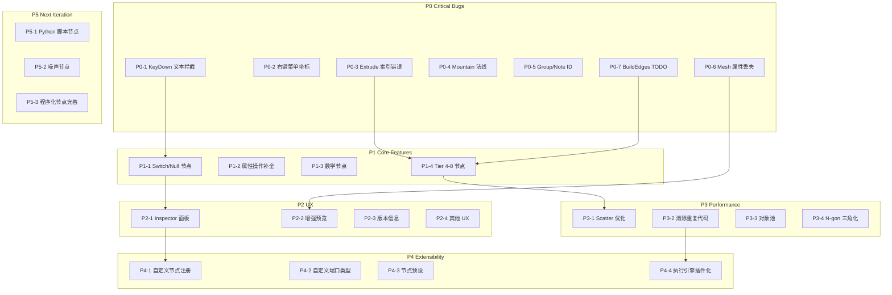

# PCG Toolkit for Unity — 第二轮迭代任务大纲

**当前版本**: `05f8f419` (2026-03-20, Merge PR #15) 

**节点实现进度**: Tier 0-3 基本完成, Tier 4-8 部分完成 (已实现 10/26 高级节点) 

---

## P0 — 必须修复的设计错误 (Critical Bugs)

### P0-1: `PCGGraphView.OnKeyDown` 未检查文本输入焦点

`PCGGraphEditorWindow.OnGlobalKeyDown` 已修复此问题，但 `PCGGraphView.OnKeyDown` (line 368-382) 仍然无条件拦截 F 和 Delete 键，导致在节点内联 TextField 中无法输入字母 "f" 或使用 Delete 键。 [0-cite-2](#0-cite-2)

### P0-2: 右键菜单 "Create Node" 坐标仍然错误

`BuildContextualMenu` 中 `screenMousePosition = evt.mousePosition` 传递的是局部坐标而非屏幕坐标，TASK_TODO #15 的修复未被应用。 

### P0-3: `ExtrudeNode` 侧面索引计算错误

`prevIdx` 的计算逻辑 (line 122-128) 先计算了一个复杂的偏移量，然后立即覆盖为简单的 `(d-1)*prim.Length + i`，导致侧面顶点索引不正确，挤出结果会产生错误的面连接。 [0-cite-4](#0-cite-4)

### P0-4: `MountainNode` 法线估算严重不准

当前使用 `p.normalized`（点到原点方向）作为法线方向，对于非中心对称的几何体完全错误。应该从 `PointAttribs` 读取 "N" 属性，或从相邻面计算顶点法线。 

### P0-5: `SaveToGraphData` 使用 `title` 作为 Group/StickyNote ID

`GroupId` 和 `NoteId` 使用 `group.title` / `note.title` 而非 GUID，多个同名 Group 会导致序列化冲突。 

### P0-6: `PCGGeometryToMesh.Convert` 不提取 UV/Normal/Color 属性

转换时忽略了 `PointAttribs` 中的 "N"、"uv"、"Cd" 等属性，导致预览和导出的 Mesh 丢失这些关键数据。 

### P0-7: `PCGGeometry.BuildEdges()` 未实现

仍然是 TODO 状态，多个节点（如 PolyBevel、Fuse）依赖边数据。

---

## P1 — 核心功能完善 (Missing Logic Nodes)

### P1-1: 条件/逻辑控制节点

| 节点 | 说明 |
|------|------|
| `SwitchNode` | 根据 int/string 条件选择输入几何体之一输出（对标 Houdini Switch SOP） |
| `NullNode` | 直通节点，不修改几何体，用于组织图结构和标记检查点 |

### P1-2: 属性操作补全

| 节点 | 说明 |
|------|------|
| `AttributePromoteNode` | 在 Point/Vertex/Prim/Detail 层级之间转换属性 |
| `AttributeTransferNode` | 从一个几何体向另一个几何体传递属性（基于空间距离） |
| `AttributeDeleteNode` | 删除指定属性 |

### P1-3: 数学/表达式节点

| 节点 | 说明 |
|------|------|
| `FitNode` | 将值从一个范围映射到另一个范围 (Remap) |
| `MathNode` | 基础数学运算 (Add/Subtract/Multiply/Divide/Power/Mod) |
| `CompareNode` | 比较运算，输出 Bool |

### P1-4: 待实现的 Tier 4-8 节点 (NODE_TODO 中标记的 16 个)

按优先级排序：
1. **SweepNode** — 沿曲线扫掠，PCG 管线核心能力
2. **CurveCreateNode** — 曲线创建，Sweep 的前置依赖
3. **FilletNode** — 曲线倒角
4. **ExportFBXNode** — FBX 导出，核心输出能力
5. **SaveSceneNode** — 场景保存
6. **PolyFillNode** — 填充孔洞
7. **RemeshNode** (已有基础实现，需接入 geometry3Sharp)
8. **DecimateNode** (已有基础实现，需接入 geometry3Sharp)
9. **PolyBevelNode** — 倒角
10. **PolyBridgeNode** — 桥接面
11. **LatticeNode** — FFD 变形
12. **ConvexDecompositionNode** — 凸分解
13. **LODGenerateNode** — LOD 生成
14. **WFCNode** (已有基础实现，需完善邻接规则)
15. **LSystemNode** (已有基础实现)
16. **VoronoiFractureNode** (已有基础实现)

---

## P2 — UX 与操作体验优化

### P2-1: 独立 Inspector 面板 (核心 UX 改进)

当前所有参数都挤在节点上的小控件里，参考 Houdini 的做法：
- 新建 `PCGNodeInspectorWindow : EditorWindow`，作为独立的可停靠面板
- 选中节点时，Inspector 显示该节点的完整参数列表（大尺寸控件、分组折叠、帮助文本）
- 节点面板上仅保留端口和简要信息，不再显示内联编辑器（或可选显示）
- Inspector 支持多选节点时显示共同参数 

### P2-2: 增强预览窗口

当前 `PCGNodePreviewWindow` 功能较基础：
- 增加线框/实体/UV 显示模式切换
- 增加属性可视化（选择属性名，用颜色映射显示）
- 增加几何体统计信息面板（点数、面数、边数、包围盒、属性列表）
- 支持多节点对比预览

### P2-3: 版本信息与项目状态

- 在 `PCGGraphEditorWindow` 工具栏或 About 窗口中显示版本号
- 版本号从一个集中的 `PCGToolkitVersion.cs` 常量类读取
- 显示当前图的节点数/连线数统计

### P2-4: 其他 UX 改进

- 节点搜索窗口支持模糊匹配和最近使用记录
- 自动保存（定时 + 执行前）
- 最近打开文件列表
- 节点右键菜单增加 "Help" 选项（打开节点文档）
- 连线时的实时类型提示

---

## P3 — 性能优化

### P3-1: `ScatterNode.RelaxPoints` O(n^2) 优化

当前使用暴力双重循环 + 硬编码 0.5f 距离阈值，应改用空间哈希网格或 KD-Tree。

### P3-2: 消除重复的 `TopologicalSort` 和 `DeserializeParamValue`

`PCGGraphExecutor` 和 `PCGAsyncGraphExecutor` 各自有独立的拓扑排序和参数反序列化实现。应提取为共享工具类。`PCGGraphView` 中的 `DeserializeParamValue` 也应统一使用 `PCGParamHelper`。 [0-cite-13](#0-cite-13) [0-cite-14](#0-cite-14)

### P3-3: 几何体对象池

频繁的 `new PCGGeometry()` 和 `.Clone()` 产生大量 GC 压力。引入对象池机制复用几何体实例。

### P3-4: `PCGGeometryToMesh` N-gon 三角化

当前只处理三角形和四边形，N-gon 直接跳过。应集成 LibTessDotNet 进行通用多边形三角化。

---

## P4 — 扩展性优化

### P4-1: 自定义节点注册机制

当前 `PCGNodeRegistry` 通过反射扫描所有程序集中的 `PCGNodeBase` 子类。应增加：
- `[PCGNode]` Attribute 标记，支持外部程序集注册自定义节点
- 节点版本号字段，支持图数据的向前兼容
- 节点废弃标记 `[Obsolete]` 和迁移映射 

### P4-2: 自定义端口类型扩展

当前 `PCGPortType` 是固定枚举，无法扩展。应支持注册自定义数据类型（如 Curve、Mesh、Texture 等）。

### P4-3: 节点模板/预设系统

允许用户保存节点的参数配置为预设，快速复用常用配置。

### P4-4: 图执行引擎插件化

将 `PCGGraphExecutor` 的执行策略抽象为接口，支持：
- 同步执行（当前）
- 异步分帧执行（当前）
- 多线程并行执行（未来）
- 远程执行（AI Agent 场景）

---

## P5 — 下一轮迭代 (可选/低优先级)

### P5-1: 自定义 Python 脚本节点

- 新增 `PythonWrangleNode`，允许用户编写 Python 脚本操作 PCGGeometry
- 通过 Unity 的 Python for Unity 包或进程间通信实现
- 脚本编辑器集成到 Inspector 面板

### P5-2: 噪声类型节点

- 独立的 `NoiseNode`，输出噪声值到属性（不直接变形）
- 支持 Perlin / Simplex / Worley / Curl 噪声类型
- 支持 2D/3D/4D 噪声
- 可作为 Mountain、Scatter 等节点的密度/权重输入

### P5-3: 高级程序化节点完善

- WFC 完善邻接规则编辑器
- L-System 增加随机变异和上下文敏感规则
- Voronoi Fracture 增加内部面材质分配

---

## 优先级总览

---

## 执行建议

| 阶段 | 内容 | 依赖 |
|------|------|------|
| **阶段 1** | P0 全部 + P2-3 版本信息 | 无 |
| **阶段 2** | P2-1 Inspector 面板 + P1-1 逻辑节点 | P0 完成 |
| **阶段 3** | P1-2/P1-3 属性和数学节点 + P3-2 消除重复代码 | 阶段 2 |
| **阶段 4** | P1-4 Tier 4-8 节点 (前 8 个) + P3-1/P3-4 性能 | 阶段 3 |
| **阶段 5** | P2-2/P2-4 UX 完善 + P4-1/P4-2 扩展性 | 阶段 4 |
| **阶段 6** | P1-4 剩余节点 + P4-3/P4-4 | 阶段 5 |
| **下一轮** | P5 全部 | 本轮完成 |