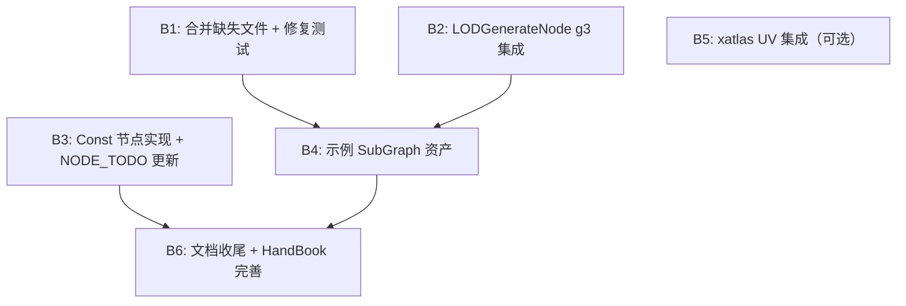

## 当前项目完成度评估

### 各 Phase 完成度

| Phase | 主题 | 完成度 | 说明 |
|-------|------|--------|------|
| Phase 1 | 基础设施 + 最小可用管线 | **95%** | 核心数据模型、Tier 0 节点、geometry3Sharp 集成、FBX 导出均已完成 |
| Phase 2 | 核心几何 + 分布实例化 + GraphView | **95%** | Tier 1/3 节点、GraphView 编辑器、SubGraph 机制均已实现 |
| Phase 3 | UV + 曲线 + AI 接口 | **90%** | Tier 2/4 节点已实现，AI Skill 层和通信层已完成，Graph API 含完整 CRUD；xatlas 未真正集成 |
| Phase 4 | 变形 + 高级拓扑 | **95%** | Tier 5/6 节点全部有实现，Remesh/Decimate/LOD 均已切换到 g3 |
| Phase 5 | 程序化规则 + 完善 | **70%** | Tier 7 节点有基础实现，示例 SubGraph 已创建，文档已补全 |

**综合完成度：约 90%**

---

### 第8轮迭代成果确认

第8轮迭代（commit [d900d1de](https://github.com/No78Vino/pcg_for_unity/commit/d900d1de)）完成了以下核心工作： [0-cite-0](#0-cite-0)

1. **AI SubGraph 构建 API** — AgentServer 新增 8 个 graph 操作 Action（`create_graph`/`add_node`/`connect_nodes`/`set_param`/`save_graph`/`execute_graph`/`list_nodes`/`get_graph_info`）
2. **AgentSession 会话管理** — 支持多图并行构建 [0-cite-1](#0-cite-1)
3. **geometry3Sharp 深度集成** — RemeshNode 和 DecimateNode 切换到 g3 Remesher/Reducer [0-cite-2](#0-cite-2) [0-cite-3](#0-cite-3)
4. **GeometryBridge 增强** — 支持 N/uv/Cd 三种属性的双向传递 [0-cite-4](#0-cite-4)
5. **WebSocket 通信支持** [0-cite-5](#0-cite-5)
6. **Skill 层补全** — `PCGNodeSkillAdapter.GetJsonSchema()` 和 `Execute()` 已完整实现 [0-cite-6](#0-cite-6) [0-cite-7](#0-cite-7)
7. **SkillExecutor.ExecutePipeline()** 已实现链式调用 [0-cite-8](#0-cite-8)

---

### 当前遗留问题

| # | 问题 | 严重度 | 说明 |
|---|------|--------|------|
| 1 | **xatlas 未真正集成** | P2 | UV Unwrap/Layout 使用简化算法 |
| 2 | **Clipper2 未集成** | P2 | 2D 布尔运算缺失 |
| 3 | **Procedural 节点质量** | P2 | WFC/LSystem/VoronoiFracture 使用简化算法 |

---

### 第9轮迭代成果确认

1. **Graph API CRUD 闭环** — AgentServer 新增 4 个 Action（`delete_node`/`disconnect_nodes`/`delete_graph`/`list_graphs`），总计 12 个 Action，支持完整的增删改查操作
2. **connect_nodes 端口存在性校验** — 连接不存在的端口会返回明确错误信息
3. **LODGenerateNode g3 集成** — DecimateGeometry() 从约 130 行自研算法替换为 g3 Reducer（约 15 行），与 DecimateNode 一致
4. **代码重复消除** — 将 ParseSimpleJson/Esc/F 提取为 JsonHelper 共享工具类，AgentServer 和 SkillExecutor 不再有重复实现
5. **HandleExecuteGraph 键名去重** — 输出键名从 `{NodeType}_{Port}` 改为 `{NodeId}_{Port}`，避免同类型节点键名冲突
6. **示例 SubGraph** — 创建 ExampleSubGraphGenerator 编辑器脚本 + README，包含 3 个示例（ParametricTable/TerrainScatter/BeveledWall）
7. **AgentSession 增强** — 新增 ListGraphSummaries() 方法支持 list_graphs
8. **测试加固** — AgentIntegrationTests 新增 10 个测试方法覆盖所有新 Action + 端到端错误恢复流程
9. **文档更新** — HandBook.md Action 列表扩充为 12 个 + 错误恢复示例；AI_AGENT_GUIDE.md 更新推荐工作流

---

## 第9轮迭代计划大纲

### 迭代主题：**质量加固 + 示例交付 + 第三方库深度集成 + 文档收尾**

### Batch 详情

| Batch | 标题 | 优先级 | 内容 |
|-------|------|--------|------|
| **B1** | 合并缺失测试文件 + 修复 | P0 | 确认 CurveNodeTests/DeformNodeTests/UVNodeTests/DistributeNodeTests/UtilityNodeTests/GeometryNodeTests 是否在 main 分支；若缺失则重新合入；运行全部测试确保通过 |
| **B2** | LODGenerateNode 切换 g3 Reducer | P0 | `LODGenerateNode.DecimateGeometry()` 内部仍用自研边坍缩算法（约130行），应改为 `GeometryBridge.ToDMesh3() → g3.Reducer → FromDMesh3()` 三步流程，与 DecimateNode 保持一致 |
| **B3** | Const 节点实现 + NODE_TODO 更新 | P1 | 实现 ConstFloat/Int/Bool/String/Vector3/Color 节点的 Execute 方法（通过 `PCGContext.GlobalVariables` 注入值）；更新 NODE_TODO.md 反映真实状态 |
| **B4** | 创建示例 SubGraph 资产 | P1 | 在 `Assets/PCGToolkit/Examples/` 下创建 2-3 个示例：(1) ParametricTable — Grid→Extrude→UVProject→SavePrefab；(2) TerrainScatter — Grid→Mountain→Scatter→CopyToPoints；(3) WallModule — Box→PolyBevel→UVProject→SavePrefab。每个附带 README |
| **B5** | xatlas UV 集成（可选） | P2 | 如果 xatlas C# binding 可用，将 UVUnwrapNode/UVLayoutNode 切换到 xatlas；否则标记为"需要 Native Plugin"并在文档中说明 |
| **B6** | 文档收尾 | P1 | HandBook.md 补充完整的节点参数参考表；AI_AGENT_GUIDE.md 补充端到端示例（从 `list_nodes` 到 `save_graph` 的完整 JSON 交互）；README.md 更新实施阶段进度 |

### 验收标准

| Batch | 验收方式 | 通过标准 |
|-------|----------|----------|
| **B1** | Unity Test Runner | 所有测试文件存在且 0 failures |
| **B2** | 在编辑器中执行 LODGenerate 节点 | LOD0/1/2 面数递减，无退化三角形 |
| **B3** | 连接 ConstFloat → Grid.rows | Grid 使用 Const 节点提供的值 |
| **B4** | 在 PCGGraphEditorWindow 中打开示例 .asset | 图结构完整，可执行并预览 |
| **B5** | UVUnwrap 输出 UV 无重叠 | UV 岛不重叠（如集成成功） |
| **B6** | HandBook.md 包含所有 Action 的请求/响应示例 | 文档完整可用 |