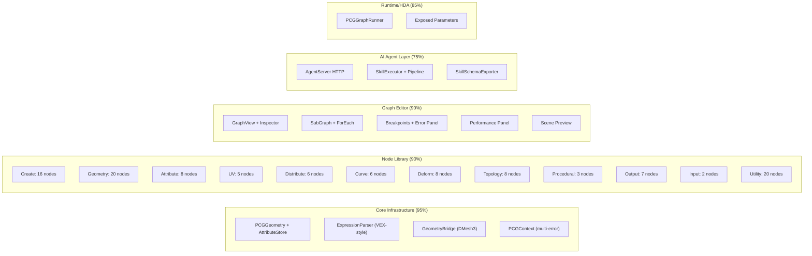
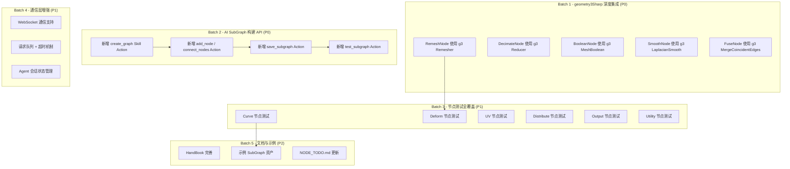

## 当前项目完成度评估

### 各模块完成情况

### 量化统计

| 模块 | 文件数 | 完成度 | 说明 |
|------|--------|--------|------|
| **Core 基础设施** | 15 | **95%** | PCGGeometry、AttributeStore、ExpressionParser、GeometryBridge 均已实现 |
| **节点库** | ~109 | **90%** | NODE_TODO.md 中列出的 26 个待实现节点已全部有文件，但部分节点使用简化算法 |
| **Graph 编辑器** | 16 | **90%** | GraphView、Inspector、Preview、Error Panel、Performance Panel、Breakpoints 均已实现 |
| **AI Agent 通信层** | 5 | **75%** | HTTP 已实现，WebSocket/stdin-stdout 未实现；Pipeline 执行已实现 |
| **Runtime/HDA** | 3 | **85%** | PCGGraphRunner + ExposedParam 已实现 |
| **测试** | 5 | **50%** | 基础测试框架已建立，但覆盖率有限 |
| **文档** | 4 | **60%** | AI_AGENT_GUIDE、HandBook、NODE_TODO 存在，但 HandBook 可能不完整 |

### 关键成就（第7轮迭代）

第7轮迭代 ([`96f6622`](https://github.com/No78Vino/pcg_for_unity/commit/96f662241159fa4975be486227c29230bd9ed159)) 完成了： [0-cite-0](#0-cite-0)

- `AgentServer` HTTP 监听（`HttpListener` + `EditorApplication.update` 轮询）
- `PCGNodeSkillAdapter.GetJsonSchema()` 完整 JSON Schema 生成 [0-cite-1](#0-cite-1)
- `SkillExecutor.ExecutePipeline()` 链式 Skill 调用 [0-cite-2](#0-cite-2)
- `PCGContext` 多错误收集（Warning/Error/Fatal 级别） [0-cite-3](#0-cite-3)
- `PCGGraphExecutor` ContinueOnError 容错执行 [0-cite-4](#0-cite-4)
- 性能 Profiler 面板 [0-cite-5](#0-cite-5)
- 节点测试框架 + Agent 端到端测试

### 当前短板

1. **第三方库集成不足**：`geometry3Sharp` 仅用于 `GeometryBridge` 转换，`RemeshNode`、`DecimateNode` 等使用简化自研算法而非 geometry3Sharp 的 `Remesher`/`Reducer`；`xatlas`、`MIConvexHull`、`Clipper2` 尚未集成 [0-cite-6](#0-cite-6)
2. **AI Agent 工作流未闭环**：Agent 可以调用单个 Skill 和 Pipeline，但无法通过 API **创建/保存 SubGraph**（即 AI 的"主战场"能力缺失） [0-cite-7](#0-cite-7)
3. **测试覆盖率低**：仅 5 个测试文件，大量节点无单元测试
4. **通信协议单一**：仅 HTTP，WebSocket 未实现

---

## 第8轮迭代计划大纲

### 核心主题：**geometry3Sharp 深度集成 + AI SubGraph 构建能力 + 测试加固**

---

### Batch 1 — geometry3Sharp 深度集成 (P0)

当前 `RemeshNode`、`DecimateNode` 等使用简化自研算法，质量不足以用于生产。应通过 `GeometryBridge` 转换为 `DMesh3`，调用 geometry3Sharp 的成熟算法，再转回 `PCGGeometry`。

| 任务 | 文件 | 说明 |
|------|------|------|
| **A1**: RemeshNode 使用 g3 Remesher | `Nodes/Topology/RemeshNode.cs` | `ToDMesh3` → `Remesher` → `FromDMesh3`，替换当前的简单边分割 |
| **A2**: DecimateNode 使用 g3 Reducer | `Nodes/Topology/DecimateNode.cs` | `ToDMesh3` → `Reducer` → `FromDMesh3`，替换当前的简单边坍缩 |
| **A3**: BooleanNode 验证/增强 | `Nodes/Geometry/BooleanNode.cs` | 确认是否已使用 g3 `MeshBoolean`，若未使用则替换 |
| **A4**: SmoothNode 使用 g3 | `Nodes/Deform/SmoothNode.cs` | 可选使用 g3 的 `LaplacianMeshSmoother` |
| **A5**: GeometryBridge 增强 | `Core/GeometryBridge.cs` | 补充 VertexAttribs 的双向传递、PrimGroup 的完整映射 |

### Batch 2 — AI SubGraph 构建 API (P0)

根据 `AI_AGENT_GUIDE.md` 的定位，AI 的主战场是**组装 SubGraph**。当前 Agent 只能调用单个 Skill/Pipeline，无法通过 API 创建和保存 SubGraph。

| 任务 | 文件 | 说明 |
|------|------|------|
| **B1**: `create_graph` Action | `AgentServer.cs` + `SkillExecutor.cs` | 新增 Action：创建空 `PCGGraphData`，返回 graphId |
| **B2**: `add_node` / `connect_nodes` / `set_param` Action | `SkillExecutor.cs` | 新增 Action：向指定 graph 添加节点、连线、设置参数 |
| **B3**: `save_subgraph` Action | `SkillExecutor.cs` | 新增 Action：将构建好的 graph 保存为 `.asset` 文件 |
| **B4**: `test_subgraph` Action | `SkillExecutor.cs` | 新增 Action：执行指定 SubGraph 并返回输出统计（点数/面数/bounds） |
| **B5**: `AgentProtocol` 扩展 | `AgentProtocol.cs` | 新增 graph 操作相关的请求/响应字段 |

### Batch 3 — 节点测试全覆盖 (P1)

当前仅有 `CreateNodeTests`、`TopologyNodeTests`、`GraphExecutionTests`、`AgentIntegrationTests`。应为每个 Tier 补充测试。

| 任务 | 文件 | 说明 |
|------|------|------|
| **C1**: Curve 节点测试 | 新建 `Tests/CurveNodeTests.cs` | Sweep、Resample、Carve、Fillet 的基本输入输出验证 |
| **C2**: Deform 节点测试 | 新建 `Tests/DeformNodeTests.cs` | Mountain、Bend、Twist、Taper、Smooth 的变形正确性 |
| **C3**: UV 节点测试 | 新建 `Tests/UVNodeTests.cs` | UVProject、UVTransform 的 UV 坐标范围验证 |
| **C4**: Distribute 节点测试 | 新建 `Tests/DistributeNodeTests.cs` | Scatter、CopyToPoints 的点数/分布验证 |
| **C5**: Utility 节点测试 | 新建 `Tests/UtilityNodeTests.cs` | Const 系列、ForEach、Switch、Split 的逻辑验证 |
| **C6**: ExpressionParser 测试扩展 | `Tests/ExpressionParserTests.cs` | 补充 if/else、三元表达式、赋值语句的测试用例 |

### Batch 4 — 通信层增强 (P1)

| 任务 | 文件 | 说明 |
|------|------|------|
| **D1**: WebSocket 支持 | `AgentServer.cs` | 实现 `ProtocolType.WebSocket` 分支，支持双向实时通信 |
| **D2**: 请求超时 + 并发控制 | `AgentServer.cs` | 为长时间执行的 Skill 添加超时机制和取消支持 |
| **D3**: Agent 会话状态 | 新建 `Communication/AgentSession.cs` | 管理 Agent 的会话状态（当前正在构建的 graph、执行历史等） |

### Batch 5 — 文档与示例 (P2)

| 任务 | 文件 | 说明 |
|------|------|------|
| **E1**: HandBook 完善 | `HandBook.md` | 补充所有节点的使用说明和参数文档 |
| **E2**: 示例 SubGraph | 新建 `Assets/PCGToolkit/Examples/` | 创建 2-3 个示例 SubGraph（如"参数化桌子"、"地形生成器"） |
| **E3**: NODE_TODO.md 更新 | `NODE_TODO.md` | 更新实现进度（当前文件严重过时，显示 10/26 已实现，实际已全部实现） |

### 优先级总结

| 优先级 | Batch | 核心价值 | 前置依赖 |
|--------|-------|----------|----------|
| **P0** | Batch 1 | 节点质量从"能跑"提升到"可用于生产" | 无 |
| **P0** | Batch 2 | 补齐 AI Agent 的核心能力——构建 SubGraph | 无 |
| **P1** | Batch 3 | 防止回归，保障质量 | 无（可与 Batch 1 并行） |
| **P1** | Batch 4 | 通信层健壮性 | Batch 2 |
| **P2** | Batch 5 | 可用性和可维护性 | Batch 1+2 |

### 整体项目完成度估算

按 README 中的 Phase 1-5 路线图：

| Phase | 内容 | 完成度 |
|-------|------|--------|
| Phase 1 | 基础设施 + 最小可用管线 | **100%** |
| Phase 2 | 核心几何 + 分布实例化 + GraphView | **95%** |
| Phase 3 | UV + 曲线 + AI 接口 | **85%** |
| Phase 4 | 变形 + 高级拓扑 | **80%**（节点存在但算法质量待提升） |
| Phase 5 | 程序化规则 + 完善 | **70%**（WFC/LSystem/Voronoi 已实现基础版本） |

**综合完成度：约 85%**。主要差距在于第三方库深度集成和 AI SubGraph 构建闭环。