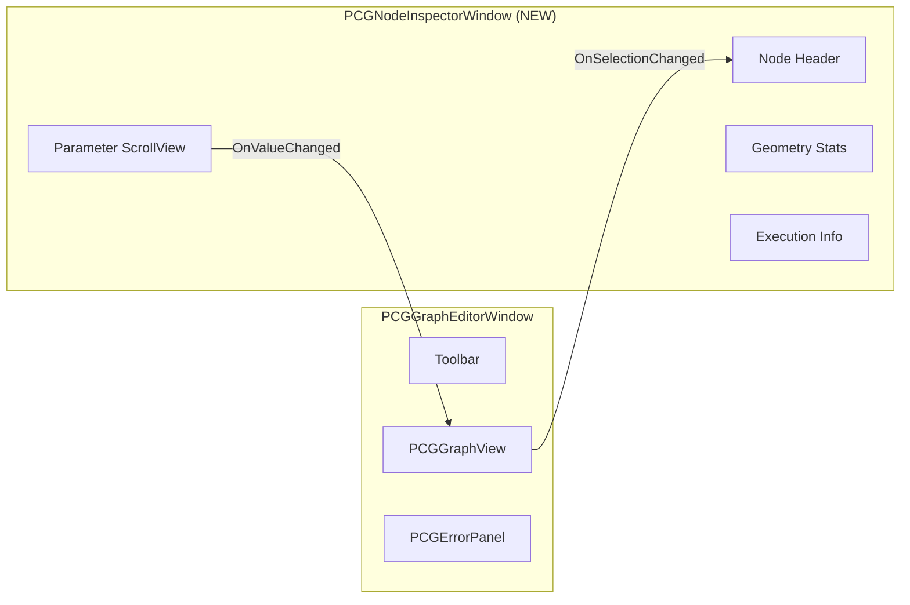
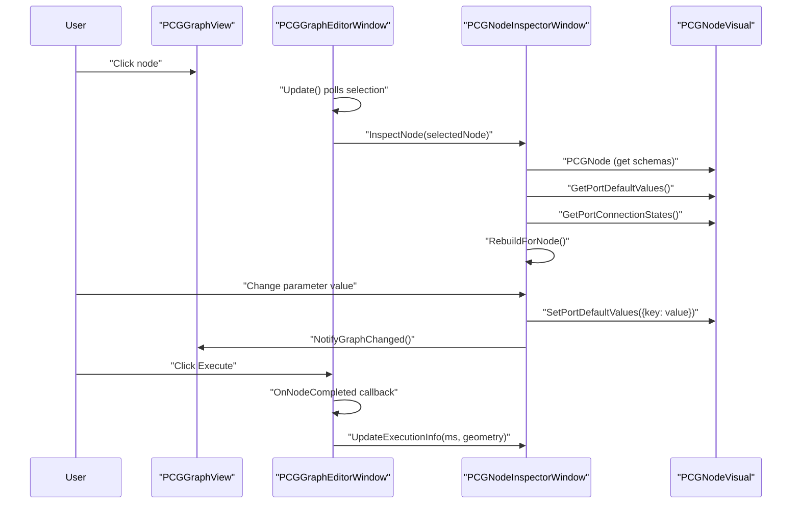

# 阶段 2 详细实施文档

**范围**: P2-1 (独立 Inspector 面板) + P1-1 (SwitchNode / NullNode 逻辑控制节点)

---

## P2-1: 独立 Inspector 面板

### 背景

当前所有节点参数都通过 `PCGNodeVisual.CreateInlineWidget()` 挤在节点面板上的小控件里（宽度仅 60-80px），Vector3 需要垂直排列三行，Slider 只有 80px 宽。参考 Houdini 的做法，选中节点后应在独立的 Inspector 面板中显示完整参数。 [2-cite-0](#2-cite-0)

### 架构设计



### 新建文件: `Assets/PCGToolkit/Editor/Graph/PCGNodeInspectorWindow.cs`

```csharp
using System.Collections.Generic;
using System.Linq;
using UnityEditor;
using UnityEditor.Experimental.GraphView;
using UnityEditor.UIElements;
using UnityEngine;
using UnityEngine.UIElements;
using PCGToolkit.Core;

namespace PCGToolkit.Graph
{
    /// <summary>
    /// 独立的节点参数 Inspector 面板（对标 Houdini 的 Parameter Editor）。
    /// 选中节点时显示完整参数列表，支持大尺寸控件、分组折叠、帮助文本。
    /// </summary>
    public class PCGNodeInspectorWindow : EditorWindow
    {
        private PCGNodeVisual _currentNode;
        private PCGGraphView _graphView;
        
        // UI 元素
        private VisualElement _headerContainer;
        private Label _nodeNameLabel;
        private Label _nodeDescLabel;
        private Label _nodeCategoryLabel;
        private VisualElement _paramContainer;
        private ScrollView _paramScrollView;
        private VisualElement _statsContainer;
        private Label _executionTimeLabel;
        private Label _geometryStatsLabel;
        
        // 参数控件映射（用于双向同步）
        private Dictionary<string, VisualElement> _paramWidgets = new();
        
        [MenuItem("PCG Toolkit/Node Inspector")]
        public static PCGNodeInspectorWindow Open()
        {
            var window = GetWindow<PCGNodeInspectorWindow>();
            window.titleContent = new GUIContent("PCG Inspector");
            window.minSize = new Vector2(300, 400);
            return window;
        }

        public void BindGraphView(PCGGraphView graphView)
        {
            _graphView = graphView;
        }

        private void OnEnable()
        {
            BuildUI();
            ShowEmpty();
        }

        /// <summary>
        /// 由 PCGGraphEditorWindow 在选中节点变化时调用
        /// </summary>
        public void InspectNode(PCGNodeVisual nodeVisual)
        {
            if (nodeVisual == _currentNode) return;
            _currentNode = nodeVisual;
            
            if (nodeVisual == null)
            {
                ShowEmpty();
                return;
            }
            
            RebuildForNode(nodeVisual);
        }

        /// <summary>
        /// 更新执行结果信息（执行完成后调用）
        /// </summary>
        public void UpdateExecutionInfo(double elapsedMs, PCGGeometry geometry)
        {
            if (_executionTimeLabel != null)
                _executionTimeLabel.text = $"Execution: {elapsedMs:F2}ms";
            
            if (_geometryStatsLabel != null && geometry != null)
            {
                _geometryStatsLabel.text = 
                    $"Points: {geometry.Points.Count}\n" +
                    $"Primitives: {geometry.Primitives.Count}\n" +
                    $"Edges: {geometry.Edges.Count}\n" +
                    $"Point Attribs: {string.Join(", ", geometry.PointAttribs.GetAttributeNames())}\n" +
                    $"Prim Attribs: {string.Join(", ", geometry.PrimAttribs.GetAttributeNames())}\n" +
                    $"Point Groups: {string.Join(", ", geometry.PointGroups.Keys)}\n" +
                    $"Prim Groups: {string.Join(", ", geometry.PrimGroups.Keys)}";
            }
        }

        // ---- UI 构建 ----

        private void BuildUI()
        {
            var root = rootVisualElement;
            root.style.backgroundColor = new StyleColor(new Color(0.2f, 0.2f, 0.2f));
            
            // Header
            _headerContainer = new VisualElement
            {
                style =
                {
                    paddingLeft = 12, paddingRight = 12,
                    paddingTop = 8, paddingBottom = 8,
                    borderBottomWidth = 1,
                    borderBottomColor = new StyleColor(new Color(0.35f, 0.35f, 0.35f)),
                }
            };
            
            _nodeNameLabel = new Label("No Selection")
            {
                style =
                {
                    fontSize = 16,
                    unityFontStyleAndWeight = FontStyle.Bold,
                    color = new StyleColor(Color.white),
                }
            };
            _headerContainer.Add(_nodeNameLabel);
            
            _nodeCategoryLabel = new Label("")
            {
                style =
                {
                    fontSize = 10,
                    color = new StyleColor(new Color(0.6f, 0.8f, 0.6f)),
                    marginTop = 2,
                }
            };
            _headerContainer.Add(_nodeCategoryLabel);
            
            _nodeDescLabel = new Label("")
            {
                style =
                {
                    fontSize = 11,
                    color = new StyleColor(new Color(0.7f, 0.7f, 0.7f)),
                    marginTop = 4,
                    whiteSpace = WhiteSpace.Normal,
                }
            };
            _headerContainer.Add(_nodeDescLabel);
            
            root.Add(_headerContainer);
            
            // Parameter ScrollView
            _paramScrollView = new ScrollView
            {
                style = { flexGrow = 1 }
            };
            _paramContainer = new VisualElement
            {
                style =
                {
                    paddingLeft = 12, paddingRight = 12,
                    paddingTop = 8, paddingBottom = 8,
                }
            };
            _paramScrollView.Add(_paramContainer);
            root.Add(_paramScrollView);
            
            // Stats Footer
            _statsContainer = new VisualElement
            {
                style =
                {
                    paddingLeft = 12, paddingRight = 12,
                    paddingTop = 6, paddingBottom = 6,
                    borderTopWidth = 1,
                    borderTopColor = new StyleColor(new Color(0.35f, 0.35f, 0.35f)),
                    backgroundColor = new StyleColor(new Color(0.18f, 0.18f, 0.18f)),
                }
            };
            
            _executionTimeLabel = new Label("Execution: --")
            {
                style = { fontSize = 10, color = new StyleColor(new Color(0.9f, 0.9f, 0.3f)) }
            };
            _statsContainer.Add(_executionTimeLabel);
            
            _geometryStatsLabel = new Label("")
            {
                style =
                {
                    fontSize = 10,
                    color = new StyleColor(new Color(0.7f, 0.7f, 0.7f)),
                    marginTop = 4,
                    whiteSpace = WhiteSpace.Normal,
                }
            };
            _statsContainer.Add(_geometryStatsLabel);
            
            root.Add(_statsContainer);
        }

        private void ShowEmpty()
        {
            _currentNode = null;
            _nodeNameLabel.text = "No Selection";
            _nodeCategoryLabel.text = "";
            _nodeDescLabel.text = "Select a node in the graph to inspect its parameters.";
            _paramContainer.Clear();
            _paramWidgets.Clear();
            _executionTimeLabel.text = "Execution: --";
            _geometryStatsLabel.text = "";
        }

        private void RebuildForNode(PCGNodeVisual nodeVisual)
        {
            var pcgNode = nodeVisual.PCGNode;
            
            // Header
            _nodeNameLabel.text = pcgNode.DisplayName;
            _nodeCategoryLabel.text = $"[{pcgNode.Category}] {pcgNode.Name}";
            _nodeDescLabel.text = pcgNode.Description;
            
            // Parameters
            _paramContainer.Clear();
            _paramWidgets.Clear();
            
            if (pcgNode.Inputs == null || pcgNode.Inputs.Length == 0)
            {
                _paramContainer.Add(new Label("No parameters")
                {
                    style = { color = new StyleColor(new Color(0.5f, 0.5f, 0.5f)), fontSize = 11 }
                });
                return;
            }
            
            // 分组：Geometry 输入端口 vs 参数端口
            var geoInputs = pcgNode.Inputs.Where(s => s.PortType == PCGPortType.Geometry || s.PortType == PCGPortType.Any).ToList();
            var paramInputs = pcgNode.Inputs.Where(s => s.PortType != PCGPortType.Geometry && s.PortType != PCGPortType.Any).ToList();
            
            // Geometry 输入信息（只读显示）
            if (geoInputs.Count > 0)
            {
                var geoFoldout = new Foldout { text = "Geometry Inputs", value = true };
                geoFoldout.style.marginBottom = 8;
                
                foreach (var schema in geoInputs)
                {
                    var row = new VisualElement { style = { flexDirection = FlexDirection.Row, marginBottom = 2 } };
                    var nameLabel = new Label(schema.DisplayName)
                    {
                        style = { width = 120, fontSize = 11, color = new StyleColor(new Color(0.2f, 0.8f, 0.4f)) }
                    };
                    var statusLabel = new Label(nodeVisual.IsPortConnected(schema.Name) ? "Connected" : "Not connected")
                    {
                        style =
                        {
                            fontSize = 10,
                            color = new StyleColor(nodeVisual.IsPortConnected(schema.Name) 
                                ? new Color(0.5f, 0.9f, 0.5f) 
                                : new Color(0.6f, 0.4f, 0.4f))
                        }
                    };
                    row.Add(nameLabel);
                    row.Add(statusLabel);
                    geoFoldout.Add(row);
                }
                
                _paramContainer.Add(geoFoldout);
            }
            
            // 参数编辑
            if (paramInputs.Count > 0)
            {
                var paramFoldout = new Foldout { text = "Parameters", value = true };
                paramFoldout.style.marginBottom = 8;
                
                var currentDefaults = nodeVisual.GetPortDefaultValues();
                
                foreach (var schema in paramInputs)
                {
                    bool isConnected = nodeVisual.IsPortConnected(schema.Name);
                    var paramRow = CreateInspectorParam(schema, currentDefaults, nodeVisual, isConnected);
                    paramFoldout.Add(paramRow);
                }
                
                _paramContainer.Add(paramFoldout);
            }
        }

        /// <summary>
        /// 为单个参数创建 Inspector 中的编辑控件（比节点内联版本更大、更完整）
        /// </summary>
        private VisualElement CreateInspectorParam(
            PCGParamSchema schema, 
            Dictionary<string, object> currentValues,
            PCGNodeVisual nodeVisual,
            bool isConnected)
        {
            var container = new VisualElement
            {
                style =
                {
                    marginBottom = 6,
                    paddingBottom = 4,
                    borderBottomWidth = 1,
                    borderBottomColor = new StyleColor(new Color(0.25f, 0.25f, 0.25f)),
                }
            };
            
            // 参数名 + 描述
            var headerRow = new VisualElement { style = { flexDirection = FlexDirection.Row } };
            var nameLabel = new Label(schema.DisplayName)
            {
                style =
                {
                    fontSize = 12,
                    unityFontStyleAndWeight = FontStyle.Bold,
                    color = new StyleColor(GetPortLabelColor(schema.PortType)),
                    width = 120,
                }
            };
            headerRow.Add(nameLabel);
            
            if (!string.IsNullOrEmpty(schema.Description))
            {
                var descLabel = new Label(schema.Description)
                {
                    style =
                    {
                        fontSize = 9,
                        color = new StyleColor(new Color(0.5f, 0.5f, 0.5f)),
                        flexGrow = 1,
                        unityTextAlign = TextAnchor.MiddleLeft,
                    }
                };
                headerRow.Add(descLabel);
            }
            container.Add(headerRow);
            
            // 如果已连接，显示 "Connected" 标签，禁用编辑
            if (isConnected)
            {
                var connectedLabel = new Label("(Connected — value from upstream)")
                {
                    style =
                    {
                        fontSize = 10,
                        color = new StyleColor(new Color(0.5f, 0.7f, 0.5f)),
                        marginTop = 2,
                        fontStyle = FontStyle.Italic,
                    }
                };
                container.Add(connectedLabel);
                return container;
            }
            
            // 创建编辑控件
            currentValues.TryGetValue(schema.Name, out var currentVal);
            var widget = CreateInspectorWidget(schema, currentVal, nodeVisual);
            if (widget != null)
            {
                widget.style.marginTop = 4;
                container.Add(widget);
                _paramWidgets[schema.Name] = widget;
            }
            
            return container;
        }

        private VisualElement CreateInspectorWidget(
            PCGParamSchema schema, object currentValue, PCGNodeVisual nodeVisual)
        {
            // Enum/Dropdown
            if (schema.EnumOptions != null && schema.EnumOptions.Length > 0)
            {
                var currentStr = currentValue as string ?? schema.EnumOptions[0];
                var defaultIndex = System.Array.IndexOf(schema.EnumOptions, currentStr);
                if (defaultIndex < 0) defaultIndex = 0;
                
                var popup = new PopupField<string>(
                    schema.DisplayName, schema.EnumOptions.ToList(), defaultIndex);
                popup.style.flexGrow = 1;
                popup.RegisterValueChangedCallback(evt =>
                {
                    SyncValueToNode(nodeVisual, schema.Name, evt.newValue);
                });
                return popup;
            }

            switch (schema.PortType)
            {
                case PCGPortType.Float:
                {
                    var val = currentValue is float f ? f : 0f;
                    
                    if (schema.Min != float.MinValue && schema.Max != float.MaxValue)
                    {
                        // Slider + 数值输入
                        var row = new VisualElement { style = { flexDirection = FlexDirection.Row } };
                        var slider = new Slider(schema.DisplayName, schema.Min, schema.Max)
                        {
                            value = val,
                            showInputField = true,
                            style = { flexGrow = 1 }
                        };
                        slider.RegisterValueChangedCallback(evt =>
                        {
                            SyncValueToNode(nodeVisual, schema.Name, evt.newValue);
                        });
                        row.Add(slider);
                        return row;
                    }
                    else
                    {
                        var field = new FloatField(schema.DisplayName)
                        {
                            value = val,
                            style = { flexGrow = 1 }
                        };
                        field.RegisterValueChangedCallback(evt =>
                        {
                            var v = evt.newValue;
                            if (schema.Min != float.MinValue && v < schema.Min) v = schema.Min;
                            if (schema.Max != float.MaxValue && v > schema.Max) v = schema.Max;
                            if (v != evt.newValue) field.SetValueWithoutNotify(v);
                            SyncValueToNode(nodeVisual, schema.Name, v);
                        });
                        return field;
                    }
                }

                case PCGPortType.Int:
                {
                    var val = currentValue is int i ? i : 0;
                    
                    if (schema.Min != float.MinValue && schema.Max != float.MaxValue)
                    {
                        var slider = new SliderInt(schema.DisplayName, (int)schema.Min, (int)schema.Max)
                        {
                            value = val,
                            showInputField = true,
                            style = { flexGrow = 1 }
                        };
                        slider.RegisterValueChangedCallback(evt =>
                        {
                            SyncValueToNode(nodeVisual, schema.Name, evt.newValue);
                        });
                        return slider;
                    }
                    else
                    {
                        var field = new IntegerField(schema.DisplayName)
                        {
                            value = val,
                            style = { flexGrow = 1 }
                        };
                        field.RegisterValueChangedCallback(evt =>
                        {
                            var v = evt.newValue;
                            if (schema.Min != float.MinValue && v < (int)schema.Min) v = (int)schema.Min;
                            if (schema.Max != float.MaxValue && v > (int)schema.Max) v = (int)schema.Max;
                            if (v != evt.newValue) field.SetValueWithoutNotify(v);
                            SyncValueToNode(nodeVisual, schema.Name, v);
                        });
                        return field;
                    }
                }

                case PCGPortType.Bool:
                {
                    var val = currentValue is bool b && b;
                    var toggle = new Toggle(schema.DisplayName)
                    {
                        value = val,
                        style = { flexGrow = 1 }
                    };
                    toggle.RegisterValueChangedCallback(evt =>
                    {
                        SyncValueToNode(nodeVisual, schema.Name, evt.newValue);
                    });
                    return toggle;
                }

                case PCGPortType.String:
                {
                    var val = currentValue as string ?? "";
                    var field = new TextField(schema.DisplayName)
                    {
                        value = val,
                        multiline = val.Length > 50, // 长文本自动多行
                        style = { flexGrow = 1 }
                    };
                    field.RegisterValueChangedCallback(evt =>
                    {
                        SyncValueToNode(nodeVisual, schema.Name, evt.newValue);
                    });
                    return field;
                }

                case PCGPortType.Vector3:
                {
                    var val = currentValue is Vector3 v ? v : Vector3.zero;
                    var field = new Vector3Field(schema.DisplayName)
                    {
                        value = val,
                        style = { flexGrow = 1 }
                    };
                    field.RegisterValueChangedCallback(evt =>
                    {
                        SyncValueToNode(nodeVisual, schema.Name, evt.newValue);
                    });
                    return field;
                }

                case PCGPortType.Color:
                {
                    var val = currentValue is Color c ? c : Color.white;
                    var field = new ColorField(schema.DisplayName)
                    {
                        value = val,
                        showAlpha = true,
                        style = { flexGrow = 1 }
                    };
                    field.RegisterValueChangedCallback(evt =>
                    {
                        SyncValueToNode(nodeVisual, schema.Name, evt.newValue);
                    });
                    return field;
                }
            }

            return null;
        }

        /// <summary>
        /// 将 Inspector 中修改的值同步回节点
        /// </summary>
        private void SyncValueToNode(PCGNodeVisual nodeVisual, string paramName, object value)
        {
            // 更新节点内部的默认值字典
            var defaults = nodeVisual.GetPortDefaultValues();
            defaults[paramName] = value;
            nodeVisual.SetPortDefaultValues(new Dictionary<string, object> { { paramName, value } });
            
            // 通知图变更（脏状态）
            _graphView?.NotifyGraphChanged();
        }

        private Color GetPortLabelColor(PCGPortType portType)
        {
            return portType switch
            {
                PCGPortType.Float => new Color(0.4f, 0.6f, 1.0f),
                PCGPortType.Int => new Color(0.3f, 0.9f, 0.9f),
                PCGPortType.Vector3 => new Color(1.0f, 0.8f, 0.2f),
                PCGPortType.String => new Color(1.0f, 0.4f, 0.6f),
                PCGPortType.Bool => new Color(0.9f, 0.3f, 0.3f),
                PCGPortType.Color => Color.white,
                _ => new Color(0.8f, 0.8f, 0.8f),
            };
        }
    }
}
```

### 修改 `PCGGraphView.cs` — 添加选中变化通知

需要在 `PCGGraphView` 中添加选中节点变化的事件，以及一个公共方法供 Inspector 调用通知脏状态。 [2-cite-1](#2-cite-1)

在 `PCGGraphView` 类中添加：

```csharp
// 新增：选中节点变化事件
public event Action<PCGNodeVisual> OnSelectionNodeChanged;

// 新增：供 Inspector 调用的脏状态通知
public void NotifyGraphChanged()
{
    OnGraphChanged?.Invoke();
}
```

然后重写 `GraphView` 的选中变化回调。在 `PCGGraphView` 构造函数中注册：

```csharp
// 在构造函数末尾添加
RegisterCallback<MouseUpEvent>(evt =>
{
    // 延迟一帧检查选中状态，因为 selection 在 MouseUp 后才更新
    EditorApplication.delayCall += () =>
    {
        var selectedNode = selection.OfType<PCGNodeVisual>().FirstOrDefault();
        OnSelectionNodeChanged?.Invoke(selectedNode);
    };
});
```

> **注意**: Unity GraphView 没有直接的 `OnSelectionChanged` 回调。更可靠的方式是在 `OnGraphViewChanged` 中检测，或者使用 `schedule.Execute` 延迟检查。另一种方案是在 `PCGGraphEditorWindow.Update()` 中轮询选中状态。

### 修改 `PCGGraphEditorWindow.cs` — 集成 Inspector [2-cite-2](#2-cite-2)

**1. 添加字段** (line 19 附近):

```csharp
private PCGNodeInspectorWindow _inspectorWindow;
private PCGNodeVisual _lastSelectedNode; // 用于轮询检测选中变化
```

**2. 在 `ConstructGraphView()` 末尾添加** (line 95 之后):

```csharp
// 注册选中变化事件
graphView.OnSelectionNodeChanged += OnSelectionChanged;
```

**3. 添加选中变化处理方法**:

```csharp
private void OnSelectionChanged(PCGNodeVisual selectedNode)
{
    if (selectedNode == _lastSelectedNode) return;
    _lastSelectedNode = selectedNode;
    
    // 如果 Inspector 窗口已打开，更新它
    if (_inspectorWindow != null)
    {
        _inspectorWindow.InspectNode(selectedNode);
    }
}
```

**4. 在 `GenerateToolbar()` 中添加 Inspector 按钮** (line 261 之后，在第二个 ToolbarSpacer 之后):

```csharp
// Inspector 按钮
var inspectorButton = new Button(() =>
{
    _inspectorWindow = PCGNodeInspectorWindow.Open();
    _inspectorWindow.BindGraphView(graphView);
    // 如果当前有选中节点，立即显示
    var selected = graphView.GetSelectedNodeVisual();
    if (selected != null)
        _inspectorWindow.InspectNode(selected);
}) { text = "Inspector" };
toolbar.Add(inspectorButton);
```

**5. 在 `OnNodeCompleted` 回调中更新 Inspector** (line 158-178 区域):

```csharp
// 在 OnNodeCompleted 回调中，result.Success 分支后添加：
if (_inspectorWindow != null && _lastSelectedNode != null && 
    result.NodeId == _lastSelectedNode.NodeId)
{
    PCGGeometry previewGeo = null;
    if (result.Outputs != null)
    {
        foreach (var kvp in result.Outputs)
        {
            if (kvp.Value != null) { previewGeo = kvp.Value; break; }
        }
    }
    _inspectorWindow.UpdateExecutionInfo(result.ElapsedMs, previewGeo);
}
```

**6. 添加 `Update()` 方法轮询选中状态**（作为 `OnSelectionNodeChanged` 事件的备选方案，更可靠）:

```csharp
private void Update()
{
    // 轮询检测选中节点变化（GraphView 没有原生的 OnSelectionChanged）
    if (graphView == null) return;
    var currentSelected = graphView.GetSelectedNodeVisual();
    if (currentSelected != _lastSelectedNode)
    {
        _lastSelectedNode = currentSelected;
        if (_inspectorWindow != null)
            _inspectorWindow.InspectNode(currentSelected);
    }
}
```

> 使用 `Update()` 轮询比事件回调更可靠，因为 GraphView 的选中状态可能通过多种方式改变（点击、框选、Delete 后等）。`Update()` 在 EditorWindow 聚焦时每帧调用，性能开销可忽略。

### 可选优化：节点面板简化模式

当 Inspector 窗口打开时，可以选择隐藏节点上的内联编辑器，只保留端口。这需要在 `PCGNodeVisual` 中添加一个模式切换：

```csharp
// PCGNodeVisual.cs 中添加
public void SetCompactMode(bool compact)
{
    foreach (var kvp in _portWidgets)
    {
        kvp.Value.style.display = compact ? DisplayStyle.None : DisplayStyle.Flex;
    }
}
```

这个功能是可选的，可以在后续迭代中添加。当前阶段 Inspector 和内联编辑器可以共存，两者双向同步。

---

## P1-1: 逻辑控制节点

Now I have all the context I need. Let me produce the continuation of the Phase 2 document.

(接上文，继续阶段 2 文档)

---

## P1-1a: NullNode (直通节点)

**对标 Houdini**: Null SOP — 不修改几何体，用于组织图结构、标记检查点、作为 SubGraph 的输出标记。

**文件**: `Assets/PCGToolkit/Editor/Nodes/Utility/NullNode.cs` [3-cite-0](#3-cite-0)

```csharp
using System.Collections.Generic;
using PCGToolkit.Core;

namespace PCGToolkit.Nodes.Utility
{
    /// <summary>
    /// Null 节点：直通传递几何体，不做任何修改。
    /// 用于组织图结构、标记检查点、作为 SubGraph 的输出标记。
    /// 对标 Houdini Null SOP。
    /// </summary>
    public class NullNode : PCGNodeBase
    {
        public override string Name => "Null";
        public override string DisplayName => "Null";
        public override string Description => "直通传递几何体，不做任何修改（用于组织图结构和标记检查点）";
        public override PCGNodeCategory Category => PCGNodeCategory.Utility;

        public override PCGParamSchema[] Inputs => new[]
        {
            new PCGParamSchema("input", PCGPortDirection.Input, PCGPortType.Geometry,
                "Input", "输入几何体", null, required: false),
        };

        public override PCGParamSchema[] Outputs => new[]
        {
            new PCGParamSchema("geometry", PCGPortDirection.Output, PCGPortType.Geometry,
                "Geometry", "直通输出（与输入完全相同）"),
        };

        public override Dictionary<string, PCGGeometry> Execute(
            PCGContext ctx,
            Dictionary<string, PCGGeometry> inputGeometries,
            Dictionary<string, object> parameters)
        {
            var geo = GetInputGeometry(inputGeometries, "input");
            ctx.Log("Null: pass-through");
            return SingleOutput("geometry", geo);
        }
    }
}
```

**设计说明**:
- `required: false` — 允许不连接输入，此时 `GetInputGeometry` 返回空几何体 [3-cite-1](#3-cite-1)
- 不调用 `.Clone()`，直接传递引用（零开销直通）。如果下游节点需要修改几何体，由下游节点自行 Clone
- 归类为 `PCGNodeCategory.Utility`，与 Merge、Delete 同组 [3-cite-2](#3-cite-2)

---

## P1-1b: SwitchNode (条件选择节点)

**对标 Houdini**: Switch SOP — 根据整数索引从多个输入中选择一个输出。

**文件**: `Assets/PCGToolkit/Editor/Nodes/Utility/SwitchNode.cs`

**设计要点**:
1. 支持多个 Geometry 输入（`input0`, `input1`, `input2`, `input3`），固定 4 个输入端口
2. 一个 `index` 参数控制选择哪个输入
3. 索引越界时 clamp 到有效范围
4. 参考 `MergeNode` 的多输入模式，但 Switch 不是 `allowMultiple`，而是多个独立端口 [3-cite-3](#3-cite-3)

```csharp
using System.Collections.Generic;
using PCGToolkit.Core;
using UnityEngine;

namespace PCGToolkit.Nodes.Utility
{
    /// <summary>
    /// Switch 节点：根据整数索引从多个输入中选择一个输出。
    /// 对标 Houdini Switch SOP。
    /// </summary>
    public class SwitchNode : PCGNodeBase
    {
        public override string Name => "Switch";
        public override string DisplayName => "Switch";
        public override string Description => "根据索引从多个输入中选择一个几何体输出";
        public override PCGNodeCategory Category => PCGNodeCategory.Utility;

        private const int MaxInputs = 4;

        public override PCGParamSchema[] Inputs => new[]
        {
            new PCGParamSchema("input0", PCGPortDirection.Input, PCGPortType.Geometry,
                "Input 0", "第一个输入几何体", null, required: false),
            new PCGParamSchema("input1", PCGPortDirection.Input, PCGPortType.Geometry,
                "Input 1", "第二个输入几何体", null, required: false),
            new PCGParamSchema("input2", PCGPortDirection.Input, PCGPortType.Geometry,
                "Input 2", "第三个输入几何体", null, required: false),
            new PCGParamSchema("input3", PCGPortDirection.Input, PCGPortType.Geometry,
                "Input 3", "第四个输入几何体", null, required: false),
            new PCGParamSchema("index", PCGPortDirection.Input, PCGPortType.Int,
                "Select Index", "选择输入的索引（0-3）", 0)
            {
                Min = 0, Max = MaxInputs - 1
            },
        };

        public override PCGParamSchema[] Outputs => new[]
        {
            new PCGParamSchema("geometry", PCGPortDirection.Output, PCGPortType.Geometry,
                "Geometry", "选中的输入几何体"),
        };

        public override Dictionary<string, PCGGeometry> Execute(
            PCGContext ctx,
            Dictionary<string, PCGGeometry> inputGeometries,
            Dictionary<string, object> parameters)
        {
            int index = GetParamInt(parameters, "index", 0);

            // Clamp 到有效范围
            index = Mathf.Clamp(index, 0, MaxInputs - 1);

            // 查找实际连接的输入端口列表
            var connectedInputs = new List<string>();
            for (int i = 0; i < MaxInputs; i++)
            {
                string portName = $"input{i}";
                if (inputGeometries != null && inputGeometries.ContainsKey(portName) 
                    && inputGeometries[portName] != null)
                {
                    connectedInputs.Add(portName);
                }
            }

            if (connectedInputs.Count == 0)
            {
                ctx.LogWarning("Switch: No inputs connected, outputting empty geometry.");
                return SingleOutput("geometry", new PCGGeometry());
            }

            // 如果 index 超出已连接的输入数量，clamp 到最后一个
            string selectedPort = $"input{index}";
            
            // 优先使用精确索引
            if (inputGeometries.ContainsKey(selectedPort) && inputGeometries[selectedPort] != null)
            {
                ctx.Log($"Switch: Selected input{index}");
                return SingleOutput("geometry", inputGeometries[selectedPort]);
            }
            
            // 如果精确索引未连接，fallback 到最近的已连接输入
            // 向下搜索
            for (int i = index; i >= 0; i--)
            {
                string port = $"input{i}";
                if (inputGeometries.ContainsKey(port) && inputGeometries[port] != null)
                {
                    ctx.LogWarning($"Switch: input{index} not connected, falling back to input{i}");
                    return SingleOutput("geometry", inputGeometries[port]);
                }
            }
            // 向上搜索
            for (int i = index + 1; i < MaxInputs; i++)
            {
                string port = $"input{i}";
                if (inputGeometries.ContainsKey(port) && inputGeometries[port] != null)
                {
                    ctx.LogWarning($"Switch: input{index} not connected, falling back to input{i}");
                    return SingleOutput("geometry", inputGeometries[port]);
                }
            }

            ctx.LogWarning("Switch: No valid input found, outputting empty geometry.");
            return SingleOutput("geometry", new PCGGeometry());
        }
    }
}
```

**设计说明**:
- 使用 4 个独立的 Geometry 输入端口而非 `allowMultiple`，因为 Switch 需要按索引精确选择，而 `allowMultiple` 的多输入在执行器中会被合并为一个字典条目
- `index` 参数设置了 `Min = 0, Max = 3`，在节点面板上会渲染为 Slider [3-cite-4](#3-cite-4)
- 不 Clone 输出几何体（与 NullNode 同理，零开销直通）
- Fallback 逻辑：如果指定索引的输入未连接，向下再向上搜索最近的已连接输入，避免用户忘记连线时输出空几何体

---

## P2-1 补充: `PCGNodeVisual` 需要暴露的接口

Inspector 面板需要从 `PCGNodeVisual` 读取和写入数据。当前 `PCGNodeVisual` 已有 `GetPortDefaultValues()` 和 `SetPortDefaultValues()` 方法，但还需要补充几个接口： [3-cite-5](#3-cite-5)

在 `PCGNodeVisual.cs` 中添加：

```csharp
/// <summary>
/// 获取所有输入端口的 Schema 定义（供 Inspector 使用）
/// </summary>
public IReadOnlyDictionary<string, PCGParamSchema> GetInputSchemas()
{
    return _inputSchemas;
}

/// <summary>
/// 获取所有输入端口的连接状态
/// </summary>
public Dictionary<string, bool> GetPortConnectionStates()
{
    var states = new Dictionary<string, bool>();
    foreach (var kvp in inputPorts)
    {
        states[kvp.Key] = kvp.Value.connected;
    }
    return states;
}
```

---

## P2-1 补充: `PCGGraphView` 选中节点获取方法

`PCGGraphView` 已有 `GetSelectedNodeVisual()` 方法，可以直接使用： [3-cite-6](#3-cite-6)

---

## 完整的 Inspector 集成流程



---

## 文件变更清单

| 文件 | 操作 | 说明 |
|------|------|------|
| `Editor/Graph/PCGNodeInspectorWindow.cs` | **新建** | 独立 Inspector 面板 (~350 行) |
| `Editor/Nodes/Utility/NullNode.cs` | **新建** | Null 直通节点 (~40 行) |
| `Editor/Nodes/Utility/SwitchNode.cs` | **新建** | Switch 条件选择节点 (~110 行) |
| `Editor/Graph/PCGNodeVisual.cs` | 改 | 添加 `GetInputSchemas()`, `GetPortConnectionStates()` (~15 行) |
| `Editor/Graph/PCGGraphView.cs` | 改 | 添加 `OnSelectionNodeChanged` 事件, `NotifyGraphChanged()` (~10 行) |
| `Editor/Graph/PCGGraphEditorWindow.cs` | 改 | 添加 Inspector 集成: 字段、`Update()` 轮询、工具栏按钮、执行回调更新 (~40 行) |

---

## 注意事项

1. **Inspector 与内联编辑器的双向同步**: Inspector 修改值时调用 `NodeVisual.SetPortDefaultValues()`，该方法内部会调用 `UpdateWidgetValue()` 更新节点面板上的内联控件。反过来，内联控件修改值时只更新 `_portDefaultValues` 字典，Inspector 需要在下次 `RebuildForNode` 时重新读取。如果需要实时同步，可以在 `PCGNodeVisual` 中添加一个 `OnDefaultValueChanged` 事件，Inspector 订阅后刷新对应控件。 [3-cite-7](#3-cite-7)

2. **SwitchNode 的执行器兼容性**: 当前 `PCGAsyncGraphExecutor` 在收集节点输入时，会遍历所有连接到该节点的边，将上游输出映射到输入端口名。SwitchNode 的 4 个独立输入端口 (`input0`~`input3`) 会被正确映射，无需修改执行器。 [3-cite-8](#3-cite-8)

3. **NullNode 和 SwitchNode 的自动注册**: `PCGNodeRegistry.EnsureInitialized()` 通过反射扫描所有 `PCGNodeBase` 子类并自动注册，新节点只需放在正确的命名空间下即可被发现，无需手动注册。 [3-cite-9](#3-cite-9)