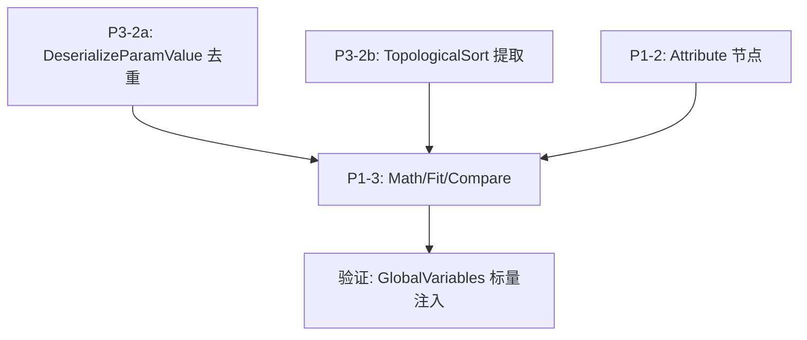

# 阶段 3 详细实施文档

**范围**: P1-2 (属性操作节点补全) + P1-3 (数学/表达式节点) + P3-2 (消除重复代码)

---

## P3-2: 消除重复的 `DeserializeParamValue` 和 `TopologicalSort`

这是最小改动、最高收益的重构，应最先执行，因为后续新节点开发依赖干净的代码基础。

### P3-2a: 消除 `DeserializeParamValue` 重复

**问题**: 三处独立实现完全相同的反序列化逻辑：
- `PCGParamHelper.DeserializeParamValue` (权威版本) [4-cite-0](#4-cite-0)
- `PCGGraphView.DeserializeParamValue` (line 661-713, 重复) [4-cite-1](#4-cite-1)
- `PCGAsyncGraphExecutor.DeserializeParamValue` (line 367-421, 重复) [4-cite-2](#4-cite-2)

`PCGGraphExecutor` 已经正确使用了 `PCGParamHelper`: [4-cite-3](#4-cite-3)

**修改 1**: `PCGGraphView.cs` — 删除 line 661-713 的 `DeserializeParamValue` 方法，将两处调用改为 `PCGParamHelper.DeserializeParamValue`：

```csharp
// line 282 (UnserializeAndPaste 中)
defaults[param.Key] = PCGParamHelper.DeserializeParamValue(param);

// line 471 (LoadGraph 中)
defaults[param.Key] = PCGParamHelper.DeserializeParamValue(param);
```

文件顶部确保有 `using PCGToolkit.Core;`。

**修改 2**: `PCGAsyncGraphExecutor.cs` — 删除 line 367-421 的 `DeserializeParamValue` 方法，将 line 313 的调用改为：

```csharp
// line 313
parameters[param.Key] = PCGParamHelper.DeserializeParamValue(param);
```

文件顶部已有 `using PCGToolkit.Core;` (line 7)。 [4-cite-4](#4-cite-4)

### P3-2b: 提取共享的 `TopologicalSort` 工具类

**问题**: `PCGGraphExecutor.TopologicalSort()` (line 141-195) 和 `PCGAsyncGraphExecutor.TopologicalSort()` (line 426-475) 是完全相同的 Kahn 算法实现。 [4-cite-5](#4-cite-5) [4-cite-6](#4-cite-6)

**新建文件**: `Assets/PCGToolkit/Editor/Core/PCGGraphHelper.cs`

```csharp
using System.Collections.Generic;
using UnityEngine;
using PCGToolkit.Graph;

namespace PCGToolkit.Core
{
    /// <summary>
    /// 图操作工具类，提供拓扑排序等共享算法。
    /// </summary>
    public static class PCGGraphHelper
    {
        /// <summary>
        /// 对节点图进行拓扑排序（Kahn 算法）。
        /// 返回排序后的节点列表，如果存在环则返回 null。
        /// </summary>
        public static List<PCGNodeData> TopologicalSort(PCGGraphData graphData)
        {
            var nodeMap = new Dictionary<string, PCGNodeData>();
            var inDegree = new Dictionary<string, int>();
            var adjacency = new Dictionary<string, List<string>>();

            foreach (var node in graphData.Nodes)
            {
                nodeMap[node.NodeId] = node;
                inDegree[node.NodeId] = 0;
                adjacency[node.NodeId] = new List<string>();
            }

            foreach (var edge in graphData.Edges)
            {
                if (adjacency.ContainsKey(edge.OutputNodeId) && inDegree.ContainsKey(edge.InputNodeId))
                {
                    adjacency[edge.OutputNodeId].Add(edge.InputNodeId);
                    inDegree[edge.InputNodeId]++;
                }
            }

            var queue = new Queue<string>();
            foreach (var kvp in inDegree)
            {
                if (kvp.Value == 0)
                    queue.Enqueue(kvp.Key);
            }

            var sorted = new List<PCGNodeData>();
            while (queue.Count > 0)
            {
                var nodeId = queue.Dequeue();
                sorted.Add(nodeMap[nodeId]);
                foreach (var neighbor in adjacency[nodeId])
                {
                    inDegree[neighbor]--;
                    if (inDegree[neighbor] == 0)
                        queue.Enqueue(neighbor);
                }
            }

            if (sorted.Count != graphData.Nodes.Count)
            {
                Debug.LogError(
                    $"[PCGGraphHelper] Cycle detected! Sorted {sorted.Count} nodes out of {graphData.Nodes.Count}.");
                return null;
            }

            return sorted;
        }
    }
}
```

**修改 `PCGGraphExecutor.cs`**: 删除 line 141-195 的 `TopologicalSort()` 方法，将 line 35 和 line 65 的调用改为：

```csharp
var sortedNodes = PCGGraphHelper.TopologicalSort(graphData);
```

**修改 `PCGAsyncGraphExecutor.cs`**: 删除 line 426-475 的 `TopologicalSort()` 方法，将 line 168 的调用改为：

```csharp
_sortedNodes = PCGGraphHelper.TopologicalSort(_graphData);
```

---

## P1-2: 属性操作节点补全

### 现有属性系统分析

当前 `PCGGeometry` 有四级属性存储：`PointAttribs`, `VertexAttribs`, `PrimAttribs`, `DetailAttribs`，每个都是 `AttributeStore` 实例。 [4-cite-7](#4-cite-7)

`AttributeStore` 支持 `CreateAttribute`, `GetAttribute`, `RemoveAttribute`, `HasAttribute`, `GetAttributeNames`, `GetAllAttributes`, `SetAttribute`, `Clone` 等操作。 [4-cite-8](#4-cite-8)

`PCGAttribute` 存储 `Name`, `Type`, `DefaultValue`, `Values` (List\<object\>)。 [4-cite-9](#4-cite-9)

已有节点：`AttributeCreateNode` 和 `AttributeSetNode`。 [4-cite-10](#4-cite-10) [4-cite-11](#4-cite-11)

### P1-2a: AttributeDeleteNode

**对标 Houdini**: AttribDelete SOP — 删除指定名称的属性。

**文件**: `Assets/PCGToolkit/Editor/Nodes/Attribute/AttributeDeleteNode.cs`

```csharp
using System.Collections.Generic;
using PCGToolkit.Core;

namespace PCGToolkit.Nodes.Attribute
{
    /// <summary>
    /// 删除指定属性（对标 Houdini AttribDelete SOP）
    /// </summary>
    public class AttributeDeleteNode : PCGNodeBase
    {
        public override string Name => "AttributeDelete";
        public override string DisplayName => "Attribute Delete";
        public override string Description => "删除几何体上的指定属性";
        public override PCGNodeCategory Category => PCGNodeCategory.Attribute;

        public override PCGParamSchema[] Inputs => new[]
        {
            new PCGParamSchema("input", PCGPortDirection.Input, PCGPortType.Geometry,
                "Input", "输入几何体", null, required: true),
            new PCGParamSchema("name", PCGPortDirection.Input, PCGPortType.String,
                "Name", "要删除的属性名称（多个用逗号分隔）", ""),
            new PCGParamSchema("class", PCGPortDirection.Input, PCGPortType.String,
                "Class", "属性层级", "point")
            {
                EnumOptions = new[] { "point", "vertex", "primitive", "detail" }
            },
            new PCGParamSchema("deleteAll", PCGPortDirection.Input, PCGPortType.Bool,
                "Delete All", "删除该层级的所有属性", false),
        };

        public override PCGParamSchema[] Outputs => new[]
        {
            new PCGParamSchema("geometry", PCGPortDirection.Output, PCGPortType.Geometry,
                "Geometry", "输出几何体"),
        };

        public override Dictionary<string, PCGGeometry> Execute(
            PCGContext ctx,
            Dictionary<string, PCGGeometry> inputGeometries,
            Dictionary<string, object> parameters)
        {
            var geo = GetInputGeometry(inputGeometries, "input").Clone();
            string names = GetParamString(parameters, "name", "");
            string attrClass = GetParamString(parameters, "class", "point");
            bool deleteAll = GetParamBool(parameters, "deleteAll", false);

            AttributeStore store = GetStore(geo, attrClass);

            if (deleteAll)
            {
                store.Clear();
                ctx.Log($"AttributeDelete: Cleared all {attrClass} attributes");
            }
            else
            {
                var nameList = names.Split(',');
                foreach (var rawName in nameList)
                {
                    var n = rawName.Trim();
                    if (string.IsNullOrEmpty(n)) continue;
                    if (store.RemoveAttribute(n))
                        ctx.Log($"AttributeDelete: Removed {attrClass}.{n}");
                    else
                        ctx.LogWarning($"AttributeDelete: Attribute {attrClass}.{n} not found");
                }
            }

            return SingleOutput("geometry", geo);
        }

        private AttributeStore GetStore(PCGGeometry geo, string attrClass)
        {
            return attrClass.ToLower() switch
            {
                "point" => geo.PointAttribs,
                "vertex" => geo.VertexAttribs,
                "primitive" => geo.PrimAttribs,
                "detail" => geo.DetailAttribs,
                _ => geo.PointAttribs
            };
        }
    }
}
```

### P1-2b: AttributePromoteNode

**对标 Houdini**: AttribPromote SOP — 在 Point/Vertex/Prim/Detail 层级之间转换属性。

**核心逻辑**:
- Point → Detail: 对所有点的属性值求聚合（avg/min/max/sum/first）
- Detail → Point: 将 Detail 值广播到所有点
- Point → Prim: 对每个面的顶点属性值求聚合
- Prim → Point: 将面属性值广播到面的所有顶点（可能冲突，取 first/avg）

**文件**: `Assets/PCGToolkit/Editor/Nodes/Attribute/AttributePromoteNode.cs`

```csharp
using System.Collections.Generic;
using System.Linq;
using PCGToolkit.Core;
using UnityEngine;

namespace PCGToolkit.Nodes.Attribute
{
    /// <summary>
    /// 属性层级提升/降级（对标 Houdini AttribPromote SOP）
    /// </summary>
    public class AttributePromoteNode : PCGNodeBase
    {
        public override string Name => "AttributePromote";
        public override string DisplayName => "Attribute Promote";
        public override string Description => "在 Point/Prim/Detail 层级之间转换属性";
        public override PCGNodeCategory Category => PCGNodeCategory.Attribute;

        public override PCGParamSchema[] Inputs => new[]
        {
            new PCGParamSchema("input", PCGPortDirection.Input, PCGPortType.Geometry,
                "Input", "输入几何体", null, required: true),
            new PCGParamSchema("name", PCGPortDirection.Input, PCGPortType.String,
                "Name", "属性名称", ""),
            new PCGParamSchema("fromClass", PCGPortDirection.Input, PCGPortType.String,
                "From", "源层级", "point")
            {
                EnumOptions = new[] { "point", "primitive", "detail" }
            },
            new PCGParamSchema("toClass", PCGPortDirection.Input, PCGPortType.String,
                "To", "目标层级", "detail")
            {
                EnumOptions = new[] { "point", "primitive", "detail" }
            },
            new PCGParamSchema("method", PCGPortDirection.Input, PCGPortType.String,
                "Method", "聚合方法（多对一时使用）", "average")
            {
                EnumOptions = new[] { "average", "min", "max", "sum", "first" }
            },
            new PCGParamSchema("deleteOriginal", PCGPortDirection.Input, PCGPortType.Bool,
                "Delete Original", "转换后删除源属性", true),
        };

        public override PCGParamSchema[] Outputs => new[]
        {
            new PCGParamSchema("geometry", PCGPortDirection.Output, PCGPortType.Geometry,
                "Geometry", "输出几何体"),
        };

        public override Dictionary<string, PCGGeometry> Execute(
            PCGContext ctx,
            Dictionary<string, PCGGeometry> inputGeometries,
            Dictionary<string, object> parameters)
        {
            var geo = GetInputGeometry(inputGeometries, "input").Clone();
            string attrName = GetParamString(parameters, "name", "");
            string fromClass = GetParamString(parameters, "fromClass", "point");
            string toClass = GetParamString(parameters, "toClass", "detail");
            string method = GetParamString(parameters, "method", "average");
            bool deleteOriginal = GetParamBool(parameters, "deleteOriginal", true);

            if (string.IsNullOrEmpty(attrName))
            {
                ctx.LogWarning("AttributePromote: No attribute name specified");
                return SingleOutput("geometry", geo);
            }

            if (fromClass == toClass)
            {
                ctx.LogWarning("AttributePromote: Source and target class are the same");
                return SingleOutput("geometry", geo);
            }

            var srcStore = GetStore(geo, fromClass);
            var dstStore = GetStore(geo, toClass);
            var srcAttr = srcStore.GetAttribute(attrName);

            if (srcAttr == null)
            {
                ctx.LogWarning($"AttributePromote: Attribute '{attrName}' not found in {fromClass}");
                return SingleOutput("geometry", geo);
            }

            // 执行转换
            if (fromClass == "point" && toClass == "detail")
                PromotePointToDetail(geo, srcAttr, dstStore, method, ctx);
            else if (fromClass == "detail" && toClass == "point")
                PromoteDetailToPoint(geo, srcAttr, dstStore, ctx);
            else if (fromClass == "point" && toClass == "primitive")
                PromotePointToPrim(geo, srcAttr, dstStore, method, ctx);
            else if (fromClass == "primitive" && toClass == "point")
                PromotePrimToPoint(geo, srcAttr, dstStore, method, ctx);
            else if (fromClass == "primitive" && toClass == "detail")
                PromotePrimToDetail(geo, srcAttr, dstStore, method, ctx);
            else if (fromClass == "detail" && toClass == "primitive")
                PromoteDetailToPrim(geo, srcAttr, dstStore, ctx);
            else
                ctx.LogWarning($"AttributePromote: Unsupported conversion {fromClass} -> {toClass}");

            if (deleteOriginal)
                srcStore.RemoveAttribute(attrName);

            return SingleOutput("geometry", geo);
        }

        // ---- Point → Detail: 聚合所有点值为一个 Detail 值 ----
        private void PromotePointToDetail(PCGGeometry geo, PCGAttribute src,
            AttributeStore dstStore, string method, PCGContext ctx)
        {
            if (src.Values.Count == 0) return;
            object result = AggregateValues(src.Values, src.Type, method);
            var dstAttr = dstStore.CreateAttribute(src.Name, src.Type, result);
            dstAttr.Values.Add(result);
            ctx.Log($"AttributePromote: point.{src.Name} -> detail ({method})");
        }

        // ---- Detail → Point: 广播 Detail 值到所有点 ----
        private void PromoteDetailToPoint(PCGGeometry geo, PCGAttribute src,
            AttributeStore dstStore, PCGContext ctx)
        {
            object val = src.Values.Count > 0 ? src.Values[0] : src.DefaultValue;
            var dstAttr = dstStore.CreateAttribute(src.Name, src.Type, val);
            for (int i = 0; i < geo.Points.Count; i++)
                dstAttr.Values.Add(val);
            ctx.Log($"AttributePromote: detail.{src.Name} -> point (broadcast to {geo.Points.Count} points)");
        }

        // ---- Point → Prim: 对每个面的顶点属性值聚合 ----
        private void PromotePointToPrim(PCGGeometry geo, PCGAttribute src,
            AttributeStore dstStore, string method, PCGContext ctx)
        {
            var dstAttr = dstStore.CreateAttribute(src.Name, src.Type, src.DefaultValue);
            foreach (var prim in geo.Primitives)
            {
                var faceValues = new List<object>();
                foreach (int ptIdx in prim)
                {
                    if (ptIdx < src.Values.Count)
                        faceValues.Add(src.Values[ptIdx]);
                }
                dstAttr.Values.Add(faceValues.Count > 0
                    ? AggregateValues(faceValues, src.Type, method)
                    : src.DefaultValue);
            }
            ctx.Log($"AttributePromote: point.{src.Name} -> primitive ({method})");
        }

        // ---- Prim → Point: 将面属性广播到面的顶点 ----
        private void PromotePrimToPoint(PCGGeometry geo, PCGAttribute src,
            AttributeStore dstStore, string method, PCGContext ctx)
        {
            // 每个点可能属于多个面，收集所有面的值后聚合
            var pointValues = new List<object>[geo.Points.Count];
            for (int i = 0; i < geo.Points.Count; i++)
                pointValues[i] = new List<object>();

            for (int primIdx = 0; primIdx < geo.Primitives.Count; primIdx++)
            {
                object primVal = primIdx < src.Values.Count ? src.Values[primIdx] : src.DefaultValue;
                foreach (int ptIdx in geo.Primitives[primIdx])
                {
                    if (ptIdx < pointValues.Length)
                        pointValues[ptIdx].Add(primVal);
                }
            }

            var dstAttr = dstStore.CreateAttribute(src.Name, src.Type, src.DefaultValue);
            for (int i = 0; i < geo.Points.Count; i++)
            {
                dstAttr.Values.Add(pointValues[i].Count > 0
                    ? AggregateValues(pointValues[i], src.Type, method)
                    : src.DefaultValue);
            }
            ctx.Log($"AttributePromote: primitive.{src.Name} -> point ({method})");
        }

        // ---- Prim → Detail ----
        private void PromotePrimToDetail(PCGGeometry geo, PCGAttribute src,
            AttributeStore dstStore, string method, PCGContext ctx)
        {
            if (src.Values.Count == 0) return;
            object result = AggregateValues(src.Values, src.Type, method);
            var dstAttr = dstStore.CreateAttribute(src.Name, src.Type, result);
            dstAttr.Values.Add(result);
            ctx.Log($"AttributePromote: primitive.{src.Name} -> detail ({method})");
        }

        // ---- Detail → Prim ----
        private void PromoteDetailToPrim(PCGGeometry geo, PCGAttribute src,
            AttributeStore dstStore, PCGContext ctx)
        {
            object val = src.Values.Count > 0 ? src.Values[0] : src.DefaultValue;
            var dstAttr = dstStore.CreateAttribute(src.Name, src.Type, val);
            for (int i = 0; i < geo.Primitives.Count; i++)
                dstAttr.Values.Add(val);
            ctx.Log($"AttributePromote: detail.{src.Name} -> primitive (broadcast to {geo.Primitives.Count} prims)");
        }

        // ---- 聚合函数 ----
        private object AggregateValues(List<object> values, AttribType type, string method)
        {
            if (values.Count == 0) return null;
            if (method == "first") return values[0];

            if (type == AttribType.Float || type == AttribType.Int)
            {
                var floats = values.Select(v => v is float f ? f : v is int i ? (float)i : 0f).ToList();
                return method switch
                {
                    "average" => floats.Average(),
                    "min" => floats.Min(),
                    "max" => floats.Max(),
                    "sum" => floats.Sum(),
                    _ => floats.Average()
                };
            }

            if (type == AttribType.Vector3)
            {
                var vecs = values.Select(v => v is Vector3 vec ? vec : Vector3.zero).ToList();
                return method switch
                {
                    "average" => vecs.Aggregate(Vector3.zero, (a, b) => a + b) / vecs.Count,
                    "min" => new Vector3(vecs.Min(v => v.x), vecs.Min(v => v.y), vecs.Min(v => v.z)),
                    "max" => new Vector3(vecs.Max(v => v.x), vecs.Max(v => v.y), vecs.Max(v => v.z)),
                    "sum" => vecs.Aggregate(Vector3.zero, (a, b) => a + b),
                    _ => vecs.Aggregate(Vector3.zero, (a, b) => a + b) / vecs.Count
                };
            }

            if (type == AttribType.Color)
            {
                var colors = values.Select(v => v is Color c ? c : Color.white).ToList();
                return method switch
                {
                    "average" => new Color(
                        colors.Average(c => c.r), colors.Average(c => c.g),
                        colors.Average(c => c.b), colors.Average(c => c.a)),
                    _ => colors[0]
                };
            }

            // String 等类型只支持 first
            return values[0];
        }

        private AttributeStore GetStore(PCGGeometry geo, string attrClass)
        {
            return attrClass.ToLower() switch
            {
                "point" => geo.PointAttribs,
                "vertex" => geo.VertexAttribs,
                "primitive" => geo.PrimAttribs,
                "detail" => geo.DetailAttribs,
                _ => geo.PointAttribs
            };
        }
    }
}
```

### P1-2c: AttributeTransferNode

**对标 Houdini**: AttribTransfer SOP — 基于空间距离从一个几何体向另一个几何体传递属性。

**核心逻辑**:
1. 对于目标几何体的每个点，在源几何体中找到最近的 K 个点
2. 根据距离权重插值源属性值，写入目标点

**文件**: `Assets/PCGToolkit/Editor/Nodes/Attribute/AttributeTransferNode.cs`

```csharp
using System.Collections.Generic;
using System.Linq;
using PCGToolkit.Core;
using UnityEngine;

namespace PCGToolkit.Nodes.Attribute
{
    public class AttributeTransferNode : PCGNodeBase
    {
        public override string Name => "AttributeTransfer";
        public override string DisplayName => "Attribute Transfer";
        public override string Description => "基于空间距离从源几何体向目标几何体传递点属性";
        public override PCGNodeCategory Category => PCGNodeCategory.Attribute;

        public override PCGParamSchema[] Inputs => new[]
        {
            new PCGParamSchema("target", PCGPortDirection.Input, PCGPortType.Geometry,
                "Target", "目标几何体（接收属性）", null, required: true),
            new PCGParamSchema("source", PCGPortDirection.Input, PCGPortType.Geometry,
                "Source", "源几何体（提供属性）", null, required: true),
            new PCGParamSchema("name", PCGPortDirection.Input, PCGPortType.String,
                "Name", "要传递的属性名称（多个用逗号分隔，空=全部）", ""),
            new PCGParamSchema("maxDistance", PCGPortDirection.Input, PCGPortType.Float,
                "Max Distance", "最大搜索距离", 10f)
            {
                Min = 0.001f, Max = 1000f
            },
            new PCGParamSchema("blendWidth", PCGPortDirection.Input, PCGPortType.Float,
                "Blend Width", "混合宽度（距离衰减范围）", 1f)
            {
                Min = 0.001f, Max = 100f
            },
        };

        public override PCGParamSchema[] Outputs => new[]
        {
            new PCGParamSchema("geometry", PCGPortDirection.Output, PCGPortType.Geometry,
                "Geometry", "输出几何体（带传递后的属性）"),
        };

        public override Dictionary<string, PCGGeometry> Execute(
            PCGContext ctx,
            Dictionary<string, PCGGeometry> inputGeometries,
            Dictionary<string, object> parameters)
        {
            var target = GetInputGeometry(inputGeometries, "target").Clone();
            var source = GetInputGeometry(inputGeometries, "source");
            string names = GetParamString(parameters, "name", "");
            float maxDist = GetParamFloat(parameters, "maxDistance", 10f);
            float blendWidth = GetParamFloat(parameters, "blendWidth", 1f);

            if (source.Points.Count == 0)
            {
                ctx.LogWarning("AttributeTransfer: Source geometry has no points");
                return SingleOutput("geometry", target);
            }

            // 确定要传递的属性列表
            List<PCGAttribute> attrsToTransfer;
            if (string.IsNullOrEmpty(names))
            {
                attrsToTransfer = source.PointAttribs.GetAllAttributes().ToList();
            }
            else
            {
                attrsToTransfer = new List<PCGAttribute>();
                foreach (var rawName in names.Split(','))
                {
                    var n = rawName.Trim();
                    var attr = source.PointAttribs.GetAttribute(n);
                    if (attr != null) attrsToTransfer.Add(attr);
                    else ctx.LogWarning($"AttributeTransfer: Attribute '{n}' not found in source");
                }
            }

            if (attrsToTransfer.Count == 0)
            {
                ctx.LogWarning("AttributeTransfer: No attributes to transfer");
                return SingleOutput("geometry", target);
            }

            // 为每个属性在目标上创建对应属性
            var targetAttrs = new Dictionary<string, PCGAttribute>();
            foreach (var srcAttr in attrsToTransfer)
            {
                var dstAttr = target.PointAttribs.CreateAttribute(
                    srcAttr.Name, srcAttr.Type, srcAttr.DefaultValue);
                // 预填充默认值
                for (int i = 0; i < target.Points.Count; i++)
                    dstAttr.Values.Add(srcAttr.DefaultValue);
                targetAttrs[srcAttr.Name] = dstAttr;
            }

            float maxDistSq = maxDist * maxDist;

            // 对每个目标点，找源几何体中最近的点并插值
            for (int ti = 0; ti < target.Points.Count; ti++)
            {
                Vector3 targetPos = target.Points[ti];

                // 暴力搜索最近点（后续可优化为 KD-Tree）
                float bestDistSq = float.MaxValue;
                int bestIdx = -1;

                for (int si = 0; si < source.Points.Count; si++)
                {
                    float distSq = (source.Points[si] - targetPos).sqrMagnitude;
                    if (distSq < bestDistSq)
                    {
                        bestDistSq = distSq;
                        bestIdx = si;
                    }
                }

                if (bestIdx < 0 || bestDistSq > maxDistSq)
                    continue; // 超出最大距离，保持默认值

                float dist = Mathf.Sqrt(bestDistSq);

                // 距离衰减权重：在 blendWidth 范围内线性衰减
                float weight = 1f;
                if (blendWidth > 0.001f && dist > 0f)
                {
                    weight = Mathf.Clamp01(1f - dist / blendWidth);
                }

                // 对每个属性进行加权插值
                foreach (var srcAttr in attrsToTransfer)
                {
                    if (bestIdx >= srcAttr.Values.Count) continue;
                    var dstAttr = targetAttrs[srcAttr.Name];
                    object srcVal = srcAttr.Values[bestIdx];
                    object dstVal = dstAttr.Values[ti];

                    dstAttr.Values[ti] = LerpValue(dstVal, srcVal, weight, srcAttr.Type);
                }
            }

            ctx.Log($"AttributeTransfer: Transferred {attrsToTransfer.Count} attributes " +
                    $"from {source.Points.Count} source points to {target.Points.Count} target points");
            return SingleOutput("geometry", target);
        }

        /// <summary>
        /// 按权重插值两个属性值
        /// </summary>
        private object LerpValue(object a, object b, float t, AttribType type)
        {
            switch (type)
            {
                case AttribType.Float:
                {
                    float fa = a is float f1 ? f1 : 0f;
                    float fb = b is float f2 ? f2 : 0f;
                    return Mathf.Lerp(fa, fb, t);
                }
                case AttribType.Int:
                {
                    int ia = a is int i1 ? i1 : 0;
                    int ib = b is int i2 ? i2 : 0;
                    return Mathf.RoundToInt(Mathf.Lerp(ia, ib, t));
                }
                case AttribType.Vector3:
                {
                    Vector3 va = a is Vector3 v1 ? v1 : Vector3.zero;
                    Vector3 vb = b is Vector3 v2 ? v2 : Vector3.zero;
                    return Vector3.Lerp(va, vb, t);
                }
                case AttribType.Color:
                {
                    Color ca = a is Color c1 ? c1 : Color.white;
                    Color cb = b is Color c2 ? c2 : Color.white;
                    return Color.Lerp(ca, cb, t);
                }
                default:
                    // String 等不可插值类型：权重 > 0.5 时取源值
                    return t > 0.5f ? b : a;
            }
        }
    }
}
```

**设计说明**:
- 当前使用 O(n*m) 暴力搜索最近点，对于大规模几何体性能不佳。后续 P3 阶段可引入 KD-Tree 优化
- `blendWidth` 控制距离衰减：距离为 0 时权重为 1（完全取源值），距离等于 `blendWidth` 时权重为 0（保持默认值）
- 对 Float/Int/Vector3/Color 支持线性插值，String 类型按阈值切换 [5-cite-2](#5-cite-2)

---

## P1-3: 数学/表达式节点

这些节点不操作几何体，而是通过 `ctx.GlobalVariables` 传递标量值，与现有的 `ConstFloatNode` 等节点模式一致。 [5-cite-3](#5-cite-3) [5-cite-4](#5-cite-4)

### P1-3a: FitNode (范围映射)

**对标 Houdini**: fit() VEX 函数 — 将值从一个范围映射到另一个范围。

**文件**: `Assets/PCGToolkit/Editor/Nodes/Utility/FitNode.cs`

```csharp
using System.Collections.Generic;
using PCGToolkit.Core;
using UnityEngine;

namespace PCGToolkit.Nodes.Utility
{
    /// <summary>
    /// 范围映射节点（对标 Houdini fit() 函数）
    /// 将值从 [srcMin, srcMax] 映射到 [dstMin, dstMax]
    /// </summary>
    public class FitNode : PCGNodeBase
    {
        public override string Name => "Fit";
        public override string DisplayName => "Fit (Remap)";
        public override string Description => "将值从源范围映射到目标范围";
        public override PCGNodeCategory Category => PCGNodeCategory.Utility;

        public override PCGParamSchema[] Inputs => new[]
        {
            new PCGParamSchema("value", PCGPortDirection.Input, PCGPortType.Float,
                "Value", "输入值", 0f),
            new PCGParamSchema("srcMin", PCGPortDirection.Input, PCGPortType.Float,
                "Source Min", "源范围最小值", 0f),
            new PCGParamSchema("srcMax", PCGPortDirection.Input, PCGPortType.Float,
                "Source Max", "源范围最大值", 1f),
            new PCGParamSchema("dstMin", PCGPortDirection.Input, PCGPortType.Float,
                "Dest Min", "目标范围最小值", 0f),
            new PCGParamSchema("dstMax", PCGPortDirection.Input, PCGPortType.Float,
                "Dest Max", "目标范围最大值", 1f),
            new PCGParamSchema("clamp", PCGPortDirection.Input, PCGPortType.Bool,
                "Clamp", "是否将结果限制在目标范围内", true),
        };

        public override PCGParamSchema[] Outputs => new[]
        {
            new PCGParamSchema("value", PCGPortDirection.Output, PCGPortType.Float,
                "Value", "映射后的值"),
        };

        public override Dictionary<string, PCGGeometry> Execute(
            PCGContext ctx, Dictionary<string, PCGGeometry> inputGeometries,
            Dictionary<string, object> parameters)
        {
            float value = GetParamFloat(parameters, "value", 0f);
            float srcMin = GetParamFloat(parameters, "srcMin", 0f);
            float srcMax = GetParamFloat(parameters, "srcMax", 1f);
            float dstMin = GetParamFloat(parameters, "dstMin", 0f);
            float dstMax = GetParamFloat(parameters, "dstMax", 1f);
            bool clamp = GetParamBool(parameters, "clamp", true);

            float srcRange = srcMax - srcMin;
            float result;

            if (Mathf.Abs(srcRange) < 1e-7f)
            {
                // 源范围为零，避免除零
                result = dstMin;
                ctx.LogWarning("Fit: Source range is zero, outputting dstMin");
            }
            else
            {
                float t = (value - srcMin) / srcRange;
                if (clamp) t = Mathf.Clamp01(t);
                result = Mathf.Lerp(dstMin, dstMax, t);
            }

            ctx.GlobalVariables[$"{ctx.CurrentNodeId}.value"] = result;
            ctx.Log($"Fit: {value} [{srcMin},{srcMax}] -> {result} [{dstMin},{dstMax}]");
            return new Dictionary<string, PCGGeometry>();
        }
    }
}
```

### P1-3b: MathNode (基础数学运算)

**对标 Houdini**: Math VOP / 各种 VEX 数学函数

**文件**: `Assets/PCGToolkit/Editor/Nodes/Utility/MathNode.cs`

```csharp
using System.Collections.Generic;
using PCGToolkit.Core;
using UnityEngine;

namespace PCGToolkit.Nodes.Utility
{
    /// <summary>
    /// 基础数学运算节点
    /// 支持 Add / Subtract / Multiply / Divide / Power / Modulo / Min / Max / Abs
    /// </summary>
    public class MathNode : PCGNodeBase
    {
        public override string Name => "Math";
        public override string DisplayName => "Math";
        public override string Description => "对两个浮点数执行数学运算";
        public override PCGNodeCategory Category => PCGNodeCategory.Utility;

        public override PCGParamSchema[] Inputs => new[]
        {
            new PCGParamSchema("a", PCGPortDirection.Input, PCGPortType.Float,
                "A", "第一个操作数", 0f),
            new PCGParamSchema("b", PCGPortDirection.Input, PCGPortType.Float,
                "B", "第二个操作数", 0f),
            new PCGParamSchema("operation", PCGPortDirection.Input, PCGPortType.String,
                "Operation", "运算类型", "add")
            {
                EnumOptions = new[] { "add", "subtract", "multiply", "divide",
                                      "power", "modulo", "min", "max", "abs" }
            },
        };

        public override PCGParamSchema[] Outputs => new[]
        {
            new PCGParamSchema("value", PCGPortDirection.Output, PCGPortType.Float,
                "Value", "运算结果"),
        };

        public override Dictionary<string, PCGGeometry> Execute(
            PCGContext ctx, Dictionary<string, PCGGeometry> inputGeometries,
            Dictionary<string, object> parameters)
        {
            float a = GetParamFloat(parameters, "a", 0f);
            float b = GetParamFloat(parameters, "b", 0f);
            string op = GetParamString(parameters, "operation", "add");

            float result = op.ToLower() switch
            {
                "add" => a + b,
                "subtract" => a - b,
                "multiply" => a * b,
                "divide" => Mathf.Abs(b) > 1e-7f ? a / b : 0f,
                "power" => Mathf.Pow(a, b),
                "modulo" => Mathf.Abs(b) > 1e-7f ? a % b : 0f,
                "min" => Mathf.Min(a, b),
                "max" => Mathf.Max(a, b),
                "abs" => Mathf.Abs(a),
                _ => a + b
            };

            if (op == "divide" && Mathf.Abs(b) <= 1e-7f)
                ctx.LogWarning("Math: Division by near-zero, result set to 0");
            if (op == "modulo" && Mathf.Abs(b) <= 1e-7f)
                ctx.LogWarning("Math: Modulo by near-zero, result set to 0");

            ctx.GlobalVariables[$"{ctx.CurrentNodeId}.value"] = result;
            ctx.Log($"Math: {a} {op} {b} = {result}");
            return new Dictionary<string, PCGGeometry>();
        }
    }
}
```

**设计说明**:
- 使用 `EnumOptions` 渲染为下拉框，与现有的 Enum/Dropdown 支持一致 [5-cite-5](#5-cite-5)
- `divide` 和 `modulo` 对除零做了保护
- `abs` 只使用操作数 A，忽略 B
- 通过 `ctx.GlobalVariables` 传递结果，与 `ConstFloatNode` 模式一致

### P1-3c: CompareNode (比较运算)

**文件**: `Assets/PCGToolkit/Editor/Nodes/Utility/CompareNode.cs`

```csharp
using System.Collections.Generic;
using PCGToolkit.Core;
using UnityEngine;

namespace PCGToolkit.Nodes.Utility
{
    /// <summary>
    /// 比较运算节点，输出布尔值（0 或 1 的 float）
    /// 可用于驱动 SwitchNode 的 index 参数
    /// </summary>
    public class CompareNode : PCGNodeBase
    {
        public override string Name => "Compare";
        public override string DisplayName => "Compare";
        public override string Description => "比较两个浮点数，输出布尔结果（0 或 1）";
        public override PCGNodeCategory Category => PCGNodeCategory.Utility;

        public override PCGParamSchema[] Inputs => new[]
        {
            new PCGParamSchema("a", PCGPortDirection.Input, PCGPortType.Float,
                "A", "第一个操作数", 0f),
            new PCGParamSchema("b", PCGPortDirection.Input, PCGPortType.Float,
                "B", "第二个操作数", 0f),
            new PCGParamSchema("operation", PCGPortDirection.Input, PCGPortType.String,
                "Operation", "比较类型", "equal")
            {
                EnumOptions = new[] { "equal", "notEqual", "greater", "greaterEqual",
                                      "less", "lessEqual" }
            },
            new PCGParamSchema("tolerance", PCGPortDirection.Input, PCGPortType.Float,
                "Tolerance", "相等比较的容差", 0.001f)
            {
                Min = 0f, Max = 1f
            },
        };

        public override PCGParamSchema[] Outputs => new[]
        {
            new PCGParamSchema("result", PCGPortDirection.Output, PCGPortType.Int,
                "Result", "比较结果（0=false, 1=true）"),
        };

        public override Dictionary<string, PCGGeometry> Execute(
            PCGContext ctx, Dictionary<string, PCGGeometry> inputGeometries,
            Dictionary<string, object> parameters)
        {
            float a = GetParamFloat(parameters, "a", 0f);
            float b = GetParamFloat(parameters, "b", 0f);
            string op = GetParamString(parameters, "operation", "equal");
            float tolerance = GetParamFloat(parameters, "tolerance", 0.001f);

            bool result = op.ToLower() switch
            {
                "equal" => Mathf.Abs(a - b) <= tolerance,
                "notequal" => Mathf.Abs(a - b) > tolerance,
                "greater" => a > b,
                "greaterequal" => a >= b,
                "less" => a < b,
                "lessequal" => a <= b,
                _ => false
            };

            int intResult = result ? 1 : 0;
            ctx.GlobalVariables[$"{ctx.CurrentNodeId}.result"] = intResult;
            ctx.Log($"Compare: {a} {op} {b} = {result}");
            return new Dictionary<string, PCGGeometry>();
        }
    }
}
```

**设计说明**:
- 输出 `Int` 类型（0 或 1），可以直接连接到 `SwitchNode` 的 `index` 端口
- `equal` 和 `notEqual` 使用 `tolerance` 容差进行浮点比较
- 通过 `ctx.GlobalVariables` 传递结果

---

## 关于非 Geometry 端口的数据流说明

当前架构中，节点间的数据流主要通过 `Dictionary<string, PCGGeometry>` 传递几何体。对于标量值（Float/Int/Bool/String），使用 `ctx.GlobalVariables` 作为旁路通道，key 格式为 `"{nodeId}.{portName}"`。 [5-cite-4](#5-cite-4)

执行器在收集节点输入时，需要检查上游节点是否通过 `GlobalVariables` 输出了标量值，并将其注入到下游节点的 `parameters` 字典中。这个机制在 `ConstFloatNode` 等节点中已经在使用。 [5-cite-6](#5-cite-6)

如果执行器尚未实现从 `GlobalVariables` 自动注入参数的逻辑，需要在 `PCGAsyncGraphExecutor` 和 `PCGGraphExecutor` 的节点执行循环中添加：

```csharp
// 在收集 parameters 之后、调用 node.Execute 之前添加：
// 检查输入端口是否连接了标量输出节点，从 GlobalVariables 注入值
foreach (var edge in graphData.Edges)
{
    if (edge.InputNodeId == nodeData.NodeId)
    {
        string globalKey = $"{edge.OutputNodeId}.{edge.OutputPortName}";
        if (ctx.GlobalVariables.TryGetValue(globalKey, out var globalVal))
        {
            parameters[edge.InputPortName] = globalVal;
        }
    }
}
```

---

## 文件变更清单

| 文件 | 操作 | 说明 |
|------|------|------|
| `Editor/Core/PCGGraphHelper.cs` | **新建** | 共享拓扑排序工具类 (~70 行) |
| `Editor/Nodes/Attribute/AttributeDeleteNode.cs` | **新建** | 属性删除节点 (~70 行) |
| `Editor/Nodes/Attribute/AttributePromoteNode.cs` | **新建** | 属性层级转换节点 (~250 行) |
| `Editor/Nodes/Attribute/AttributeTransferNode.cs` | **新建** | 属性空间传递节点 (~170 行) |
| `Editor/Nodes/Utility/FitNode.cs` | **新建** | 范围映射节点 (~70 行) |
| `Editor/Nodes/Utility/MathNode.cs` | **新建** | 数学运算节点 (~65 行) |
| `Editor/Nodes/Utility/CompareNode.cs` | **新建** | 比较运算节点 (~65 行) |
| `Editor/Graph/PCGGraphView.cs` | 改 | 删除重复 `DeserializeParamValue` (-52 行), 改 2 处调用 |
| `Editor/Graph/PCGAsyncGraphExecutor.cs` | 改 | 删除重复 `DeserializeParamValue` (-55 行) 和 `TopologicalSort` (-50 行), 改调用 |
| `Editor/Graph/PCGGraphExecutor.cs` | 改 | 删除重复 `TopologicalSort` (-55 行), 改调用 |

---

## 依赖关系



- P3-2 (去重) 无外部依赖，可立即执行
- P1-2 (属性节点) 依赖阶段 1 的 P0-7 (`BuildEdges`) 完成（AttributePromote 的 Point→Prim 需要知道面的顶点关系，但不依赖边数据，所以实际上可以并行）
- P1-3 (数学节点) 需要确认执行器的 `GlobalVariables` 标量注入机制是否完整