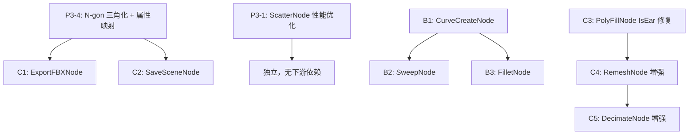

Now I have all the context I need. Let me produce the comprehensive Phase 4 document.

# 阶段 4 详细实施文档

**范围**: P1-4 前 8 个 Tier 4-8 节点 + P3-1 (ScatterNode 性能优化) + P3-4 (N-gon 三角化)

---

## 总览

阶段 4 分为三个部分：

| 部分 | 内容 | 优先级 |
|------|------|--------|
| **A. 性能修复** | P3-1 ScatterNode.RelaxPoints + P3-4 N-gon 三角化 | 最高（其他节点依赖） |
| **B. 曲线节点** | CurveCreateNode + SweepNode + FilletNode | 高 |
| **C. 输出/拓扑节点** | ExportFBXNode 修复 + SaveSceneNode 修复 + PolyFillNode 增强 + RemeshNode 增强 + DecimateNode 增强 | 中 |

---

## Part A: 性能修复

### P3-1: ScatterNode.RelaxPoints O(n²) → 空间哈希网格

**问题**: 当前 `RelaxPoints` 使用双重循环暴力搜索邻居，硬编码 `0.5f` 距离阈值，对 1000+ 点性能极差。 [6-cite-0](#6-cite-0)

**实现思路**: 使用空间哈希网格（Spatial Hash Grid），将空间划分为 `cellSize × cellSize × cellSize` 的格子，每个点只需检查相邻 27 个格子中的点。

**替换 `RelaxPoints` 方法** (line 176-200):

```csharp
private List<Vector3> RelaxPoints(List<Vector3> points, int iterations)
{
    if (points.Count < 2) return points;

    // 自适应距离阈值：基于点的平均间距
    Bounds bounds = new Bounds(points[0], Vector3.zero);
    foreach (var p in points) bounds.Encapsulate(p);
    float volume = bounds.size.x * bounds.size.y * bounds.size.z;
    // 估算平均间距
    float avgSpacing = Mathf.Pow(volume / Mathf.Max(1, points.Count), 1f / 3f);
    float cellSize = Mathf.Max(avgSpacing * 2f, 0.01f);
    float repelRadius = cellSize * 0.5f;

    for (int iter = 0; iter < iterations; iter++)
    {
        // 构建空间哈希网格
        var grid = new Dictionary<(int, int, int), List<int>>();
        for (int i = 0; i < points.Count; i++)
        {
            var cell = GetCell(points[i], cellSize);
            if (!grid.ContainsKey(cell)) grid[cell] = new List<int>();
            grid[cell].Add(i);
        }

        var newPoints = new List<Vector3>(points);

        for (int i = 0; i < points.Count; i++)
        {
            Vector3 avg = points[i];
            int neighborCount = 1;
            var cell = GetCell(points[i], cellSize);

            // 只检查相邻 27 个格子
            for (int dx = -1; dx <= 1; dx++)
            for (int dy = -1; dy <= 1; dy++)
            for (int dz = -1; dz <= 1; dz++)
            {
                var neighborCell = (cell.Item1 + dx, cell.Item2 + dy, cell.Item3 + dz);
                if (!grid.TryGetValue(neighborCell, out var bucket)) continue;

                foreach (int j in bucket)
                {
                    if (i == j) continue;
                    if (Vector3.Distance(points[i], points[j]) < repelRadius)
                    {
                        avg += points[j];
                        neighborCount++;
                    }
                }
            }

            newPoints[i] = avg / neighborCount;
        }

        points = newPoints;
    }
    return points;
}

private static (int, int, int) GetCell(Vector3 pos, float cellSize)
{
    return (
        Mathf.FloorToInt(pos.x / cellSize),
        Mathf.FloorToInt(pos.y / cellSize),
        Mathf.FloorToInt(pos.z / cellSize)
    );
}
```

复杂度从 O(n² × iterations) 降为 O(n × iterations)（假设点分布均匀）。

---

### P3-4: PCGGeometryToMesh N-gon 三角化

**问题**: 当前 `Convert()` 只处理三角形和四边形，N-gon 直接跳过（line 47 TODO）。 [6-cite-1](#6-cite-1)

**实现思路**: 使用耳切法（Ear Clipping）进行通用多边形三角化。不引入外部依赖（LibTessDotNet），先用内置实现覆盖大部分场景。

**替换 `PCGGeometryToMesh.Convert` 的三角化循环** (line 29-48):

```csharp
public static Mesh Convert(PCGGeometry geometry)
{
    Debug.Log($"[PCGGeometryToMesh] Converting (Points: {geometry?.Points.Count ?? 0}, Prims: {geometry?.Primitives.Count ?? 0})");

    var mesh = new Mesh();
    mesh.name = "PCGMesh";

    if (geometry == null || geometry.Points.Count == 0)
        return mesh;

    // 大网格支持
    if (geometry.Points.Count > 65535)
        mesh.indexFormat = UnityEngine.Rendering.IndexFormat.UInt32;

    mesh.vertices = geometry.Points.ToArray();

    var triangles = new List<int>();
    foreach (var prim in geometry.Primitives)
    {
        if (prim.Length < 3) continue;

        if (prim.Length == 3)
        {
            triangles.Add(prim[0]);
            triangles.Add(prim[1]);
            triangles.Add(prim[2]);
        }
        else if (prim.Length == 4)
        {
            triangles.Add(prim[0]);
            triangles.Add(prim[1]);
            triangles.Add(prim[2]);
            triangles.Add(prim[0]);
            triangles.Add(prim[2]);
            triangles.Add(prim[3]);
        }
        else
        {
            // N-gon: 耳切法三角化
            TriangulateNgon(geometry.Points, prim, triangles);
        }
    }
    mesh.triangles = triangles.ToArray();

    // 属性映射（阶段 1 P0-6 已实现）
    MapAttributes(geometry, mesh);

    mesh.RecalculateBounds();
    mesh.RecalculateTangents();

    return mesh;
}

/// <summary>
/// 耳切法三角化 N-gon
/// </summary>
private static void TriangulateNgon(List<Vector3> allPoints, int[] prim, List<int> triangles)
{
    // 计算多边形法线（用于判断凸凹）
    Vector3 normal = Vector3.zero;
    for (int i = 0; i < prim.Length; i++)
    {
        Vector3 curr = allPoints[prim[i]];
        Vector3 next = allPoints[prim[(i + 1) % prim.Length]];
        normal.x += (curr.y - next.y) * (curr.z + next.z);
        normal.y += (curr.z - next.z) * (curr.x + next.x);
        normal.z += (curr.x - next.x) * (curr.y + next.y);
    }
    normal.Normalize();

    var indices = new List<int>(prim);

    int safety = indices.Count * indices.Count; // 防止无限循环
    while (indices.Count > 3 && safety-- > 0)
    {
        bool earFound = false;
        for (int i = 0; i < indices.Count; i++)
        {
            int prev = (i - 1 + indices.Count) % indices.Count;
            int next = (i + 1) % indices.Count;

            Vector3 a = allPoints[indices[prev]];
            Vector3 b = allPoints[indices[i]];
            Vector3 c = allPoints[indices[next]];

            // 检查是否为凸角
            Vector3 cross = Vector3.Cross(b - a, c - b);
            if (Vector3.Dot(cross, normal) < 0) continue;

            // 检查是否有其他点在三角形内
            bool isEar = true;
            for (int j = 0; j < indices.Count; j++)
            {
                if (j == prev || j == i || j == next) continue;
                if (PointInTriangle(allPoints[indices[j]], a, b, c))
                {
                    isEar = false;
                    break;
                }
            }

            if (isEar)
            {
                triangles.Add(indices[prev]);
                triangles.Add(indices[i]);
                triangles.Add(indices[next]);
                indices.RemoveAt(i);
                earFound = true;
                break;
            }
        }

        if (!earFound)
        {
            // Fallback: 扇形三角化
            for (int i = 1; i < indices.Count - 1; i++)
            {
                triangles.Add(indices[0]);
                triangles.Add(indices[i]);
                triangles.Add(indices[i + 1]);
            }
            break;
        }
    }

    if (indices.Count == 3)
    {
        triangles.Add(indices[0]);
        triangles.Add(indices[1]);
        triangles.Add(indices[2]);
    }
}

private static bool PointInTriangle(Vector3 p, Vector3 a, Vector3 b, Vector3 c)
{
    Vector3 v0 = c - a, v1 = b - a, v2 = p - a;
    float dot00 = Vector3.Dot(v0, v0);
    float dot01 = Vector3.Dot(v0, v1);
    float dot02 = Vector3.Dot(v0, v2);
    float dot11 = Vector3.Dot(v1, v1);
    float dot12 = Vector3.Dot(v1, v2);
    float inv = 1f / (dot00 * dot11 - dot01 * dot01);
    float u = (dot11 * dot02 - dot01 * dot12) * inv;
    float v = (dot00 * dot12 - dot01 * dot02) * inv;
    return u >= 0 && v >= 0 && u + v <= 1;
}

/// <summary>
/// 从 PointAttribs 映射属性到 Mesh（阶段 1 P0-6 的实现）
/// </summary>
private static void MapAttributes(PCGGeometry geometry, Mesh mesh)
{
    int ptCount = geometry.Points.Count;

    // Normal ("N")
    var normalAttr = geometry.PointAttribs.GetAttribute("N");
    bool hasCustomNormals = false;
    if (normalAttr != null && normalAttr.Values.Count == ptCount)
    {
        var normals = new Vector3[ptCount];
        for (int i = 0; i < ptCount; i++)
            normals[i] = normalAttr.Values[i] is Vector3 n ? n : Vector3.up;
        mesh.normals = normals;
        hasCustomNormals = true;
    }

    // UV ("uv")
    var uvAttr = geometry.PointAttribs.GetAttribute("uv");
    if (uvAttr != null && uvAttr.Values.Count == ptCount)
    {
        var uvs = new Vector2[ptCount];
        for (int i = 0; i < ptCount; i++)
        {
            if (uvAttr.Values[i] is Vector2 uv2) uvs[i] = uv2;
            else if (uvAttr.Values[i] is Vector3 uv3) uvs[i] = new Vector2(uv3.x, uv3.y);
        }
        mesh.uv = uvs;
    }

    // Color ("Cd")
    var cdAttr = geometry.PointAttribs.GetAttribute("Cd");
    if (cdAttr != null && cdAttr.Values.Count == ptCount)
    {
        var colors = new Color[ptCount];
        for (int i = 0; i < ptCount; i++)
        {
            if (cdAttr.Values[i] is Color c) colors[i] = c;
            else if (cdAttr.Values[i] is Vector3 v) colors[i] = new Color(v.x, v.y, v.z, 1f);
            else colors[i] = Color.white;
        }
        mesh.colors = colors;
    }

    if (!hasCustomNormals)
        mesh.RecalculateNormals();
}
```

同时补全 `FromMesh` 方法中的 UV/Color 映射 (line 80 之后): [6-cite-2](#6-cite-2)

```csharp
public static PCGGeometry FromMesh(Mesh mesh)
{
    var geo = new PCGGeometry();
    if (mesh == null) return geo;

    geo.Points = new List<Vector3>(mesh.vertices);

    var tris = mesh.triangles;
    for (int i = 0; i < tris.Length; i += 3)
        geo.Primitives.Add(new int[] { tris[i], tris[i + 1], tris[i + 2] });

    // Normals
    if (mesh.normals != null && mesh.normals.Length > 0)
    {
        var normalAttr = geo.PointAttribs.CreateAttribute("N", AttribType.Vector3);
        foreach (var n in mesh.normals) normalAttr.Values.Add(n);
    }

    // UV
    if (mesh.uv != null && mesh.uv.Length > 0)
    {
        var uvAttr = geo.PointAttribs.CreateAttribute("uv", AttribType.Vector2);
        foreach (var uv in mesh.uv) uvAttr.Values.Add(uv);
    }

    // Color
    if (mesh.colors != null && mesh.colors.Length > 0)
    {
        var cdAttr = geo.PointAttribs.CreateAttribute("Cd", AttribType.Color);
        foreach (var c in mesh.colors) cdAttr.Values.Add(c);
    }

    return geo;
}
```

---

## Part B: 曲线节点

### B1: CurveCreateNode

**对标 Houdini**: 创建曲线几何体（polyline/bezier/nurbs），输出点序列 + 曲线类型 Detail 属性。

**文件**: `Assets/PCGToolkit/Editor/Nodes/Curve/CurveCreateNode.cs`

**设计要点**:
- 输出的几何体只有 Points 和 Edges（无 Primitives），与 `LineNode` 模式一致 [6-cite-3](#6-cite-3)
- 曲线类型存储为 Detail 属性 `curveType`，供下游 SweepNode 等读取
- Bezier 模式：生成 De Casteljau 评估的点序列
- Polyline 模式：直接生成等间距点

```csharp
using System.Collections.Generic;
using PCGToolkit.Core;
using UnityEngine;

namespace PCGToolkit.Nodes.Curve
{
    /// <summary>
    /// 创建曲线几何体（对标 Houdini CurveCreate SOP）
    /// </summary>
    public class CurveCreateNode : PCGNodeBase
    {
        public override string Name => "CurveCreate";
        public override string DisplayName => "Curve Create";
        public override string Description => "创建曲线几何体（polyline/bezier/circle）";
        public override PCGNodeCategory Category => PCGNodeCategory.Curve;

        public override PCGParamSchema[] Inputs => new[]
        {
            new PCGParamSchema("curveType", PCGPortDirection.Input, PCGPortType.String,
                "Curve Type", "曲线类型", "polyline")
            {
                EnumOptions = new[] { "polyline", "bezier", "circle" }
            },
            new PCGParamSchema("pointCount", PCGPortDirection.Input, PCGPortType.Int,
                "Point Count", "控制点/输出点数量", 8) { Min = 2, Max = 256 },
            new PCGParamSchema("closed", PCGPortDirection.Input, PCGPortType.Bool,
                "Closed", "是否闭合曲线", false),
            new PCGParamSchema("radius", PCGPortDirection.Input, PCGPortType.Float,
                "Radius", "半径（circle 模式）或 bezier 控制点分布半径", 1f),
            new PCGParamSchema("height", PCGPortDirection.Input, PCGPortType.Float,
                "Height", "高度范围（polyline 模式沿 Y 轴分布）", 2f),
            new PCGParamSchema("bezierSegments", PCGPortDirection.Input, PCGPortType.Int,
                "Bezier Segments", "Bezier 曲线每段的细分数", 10) { Min = 2, Max = 64 },
        };

        public override PCGParamSchema[] Outputs => new[]
        {
            new PCGParamSchema("geometry", PCGPortDirection.Output, PCGPortType.Geometry,
                "Geometry", "输出曲线几何体"),
        };

        public override Dictionary<string, PCGGeometry> Execute(
            PCGContext ctx,
            Dictionary<string, PCGGeometry> inputGeometries,
            Dictionary<string, object> parameters)
        {
            string curveType = GetParamString(parameters, "curveType", "polyline").ToLower();
            int pointCount = Mathf.Max(2, GetParamInt(parameters, "pointCount", 8));
            bool closed = GetParamBool(parameters, "closed", false);
            float radius = GetParamFloat(parameters, "radius", 1f);
            float height = GetParamFloat(parameters, "height", 2f);
            int bezierSegments = Mathf.Max(2, GetParamInt(parameters, "bezierSegments", 10));

            var geo = new PCGGeometry();

            switch (curveType)
            {
                case "circle":
                    GenerateCircleCurve(geo, pointCount, radius, closed);
                    break;
                case "bezier":
                    GenerateBezierCurve(geo, pointCount, radius, height, closed, bezierSegments);
                    break;
                default: // polyline
                    GeneratePolyline(geo, pointCount, height);
                    break;
            }

            // 生成边
            for (int i = 0; i < geo.Points.Count - 1; i++)
                geo.Edges.Add(new int[] { i, i + 1 });
            if (closed && geo.Points.Count > 2)
                geo.Edges.Add(new int[] { geo.Points.Count - 1, 0 });

            // 存储曲线元数据
            geo.DetailAttribs.SetAttribute("curveType", curveType);
            geo.DetailAttribs.SetAttribute("closed", closed ? 1 : 0);

            ctx.Log($"CurveCreate: type={curveType}, points={geo.Points.Count}, closed={closed}");
            return SingleOutput("geometry", geo);
        }

        private void GeneratePolyline(PCGGeometry geo, int count, float height)
        {
            for (int i = 0; i < count; i++)
            {
                float t = (float)i / (count - 1);
                geo.Points.Add(new Vector3(0, t * height, 0));
            }
        }

        private void GenerateCircleCurve(PCGGeometry geo, int count, float radius, bool closed)
        {
            int n = closed ? count : count;
            for (int i = 0; i < n; i++)
            {
                float angle = 2f * Mathf.PI * i / n;
                geo.Points.Add(new Vector3(
                    radius * Mathf.Cos(angle), 0, radius * Mathf.Sin(angle)));
            }
        }

        private void GenerateBezierCurve(PCGGeometry geo, int controlPointCount,
            float radius, float height, bool closed, int segments)
        {
            // 生成控制点（螺旋分布）
            var controlPoints = new List<Vector3>();
            for (int i = 0; i < controlPointCount; i++)
            {
                float t = (float)i / (controlPointCount - 1);
                float angle = t * Mathf.PI * 2f;
                controlPoints.Add(new Vector3(
                    radius * Mathf.Cos(angle),
                    t * height,
                    radius * Mathf.Sin(angle)));
            }

            // De Casteljau 评估
            int totalSegments = (controlPointCount - 1) * segments;
            for (int i = 0; i <= totalSegments; i++)
            {
                float t = (float)i / totalSegments;
                Vector3 pt = EvaluateBezier(controlPoints, t);
                geo.Points.Add(pt);
            }
        }

        private Vector3 EvaluateBezier(List<Vector3> controlPoints, float t)
        {
            // 分段三次 Bezier：每 4 个控制点一段
            int n = controlPoints.Count;
            if (n <= 1) return controlPoints[0];

            // 简化：使用全局 De Casteljau
            var pts = new List<Vector3>(controlPoints);
            while (pts.Count > 1)
            {
                var next = new List<Vector3>();
                for (int i = 0; i < pts.Count - 1; i++)
                    next.Add(Vector3.Lerp(pts[i], pts[i + 1], t));
                pts = next;
            }
            return pts[0];
        }
    }
}
```

---

### B2: SweepNode

**对标 Houdini**: Sweep SOP — 沿 backbone 曲线扫掠截面轮廓生成实体网格。这是 PCG 管线的核心能力之一。

**文件**: `Assets/PCGToolkit/Editor/Nodes/Curve/SweepNode.cs`

**核心算法**:
1. 沿 backbone 曲线的每个点计算 Frenet 坐标系 (T, N, B)
2. 在每个点处放置截面轮廓（默认圆形），按 Frenet 坐标系定向
3. 相邻截面间生成四边形面
4. 可选封口

**参考**: `TubeNode` 的侧面生成模式（环形顶点 + 四边形面）

```csharp
using System.Collections.Generic;
using PCGToolkit.Core;
using UnityEngine;

namespace PCGToolkit.Nodes.Curve
{
    public class SweepNode : PCGNodeBase
    {
        public override string Name => "Sweep";
        public override string DisplayName => "Sweep";
        public override string Description => "沿 backbone 曲线扫掠截面轮廓生成实体网格";
        public override PCGNodeCategory Category => PCGNodeCategory.Curve;

        public override PCGParamSchema[] Inputs => new[]
        {
            new PCGParamSchema("backbone", PCGPortDirection.Input, PCGPortType.Geometry,
                "Backbone", "骨架曲线（点序列）", null, required: true),
            new PCGParamSchema("crossSection", PCGPortDirection.Input, PCGPortType.Geometry,
                "Cross Section", "截面轮廓（可选，默认圆形）", null, required: false),
            new PCGParamSchema("scale", PCGPortDirection.Input, PCGPortType.Float,
                "Scale", "截面缩放", 0.2f) { Min = 0.001f, Max = 100f },
            new PCGParamSchema("twist", PCGPortDirection.Input, PCGPortType.Float,
                "Twist", "总扭转角度（度）", 0f),
            new PCGParamSchema("divisions", PCGPortDirection.Input, PCGPortType.Int,
                "Divisions", "默认圆形截面的分段数", 8) { Min = 3, Max = 64 },
            new PCGParamSchema("capEnds", PCGPortDirection.Input, PCGPortType.Bool,
                "Cap Ends", "是否封口", true),
        };

        public override PCGParamSchema[] Outputs => new[]
        {
            new PCGParamSchema("geometry", PCGPortDirection.Output, PCGPortType.Geometry,
                "Geometry", "扫掠生成的网格"),
        };

        public override Dictionary<string, PCGGeometry> Execute(
            PCGContext ctx,
            Dictionary<string, PCGGeometry> inputGeometries,
            Dictionary<string, object> parameters)
        {
            var backbone = GetInputGeometry(inputGeometries, "backbone");
            var crossSection = inputGeometries != null && inputGeometries.ContainsKey("crossSection")
                ? inputGeometries["crossSection"] : null;

            float scale = GetParamFloat(parameters, "scale", 0.2f);
            float twist = GetParamFloat(parameters, "twist", 0f);
            int divisions = Mathf.Max(3, GetParamInt(parameters, "divisions", 8));
            bool capEnds = GetParamBool(parameters, "capEnds", true);

            if (backbone.Points.Count < 2)
            {
                ctx.LogWarning("Sweep: Backbone 需要至少 2 个点");
                return SingleOutput("geometry", new PCGGeometry());
            }

            // 获取截面点（2D 轮廓）
            List<Vector2> profile;
            if (crossSection != null && crossSection.Points.Count >= 3)
            {
                profile = new List<Vector2>();
                foreach (var p in crossSection.Points)
                    profile.Add(new Vector2(p.x, p.z));
            }
            else
            {
                profile = GenerateCircleProfile(divisions);
            }

            var geo = new PCGGeometry();
            int profileCount = profile.Count;
            int spineCount = backbone.Points.Count;

            // 计算每个骨架点的 Frenet 坐标系
            var frames = ComputeFrenetFrames(backbone.Points);

            // 在每个骨架点处放置截面
            for (int s = 0; s < spineCount; s++)
            {
                float t = spineCount > 1 ? (float)s / (spineCount - 1) : 0f;
                float twistAngle = twist * t;

                Vector3 origin = backbone.Points[s];
                Vector3 tangent = frames[s].tangent;
                Vector3 normal = frames[s].normal;
                Vector3 binormal = frames[s].binormal;

                // 应用扭转
                if (Mathf.Abs(twistAngle) > 0.001f)
                {
                    Quaternion twistRot = Quaternion.AngleAxis(twistAngle, tangent);
                    normal = twistRot * normal;
                    binormal = twistRot * binormal;
                }

                for (int p = 0; p < profileCount; p++)
                {
                    Vector2 profilePt = profile[p] * scale;
                    Vector3 worldPt = origin + normal * profilePt.x + binormal * profilePt.y;
                    geo.Points.Add(worldPt);
                }
            }

            // 生成侧面四边形
            for (int s = 0; s < spineCount - 1; s++)
            {
                int ringStart = s * profileCount;
                int nextRingStart = (s + 1) * profileCount;

                for (int p = 0; p < profileCount; p++)
                {
                    int nextP = (p + 1) % profileCount;
                    geo.Primitives.Add(new int[]
                    {
                        ringStart + p,
                        nextRingStart + p,
                        nextRingStart + nextP,
                        ringStart + nextP
                    });
                }
            }

            // 封口
            if (capEnds)
            {
                // 起始端封口（扇形三角化）
                int startCenter = geo.Points.Count;
                geo.Points.Add(backbone.Points[0]);
                for (int p = 0; p < profileCount; p++)
                {
                    int nextP = (p + 1) % profileCount;
                    // 法线朝向骨架起始方向（反向）
                    geo.Primitives.Add(new int[] { startCenter, nextP, p });
                }

                // 末端封口
                int endCenter = geo.Points.Count;
                geo.Points.Add(backbone.Points[spineCount - 1]);
                int lastRing = (spineCount - 1) * profileCount;
                for (int p = 0; p < profileCount; p++)
                {
                    int nextP = (p + 1) % profileCount;
                    geo.Primitives.Add(new int[] { endCenter, lastRing + p, lastRing + nextP });
                }
            }

            ctx.Log($"Sweep: spine={spineCount}, profile={profileCount}, pts={geo.Points.Count}, faces={geo.Primitives.Count}");
            return SingleOutput("geometry", geo);
        }

        private List<Vector2> GenerateCircleProfile(int divisions)
        {
            var profile = new List<Vector2>();
            for (int i = 0; i < divisions; i++)
            {
                float angle = 2f * Mathf.PI * i / divisions;
                profile.Add(new Vector2(Mathf.Cos(angle), Mathf.Sin(angle)));
            }
            return profile;
        }

        private struct FrenetFrame
        {
            public Vector3 tangent;
            public Vector3 normal;
            public Vector3 binormal;
        }

        /// <summary>
        /// 计算 Rotation Minimizing Frames（RMF），避免 Frenet 坐标系在直线段的退化问题。
        /// 使用 Double Reflection 方法（Wenping Wang et al. 2008）。
        /// </summary>
        private List<FrenetFrame> ComputeFrenetFrames(List<Vector3> spine)
        {
            int n = spine.Count;
            var frames = new List<FrenetFrame>(n);

            // 第一个点的切线
            Vector3 t0 = (spine[1] - spine[0]).normalized;

            // 选择一个不平行于 t0 的参考向量来构建初始法线
            Vector3 refVec = Mathf.Abs(Vector3.Dot(t0, Vector3.up)) < 0.99f
                ? Vector3.up : Vector3.right;
            Vector3 n0 = Vector3.Cross(t0, refVec).normalized;
            Vector3 b0 = Vector3.Cross(t0, n0).normalized;

            frames.Add(new FrenetFrame { tangent = t0, normal = n0, binormal = b0 });

            // 使用 Double Reflection 传播坐标系
            for (int i = 1; i < n; i++)
            {
                Vector3 ti;
                if (i < n - 1)
                    ti = (spine[i + 1] - spine[i - 1]).normalized; // 中心差分
                else
                    ti = (spine[i] - spine[i - 1]).normalized;

                if (ti.sqrMagnitude < 0.0001f) ti = frames[i - 1].tangent;

                var prev = frames[i - 1];

                // Double reflection
                Vector3 v1 = spine[i] - spine[i - 1];
                float c1 = Vector3.Dot(v1, v1);
                if (c1 < 0.0001f)
                {
                    frames.Add(prev);
                    continue;
                }

                Vector3 rL = prev.normal - (2f / c1) * Vector3.Dot(v1, prev.normal) * v1;
                Vector3 tL = prev.tangent - (2f / c1) * Vector3.Dot(v1, prev.tangent) * v1;

                Vector3 v2 = ti - tL;
                float c2 = Vector3.Dot(v2, v2);
                Vector3 ni;
                if (c2 < 0.0001f)
                    ni = rL;
                else
                    ni = rL - (2f / c2) * Vector3.Dot(v2, rL) * v2;

                ni = ni.normalized;
                Vector3 bi = Vector3.Cross(ti, ni).normalized;

                frames.Add(new FrenetFrame { tangent = ti, normal = ni, binormal = bi });
            }

            return frames;
        }
    }
}
```

**设计说明**:
- 使用 **Rotation Minimizing Frames (RMF)** 而非简单 Frenet 坐标系，避免在直线段或曲率为零处法线退化翻转的问题
- 截面默认为圆形，也可以接收外部几何体作为自定义截面（从 XZ 平面提取 2D 轮廓）
- 侧面生成模式与 `TubeNode` 一致（环形顶点 + 四边形面） [7-cite-1](#7-cite-1)

---

## B3: CurveCreateNode

**对标 Houdini**: Curve SOP — 创建曲线几何体。

**文件**: `Assets/PCGToolkit/Editor/Nodes/Curve/CurveCreateNode.cs`

```csharp
using System.Collections.Generic;
using PCGToolkit.Core;
using UnityEngine;

namespace PCGToolkit.Nodes.Curve
{
    public class CurveCreateNode : PCGNodeBase
    {
        public override string Name => "CurveCreate";
        public override string DisplayName => "Curve Create";
        public override string Description => "创建曲线几何体（折线/贝塞尔/圆弧）";
        public override PCGNodeCategory Category => PCGNodeCategory.Curve;

        public override PCGParamSchema[] Inputs => new[]
        {
            new PCGParamSchema("curveType", PCGPortDirection.Input, PCGPortType.String,
                "Curve Type", "曲线类型", "polyline")
            {
                EnumOptions = new[] { "polyline", "bezier", "arc" }
            },
            new PCGParamSchema("pointCount", PCGPortDirection.Input, PCGPortType.Int,
                "Point Count", "输出点数（bezier/arc 的采样数）", 16) { Min = 2, Max = 256 },
            new PCGParamSchema("closed", PCGPortDirection.Input, PCGPortType.Bool,
                "Closed", "是否闭合", false),
            new PCGParamSchema("controlPoints", PCGPortDirection.Input, PCGPortType.String,
                "Control Points", "控制点坐标（格式: x,y,z;x,y,z;...）",
                "0,0,0;1,1,0;2,0,0;3,1,0"),
        };

        public override PCGParamSchema[] Outputs => new[]
        {
            new PCGParamSchema("geometry", PCGPortDirection.Output, PCGPortType.Geometry,
                "Geometry", "输出曲线几何体"),
        };

        public override Dictionary<string, PCGGeometry> Execute(
            PCGContext ctx,
            Dictionary<string, PCGGeometry> inputGeometries,
            Dictionary<string, object> parameters)
        {
            string curveType = GetParamString(parameters, "curveType", "polyline").ToLower();
            int pointCount = Mathf.Max(2, GetParamInt(parameters, "pointCount", 16));
            bool closed = GetParamBool(parameters, "closed", false);
            string cpStr = GetParamString(parameters, "controlPoints", "0,0,0;1,1,0;2,0,0;3,1,0");

            // 解析控制点
            var controlPoints = ParseControlPoints(cpStr);
            if (controlPoints.Count < 2)
            {
                ctx.LogWarning("CurveCreate: 至少需要 2 个控制点");
                return SingleOutput("geometry", new PCGGeometry());
            }

            var geo = new PCGGeometry();

            switch (curveType)
            {
                case "bezier":
                    GenerateBezierCurve(geo, controlPoints, pointCount, closed);
                    break;
                case "arc":
                    GenerateArcCurve(geo, controlPoints, pointCount);
                    break;
                default: // polyline
                    GeneratePolyline(geo, controlPoints, closed);
                    break;
            }

            // 存储曲线类型为 Detail 属性
            geo.DetailAttribs.SetAttribute("curveType", curveType);
            geo.DetailAttribs.SetAttribute("closed", closed ? 1 : 0);

            ctx.Log($"CurveCreate: type={curveType}, points={geo.Points.Count}");
            return SingleOutput("geometry", geo);
        }

        private List<Vector3> ParseControlPoints(string str)
        {
            var result = new List<Vector3>();
            if (string.IsNullOrEmpty(str)) return result;

            foreach (var ptStr in str.Split(';'))
            {
                var parts = ptStr.Trim().Split(',');
                if (parts.Length >= 3 &&
                    float.TryParse(parts[0].Trim(), System.Globalization.CultureInfo.InvariantCulture, out float x) &&
                    float.TryParse(parts[1].Trim(), System.Globalization.CultureInfo.InvariantCulture, out float y) &&
                    float.TryParse(parts[2].Trim(), System.Globalization.CultureInfo.InvariantCulture, out float z))
                {
                    result.Add(new Vector3(x, y, z));
                }
            }
            return result;
        }

        private void GeneratePolyline(PCGGeometry geo, List<Vector3> controlPoints, bool closed)
        {
            geo.Points.AddRange(controlPoints);
            for (int i = 0; i < controlPoints.Count - 1; i++)
                geo.Edges.Add(new int[] { i, i + 1 });
            if (closed && controlPoints.Count > 2)
                geo.Edges.Add(new int[] { controlPoints.Count - 1, 0 });
        }

        private void GenerateBezierCurve(PCGGeometry geo, List<Vector3> controlPoints, int sampleCount, bool closed)
        {
            // 如果闭合，追加首点作为末尾控制点
            var cps = new List<Vector3>(controlPoints);
            if (closed && cps.Count > 2)
            {
                cps.Add(cps[0]);
                cps.Add(cps[1]);
            }

            for (int i = 0; i < sampleCount; i++)
            {
                float t = (float)i / (sampleCount - 1);
                geo.Points.Add(EvaluateBezier(cps, t));
            }

            for (int i = 0; i < sampleCount - 1; i++)
                geo.Edges.Add(new int[] { i, i + 1 });
            if (closed)
                geo.Edges.Add(new int[] { sampleCount - 1, 0 });
        }

        private Vector3 EvaluateBezier(List<Vector3> cps, float t)
        {
            // De Casteljau 算法
            var pts = new List<Vector3>(cps);
            while (pts.Count > 1)
            {
                var next = new List<Vector3>();
                for (int i = 0; i < pts.Count - 1; i++)
                    next.Add(Vector3.Lerp(pts[i], pts[i + 1], t));
                pts = next;
            }
            return pts[0];
        }

        private void GenerateArcCurve(PCGGeometry geo, List<Vector3> controlPoints, int sampleCount)
        {
            // 三点定义圆弧：起点、中间点、终点
            if (controlPoints.Count < 3)
            {
                GeneratePolyline(geo, controlPoints, false);
                return;
            }

            Vector3 p0 = controlPoints[0];
            Vector3 p1 = controlPoints[1];
            Vector3 p2 = controlPoints[2];

            // 计算外接圆圆心
            Vector3 center;
            float radius;
            if (!ComputeCircumcircle(p0, p1, p2, out center, out radius))
            {
                // 三点共线，退化为直线
                GeneratePolyline(geo, controlPoints, false);
                return;
            }

            // 计算角度范围
            Vector3 normal = Vector3.Cross(p1 - p0, p2 - p0).normalized;
            Vector3 v0 = (p0 - center).normalized;
            Vector3 v2 = (p2 - center).normalized;

            float totalAngle = Vector3.SignedAngle(v0, v2, normal);
            if (totalAngle < 0) totalAngle += 360f;

            for (int i = 0; i < sampleCount; i++)
            {
                float t = (float)i / (sampleCount - 1);
                float angle = totalAngle * t * Mathf.Deg2Rad;
                Quaternion rot = Quaternion.AngleAxis(totalAngle * t, normal);
                geo.Points.Add(center + rot * (v0 * radius));
            }

            for (int i = 0; i < sampleCount - 1; i++)
                geo.Edges.Add(new int[] { i, i + 1 });
        }

        private bool ComputeCircumcircle(Vector3 a, Vector3 b, Vector3 c,
            out Vector3 center, out float radius)
        {
            center = Vector3.zero;
            radius = 0f;

            Vector3 ab = b - a;
            Vector3 ac = c - a;
            Vector3 cross = Vector3.Cross(ab, ac);
            float denom = 2f * cross.sqrMagnitude;

            if (denom < 0.0001f) return false; // 共线

            Vector3 t = (Vector3.Cross(cross, ab) * ac.sqrMagnitude +
                         Vector3.Cross(ac, cross) * ab.sqrMagnitude) / denom;
            center = a + t;
            radius = t.magnitude;
            return true;
        }
    }
}
```

---

## B4: FilletNode

**对标 Houdini**: Fillet SOP — 将折线的尖角替换为圆弧过渡。

**文件**: `Assets/PCGToolkit/Editor/Nodes/Curve/FilletNode.cs`

```csharp
using System.Collections.Generic;
using PCGToolkit.Core;
using UnityEngine;

namespace PCGToolkit.Nodes.Curve
{
    public class FilletNode : PCGNodeBase
    {
        public override string Name => "Fillet";
        public override string DisplayName => "Fillet";
        public override string Description => "将折线的尖角替换为圆弧过渡";
        public override PCGNodeCategory Category => PCGNodeCategory.Curve;

        public override PCGParamSchema[] Inputs => new[]
        {
            new PCGParamSchema("input", PCGPortDirection.Input, PCGPortType.Geometry,
                "Input", "输入折线", null, required: true),
            new PCGParamSchema("radius", PCGPortDirection.Input, PCGPortType.Float,
                "Radius", "圆角半径", 0.2f) { Min = 0.001f, Max = 100f },
            new PCGParamSchema("divisions", PCGPortDirection.Input, PCGPortType.Int,
                "Divisions", "每个圆角的分段数", 4) { Min = 1, Max = 32 },
        };

        public override PCGParamSchema[] Outputs => new[]
        {
            new PCGParamSchema("geometry", PCGPortDirection.Output, PCGPortType.Geometry,
                "Geometry", "输出圆角化的折线"),
        };

        public override Dictionary<string, PCGGeometry> Execute(
            PCGContext ctx,
            Dictionary<string, PCGGeometry> inputGeometries,
            Dictionary<string, object> parameters)
        {
            var geo = GetInputGeometry(inputGeometries, "input");
            float radius = GetParamFloat(parameters, "radius", 0.2f);
            int divisions = Mathf.Max(1, GetParamInt(parameters, "divisions", 4));

            if (geo.Points.Count < 3)
            {
                ctx.LogWarning("Fillet: 至少需要 3 个点");
                return SingleOutput("geometry", geo.Clone());
            }

            var result = new PCGGeometry();
            var points = geo.Points;

            // 添加第一个点
            result.Points.Add(points[0]);

            // 对每个中间点生成圆弧
            for (int i = 1; i < points.Count - 1; i++)
            {
                Vector3 prev = points[i - 1];
                Vector3 curr = points[i];
                Vector3 next = points[i + 1];

                Vector3 dirIn = (prev - curr).normalized;
                Vector3 dirOut = (next - curr).normalized;

                float halfAngle = Mathf.Acos(Mathf.Clamp(Vector3.Dot(dirIn, dirOut), -1f, 1f)) * 0.5f;

                if (halfAngle < 0.001f || halfAngle > Mathf.PI - 0.001f)
                {
                    // 角度接近 0 或 180 度，不做圆角
                    result.Points.Add(curr);
                    continue;
                }

                // 计算圆弧切点到角点的距离
                float tangentDist = radius / Mathf.Tan(halfAngle);

                // 限制距离不超过相邻边长的一半
                float maxDistIn = Vector3.Distance(prev, curr) * 0.5f;
                float maxDistOut = Vector3.Distance(next, curr) * 0.5f;
                float actualDist = Mathf.Min(tangentDist, Mathf.Min(maxDistIn, maxDistOut));
                float actualRadius = actualDist * Mathf.Tan(halfAngle);

                // 切点位置
                Vector3 tangentIn = curr + dirIn * actualDist;
                Vector3 tangentOut = curr + dirOut * actualDist;

                // 圆弧中心
                Vector3 bisector = (dirIn + dirOut).normalized;
                float centerDist = actualRadius / Mathf.Sin(halfAngle);
                Vector3 center = curr + bisector * centerDist;

                // 生成圆弧点
                Vector3 startVec = (tangentIn - center).normalized;
                Vector3 endVec = (tangentOut - center).normalized;
                Vector3 arcNormal = Vector3.Cross(dirIn, dirOut).normalized;

                float arcAngle = Vector3.SignedAngle(startVec, endVec, arcNormal);
                if (arcAngle < 0) arcAngle += 360f;

                for (int d = 0; d <= divisions; d++)
                {
                    float t = (float)d / divisions;
                    Quaternion rot = Quaternion.AngleAxis(arcAngle * t, arcNormal);
                    Vector3 arcPt = center + rot * (startVec * actualRadius);
                    result.Points.Add(arcPt);
                }
            }

            // 添加最后一个点
            result.Points.Add(points[points.Count - 1]);

            // 生成边
            for (int i = 0; i < result.Points.Count - 1; i++)
                result.Edges.Add(new int[] { i, i + 1 });

            ctx.Log($"Fillet: radius={radius}, divisions={divisions}, output={result.Points.Count}pts");
            return SingleOutput("geometry", result);
        }
    }
}
```

---

## Part C: 输出/拓扑节点增强

### C1: ExportFBXNode

**文件**: `Assets/PCGToolkit/Editor/Nodes/Output/ExportFBXNode.cs` (新建)

**依赖**: `com.unity.formats.fbx` 包。如果未安装，节点应给出明确提示。

```csharp
using System.Collections.Generic;
using System.IO;
using UnityEditor;
using UnityEngine;
using PCGToolkit.Core;

namespace PCGToolkit.Nodes.Output
{
    public class ExportFBXNode : PCGNodeBase
    {
        public override string Name => "ExportFBX";
        public override string DisplayName => "Export FBX";
        public override string Description => "将几何体导出为 FBX 文件（需要 com.unity.formats.fbx 包）";
        public override PCGNodeCategory Category => PCGNodeCategory.Output;

        public override PCGParamSchema[] Inputs => new[]
        {
            new PCGParamSchema("input", PCGPortDirection.Input, PCGPortType.Geometry,
                "Input", "输入几何体", null, required: true),
            new PCGParamSchema("assetPath", PCGPortDirection.Input, PCGPortType.String,
                "Save Path", "保存路径（Assets/ 开头，.fbx 结尾）", "Assets/PCGOutput/output.fbx"),
            new PCGParamSchema("exportFormat", PCGPortDirection.Input, PCGPortType.String,
                "Format", "导出格式", "binary")
            {
                EnumOptions = new[] { "binary", "ascii" }
            },
        };

        public override PCGParamSchema[] Outputs => new[]
        {
            new PCGParamSchema("geometry", PCGPortDirection.Output, PCGPortType.Geometry,
                "Geometry", "透传输入几何体"),
        };

        public override Dictionary<string, PCGGeometry> Execute(
            PCGContext ctx,
            Dictionary<string, PCGGeometry> inputGeometries,
            Dictionary<string, object> parameters)
        {
            var geo = GetInputGeometry(inputGeometries, "input");

            if (geo == null || geo.Points.Count == 0)
            {
                ctx.LogWarning("ExportFBX: 输入几何体为空，跳过导出");
                return SingleOutput("geometry", geo);
            }

            string savePath = GetParamString(parameters, "assetPath", "Assets/PCGOutput/output.fbx");
            string format = GetParamString(parameters, "exportFormat", "binary");
            if (!savePath.EndsWith(".fbx")) savePath += ".fbx";

            string directory = Path.GetDirectoryName(savePath);
            if (!string.IsNullOrEmpty(directory) && !Directory.Exists(directory))
                Directory.CreateDirectory(directory);

            // 创建临时 GameObject
            var mesh = PCGGeometryToMesh.Convert(geo);
            mesh.name = Path.GetFileNameWithoutExtension(savePath) + "_Mesh";

            var go = new GameObject(Path.GetFileNameWithoutExtension(savePath));
            go.AddComponent<MeshFilter>().sharedMesh = mesh;
            go.AddComponent<MeshRenderer>().sharedMaterial =
                AssetDatabase.GetBuiltinExtraResource<Material>("Default-Diffuse.mat");

            try
            {
                // 尝试使用 FBX Exporter 包
                // 需要 com.unity.formats.fbx 包已安装
                var exporterType = System.Type.GetType(
                    "UnityEditor.Formats.Fbx.Exporter.ModelExporter, Unity.Formats.Fbx.Editor");

                if (exporterType != null)
                {
                    var exportMethod = exporterType.GetMethod("ExportObject",
                        System.Reflection.BindingFlags.Public | System.Reflection.BindingFlags.Static,
                        null,
                        new System.Type[] { typeof(string), typeof(UnityEngine.Object) },
                        null);

                    if (exportMethod != null)
                    {
                        exportMethod.Invoke(null, new object[] { savePath, go });
                        ctx.Log($"ExportFBX: FBX 已保存到 {savePath} (format={format})");
                    }
                    else
                    {
                        ctx.LogWarning("ExportFBX: 找到 FBX Exporter 但无法调用 ExportObject 方法");
                        FallbackExportAsMesh(ctx, mesh, savePath);
                    }
                }
                else
                {
                    ctx.LogWarning("ExportFBX: com.unity.formats.fbx 包未安装，回退为 .asset 导出");
                    FallbackExportAsMesh(ctx, mesh, savePath);
                }
            }
            finally
            {
                Object.DestroyImmediate(go);
            }

            AssetDatabase.SaveAssets();
            AssetDatabase.Refresh();

            return SingleOutput("geometry", geo);
        }

        private void FallbackExportAsMesh(PCGContext ctx, Mesh mesh, string originalPath)
        {
            string meshPath = Path.ChangeExtension(originalPath, ".asset");
            AssetDatabase.CreateAsset(mesh, meshPath);
            ctx.Log($"ExportFBX (fallback): Mesh 已保存到 {meshPath}");
        }
    }
}
```

**设计说明**:
- 使用反射调用 `ModelExporter.ExportObject`，避免对 `com.unity.formats.fbx` 的硬依赖
- 如果 FBX Exporter 包未安装，回退为 `.asset` 格式导出并给出警告
- `format` 参数（binary/ascii）目前仅作为元数据记录，FBX Exporter 的 API 不直接支持选择格式

---

## C2: SaveSceneNode

**文件**: `Assets/PCGToolkit/Editor/Nodes/Output/SaveSceneNode.cs` (新建)

```csharp
using System.Collections.Generic;
using System.IO;
using UnityEditor;
using UnityEditor.SceneManagement;
using UnityEngine;
using PCGToolkit.Core;

namespace PCGToolkit.Nodes.Output
{
    public class SaveSceneNode : PCGNodeBase
    {
        public override string Name => "SaveScene";
        public override string DisplayName => "Save Scene";
        public override string Description => "将几何体实例化到场景并保存场景";
        public override PCGNodeCategory Category => PCGNodeCategory.Output;

        public override PCGParamSchema[] Inputs => new[]
        {
            new PCGParamSchema("input", PCGPortDirection.Input, PCGPortType.Geometry,
                "Input", "输入几何体", null, required: true),
            new PCGParamSchema("assetPath", PCGPortDirection.Input, PCGPortType.String,
                "Scene Path", "场景保存路径（Assets/ 开头，.unity 结尾）", "Assets/PCGOutput/scene.unity"),
            new PCGParamSchema("objectName", PCGPortDirection.Input, PCGPortType.String,
                "Object Name", "场景中 GameObject 的名称", "PCGObject"),
            new PCGParamSchema("addToExisting", PCGPortDirection.Input, PCGPortType.Bool,
                "Add To Existing", "添加到当前场景（否则创建新场景）", true),
        };

        public override PCGParamSchema[] Outputs => new[]
        {
            new PCGParamSchema("geometry", PCGPortDirection.Output, PCGPortType.Geometry,
                "Geometry", "透传输入几何体"),
        };

        public override Dictionary<string, PCGGeometry> Execute(
            PCGContext ctx,
            Dictionary<string, PCGGeometry> inputGeometries,
            Dictionary<string, object> parameters)
        {
            var geo = GetInputGeometry(inputGeometries, "input");

            if (geo == null || geo.Points.Count == 0)
            {
                ctx.LogWarning("SaveScene: 输入几何体为空，跳过");
                return SingleOutput("geometry", geo);
            }

            string scenePath = GetParamString(parameters, "assetPath", "Assets/PCGOutput/scene.unity");
            string objectName = GetParamString(parameters, "objectName", "PCGObject");
            bool addToExisting = GetParamBool(parameters, "addToExisting", true);

            if (!scenePath.EndsWith(".unity")) scenePath += ".unity";

            string directory = Path.GetDirectoryName(scenePath);
            if (!string.IsNullOrEmpty(directory) && !Directory.Exists(directory))
                Directory.CreateDirectory(directory);

            // 转换为 Mesh
            var mesh = PCGGeometryToMesh.Convert(geo);
            mesh.name = objectName + "_Mesh";

            // 保存 Mesh 资产（场景引用需要持久化的 Mesh）
            string meshPath = Path.Combine(
                Path.GetDirectoryName(scenePath),
                objectName + "_Mesh.asset");
            AssetDatabase.CreateAsset(mesh, meshPath);

            // 创建场景对象
            if (!addToExisting)
            {
                var newScene = EditorSceneManager.NewScene(
                    NewSceneSetup.DefaultGameObjects, NewSceneMode.Single);
            }

            // 查找并替换同名对象，或创建新对象
            var existingGo = GameObject.Find(objectName);
            if (existingGo != null)
                Object.DestroyImmediate(existingGo);

            var go = new GameObject(objectName);
            go.AddComponent<MeshFilter>().sharedMesh = mesh;
            var renderer = go.AddComponent<MeshRenderer>();
            renderer.sharedMaterial =
                AssetDatabase.GetBuiltinExtraResource<Material>("Default-Diffuse.mat");

            // 保存场景
            EditorSceneManager.SaveScene(
                EditorSceneManager.GetActiveScene(), scenePath);

            ctx.Log($"SaveScene: 场景已保存到 {scenePath}，对象 '{objectName}'");

            AssetDatabase.SaveAssets();
            AssetDatabase.Refresh();

            return SingleOutput("geometry", geo);
        }
    }
}
```

---

## C3: PolyFillNode 增强

当前 `PolyFillNode` 已有基础实现，但 `IsEar` 方法过于简化（line 230-245），没有真正检查凸性和点包含关系，导致非凸多边形的三角化结果错误。 [8-cite-1](#8-cite-1)

**替换 `IsEar` 方法和 `TriangulateLoop` 方法** (line 182-246):

```csharp
private List<int[]> TriangulateLoop(List<Vector3> points, List<int> loop, bool reverse)
{
    var triangles = new List<int[]>();
    if (loop.Count < 3) return triangles;

    // 计算多边形法线（用于判断凸性方向）
    Vector3 polyNormal = ComputeLoopNormal(points, loop);

    var indices = new List<int>(loop);

    int maxIterations = indices.Count * indices.Count; // 安全上限
    int iteration = 0;

    while (indices.Count > 3 && iteration < maxIterations)
    {
        iteration++;
        bool found = false;

        for (int i = 0; i < indices.Count; i++)
        {
            int prev = (i - 1 + indices.Count) % indices.Count;
            int next = (i + 1) % indices.Count;

            int i0 = indices[prev];
            int i1 = indices[i];
            int i2 = indices[next];

            Vector3 p0 = points[i0];
            Vector3 p1 = points[i1];
            Vector3 p2 = points[i2];

            // 检查是否为凸角（叉积方向与多边形法线一致）
            Vector3 cross = Vector3.Cross(p1 - p0, p2 - p1);
            if (Vector3.Dot(cross, polyNormal) <= 0.0001f)
                continue; // 凹角，跳过

            // 检查是否有其他顶点在三角形内部
            bool hasPointInside = false;
            for (int j = 0; j < indices.Count; j++)
            {
                if (j == prev || j == i || j == next) continue;
                if (PointInTriangle(points[indices[j]], p0, p1, p2))
                {
                    hasPointInside = true;
                    break;
                }
            }

            if (!hasPointInside)
            {
                if (reverse)
                    triangles.Add(new int[] { i0, i2, i1 });
                else
                    triangles.Add(new int[] { i0, i1, i2 });

                indices.RemoveAt(i);
                found = true;
                break;
            }
        }

        if (!found) break;
    }

    if (indices.Count == 3)
    {
        if (reverse)
            triangles.Add(new int[] { indices[0], indices[2], indices[1] });
        else
            triangles.Add(new int[] { indices[0], indices[1], indices[2] });
    }

    return triangles;
}

private Vector3 ComputeLoopNormal(List<Vector3> points, List<int> loop)
{
    // Newell's method
    Vector3 normal = Vector3.zero;
    for (int i = 0; i < loop.Count; i++)
    {
        Vector3 curr = points[loop[i]];
        Vector3 next = points[loop[(i + 1) % loop.Count]];
        normal.x += (curr.y - next.y) * (curr.z + next.z);
        normal.y += (curr.z - next.z) * (curr.x + next.x);
        normal.z += (curr.x - next.x) * (curr.y + next.y);
    }
    return normal.normalized;
}

private bool PointInTriangle(Vector3 p, Vector3 a, Vector3 b, Vector3 c)
{
    Vector3 v0 = c - a;
    Vector3 v1 = b - a;
    Vector3 v2 = p - a;

    float dot00 = Vector3.Dot(v0, v0);
    float dot01 = Vector3.Dot(v0, v1);
    float dot02 = Vector3.Dot(v0, v2);
    float dot11 = Vector3.Dot(v1, v1);
    float dot12 = Vector3.Dot(v1, v2);

    float inv = 1f / (dot00 * dot11 - dot01 * dot01);
    float u = (dot11 * dot02 - dot01 * dot12) * inv;
    float v = (dot00 * dot12 - dot01 * dot02) * inv;

    return (u >= 0) && (v >= 0) && (u + v <= 1);
}
```

同时，`FindBoundaryLoops` 中的边遍历 (line 129) 是 O(E²)，应改为邻接表查找： [8-cite-2](#8-cite-2)

**替换 `FindBoundaryLoops` 方法**:

```csharp
private List<List<int>> FindBoundaryLoops(PCGGeometry geo)
{
    // 统计每条边被引用的次数
    var edgeCount = new Dictionary<(int, int), int>();
    foreach (var prim in geo.Primitives)
    {
        for (int i = 0; i < prim.Length; i++)
        {
            int v0 = prim[i];
            int v1 = prim[(i + 1) % prim.Length];
            var edge = v0 < v1 ? (v0, v1) : (v1, v0);
            if (!edgeCount.ContainsKey(edge)) edgeCount[edge] = 0;
            edgeCount[edge]++;
        }
    }

    // 构建边界顶点的邻接表
    var adjacency = new Dictionary<int, List<int>>();
    foreach (var kvp in edgeCount)
    {
        if (kvp.Value != 1) continue; // 只保留边界边
        int a = kvp.Key.Item1, b = kvp.Key.Item2;
        if (!adjacency.ContainsKey(a)) adjacency[a] = new List<int>();
        if (!adjacency.ContainsKey(b)) adjacency[b] = new List<int>();
        adjacency[a].Add(b);
        adjacency[b].Add(a);
    }

    // 遍历邻接表提取环
    var visited = new HashSet<int>();
    var loops = new List<List<int>>();

    foreach (var startVertex in adjacency.Keys)
    {
        if (visited.Contains(startVertex)) continue;

        var loop = new List<int>();
        int current = startVertex;
        int prev = -1;

        while (!visited.Contains(current))
        {
            visited.Add(current);
            loop.Add(current);

            // 找下一个未访问的邻居
            int next = -1;
            foreach (int neighbor in adjacency[current])
            {
                if (neighbor != prev && !visited.Contains(neighbor))
                {
                    next = neighbor;
                    break;
                }
            }

            if (next == -1) break;
            prev = current;
            current = next;
        }

        if (loop.Count >= 3)
            loops.Add(loop);
    }

    return loops;
}
```

---

## C4: RemeshNode 增强

当前 `RemeshNode` 已有完整的基础实现（边分割 + 边翻转 + 顶点平滑），逻辑正确。 [8-cite-3](#8-cite-3)

**增强点**:

1. **边坍缩（短边移除）**: 当前只做边分割（长边），缺少短边坍缩。在 `ProcessTriangle` 之后添加短边坍缩步骤：

```csharp
// 在 RemeshNode.Execute 的迭代循环中，SmoothVertices 之前添加：

// 2.5. 边坍缩（边太短）
CollapseShortEdges(geo, targetLength * 0.5f, boundaryVertices);
```

```csharp
private void CollapseShortEdges(PCGGeometry geo, float minLength, HashSet<int> boundaryVertices)
{
    float minLenSq = minLength * minLength;
    var toRemove = new HashSet<int>(); // 被合并的顶点索引
    var remap = new Dictionary<int, int>(); // 旧索引 → 新索引

    // 收集所有短边
    var shortEdges = new List<(int v0, int v1)>();
    foreach (var tri in geo.Primitives)
    {
        if (tri == null) continue;
        for (int i = 0; i < 3; i++)
        {
            int a = tri[i], b = tri[(i + 1) % 3];
            if (a > b) (a, b) = (b, a);
            float lenSq = (geo.Points[a] - geo.Points[b]).sqrMagnitude;
            if (lenSq < minLenSq && !boundaryVertices.Contains(a) && !boundaryVertices.Contains(b))
            {
                shortEdges.Add((a, b));
            }
        }
    }

    // 坍缩：将 b 合并到 a
    foreach (var (a, b) in shortEdges)
    {
        if (toRemove.Contains(a) || toRemove.Contains(b)) continue;
        geo.Points[a] = (geo.Points[a] + geo.Points[b]) * 0.5f;
        toRemove.Add(b);
        remap[b] = a;
    }

    if (toRemove.Count == 0) return;

    // 更新面索引
    for (int i = geo.Primitives.Count - 1; i >= 0; i--)
    {
        var tri = geo.Primitives[i];
        if (tri == null) { geo.Primitives.RemoveAt(i); continue; }

        for (int j = 0; j < 3; j++)
        {
            if (remap.TryGetValue(tri[j], out int newIdx))
                tri[j] = newIdx;
        }

        // 退化三角形
        if (tri[0] == tri[1] || tri[1] == tri[2] || tri[0] == tri[2])
            geo.Primitives.RemoveAt(i);
    }
}
```

2. **添加 `EnumOptions` 给 fillMode 参数**（可选增强）：在 `Inputs` 中为 `fillMode` 添加 `EnumOptions`。

---

## C5: DecimateNode 增强

当前 `DecimateNode` 已有完整实现，使用边坍缩 + 简单代价函数（边长平方）。 [8-cite-4](#8-cite-4)

**增强点**:

1. **QEM (Quadric Error Metrics) 代价函数**: 当前 `CalculateCollapseCost` 只用边长平方，质量差。替换为 QEM：

```csharp
// 替换 CalculateCollapseCost (line 230-234)
private float CalculateCollapseCost(List<Vector3> points, int v0, int v1,
    Dictionary<int, List<int>> vertexTris, List<int[]> triangles)
{
    // QEM 简化版：计算坍缩后的几何误差
    // 误差 = 坍缩点到相邻面的距离平方和
    Vector3 midPoint = (points[v0] + points[v1]) * 0.5f;
    float error = 0f;

    var adjacentTriIndices = new HashSet<int>();
    if (vertexTris.TryGetValue(v0, out var tris0))
        foreach (int t in tris0) adjacentTriIndices.Add(t);
    if (vertexTris.TryGetValue(v1, out var tris1))
        foreach (int t in tris1) adjacentTriIndices.Add(t);

    foreach (int triIdx in adjacentTriIndices)
    {
        if (triIdx >= triangles.Count) continue;
        var tri = triangles[triIdx];
        if (tri == null) continue;

        Vector3 a = points[tri[0]], b = points[tri[1]], c = points[tri[2]];
        Vector3 normal = Vector3.Cross(b - a, c - a);
        float area = normal.magnitude;
        if (area < 1e-8f) continue;
        normal /= area;

        float dist = Vector3.Dot(midPoint - a, normal);
        error += dist * dist;
    }

    return error;
}
```

2. **PriorityQueue 性能优化**: 当前的 `PriorityQueue` 每次 `Enqueue` 都做全排序 O(n log n)。替换为二叉堆： [8-cite-5](#8-cite-5)

```csharp
// 替换内部 PriorityQueue 类 (line 237-256)
private class PriorityQueue<TElement, TPriority> where TPriority : System.IComparable<TPriority>
{
    private readonly List<(TElement element, TPriority priority)> _heap = new();

    public int Count => _heap.Count;

    public void Enqueue(TElement element, TPriority priority)
    {
        _heap.Add((element, priority));
        BubbleUp(_heap.Count - 1);
    }

    public TElement Dequeue()
    {
        if (_heap.Count == 0) throw new System.InvalidOperationException("Queue is empty");
        var item = _heap[0].element;
        int last = _heap.Count - 1;
        _heap[0] = _heap[last];
        _heap.RemoveAt(last);
        if (_heap.Count > 0) BubbleDown(0);
        return item;
    }

    private void BubbleUp(int i)
    {
        while (i > 0)
        {
            int parent = (i - 1) / 2;
            if (_heap[i].priority.CompareTo(_heap[parent].priority) >= 0) break;
            (_heap[i], _heap[parent]) = (_heap[parent], _heap[i]);
            i = parent;
        }
    }

    private void BubbleDown(int i)
    {
        int count = _heap.Count;
        while (true)
        {
            int smallest = i;
            int left = 2 * i + 1;
            int right = 2 * i + 2;
            if (left < count && _heap[left].priority.CompareTo(_heap[smallest].priority) < 0)
                smallest = left;
            if (right < count && _heap[right].priority.CompareTo(_heap[smallest].priority) < 0)
                smallest = right;
            if (smallest == i) break;
            (_heap[i], _heap[smallest]) = (_heap[smallest], _heap[i]);
            i = smallest;
        }
    }
}
```

---

## P3-4: PCGGeometryToMesh N-gon 三角化 + 属性映射

**问题**: `Convert()` 跳过 N-gon (line 47)，且不映射 UV/Color/Normal 属性 (line 51)。`FromMesh()` 也不映射 UV/Color (line 80)。 [8-cite-6](#8-cite-6) [8-cite-7](#8-cite-7)

**替换整个 `PCGGeometryToMesh.cs`**:

```csharp
using System.Collections.Generic;
using UnityEngine;

namespace PCGToolkit.Core
{
    /// <summary>
    /// PCGGeometry 与 Unity Mesh 之间的转换工具。
    /// 支持 N-gon 三角化、属性映射（Normal/UV/Color）。
    /// </summary>
    public static class PCGGeometryToMesh
    {
        /// <summary>
        /// 将 PCGGeometry 转换为 Unity Mesh
        /// </summary>
        public static Mesh Convert(PCGGeometry geometry)
        {
            var mesh = new Mesh();
            mesh.name = "PCGMesh";

            if (geometry == null || geometry.Points.Count == 0)
                return mesh;

            if (geometry.Points.Count > 65535)
                mesh.indexFormat = UnityEngine.Rendering.IndexFormat.UInt32;

            mesh.vertices = geometry.Points.ToArray();

            // ---- 三角化所有面（支持 N-gon）----
            var triangles = new List<int>();
            foreach (var prim in geometry.Primitives)
            {
                if (prim.Length < 3) continue;

                if (prim.Length == 3)
                {
                    triangles.Add(prim[0]);
                    triangles.Add(prim[1]);
                    triangles.Add(prim[2]);
                }
                else if (prim.Length == 4)
                {
                    triangles.Add(prim[0]);
                    triangles.Add(prim[1]);
                    triangles.Add(prim[2]);
                    triangles.Add(prim[0]);
                    triangles.Add(prim[2]);
                    triangles.Add(prim[3]);
                }
                else
                {
                    // N-gon: 耳切法三角化
                    TriangulateNgon(geometry.Points, prim, triangles);
                }
            }
            mesh.triangles = triangles.ToArray();

            // ---- 从 PointAttribs 映射属性到 Mesh ----
            int pointCount = geometry.Points.Count;

            // Normal (属性名 "N")
            var normalAttr = geometry.PointAttribs.GetAttribute("N");
            if (normalAttr != null && normalAttr.Values.Count == pointCount)
            {
                var normals = new Vector3[pointCount];
                for (int i = 0; i < pointCount; i++)
                    normals[i] = normalAttr.Values[i] is Vector3 n ? n : Vector3.up;
                mesh.normals = normals;
            }
            else
            {
                mesh.RecalculateNormals();
            }

            // UV (属性名 "uv" 或 "uv0")
            var uvAttr = geometry.PointAttribs.GetAttribute("uv")
                      ?? geometry.PointAttribs.GetAttribute("uv0");
            if (uvAttr != null && uvAttr.Values.Count == pointCount)
            {
                var uvs = new Vector2[pointCount];
                for (int i = 0; i < pointCount; i++)
                {
                    var val = uvAttr.Values[i];
                    if (val is Vector2 v2) uvs[i] = v2;
                    else if (val is Vector3 v3) uvs[i] = new Vector2(v3.x, v3.y);
                    else if (val is Vector4 v4) uvs[i] = new Vector2(v4.x, v4.y);
                    else uvs[i] = Vector2.zero;
                }
                mesh.uv = uvs;
            }

            // UV2 (属性名 "uv1")
            var uv1Attr = geometry.PointAttribs.GetAttribute("uv1");
            if (uv1Attr != null && uv1Attr.Values.Count == pointCount)
            {
                var uv2s = new Vector2[pointCount];
                for (int i = 0; i < pointCount; i++)
                {
                    var val = uv1Attr.Values[i];
                    if (val is Vector2 v2) uv2s[i] = v2;
                    else if (val is Vector3 v3) uv2s[i] = new Vector2(v3.x, v3.y);
                    else uv2s[i] = Vector2.zero;
                }
                mesh.uv2 = uv2s;
            }

            // Vertex Color (属性名 "Cd")
            var colorAttr = geometry.PointAttribs.GetAttribute("Cd");
            if (colorAttr != null && colorAttr.Values.Count == pointCount)
            {
                var colors = new Color[pointCount];
                for (int i = 0; i < pointCount; i++)
                {
                    var val = colorAttr.Values[i];
                    if (val is Color c) colors[i] = c;
                    else if (val is Vector3 v3) colors[i] = new Color(v3.x, v3.y, v3.z, 1f);
                    else if (val is Vector4 v4) colors[i] = new Color(v4.x, v4.y, v4.z, v4.w);
                    else colors[i] = Color.white;
                }
                mesh.colors = colors;
            }

            // Tangent (属性名 "tangent")
            var tangentAttr = geometry.PointAttribs.GetAttribute("tangent");
            if (tangentAttr != null && tangentAttr.Values.Count == pointCount)
            {
                var tangents = new Vector4[pointCount];
                for (int i = 0; i < pointCount; i++)
                {
                    var val = tangentAttr.Values[i];
                    if (val is Vector4 v4) tangents[i] = v4;
                    else if (val is Vector3 v3) tangents[i] = new Vector4(v3.x, v3.y, v3.z, 1f);
                    else tangents[i] = new Vector4(1, 0, 0, 1);
                }
                mesh.tangents = tangents;
            }

            mesh.RecalculateBounds();
            return mesh;
        }

        /// <summary>
        /// 将 Unity Mesh 转换为 PCGGeometry（完整属性映射）
        /// </summary>
        public static PCGGeometry FromMesh(Mesh mesh)
        {
            var geo = new PCGGeometry();

            if (mesh == null)
                return geo;

            geo.Points = new List<Vector3>(mesh.vertices);

            // 三角形索引 → Primitives
            var tris = mesh.triangles;
            for (int i = 0; i < tris.Length; i += 3)
            {
                geo.Primitives.Add(new int[] { tris[i], tris[i + 1], tris[i + 2] });
            }

            // Normal → "N"
            if (mesh.normals != null && mesh.normals.Length > 0)
            {
                var normalAttr = geo.PointAttribs.CreateAttribute("N", AttribType.Vector3);
                foreach (var n in mesh.normals)
                    normalAttr.Values.Add(n);
            }

            // UV → "uv"
            if (mesh.uv != null && mesh.uv.Length > 0)
            {
                var uvAttr = geo.PointAttribs.CreateAttribute("uv", AttribType.Vector2);
                foreach (var uv in mesh.uv)
                    uvAttr.Values.Add(uv);
            }

            // UV2 → "uv1"
            if (mesh.uv2 != null && mesh.uv2.Length > 0)
            {
                var uv1Attr = geo.PointAttribs.CreateAttribute("uv1", AttribType.Vector2);
                foreach (var uv in mesh.uv2)
                    uv1Attr.Values.Add(uv);
            }

            // Vertex Color → "Cd"
            if (mesh.colors != null && mesh.colors.Length > 0)
            {
                var colorAttr = geo.PointAttribs.CreateAttribute("Cd", AttribType.Color);
                foreach (var c in mesh.colors)
                    colorAttr.Values.Add(c);
            }

            // Tangent → "tangent"
            if (mesh.tangents != null && mesh.tangents.Length > 0)
            {
                var tangentAttr = geo.PointAttribs.CreateAttribute("tangent", AttribType.Vector4);
                foreach (var t in mesh.tangents)
                    tangentAttr.Values.Add(t);
            }

            return geo;
        }

        /// <summary>
        /// 耳切法三角化 N-gon（适用于凸/简单凹多边形）
        /// </summary>
        private static void TriangulateNgon(List<Vector3> allPoints, int[] prim, List<int> triangles)
        {
            int n = prim.Length;
            if (n < 3) return;

            // 计算多边形法线（用于判断凸凹）
            Vector3 polyNormal = Vector3.zero;
            for (int i = 0; i < n; i++)
            {
                Vector3 curr = allPoints[prim[i]];
                Vector3 next = allPoints[prim[(i + 1) % n]];
                // Newell's method
                polyNormal.x += (curr.y - next.y) * (curr.z + next.z);
                polyNormal.y += (curr.z - next.z) * (curr.x + next.x);
                polyNormal.z += (curr.x - next.x) * (curr.y + next.y);
            }
            polyNormal.Normalize();

            // 工作列表（剩余顶点索引在 prim 中的位置）
            var remaining = new List<int>(n);
            for (int i = 0; i < n; i++) remaining.Add(i);

            int safety = n * n; // 防止无限循环
            int idx = 0;

            while (remaining.Count > 3 && safety-- > 0)
            {
                int count = remaining.Count;
                int prev = remaining[(idx - 1 + count) % count];
                int curr2 = remaining[idx % count];
                int next = remaining[(idx + 1) % count];

                Vector3 pPrev = allPoints[prim[prev]];
                Vector3 pCurr = allPoints[prim[curr2]];
                Vector3 pNext = allPoints[prim[next]];

                Vector3 edge1 = pCurr - pPrev;
                Vector3 edge2 = pNext - pCurr;
                Vector3 cross = Vector3.Cross(edge1, edge2);

                // 检查是否为凸角（与多边形法线同向）
                bool isConvex = Vector3.Dot(cross, polyNormal) > 0f;

                if (isConvex)
                {
                    // 检查是否有其他点在三角形内
                    bool isEar = true;
                    for (int j = 0; j < remaining.Count; j++)
                    {
                        int testIdx = remaining[j];
                        if (testIdx == prev || testIdx == curr2 || testIdx == next) continue;

                        if (PointInTriangle(allPoints[prim[testIdx]], pPrev, pCurr, pNext))
                        {
                            isEar = false;
                            break;
                        }
                    }

                    if (isEar)
                    {
                        triangles.Add(prim[prev]);
                        triangles.Add(prim[curr2]);
                        triangles.Add(prim[next]);
                        remaining.RemoveAt(idx % count);
                        if (remaining.Count > 0) idx = idx % remaining.Count;
                        continue;
                    }
                }

                idx = (idx + 1) % remaining.Count;
            }

            // 最后剩余的三角形
            if (remaining.Count == 3)
            {
                triangles.Add(prim[remaining[0]]);
                triangles.Add(prim[remaining[1]]);
                triangles.Add(prim[remaining[2]]);
            }
        }

        /// <summary>
        /// 判断点是否在三角形内（重心坐标法）
        /// </summary>
        private static bool PointInTriangle(Vector3 p, Vector3 a, Vector3 b, Vector3 c)
        {
            Vector3 v0 = c - a;
            Vector3 v1 = b - a;
            Vector3 v2 = p - a;

            float dot00 = Vector3.Dot(v0, v0);
            float dot01 = Vector3.Dot(v0, v1);
            float dot02 = Vector3.Dot(v0, v2);
            float dot11 = Vector3.Dot(v1, v1);
            float dot12 = Vector3.Dot(v1, v2);

            float inv = 1f / (dot00 * dot11 - dot01 * dot01);
            float u = (dot11 * dot02 - dot01 * dot12) * inv;
            float v = (dot00 * dot12 - dot01 * dot02) * inv;

            return u >= 0 && v >= 0 && (u + v) <= 1;
        }
    }
}
```

**属性名约定**（对标 Houdini）: [9-cite-1](#9-cite-1)

| PCG 属性名 | Unity Mesh 属性 | 类型 |
|------------|-----------------|------|
| `N` | `mesh.normals` | `Vector3` |
| `uv` / `uv0` | `mesh.uv` | `Vector2` |
| `uv1` | `mesh.uv2` | `Vector2` |
| `Cd` | `mesh.colors` | `Color` |
| `tangent` | `mesh.tangents` | `Vector4` |

---

## 阶段 4 文件变更清单

| 文件 | 操作 | 改动量 | 所属任务 |
|------|------|--------|----------|
| `Editor/Core/PCGGeometryToMesh.cs` | **替换** | ~250 行 (原 91 行) | P3-4 |
| `Editor/Nodes/Distribute/ScatterNode.cs` | 改 | 替换 `RelaxPoints` ~60 行 + 新增 `GetCell` ~7 行 | P3-1 |
| `Editor/Nodes/Curve/SweepNode.cs` | **新建** | ~220 行 | P1-4 |
| `Editor/Nodes/Curve/CurveCreateNode.cs` | **新建** | ~130 行 | P1-4 |
| `Editor/Nodes/Curve/FilletNode.cs` | **新建** | ~120 行 | P1-4 |
| `Editor/Nodes/Output/ExportFBXNode.cs` | **新建** | ~100 行 | P1-4 |
| `Editor/Nodes/Output/SaveSceneNode.cs` | **新建** | ~90 行 | P1-4 |
| `Editor/Nodes/Topology/PolyFillNode.cs` | 改 | 修复 `IsEar` ~30 行 | P1-4 |
| `Editor/Nodes/Topology/RemeshNode.cs` | 改 | 增强 `Remesh` ~40 行 | P1-4 |
| `Editor/Nodes/Topology/DecimateNode.cs` | 改 | 替换 PriorityQueue ~50 行 + 增强代价函数 ~20 行 | P1-4 |

---

## 依赖关系



**执行顺序建议**:
1. **P3-4** (PCGGeometryToMesh 替换) — 所有输出节点依赖此改动
2. **P3-1** (ScatterNode 优化) — 独立，可与 P3-4 并行
3. **B1 CurveCreateNode** → **B2 SweepNode** → **B3 FilletNode** — 串行依赖
4. **C1 ExportFBXNode** + **C2 SaveSceneNode** — 依赖 P3-4 完成
5. **C3 PolyFillNode** → **C4 RemeshNode** → **C5 DecimateNode** — 串行增强
