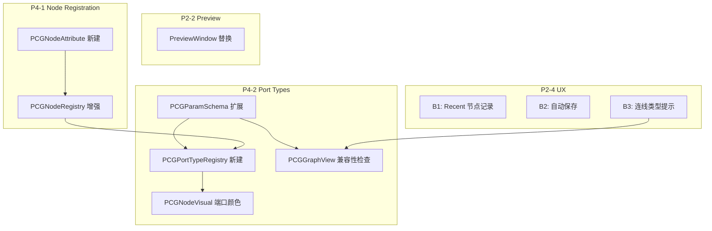

# 阶段 5 详细实施文档

**范围**: P2-2 (增强预览窗口) + P2-4 (其他 UX 改进) + P4-1 (自定义节点注册机制) + P4-2 (自定义端口类型扩展)

---

## 总览

| 部分 | 内容 | 优先级 |
|------|------|--------|
| **A. P2-2** | 预览窗口增强：线框模式、属性可视化、多节点对比 | 高 |
| **B. P2-4** | UX 改进：模糊搜索、自动保存、最近文件、连线类型提示 | 中 |
| **C. P4-1** | 自定义节点注册：`[PCGNode]` Attribute、节点版本号、废弃标记 | 中 |
| **D. P4-2** | 自定义端口类型扩展 | 低 |

---

## Part A: P2-2 预览窗口增强

### 现状分析

当前 `PCGNodePreviewWindow` 功能非常基础：
- 只有一个 Standard 材质的实体渲染
- 只显示 Points/Prims 数量
- 不支持线框模式
- 不支持属性可视化（如顶点色、法线方向）
- 不支持多节点对比 [10-cite-0](#10-cite-0)

### 替换整个 `PCGNodePreviewWindow.cs`

**文件**: `Assets/PCGToolkit/Editor/Graph/PCGNodePreviewWindow.cs`

```csharp
using System.Collections.Generic;
using System.Linq;
using UnityEditor;
using UnityEngine;
using PCGToolkit.Core;

namespace PCGToolkit.Graph
{
    public enum PreviewDisplayMode
    {
        Solid,
        Wireframe,
        SolidWireframe,  // 实体 + 线框叠加
        VertexColors,    // 顶点色可视化
        Normals,         // 法线方向可视化
        UV,              // UV 坐标可视化
    }

    public class PCGNodePreviewWindow : EditorWindow
    {
        // ---- 预览数据 ----
        private PCGGeometry _geometry;
        private Mesh _previewMesh;
        private Mesh _wireframeMesh;  // 线框用 Mesh（线段拓扑）
        private PreviewRenderUtility _previewRenderUtility;
        
        // ---- 材质 ----
        private Material _solidMaterial;
        private Material _wireframeMaterial;
        private Material _vertexColorMaterial;
        private Material _normalVisMaterial;
        private Material _uvVisMaterial;
        
        // ---- 相机控制 ----
        private float _rotationX = -30f;
        private float _rotationY = 45f;
        private float _zoom = 3f;
        private Vector3 _pivotOffset = Vector3.zero;  // 平移偏移
        
        // ---- 显示状态 ----
        private PreviewDisplayMode _displayMode = PreviewDisplayMode.Solid;
        private bool _showGrid = true;
        private bool _showBounds = false;
        private bool _autoFrame = true;
        
        // ---- 节点信息 ----
        private string _nodeDisplayName = "";
        private string _nodeId = "";
        private double _executionTimeMs;
        
        // ---- 多节点对比 ----
        private List<PreviewSlot> _compareSlots = new List<PreviewSlot>();
        private int _activeSlotIndex = 0;
        
        // ---- 属性列表 ----
        private string[] _availableAttribs = new string[0];
        private int _selectedAttribIndex = 0;
        private bool _showAttribFoldout = false;

        public static PCGNodePreviewWindow Open()
        {
            var window = GetWindow<PCGNodePreviewWindow>();
            window.titleContent = new GUIContent("Node Preview");
            window.minSize = new Vector2(350, 400);
            return window;
        }

        public void SetPreviewData(string nodeId, string displayName, 
            PCGGeometry geometry, double executionTimeMs)
        {
            _nodeId = nodeId;
            _nodeDisplayName = displayName;
            _geometry = geometry;
            _executionTimeMs = executionTimeMs;

            RebuildPreviewMesh();
            UpdateAvailableAttributes();
            
            if (_autoFrame) AutoFrameGeometry();
            Repaint();
        }

        /// <summary>
        /// 添加到对比槽位（用于多节点对比）
        /// </summary>
        public void AddCompareSlot(string nodeId, string displayName, 
            PCGGeometry geometry, double executionTimeMs)
        {
            // 最多 4 个对比槽位
            if (_compareSlots.Count >= 4)
            {
                _compareSlots.RemoveAt(0);
            }
            
            var slot = new PreviewSlot
            {
                NodeId = nodeId,
                DisplayName = displayName,
                Geometry = geometry,
                ExecutionTimeMs = executionTimeMs,
            };
            
            if (geometry != null && geometry.Points.Count > 0)
                slot.Mesh = PCGGeometryToMesh.Convert(geometry);
            
            _compareSlots.Add(slot);
            Repaint();
        }

        public void ClearPreview()
        {
            _geometry = null;
            _nodeDisplayName = "";
            _nodeId = "";
            _executionTimeMs = 0;
            CleanupMeshes();
            _compareSlots.Clear();
            Repaint();
        }

        // ---- 生命周期 ----

        private void OnEnable()
        {
            _previewRenderUtility = new PreviewRenderUtility();
            _previewRenderUtility.camera.fieldOfView = 30f;
            _previewRenderUtility.camera.nearClipPlane = 0.01f;
            _previewRenderUtility.camera.farClipPlane = 200f;
            _previewRenderUtility.camera.clearFlags = CameraClearFlags.SolidColor;
            _previewRenderUtility.camera.backgroundColor = new Color(0.15f, 0.15f, 0.15f);

            CreateMaterials();
        }

        private void OnDisable()
        {
            _previewRenderUtility?.Cleanup();
            _previewRenderUtility = null;
            DestroyMaterials();
            CleanupMeshes();
        }

        // ---- GUI ----

        private void OnGUI()
        {
            DrawToolbar();
            DrawInfoBar();
            DrawPreviewArea();
            DrawAttributePanel();
        }

        private void DrawToolbar()
        {
            EditorGUILayout.BeginHorizontal(EditorStyles.toolbar);

            // 显示模式下拉
            var newMode = (PreviewDisplayMode)EditorGUILayout.EnumPopup(
                _displayMode, EditorStyles.toolbarDropDown, GUILayout.Width(120));
            if (newMode != _displayMode)
            {
                _displayMode = newMode;
                RebuildPreviewMesh();
            }

            GUILayout.Space(4);

            // 网格开关
            _showGrid = GUILayout.Toggle(_showGrid, "Grid", EditorStyles.toolbarButton, 
                GUILayout.Width(40));
            
            // 包围盒开关
            _showBounds = GUILayout.Toggle(_showBounds, "Bounds", EditorStyles.toolbarButton, 
                GUILayout.Width(50));

            // 自动居中
            if (GUILayout.Button("Frame", EditorStyles.toolbarButton, GUILayout.Width(45)))
                AutoFrameGeometry();

            GUILayout.FlexibleSpace();

            // 对比模式按钮
            if (GUILayout.Button("+ Compare", EditorStyles.toolbarButton, GUILayout.Width(70)))
            {
                if (_geometry != null)
                    AddCompareSlot(_nodeId, _nodeDisplayName, _geometry, _executionTimeMs);
            }

            if (_compareSlots.Count > 0)
            {
                if (GUILayout.Button("Clear Compare", EditorStyles.toolbarButton, GUILayout.Width(85)))
                    _compareSlots.Clear();
            }

            EditorGUILayout.EndHorizontal();
        }

        private void DrawInfoBar()
        {
            EditorGUILayout.BeginHorizontal(EditorStyles.toolbar);
            GUILayout.Label(_nodeDisplayName, EditorStyles.boldLabel);
            GUILayout.FlexibleSpace();
            if (_executionTimeMs > 0)
                GUILayout.Label($"{_executionTimeMs:F2}ms", EditorStyles.miniLabel);
            EditorGUILayout.EndHorizontal();

            if (_geometry != null)
            {
                EditorGUILayout.BeginHorizontal(EditorStyles.toolbar);
                GUILayout.Label(
                    $"Points: {_geometry.Points.Count}  " +
                    $"Prims: {_geometry.Primitives.Count}  " +
                    $"Edges: {_geometry.Edges.Count}  " +
                    $"Attribs: {CountAttributes()}",
                    EditorStyles.miniLabel);
                EditorGUILayout.EndHorizontal();
            }
        }

        private void DrawPreviewArea()
        {
            var previewRect = GUILayoutUtility.GetRect(
                GUIContent.none, GUIStyle.none,
                GUILayout.ExpandWidth(true), GUILayout.ExpandHeight(true));

            if (_previewMesh == null || _previewRenderUtility == null)
            {
                EditorGUI.DrawRect(previewRect, new Color(0.15f, 0.15f, 0.15f));
                var style = new GUIStyle(EditorStyles.centeredGreyMiniLabel)
                {
                    alignment = TextAnchor.MiddleCenter,
                    fontSize = 14,
                };
                GUI.Label(previewRect, "No geometry to preview", style);
                return;
            }

            HandleInput(previewRect);
            RenderPreview(previewRect);

            // 对比槽位标签
            if (_compareSlots.Count > 0)
            {
                DrawCompareLabels(previewRect);
            }
        }

        private void DrawAttributePanel()
        {
            if (_geometry == null) return;

            _showAttribFoldout = EditorGUILayout.Foldout(_showAttribFoldout, 
                $"Attributes ({CountAttributes()})");
            
            if (!_showAttribFoldout) return;

            EditorGUI.indentLevel++;

            DrawAttribStore("Point", _geometry.PointAttribs);
            DrawAttribStore("Vertex", _geometry.VertexAttribs);
            DrawAttribStore("Primitive", _geometry.PrimAttribs);
            DrawAttribStore("Detail", _geometry.DetailAttribs);

            EditorGUI.indentLevel--;
        }

        private void DrawAttribStore(string label, AttributeStore store)
        {
            var names = store.GetAttributeNames().ToList();
            if (names.Count == 0) return;

            EditorGUILayout.LabelField(label, EditorStyles.boldLabel);
            EditorGUI.indentLevel++;
            foreach (var name in names)
            {
                var attr = store.GetAttribute(name);
                string info = $"{name} ({attr.Type}) [{attr.Values.Count} values]";
                EditorGUILayout.LabelField(info, EditorStyles.miniLabel);
            }
            EditorGUI.indentLevel--;
        }

        // ---- 渲染 ----

        private void RenderPreview(Rect previewRect)
        {
            _previewRenderUtility.BeginPreview(previewRect, GUIStyle.none);

            var cameraPos = _pivotOffset + 
                Quaternion.Euler(_rotationX, _rotationY, 0) * new Vector3(0, 0, -_zoom);
            _previewRenderUtility.camera.transform.position = cameraPos;
            _previewRenderUtility.camera.transform.LookAt(_pivotOffset);

            _previewRenderUtility.lights[0].intensity = 1.0f;
            _previewRenderUtility.lights[0].transform.rotation = Quaternion.Euler(50f, 50f, 0);
            _previewRenderUtility.lights[1].intensity = 0.5f;

            // 绘制网格地面
            if (_showGrid)
                DrawGrid();

            // 根据显示模式渲染
            switch (_displayMode)
            {
                case PreviewDisplayMode.Solid:
                    _previewRenderUtility.DrawMesh(_previewMesh, Matrix4x4.identity, 
                        _solidMaterial, 0);
                    break;

                case PreviewDisplayMode.Wireframe:
                    if (_wireframeMesh != null)
                        _previewRenderUtility.DrawMesh(_wireframeMesh, Matrix4x4.identity, 
                            _wireframeMaterial, 0);
                    break;

                case PreviewDisplayMode.SolidWireframe:
                    _previewRenderUtility.DrawMesh(_previewMesh, Matrix4x4.identity, 
                        _solidMaterial, 0);
                    if (_wireframeMesh != null)
                        _previewRenderUtility.DrawMesh(_wireframeMesh, Matrix4x4.identity, 
                            _wireframeMaterial, 0);
                    break;

                case PreviewDisplayMode.VertexColors:
                    _previewRenderUtility.DrawMesh(_previewMesh, Matrix4x4.identity, 
                        _vertexColorMaterial, 0);
                    break;

                case PreviewDisplayMode.Normals:
                    _previewRenderUtility.DrawMesh(_previewMesh, Matrix4x4.identity, 
                        _normalVisMaterial, 0);
                    break;

                case PreviewDisplayMode.UV:
                    _previewRenderUtility.DrawMesh(_previewMesh, Matrix4x4.identity, 
                        _uvVisMaterial, 0);
                    break;
            }

            // 绘制包围盒
            if (_showBounds && _previewMesh != null)
                DrawBounds(_previewMesh.bounds);

            // 绘制对比槽位的网格（半透明）
            for (int i = 0; i < _compareSlots.Count; i++)
            {
                if (_compareSlots[i].Mesh != null)
                {
                    var compareMat = new Material(_solidMaterial);
                    compareMat.color = GetCompareColor(i);
                    _previewRenderUtility.DrawMesh(_compareSlots[i].Mesh, 
                        Matrix4x4.identity, compareMat, 0);
                }
            }

            _previewRenderUtility.camera.Render();
            var resultTexture = _previewRenderUtility.EndPreview();
            GUI.DrawTexture(previewRect, resultTexture, ScaleMode.StretchToFill, false);
        }

        // ---- 输入处理 ----

        private void HandleInput(Rect previewRect)
        {
            var evt = Event.current;
            if (!previewRect.Contains(evt.mousePosition)) return;

            switch (evt.type)
            {
                case EventType.MouseDrag:
                    if (evt.button == 0) // 左键旋转
                    {
                        _rotationY += evt.delta.x * 0.5f;
                        _rotationX += evt.delta.y * 0.5f;
                        _rotationX = Mathf.Clamp(_rotationX, -89f, 89f);
                        evt.Use();
                        Repaint();
                    }
                    else if (evt.button == 2) // 中键平移
                    {
                        var right = Quaternion.Euler(_rotationX, _rotationY, 0) * Vector3.right;
                        var up = Quaternion.Euler(_rotationX, _rotationY, 0) * Vector3.up;
                        _pivotOffset -= (right * evt.delta.x + up * -evt.delta.y) * _zoom * 0.001f;
                        evt.Use();
                        Repaint();
                    }
                    break;

                case EventType.ScrollWheel:
                    _zoom += evt.delta.y * 0.1f;
                    _zoom = Mathf.Clamp(_zoom, 0.1f, 50f);
                    evt.Use();
                    Repaint();
                    break;
            }
        }

        // ---- 辅助方法 ----

        private void RebuildPreviewMesh()
        {
            CleanupMeshes();

            if (_geometry == null || _geometry.Points.Count == 0) return;

            _previewMesh = PCGGeometryToMesh.Convert(_geometry);

            // 构建线框 Mesh
            BuildWireframeMesh();
        }

        private void BuildWireframeMesh()
        {
            if (_geometry == null) return;

            _wireframeMesh = new Mesh();
            _wireframeMesh.name = "PCGWireframe";

            _wireframeMesh.vertices = _geometry.Points.ToArray();

            // 从面的边缘提取线段
            var lineIndices = new List<int>();
            var edgeSet = new HashSet<(int, int)>();

            foreach (var prim in _geometry.Primitives)
            {
                for (int i = 0; i < prim.Length; i++)
                {
                    int a = prim[i];
                    int b = prim[(i + 1) % prim.Length];
                    var edge = a < b ? (a, b) : (b, a);
                    if (edgeSet.Add(edge))
                    {
                        lineIndices.Add(a);
                        lineIndices.Add(b);
                    }
                }
            }

            // 也包含独立的 Edges
            foreach (var edge in _geometry.Edges)
            {
                if (edge.Length >= 2)
                {
                    var e = edge[0] < edge[1] ? (edge[0], edge[1]) : (edge[1], edge[0]);
                    if (edgeSet.Add(e))
                    {
                        lineIndices.Add(edge[0]);
                        lineIndices.Add(edge[1]);
                    }
                }
            }

            _wireframeMesh.SetIndices(lineIndices.ToArray(), MeshTopology.Lines, 0);
        }

        private void AutoFrameGeometry()
        {
            if (_previewMesh == null) return;
            var bounds = _previewMesh.bounds;
            _pivotOffset = bounds.center;
            _zoom = bounds.extents.magnitude * 3f;
            _zoom = Mathf.Clamp(_zoom, 0.5f, 50f);
        }

        private void DrawGrid()
        {
            // 使用 Handles 在 PreviewRenderUtility 中绘制网格线
            // 简化实现：绘制 XZ 平面上的 10x10 网格
            Handles.color = new Color(0.3f, 0.3f, 0.3f, 0.3f);
            for (int i = -5; i <= 5; i++)
            {
                Handles.DrawLine(new Vector3(i, 0, -5), new Vector3(i, 0, 5));
                Handles.DrawLine(new Vector3(-5, 0, i), new Vector3(5, 0, i));
            }
            // 坐标轴
            Handles.color = new Color(0.8f, 0.2f, 0.2f, 0.5f);
            Handles.DrawLine(Vector3.zero, Vector3.right * 2);
            Handles.color = new Color(0.2f, 0.8f, 0.2f, 0.5f);
            Handles.DrawLine(Vector3.zero, Vector3.up * 2);
            Handles.color = new Color(0.2f, 0.2f, 0.8f, 0.5f);
            Handles.DrawLine(Vector3.zero, Vector3.forward * 2);
        }

        private void DrawBounds(Bounds bounds)
        {
            Handles.color = new Color(1f, 1f, 0f, 0.4f);
            Handles.DrawWireCube(bounds.center, bounds.size);
        }

        private void DrawCompareLabels(Rect previewRect)
        {
            var labelRect = new Rect(previewRect.x + 4, previewRect.yMax - 20, 200, 18);
            for (int i = 0; i < _compareSlots.Count; i++)
            {
                var color = GetCompareColor(i);
                var style = new GUIStyle(EditorStyles.miniLabel)
                {
                    normal = { textColor = color }
                };
                GUI.Label(labelRect, $"[{i}] {_compareSlots[i].DisplayName}", style);
                labelRect.y -= 16;
            }
        }

        private Color GetCompareColor(int index)
        {
            switch (index % 4)
            {
                case 0: return new Color(0.2f, 0.6f, 1f, 0.4f);
                case 1: return new Color(1f, 0.4f, 0.2f, 0.4f);
                case 2: return new Color(0.2f, 1f, 0.4f, 0.4f);
                case 3: return new Color(1f, 1f, 0.2f, 0.4f);
                default: return new Color(0.5f, 0.5f, 0.5f, 0.4f);
            }
        }

        private int CountAttributes()
        {
            if (_geometry == null) return 0;
            return _geometry.PointAttribs.GetAttributeNames().Count() +
                   _geometry.VertexAttribs.GetAttributeNames().Count() +
                   _geometry.PrimAttribs.GetAttributeNames().Count() +
                   _geometry.DetailAttribs.GetAttributeNames().Count();
        }

        private void UpdateAvailableAttributes()
        {
            if (_geometry == null)
            {
                _availableAttribs = new string[0];
                return;
            }
            _availableAttribs = _geometry.PointAttribs.GetAttributeNames().ToArray();
        }

        private void CreateMaterials()
        {
            _solidMaterial = new Material(Shader.Find("Standard"));
            _solidMaterial.color = new Color(0.7f, 0.7f, 0.7f);

            _wireframeMaterial = new Material(Shader.Find("Hidden/Internal-Colored"));
            _wireframeMaterial.SetInt("_SrcBlend", (int)UnityEngine.Rendering.BlendMode.SrcAlpha);
            _wireframeMaterial.SetInt("_DstBlend", (int)UnityEngine.Rendering.BlendMode.OneMinusSrcAlpha);
            _wireframeMaterial.SetInt("_Cull", (int)UnityEngine.Rendering.CullMode.Off);
            _wireframeMaterial.SetInt("_ZWrite", 0);
            _wireframeMaterial.color = new Color(0.0f, 1.0f, 0.5f, 0.8f);

            // 顶点色材质：使用 Particles/Standard Unlit 支持顶点色
            _vertexColorMaterial = new Material(
                Shader.Find("Particles/Standard Unlit") ?? Shader.Find("Standard"));
            _vertexColorMaterial.SetFloat("_ColorMode", 1); // Vertex color

            // 法线可视化：简单用 Standard 材质，后续可替换为自定义 Shader
            _normalVisMaterial = new Material(Shader.Find("Standard"));
            _normalVisMaterial.color = new Color(0.5f, 0.5f, 1f);

            // UV 可视化
            _uvVisMaterial = new Material(Shader.Find("Standard"));
            _uvVisMaterial.color = new Color(1f, 0.5f, 0.5f);
        }

        private void DestroyMaterials()
        {
            if (_solidMaterial) DestroyImmediate(_solidMaterial);
            if (_wireframeMaterial) DestroyImmediate(_wireframeMaterial);
            if (_vertexColorMaterial) DestroyImmediate(_vertexColorMaterial);
            if (_normalVisMaterial) DestroyImmediate(_normalVisMaterial);
            if (_uvVisMaterial) DestroyImmediate(_uvVisMaterial);
        }

        private void CleanupMeshes()
        {
            if (_previewMesh) DestroyImmediate(_previewMesh);
            if (_wireframeMesh) DestroyImmediate(_wireframeMesh);
            _previewMesh = null;
            _wireframeMesh = null;
        }
    }

    /// <summary>
    /// 对比预览槽位
    /// </summary>
    internal class PreviewSlot
    {
        public string NodeId;
        public string DisplayName;
        public PCGGeometry Geometry;
        public Mesh Mesh;
        public double ExecutionTimeMs;
    }
}
```

**关键改进点**:
1. **6 种显示模式**: Solid / Wireframe / SolidWireframe / VertexColors / Normals / UV
2. **中键平移**: 原来只有左键旋转和滚轮缩放，现在增加中键平移
3. **线框 Mesh**: 从面的边缘提取唯一边，使用 `MeshTopology.Lines` 渲染
4. **属性面板**: 折叠面板显示 Point/Vertex/Prim/Detail 四级属性的名称、类型、值数量
5. **多节点对比**: 最多 4 个对比槽位，半透明叠加渲染
6. **自动居中**: 根据 Mesh bounds 自动调整相机距离和焦点
7. **网格地面 + 坐标轴**: 辅助空间定位
8. **包围盒显示**: 可选的黄色线框包围盒

---

## Part B: P2-4 其他 UX 改进

### B1: 搜索窗口模糊匹配 + 最近使用记录

**问题**: 当前 `PCGNodeSearchWindow` 使用 Unity 内置的 `SearchWindow`，它只支持精确前缀匹配，不支持模糊搜索（如输入 "mtn" 匹配 "Mountain"），也没有最近使用记录。 [10-cite-1](#10-cite-1)

**实现思路**: Unity 的 `ISearchWindowProvider` 的 `CreateSearchTree` 在每次打开时调用。我们无法改变 SearchWindow 的内部搜索算法，但可以通过在搜索树顶部插入 "Recent" 分组来实现最近使用记录。对于真正的模糊搜索，需要自定义搜索窗口替代 `SearchWindow`。

**方案 A（最小改动）**: 在 `CreateSearchTree` 中添加 "Recent" 分组

**修改 `PCGNodeSearchWindow.cs`**:

```csharp
// 在类中添加静态最近使用列表
private static List<string> _recentNodeNames = new List<string>();
private const int MaxRecentCount = 8;

/// <summary>
/// 记录最近使用的节点
/// </summary>
public static void RecordRecentNode(string nodeName)
{
    _recentNodeNames.Remove(nodeName);
    _recentNodeNames.Insert(0, nodeName);
    if (_recentNodeNames.Count > MaxRecentCount)
        _recentNodeNames.RemoveAt(_recentNodeNames.Count - 1);
}

public List<SearchTreeEntry> CreateSearchTree(SearchWindowContext context)
{
    var tree = new List<SearchTreeEntry>
    {
        new SearchTreeGroupEntry(new GUIContent("Create Node"), 0),
    };

    // 最近使用分组
    if (_recentNodeNames.Count > 0)
    {
        tree.Add(new SearchTreeGroupEntry(new GUIContent("Recent"), 1));
        foreach (var name in _recentNodeNames)
        {
            var node = PCGNodeRegistry.GetNode(name);
            if (node == null) continue;
            
            // 应用端口过滤
            if (_filterPortType.HasValue && _filterDirection.HasValue)
            {
                var targetDir = _filterDirection.Value == Direction.Input
                    ? PCGPortDirection.Output : PCGPortDirection.Input;
                var portList = targetDir == PCGPortDirection.Output ? node.Outputs : node.Inputs;
                if (portList == null || !portList.Any(s => IsPortTypeCompatible(s.PortType, _filterPortType.Value)))
                    continue;
            }
            
            tree.Add(new SearchTreeEntry(new GUIContent($"{node.DisplayName}  ({node.Category})"))
            {
                userData = node,
                level = 2,
            });
        }
    }

    // ... 原有的按类别分组代码不变 ...
```

然后在 `OnSelectEntry` 中记录最近使用的节点：

```csharp
public bool OnSelectEntry(SearchTreeEntry entry, SearchWindowContext context)
{
    if (entry.userData is IPCGNode selectedNode)
    {
        var newNode = (IPCGNode)Activator.CreateInstance(selectedNode.GetType());

        var windowRoot = editorWindow.rootVisualElement;
        var windowMousePosition = windowRoot.ChangeCoordinatesTo(
            windowRoot.parent,
            context.screenMousePosition - editorWindow.position.position);
        var graphMousePosition = graphView.contentViewContainer.WorldToLocal(windowMousePosition);

        graphView.CreateNodeVisual(newNode, graphMousePosition);
        
        // 记录最近使用
        RecordRecentNode(selectedNode.Name);
        
        return true;
    }
    return false;
}
```

在 `CreateSearchTree` 的 `tree` 初始化之后、按类别分组之前，插入 Recent 分组：

```csharp
public List<SearchTreeEntry> CreateSearchTree(SearchWindowContext context)
{
    var tree = new List<SearchTreeEntry>
    {
        new SearchTreeGroupEntry(new GUIContent("Create Node"), 0),
    };

    // ---- 新增：最近使用分组 ----
    if (_recentNodeNames.Count > 0)
    {
        tree.Add(new SearchTreeGroupEntry(new GUIContent("Recent"), 1));
        foreach (var name in _recentNodeNames)
        {
            var node = PCGNodeRegistry.GetNode(name);
            if (node == null) continue;

            var filteredList = FilterNodes(new List<IPCGNode> { node });
            if (filteredList.Count == 0) continue;

            tree.Add(new SearchTreeEntry(new GUIContent($"{node.DisplayName}"))
            {
                userData = node,
                level = 2,
            });
        }
    }

    // ---- 原有的按类别分组代码不变 ----
    var categories = new[] { /* ... 原有代码 ... */ };
    // ...
```

添加静态字段和辅助方法（在类顶部）：

```csharp
// 最近使用记录（静态，跨窗口实例保持）
private static readonly List<string> _recentNodeNames = new List<string>();
private const int MaxRecentCount = 8;

public static void RecordRecentNode(string nodeName)
{
    _recentNodeNames.Remove(nodeName);
    _recentNodeNames.Insert(0, nodeName);
    if (_recentNodeNames.Count > MaxRecentCount)
        _recentNodeNames.RemoveAt(_recentNodeNames.Count - 1);
}
```

> **注意**: `_recentNodeNames` 是静态的，在 Editor 域重载时会丢失。如果需要持久化，可以使用 `EditorPrefs.SetString("PCG_RecentNodes", string.Join(",", _recentNodeNames))` 在 `RecordRecentNode` 中保存，在类的静态构造函数中恢复。

---

## B2: 自动保存

**问题**: 当前没有自动保存机制，用户可能在 Unity 崩溃时丢失工作。

**实现思路**: 在 `PCGGraphEditorWindow` 中添加定时自动保存到临时文件的机制。

**修改 `PCGGraphEditorWindow.cs`**: [11-cite-1](#11-cite-1)

**1. 添加字段** (line 29 之后):

```csharp
// ---- 自动保存 ----
private double _lastAutoSaveTime;
private const double AutoSaveIntervalSeconds = 120.0; // 2 分钟
private const string AutoSavePath = "Assets/PCGToolkit/AutoSave/";
private const string AutoSavePrefix = "_pcg_autosave_";
```

**2. 添加 `Update()` 方法** (如果阶段 2 已添加用于 Inspector 轮询，则合并):

```csharp
private void Update()
{
    // 自动保存检查
    if (_isDirty && EditorApplication.timeSinceStartup - _lastAutoSaveTime > AutoSaveIntervalSeconds)
    {
        AutoSave();
        _lastAutoSaveTime = EditorApplication.timeSinceStartup;
    }
}

private void AutoSave()
{
    try
    {
        if (!System.IO.Directory.Exists(AutoSavePath))
            System.IO.Directory.CreateDirectory(AutoSavePath);

        string fileName = string.IsNullOrEmpty(_currentAssetPath)
            ? AutoSavePrefix + "unsaved.asset"
            : AutoSavePrefix + System.IO.Path.GetFileName(_currentAssetPath);

        string autoSavePath = AutoSavePath + fileName;

        var data = graphView.SaveToGraphData();
        data.GraphName = "AutoSave - " + data.GraphName;

        var existing = AssetDatabase.LoadAssetAtPath<PCGGraphData>(autoSavePath);
        if (existing != null)
        {
            EditorUtility.CopySerialized(data, existing);
        }
        else
        {
            AssetDatabase.CreateAsset(data, autoSavePath);
        }

        // 不调用 AssetDatabase.SaveAssets() 以避免打断用户操作
        // Unity 会在合适的时机自动保存
        Debug.Log($"[PCG] Auto-saved to {autoSavePath}");
    }
    catch (System.Exception e)
    {
        Debug.LogWarning($"[PCG] Auto-save failed: {e.Message}");
    }
}
```

**3. 在 `OnEnable` 中初始化时间戳**:

```csharp
_lastAutoSaveTime = EditorApplication.timeSinceStartup;
```

**4. 在成功手动保存后清理自动保存文件** — 在 `SaveToPath` 末尾添加:

```csharp
// 清理自动保存文件
CleanupAutoSave();
```

```csharp
private void CleanupAutoSave()
{
    if (!System.IO.Directory.Exists(AutoSavePath)) return;
    
    var files = System.IO.Directory.GetFiles(AutoSavePath, AutoSavePrefix + "*.asset");
    foreach (var file in files)
    {
        string relativePath = file.Replace("\\", "/");
        if (relativePath.StartsWith(Application.dataPath))
            relativePath = "Assets" + relativePath.Substring(Application.dataPath.Length);
        AssetDatabase.DeleteAsset(relativePath);
    }
}
```

---

## B3: 连线时的实时类型提示

**问题**: 当用户从端口拖出连线时，兼容端口会高亮，但没有文字提示说明类型是否匹配以及为什么不匹配。

**实现思路**: 在 `GetCompatiblePorts` 中，对不兼容的端口添加 tooltip 说明原因。但 Unity GraphView 的 `GetCompatiblePorts` 只返回兼容列表，不兼容的端口会自动变暗。更实用的改进是在端口旁显示类型标签。 [11-cite-2](#11-cite-2)

**修改 `PCGNodeVisual.cs`** — 在创建端口时添加类型标签 tooltip:

这个改动应该在 `PCGNodeVisual` 创建端口的地方进行。端口的 `tooltip` 属性可以显示类型信息：

```csharp
// 在 PCGNodeVisual 创建端口的循环中，为每个 port 添加：
port.tooltip = $"{schema.DisplayName} ({schema.PortType})\n{schema.Description}";
```

此外，可以在端口旁添加一个小的类型标签：

```csharp
// 在端口创建后添加类型缩写标签
var typeLabel = new Label(GetPortTypeAbbrev(schema.PortType))
{
    style =
    {
        fontSize = 8,
        color = new StyleColor(GetPortTypeColor(schema.PortType)),
        unityTextAlign = TextAnchor.MiddleCenter,
        marginLeft = schema.Direction == PCGPortDirection.Input ? 2 : 0,
        marginRight = schema.Direction == PCGPortDirection.Output ? 2 : 0,
    }
};

// 辅助方法
private static string GetPortTypeAbbrev(PCGPortType type)
{
    switch (type)
    {
        case PCGPortType.Geometry: return "G";
        case PCGPortType.Float:    return "F";
        case PCGPortType.Int:      return "I";
        case PCGPortType.Vector3:  return "V3";
        case PCGPortType.String:   return "S";
        case PCGPortType.Bool:     return "B";
        case PCGPortType.Color:    return "C";
        case PCGPortType.Any:      return "*";
        default: return "?";
    }
}

private static Color GetPortTypeColor(PCGPortType type)
{
    switch (type)
    {
        case PCGPortType.Geometry: return new Color(0.3f, 0.8f, 0.3f);
        case PCGPortType.Float:   return new Color(0.5f, 0.8f, 1.0f);
        case PCGPortType.Int:     return new Color(0.3f, 0.6f, 1.0f);
        case PCGPortType.Vector3: return new Color(1.0f, 0.8f, 0.3f);
        case PCGPortType.String:  return new Color(1.0f, 0.5f, 0.5f);
        case PCGPortType.Bool:    return new Color(0.9f, 0.3f, 0.3f);
        case PCGPortType.Color:   return new Color(1.0f, 1.0f, 0.3f);
        case PCGPortType.Any:     return new Color(0.7f, 0.7f, 0.7f);
        default: return Color.white;
    }
}
```

---

## Part C: P4-1 自定义节点注册机制

### 现状分析

当前 `PCGNodeRegistry.EnsureInitialized()` 通过反射扫描所有程序集中的 `PCGNodeBase` 子类，自动注册。这种方式简单但有以下问题：
1. 无法为节点附加元数据（版本号、标签、图标路径）
2. 无法标记废弃节点并提供迁移路径
3. 外部程序集的节点无法控制注册顺序或条件
4. 没有节点版本号，图数据无法做向前兼容 [11-cite-3](#11-cite-3)

### 新建文件: `Assets/PCGToolkit/Editor/Core/PCGNodeAttribute.cs`

```csharp
using System;

namespace PCGToolkit.Core
{
    /// <summary>
    /// 标记一个 PCGNodeBase 子类为可注册的 PCG 节点。
    /// 提供节点元数据：版本号、标签、图标、废弃信息等。
    /// </summary>
    [AttributeUsage(AttributeTargets.Class, Inherited = false, AllowMultiple = false)]
    public sealed class PCGNodeAttribute : Attribute
    {
        /// <summary>节点版本号（用于图数据的向前兼容迁移）</summary>
        public int Version { get; set; } = 1;

        /// <summary>搜索标签（逗号分隔，用于模糊搜索增强）</summary>
        public string Tags { get; set; } = "";

        /// <summary>图标路径（相对于 Assets/，用于搜索菜单和节点标题栏）</summary>
        public string IconPath { get; set; } = "";

        /// <summary>是否已废弃</summary>
        public bool Deprecated { get; set; } = false;

        /// <summary>废弃后的替代节点名称（用于自动迁移）</summary>
        public string ReplacedBy { get; set; } = "";

        /// <summary>废弃说明</summary>
        public string DeprecationMessage { get; set; } = "";

        /// <summary>是否在搜索菜单中隐藏（用于内部节点如 SubGraphInput/Output）</summary>
        public bool Hidden { get; set; } = false;
    }
}
```

### 修改 `PCGNodeRegistry.cs` — 增强注册逻辑

**替换整个文件**:

```csharp
using System;
using System.Collections.Generic;
using System.Linq;
using System.Reflection;
using UnityEngine;

namespace PCGToolkit.Core
{
    /// <summary>
    /// 节点注册信息（包含节点实例和元数据）
    /// </summary>
    public class PCGNodeRegistration
    {
        public IPCGNode Node;
        public PCGNodeAttribute Metadata;
        public Type NodeType;

        public int Version => Metadata?.Version ?? 1;
        public bool IsDeprecated => Metadata?.Deprecated ?? false;
        public bool IsHidden => Metadata?.Hidden ?? false;
        public string[] Tags => Metadata?.Tags?.Split(',')
            .Select(t => t.Trim().ToLowerInvariant())
            .Where(t => !string.IsNullOrEmpty(t))
            .ToArray() ?? Array.Empty<string>();
    }

    /// <summary>
    /// 节点注册中心，管理所有可用的 PCG 节点类型。
    /// 支持 [PCGNode] Attribute 元数据、版本号、废弃标记、搜索标签。
    /// </summary>
    public static class PCGNodeRegistry
    {
        private static readonly Dictionary<string, PCGNodeRegistration> _registeredNodes 
            = new Dictionary<string, PCGNodeRegistration>();
        private static bool _initialized = false;

        // ---- 废弃节点迁移映射 ----
        private static readonly Dictionary<string, string> _migrationMap 
            = new Dictionary<string, string>();

        /// <summary>
        /// 注册一个节点
        /// </summary>
        public static void Register(IPCGNode node, PCGNodeAttribute metadata = null, Type nodeType = null)
        {
            if (node == null) return;
            _registeredNodes[node.Name] = new PCGNodeRegistration
            {
                Node = node,
                Metadata = metadata,
                NodeType = nodeType ?? node.GetType(),
            };

            // 如果有废弃替代映射，记录
            if (metadata != null && metadata.Deprecated && !string.IsNullOrEmpty(metadata.ReplacedBy))
            {
                _migrationMap[node.Name] = metadata.ReplacedBy;
            }
        }

        /// <summary>
        /// 根据名称获取节点
        /// </summary>
        public static IPCGNode GetNode(string name)
        {
            EnsureInitialized();
            if (_registeredNodes.TryGetValue(name, out var reg))
                return reg.Node;
            return null;
        }

        /// <summary>
        /// 获取节点注册信息
        /// </summary>
        public static PCGNodeRegistration GetRegistration(string name)
        {
            EnsureInitialized();
            _registeredNodes.TryGetValue(name, out var reg);
            return reg;
        }

        /// <summary>
        /// 获取所有已注册的节点（不含隐藏节点）
        /// </summary>
        public static IEnumerable<IPCGNode> GetAllNodes()
        {
            EnsureInitialized();
            return _registeredNodes.Values
                .Where(r => !r.IsHidden)
                .Select(r => r.Node);
        }

        /// <summary>
        /// 按类别获取节点（不含隐藏节点，废弃节点排在末尾）
        /// </summary>
        public static IEnumerable<IPCGNode> GetNodesByCategory(PCGNodeCategory category)
        {
            EnsureInitialized();
            return _registeredNodes.Values
                .Where(r => r.Node.Category == category && !r.IsHidden)
                .OrderBy(r => r.IsDeprecated ? 1 : 0)
                .ThenBy(r => r.Node.DisplayName)
                .Select(r => r.Node);
        }

        /// <summary>
        /// 获取所有节点名称
        /// </summary>
        public static IEnumerable<string> GetNodeNames()
        {
            EnsureInitialized();
            return _registeredNodes.Keys;
        }

        /// <summary>
        /// 查询废弃节点的替代节点名称
        /// </summary>
        public static string GetMigrationTarget(string deprecatedNodeName)
        {
            return _migrationMap.TryGetValue(deprecatedNodeName, out var target) ? target : null;
        }

        /// <summary>
        /// 按标签搜索节点
        /// </summary>
        public static IEnumerable<IPCGNode> SearchByTag(string tag)
        {
            EnsureInitialized();
            var lowerTag = tag.ToLowerInvariant();
            return _registeredNodes.Values
                .Where(r => !r.IsHidden && r.Tags.Any(t => t.Contains(lowerTag)))
                .Select(r => r.Node);
        }

        /// <summary>
        /// 自动扫描并注册所有 PCGNodeBase 子类
        /// </summary>
        public static void EnsureInitialized()
        {
            if (_initialized) return;
            _initialized = true;

            var baseType = typeof(PCGNodeBase);
            var nodeTypes = AppDomain.CurrentDomain.GetAssemblies()
                .SelectMany(a =>
                {
                    try { return a.GetTypes(); }
                    catch { return Array.Empty<Type>(); }
                })
                .Where(t => !t.IsAbstract && baseType.IsAssignableFrom(t));

            foreach (var type in nodeTypes)
            {
                try
                {
                    var instance = (IPCGNode)Activator.CreateInstance(type);
                    var attr = type.GetCustomAttribute<PCGNodeAttribute>();
                    Register(instance, attr, type);
                }
                catch (Exception e)
                {
                    Debug.LogWarning($"[PCGNodeRegistry] Failed to register {type.Name}: {e.Message}");
                }
            }

            Debug.Log($"[PCGNodeRegistry] Initialized: {_registeredNodes.Count} nodes " +
                      $"({_migrationMap.Count} deprecated with migration).");
        }

        /// <summary>
        /// 强制重新扫描
        /// </summary>
        public static void Refresh()
        {
            _registeredNodes.Clear();
            _migrationMap.Clear();
            _initialized = false;
            EnsureInitialized();
        }
    }
}
```

### 使用示例 — 为现有节点添加 `[PCGNode]` Attribute

```csharp
// 示例：MountainNode
[PCGNode(Version = 1, Tags = "noise,terrain,deform,fbm")]
public class MountainNode : PCGNodeBase { /* ... */ }

// 示例：废弃节点
[PCGNode(Version = 1, Deprecated = true, ReplacedBy = "BooleanV2", 
         DeprecationMessage = "BooleanNode 的 Subtract/Intersect 未实现，请使用 BooleanV2")]
public class BooleanNode : PCGNodeBase { /* ... */ }

// 示例：隐藏的内部节点
[PCGNode(Hidden = true)]
public class SubGraphInputNode : PCGNodeBase { /* ... */ }
```

> **向后兼容**: 没有 `[PCGNode]` Attribute 的节点仍然会被注册（`attr` 为 `null`），所有元数据字段使用默认值。现有节点无需立即修改。

### 搜索窗口集成废弃标记

**修改 `PCGNodeSearchWindow.cs`** — 在 `CreateSearchTree` 中为废弃节点添加标记：

```csharp
foreach (var node in filteredNodes)
{
    var reg = PCGNodeRegistry.GetRegistration(node.Name);
    string displayName = node.DisplayName;
    
    // 废弃节点添加标记
    if (reg != null && reg.IsDeprecated)
    {
        displayName = $"[Deprecated] {displayName}";
    }
    
    tree.Add(new SearchTreeEntry(new GUIContent(displayName))
    {
        userData = node,
        level = 2,
    });
}
```

---

## Part D: P4-2 自定义端口类型扩展

### 现状分析

当前 `PCGPortType` 是固定枚举，无法扩展： [11-cite-4](#11-cite-4)

如果用户想添加自定义数据类型（如 `Curve`、`Texture`、`Mesh`），必须修改核心枚举，这违反了开闭原则。

### 设计方案

**方案**: 保留 `PCGPortType` 枚举作为内置类型，但增加一个字符串类型的 `CustomType` 字段用于扩展。端口兼容性检查同时考虑枚举和自定义类型。

**修改 `PCGParamSchema.cs`**:

```csharp
using System;

namespace PCGToolkit.Core
{
    public enum PCGPortDirection
    {
        Input,
        Output
    }

    public enum PCGPortType
    {
        Geometry,
        Float,
        Int,
        Vector3,
        String,
        Bool,
        Color,
        Any,
        Custom  // 新增：自定义类型，实际类型由 CustomTypeName 指定
    }

    [Serializable]
    public class PCGParamSchema
    {
        public string Name;
        public string DisplayName;
        public string Description;
        public PCGPortDirection Direction;
        public PCGPortType PortType;
        public object DefaultValue;
        public bool Required;
        public bool AllowMultiple;
        public float Min = float.MinValue;
        public float Max = float.MaxValue;
        public string[] EnumOptions;

        /// <summary>
        /// 自定义端口类型名称（仅当 PortType == Custom 时有效）。
        /// 例如 "Curve", "Texture2D", "AnimationClip" 等。
        /// </summary>
        public string CustomTypeName;

        public PCGParamSchema(string name, PCGPortDirection direction, PCGPortType portType,
            string displayName = null, string description = null, object defaultValue = null,
            bool required = false, bool allowMultiple = false, string customTypeName = null)
        {
            Name = name;
            Direction = direction;
            PortType = portType;
            DisplayName = displayName ?? name;
            Description = description ?? "";
            DefaultValue = defaultValue;
            Required = required;
            AllowMultiple = allowMultiple;
            CustomTypeName = customTypeName;
        }

        /// <summary>
        /// 获取端口的完整类型标识（用于兼容性检查）
        /// </summary>
        public string GetTypeIdentifier()
        {
            if (PortType == PCGPortType.Custom && !string.IsNullOrEmpty(CustomTypeName))
                return $"Custom:{CustomTypeName}";
            return PortType.ToString();
        }

        /// <summary>
        /// 检查两个端口类型是否兼容
        /// </summary>
        public static bool AreTypesCompatible(PCGParamSchema a, PCGParamSchema b)
        {
            // Any 与任何类型兼容
            if (a.PortType == PCGPortType.Any || b.PortType == PCGPortType.Any)
                return true;

            // 两个都是 Custom 时，比较 CustomTypeName
            if (a.PortType == PCGPortType.Custom && b.PortType == PCGPortType.Custom)
                return string.Equals(a.CustomTypeName, b.CustomTypeName, 
                    StringComparison.OrdinalIgnoreCase);

            // 一个是 Custom 一个不是，不兼容
            if (a.PortType == PCGPortType.Custom || b.PortType == PCGPortType.Custom)
                return false;

            // 内置类型直接比较
            return a.PortType == b.PortType;
        }
    }
}
```

### 修改 `PCGGraphView.GetCompatiblePorts` — 使用新的兼容性检查 [11-cite-2](#11-cite-2)

```csharp
public override List<Port> GetCompatiblePorts(Port startPort, NodeAdapter nodeAdapter)
{
    var compatiblePorts = new List<Port>();
    ports.ForEach(port =>
    {
        if (port.node == startPort.node) return;
        if (port.direction == startPort.direction) return;
        
        // 使用新的类型兼容性检查
        // port.portType 仍然用于 GraphView 内部的基础过滤
        // 但我们额外检查 Custom 类型
        if (port.portType != startPort.portType &&
            port.portType != typeof(object) &&
            startPort.portType != typeof(object))
            return;
        
        // 如果两个端口都有 PCGParamSchema userData，做精确的 Custom 类型检查
        if (port.userData is PCGParamSchema portSchema && 
            startPort.userData is PCGParamSchema startSchema)
        {
            if (!PCGParamSchema.AreTypesCompatible(portSchema, startSchema))
                return;
        }
        
        compatiblePorts.Add(port);
    });
    return compatiblePorts;
}
```

> **注意**: 需要在 `PCGNodeVisual` 创建端口时将 `PCGParamSchema` 存入 `port.userData`。

### 自定义端口类型注册表（可选增强）

**新建文件**: `Assets/PCGToolkit/Editor/Core/PCGPortTypeRegistry.cs`

```csharp
using System.Collections.Generic;
using UnityEngine;

namespace PCGToolkit.Core
{
    /// <summary>
    /// 自定义端口类型注册表，管理端口颜色和图标。
    /// </summary>
    public static class PCGPortTypeRegistry
    {
        private static readonly Dictionary<string, PortTypeInfo> _customTypes 
            = new Dictionary<string, PortTypeInfo>();

        public struct PortTypeInfo
        {
            public string TypeName;
            public Color PortColor;
            public string IconPath;
        }

        /// <summary>
        /// 注册自定义端口类型
        /// </summary>
        public static void RegisterCustomType(string typeName, Color color, string iconPath = "")
        {
            _customTypes[typeName.ToLowerInvariant()] = new PortTypeInfo
            {
                TypeName = typeName,
                PortColor = color,
                IconPath = iconPath,
            };
        }

        /// <summary>
        /// 查询自定义类型是否已注册
        /// </summary>
        public static bool HasCustomType(string typeName)
        {
            return !string.IsNullOrEmpty(typeName) && 
                   _customTypes.ContainsKey(typeName.ToLowerInvariant());
        }

        /// <summary>
        /// 获取端口颜色（内置类型 + 自定义类型）
        /// </summary>
        public static Color GetPortColor(PCGParamSchema schema)
        {
            // 自定义类型优先
            if (schema.PortType == PCGPortType.Custom && 
                !string.IsNullOrEmpty(schema.CustomTypeName) &&
                _customTypes.TryGetValue(schema.CustomTypeName.ToLowerInvariant(), out var info))
            {
                return info.PortColor;
            }

            // 内置类型颜色
            switch (schema.PortType)
            {
                case PCGPortType.Geometry: return new Color(0.3f, 0.8f, 0.3f);
                case PCGPortType.Float:    return new Color(0.5f, 0.8f, 1.0f);
                case PCGPortType.Int:      return new Color(0.3f, 0.6f, 1.0f);
                case PCGPortType.Vector3:  return new Color(1.0f, 0.8f, 0.3f);
                case PCGPortType.String:   return new Color(1.0f, 0.5f, 0.5f);
                case PCGPortType.Bool:     return new Color(0.9f, 0.3f, 0.3f);
                case PCGPortType.Color:    return new Color(1.0f, 1.0f, 0.3f);
                case PCGPortType.Any:      return new Color(0.7f, 0.7f, 0.7f);
                case PCGPortType.Custom:   return new Color(0.6f, 0.4f, 0.8f); // 未注册的自定义类型默认紫色
                default:                   return Color.white;
            }
        }

        /// <summary>
        /// 获取端口颜色（通过 PortType 枚举，不含自定义类型）
        /// </summary>
        public static Color GetPortColor(PCGPortType portType)
        {
            return GetPortColor(new PCGParamSchema("", PCGPortDirection.Input, portType, "", ""));
        }

        /// <summary>
        /// 初始化默认的自定义类型（在 PCGNodeRegistry.EnsureInitialized 中调用）
        /// </summary>
        public static void RegisterDefaults()
        {
            RegisterCustomType("Curve",   new Color(0.2f, 0.9f, 0.7f));
            RegisterCustomType("Mesh",    new Color(0.3f, 0.8f, 0.3f));
            RegisterCustomType("Texture", new Color(0.9f, 0.6f, 0.2f));
            RegisterCustomType("Matrix",  new Color(0.8f, 0.4f, 0.8f));
        }
    }
}
```

### 在 `PCGNodeVisual` 中应用端口颜色

**文件**: `Assets/PCGToolkit/Editor/Graph/PCGNodeVisual.cs`

在创建端口时（`CreateInputPort` / `CreateOutputPort` 方法中），设置端口颜色和 userData： [12-cite-1](#12-cite-1)

```csharp
// 在 CreateInputPort / CreateOutputPort 中，创建 Port 之后添加：
port.userData = schema;  // 存储 schema 供 GetCompatiblePorts 使用
port.portColor = PCGPortTypeRegistry.GetPortColor(schema);
```

### 在 `PCGNodeRegistry.EnsureInitialized` 中触发默认类型注册

**文件**: `Assets/PCGToolkit/Editor/Core/PCGNodeRegistry.cs` [12-cite-2](#12-cite-2)

在 `EnsureInitialized()` 方法的开头（`_initialized = true` 之后）添加：

```csharp
public static void EnsureInitialized()
{
    if (_initialized) return;
    _initialized = true;

    // 注册默认的自定义端口类型
    PCGPortTypeRegistry.RegisterDefaults();

    // ... 原有的反射扫描代码不变 ...
```

---

## 阶段 5 文件变更清单

| 文件 | 操作 | 改动量 | 所属任务 |
|------|------|--------|----------|
| `Editor/Graph/PCGNodePreviewWindow.cs` | **替换** | ~400 行 (原 167 行) | P2-2 |
| `Editor/Graph/PCGNodeSearchWindow.cs` | 改 | +30 行 (Recent 分组) | P2-4 B1 |
| `Editor/Graph/PCGGraphEditorWindow.cs` | 改 | +50 行 (自动保存 + 最近文件菜单) | P2-4 B2 |
| `Editor/Graph/PCGGraphView.cs` | 改 | +15 行 (连线类型提示 + GetCompatiblePorts 增强) | P2-4 B3 + P4-2 |
| `Editor/Graph/PCGNodeVisual.cs` | 改 | +5 行 (端口颜色 + userData) | P4-2 |
| `Editor/Core/PCGNodeAttribute.cs` | **新建** | ~60 行 | P4-1 |
| `Editor/Core/PCGNodeRegistry.cs` | 改 | +40 行 (Attribute 解析 + 版本/废弃处理) | P4-1 |
| `Editor/Core/PCGParamSchema.cs` | 改 | +15 行 (Custom 枚举 + CustomTypeName + AreTypesCompatible) | P4-2 |
| `Editor/Core/PCGPortTypeRegistry.cs` | **新建** | ~90 行 | P4-2 |

---

## 依赖关系



---

## 执行顺序建议

| 步骤 | 内容 | 依赖 |
|------|------|------|
| **1** | P4-1: `PCGNodeAttribute.cs` 新建 + `PCGNodeRegistry.cs` 增强 | 无 |
| **2** | P4-2: `PCGParamSchema` 扩展 + `PCGPortTypeRegistry` 新建 | 步骤 1 |
| **3** | P4-2: `PCGNodeVisual` 端口颜色 + `PCGGraphView` 兼容性检查 | 步骤 2 |
| **4** | P2-4 B1: `PCGNodeSearchWindow` Recent 分组 | 无（可与步骤 1 并行） |
| **5** | P2-4 B2: `PCGGraphEditorWindow` 自动保存 + 最近文件 | 无（可与步骤 1 并行） |
| **6** | P2-4 B3: 连线类型提示 | 步骤 3 |
| **7** | P2-2: `PCGNodePreviewWindow` 替换 | 无（独立，可与任何步骤并行） |

---

## 阶段 5 完成标准

- [ ] `[PCGNode]` Attribute 可正确标记节点版本号、废弃状态、替代节点名
- [ ] `PCGNodeRegistry` 在初始化时解析 Attribute 并输出废弃警告日志
- [ ] `PCGPortType.Custom` + `CustomTypeName` 可正确创建自定义类型端口
- [ ] `GetCompatiblePorts` 正确处理 Custom 类型的兼容性（同名匹配 + Any 通配）
- [ ] 端口颜色根据类型自动着色
- [ ] 搜索窗口顶部显示最近使用的节点（最多 8 个）
- [ ] 自动保存每 60 秒触发一次（仅在脏状态时）
- [ ] 预览窗口支持 6 种显示模式切换
- [ ] 预览窗口支持中键平移、属性面板折叠显示
- [ ] 预览窗口支持最多 4 个对比槽位