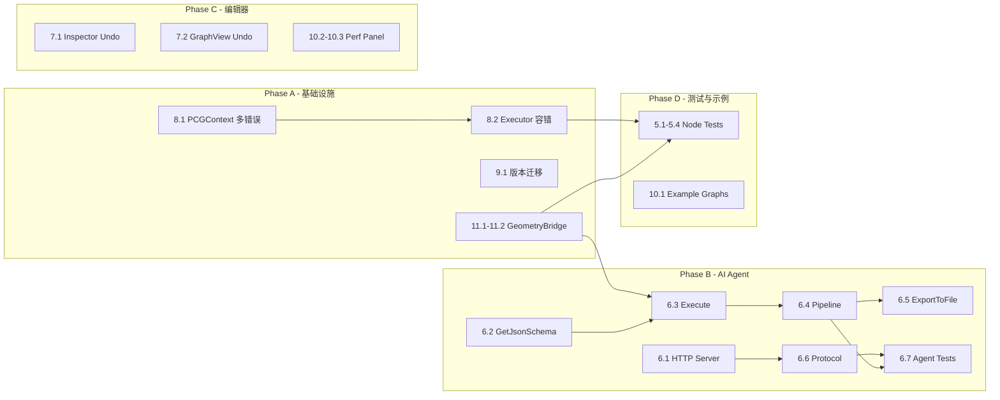

# 第7轮迭代任务计划（含伪代码指导）

---

## Batch 1 — AI Agent 通信层实现

### 任务 1.1：实现 `AgentServer` HTTP 监听

当前 `AgentServer.Start()` 是空壳。需要用 `HttpListener` 在后台线程监听，通过 `ConcurrentQueue` 将请求转发到主线程。 [1-cite-0](#1-cite-0)

```csharp
// ===== AgentServer.cs 伪代码 =====

private HttpListener _listener;
private Thread _listenThread;
private ConcurrentQueue<(HttpListenerContext ctx, string body)> _pendingRequests;
private bool _isRunning;

public void Start()
{
    _pendingRequests = new ConcurrentQueue<...>();
    _listener = new HttpListener();
    _listener.Prefixes.Add($"http://localhost:{port}/");
    _listener.Start();
    _isRunning = true;

    // 后台线程接收请求
    _listenThread = new Thread(() => {
        while (_isRunning)
        {
            try {
                var ctx = _listener.GetContext();           // 阻塞等待
                var body = ReadRequestBody(ctx.Request);    // 读取 JSON body
                _pendingRequests.Enqueue((ctx, body));      // 入队，不在此线程处理
            } catch (HttpListenerException) { break; }
        }
    });
    _listenThread.IsBackground = true;
    _listenThread.Start();

    // 注册 EditorApplication.update 在主线程处理请求
    EditorApplication.update += PollRequests;
}

private void PollRequests()
{
    while (_pendingRequests.TryDequeue(out var item))
    {
        string responseJson = HandleRequest(item.body);  // 已有的路由逻辑
        WriteResponse(item.ctx, responseJson);            // 写回 HTTP 响应
    }
}

public void Stop()
{
    _isRunning = false;
    EditorApplication.update -= PollRequests;
    _listener?.Stop();
    _listenThread?.Join(1000);
}

private void WriteResponse(HttpListenerContext ctx, string json)
{
    var bytes = Encoding.UTF8.GetBytes(json);
    ctx.Response.ContentType = "application/json";
    ctx.Response.ContentLength64 = bytes.Length;
    ctx.Response.OutputStream.Write(bytes, 0, bytes.Length);
    ctx.Response.Close();
}
```

### 任务 1.2：实现 `PCGNodeSkillAdapter.Execute()`

当前 `Execute()` 返回 TODO。需要：解析 JSON 参数 → 创建 `PCGContext` → 调用 `node.Execute()` → 序列化结果。 [1-cite-1](#1-cite-1)

```csharp
// ===== PCGNodeSkillAdapter.cs 伪代码 =====

public string Execute(string parametersJson)
{
    // 1. 解析 JSON 参数为 Dictionary<string, object>
    var parameters = ParseJsonParameters(parametersJson);
    // 使用 JsonUtility 或 MiniJSON 解析
    // 根据 node.Inputs 中的 PortType 做类型转换:
    //   PCGPortType.Float  → float
    //   PCGPortType.Int    → int
    //   PCGPortType.Bool   → bool
    //   PCGPortType.String → string
    //   PCGPortType.Vector3 → Vector3

    // 2. 创建执行上下文
    var ctx = new PCGContext();

    // 3. 处理输入几何体（如果参数中包含 "__input_geometry" 键）
    var inputGeometries = new Dictionary<string, PCGGeometry>();
    if (parameters.ContainsKey("__input_geometry_json"))
    {
        inputGeometries["input"] = DeserializeGeometry(parameters["__input_geometry_json"]);
        parameters.Remove("__input_geometry_json");
    }

    // 4. 执行节点
    var result = node.Execute(ctx, inputGeometries, parameters);

    // 5. 序列化结果
    var response = new {
        success = !ctx.HasError,
        error = ctx.ErrorMessage ?? "",
        outputs = new Dictionary<string, object>()
    };

    foreach (var kvp in result)
    {
        if (kvp.Value != null)
            response.outputs[kvp.Key] = SerializeGeometrySummary(kvp.Value);
            // SerializeGeometrySummary: { pointCount, primCount, bounds, ... }
    }

    return JsonUtility.ToJson(response);
}
```

### 任务 1.3：实现 `PCGNodeSkillAdapter.GetJsonSchema()`

当前返回 `"{}"`。需要根据节点的 `Inputs` 生成符合 OpenAI Function Calling 规范的 JSON Schema。 [1-cite-2](#1-cite-2)

```csharp
// ===== PCGNodeSkillAdapter.GetJsonSchema() 伪代码 =====

public string GetJsonSchema()
{
    var sb = new StringBuilder();
    sb.Append("{");
    sb.Append($"\"name\": \"{node.Name}\",");
    sb.Append($"\"description\": \"{EscapeJson(node.Description)}\",");
    sb.Append("\"parameters\": { \"type\": \"object\", \"properties\": {");

    var requiredList = new List<string>();
    bool first = true;

    foreach (var input in node.Inputs)
    {
        if (input.PortType == PCGPortType.Geometry) continue;  // 跳过几何体端口

        if (!first) sb.Append(",");
        first = false;

        string jsonType = MapPortTypeToJsonType(input.PortType);
        // Float → "number", Int → "integer", Bool → "boolean",
        // String → "string", Vector3 → "object"

        sb.Append($"\"{input.Name}\": {{");
        sb.Append($"\"type\": \"{jsonType}\",");
        sb.Append($"\"description\": \"{EscapeJson(input.Description)}\"");

        if (input.EnumOptions != null && input.EnumOptions.Length > 0)
            sb.Append($", \"enum\": [{string.Join(",", input.EnumOptions.Select(o => $"\"{o}\""))}]");

        if (input.DefaultValue != null)
            sb.Append($", \"default\": {SerializeDefault(input.DefaultValue)}");

        sb.Append("}");

        if (input.Required) requiredList.Add(input.Name);
    }

    sb.Append("},");
    sb.Append($"\"required\": [{string.Join(",", requiredList.Select(r => $"\"{r}\""))}]");
    sb.Append("}}");

    return sb.ToString();
}
```

### 任务 1.4：实现 `SkillExecutor.ExecutePipeline()`

链式调用多个 Skill，上一个的输出几何体作为下一个的输入。 [1-cite-3](#1-cite-3)

```csharp
// ===== SkillExecutor.ExecutePipeline() 伪代码 =====

public string ExecutePipeline(string[] skillNames, string[] parametersJsonArray)
{
    PCGGeometry currentGeo = null;
    var results = new List<string>();

    for (int i = 0; i < skillNames.Length; i++)
    {
        var skill = SkillRegistry.GetSkill(skillNames[i]);
        if (skill == null)
            return AgentProtocol.CreateErrorResponse($"Skill not found: {skillNames[i]}");

        // 将上一步的输出几何体注入到当前参数中
        string paramsJson = i < parametersJsonArray.Length ? parametersJsonArray[i] : "{}";
        if (currentGeo != null)
        {
            // 在 JSON 中注入 __input_geometry 字段
            paramsJson = InjectInputGeometry(paramsJson, currentGeo);
        }

        string resultJson = skill.Execute(paramsJson);
        results.Add(resultJson);

        // 从结果中提取输出几何体供下一步使用
        currentGeo = ExtractOutputGeometry(resultJson);
    }

    // 返回最终结果（包含管线中每一步的摘要）
    return AgentProtocol.CreateSuccessResponse(
        $"{{ \"steps\": [{string.Join(",", results)}] }}");
}
```

---

## Batch 2 — 关键节点质量提升

### 任务 2.1：`RemeshNode` 接入 geometry3Sharp

当前使用自写的边分割+翻转+平滑算法，效果有限。替换为 `g3.Remesher`。 [1-cite-4](#1-cite-4)

```csharp
// ===== RemeshNode.Execute() 伪代码 =====

public override Dictionary<string, PCGGeometry> Execute(...)
{
    var geo = GetInputGeometry(inputGeometries, "input");
    float targetLength = GetParamFloat(parameters, "targetEdgeLength", 0.5f);
    int iterations = GetParamInt(parameters, "iterations", 3);
    float smoothing = GetParamFloat(parameters, "smoothing", 0.5f);
    bool preserveBoundary = GetParamBool(parameters, "preserveBoundary", true);

    // 1. PCGGeometry → DMesh3（使用已有的 GeometryBridge）
    DMesh3 dmesh = GeometryBridge.ToDMesh3(geo);

    // 2. 配置 Remesher
    var remesher = new Remesher(dmesh);
    remesher.SetTargetEdgeLength(targetLength);
    remesher.SmoothSpeedT = smoothing;
    remesher.SetExternalConstraints(
        new MeshConstraints()  // 可选：边界约束
    );

    if (preserveBoundary)
    {
        // 锁定边界边
        MeshConstraintUtil.FixAllBoundaryEdges(remesher.Constraints, dmesh);
    }

    // 3. 执行迭代
    for (int i = 0; i < iterations; i++)
    {
        remesher.BasicRemeshPass();
    }

    // 4. DMesh3 → PCGGeometry
    var result = GeometryBridge.FromDMesh3(dmesh);

    ctx.Log($"Remesh: {geo.Points.Count}→{result.Points.Count} pts, " +
            $"{geo.Primitives.Count}→{result.Primitives.Count} tris");
    return SingleOutput("geometry", result);
}
```

### 任务 2.2：`DecimateNode` 接入 geometry3Sharp

当前使用简单边长排序的边坍缩，代价函数仅为 `sqrMagnitude`。替换为 `g3.Reducer`（QEM 减面）。 [1-cite-5](#1-cite-5)

```csharp
// ===== DecimateNode.Execute() 伪代码 =====

public override Dictionary<string, PCGGeometry> Execute(...)
{
    var geo = GetInputGeometry(inputGeometries, "input");
    float targetRatio = GetParamFloat(parameters, "targetRatio", 0.5f);
    int targetCount = GetParamInt(parameters, "targetCount", 0);
    bool preserveBoundary = GetParamBool(parameters, "preserveBoundary", true);

    // 1. 转换
    DMesh3 dmesh = GeometryBridge.ToDMesh3(geo);
    int originalCount = dmesh.TriangleCount;
    int finalCount = targetCount > 0
        ? targetCount
        : Math.Max(4, (int)(originalCount * targetRatio));

    // 2. 配置 Reducer
    var reducer = new Reducer(dmesh);

    if (preserveBoundary)
    {
        // 设置边界约束：边界边不可坍缩
        var constraints = new MeshConstraints();
        MeshConstraintUtil.FixAllBoundaryEdges(constraints, dmesh);
        reducer.SetExternalConstraints(constraints);
    }

    // 3. 执行减面
    reducer.ReduceToTriangleCount(finalCount);

    // 4. 转换回来
    var result = GeometryBridge.FromDMesh3(dmesh);

    ctx.Log($"Decimate: {originalCount}→{result.Primitives.Count} tris " +
            $"({(float)result.Primitives.Count / originalCount * 100:F1}%)");
    return SingleOutput("geometry", result);
}
```

### 任务 2.3：`SweepNode` 使用 Rotation Minimizing Frame

当前使用简单的 `Cross(tangent, up)` 构建坐标系，在曲线接近竖直方向时会退化。替换为 RMF 算法。 [1-cite-6](#1-cite-6)

```csharp
// ===== SweepNode 中的 RMF 坐标系构建伪代码 =====

// 预计算所有骨架点的 RMF 坐标系
List<(Vector3 tangent, Vector3 normal, Vector3 binormal)> frames = ComputeRMF(backbone.Points);

static List<(Vector3 T, Vector3 N, Vector3 B)> ComputeRMF(List<Vector3> points)
{
    int n = points.Count;
    var frames = new List<(Vector3, Vector3, Vector3)>(n);

    // 第一个点：用 Frenet 初始化
    Vector3 t0 = (points[1] - points[0]).normalized;
    Vector3 up = Mathf.Abs(Vector3.Dot(t0, Vector3.up)) > 0.99f ? Vector3.forward : Vector3.up;
    Vector3 n0 = Vector3.Cross(t0, up).normalized;
    Vector3 b0 = Vector3.Cross(t0, n0).normalized;
    frames.Add((t0, n0, b0));

    // 后续点：Double Reflection 方法（最稳定的 RMF 实现）
    for (int i = 1; i < n; i++)
    {
        Vector3 ti;
        if (i < n - 1)
            ti = (points[i + 1] - points[i - 1]).normalized;
        else
            ti = (points[i] - points[i - 1]).normalized;

        var prev = frames[i - 1];

        // Reflection 1: 将前一帧反射到当前切线
        Vector3 v1 = points[i] - points[i - 1];
        float c1 = Vector3.Dot(v1, v1);
        Vector3 rL = prev.N - (2f / c1) * Vector3.Dot(v1, prev.N) * v1;
        Vector3 rT = prev.T - (2f / c1) * Vector3.Dot(v1, prev.T) * v1;

        // Reflection 2: 对齐到实际切线
        Vector3 v2 = ti - rT;
        float c2 = Vector3.Dot(v2, v2);
        Vector3 ni = rL - (2f / c2) * Vector3.Dot(v2, rL) * v2;
        Vector3 bi = Vector3.Cross(ti, ni);

        frames.Add((ti, ni.normalized, bi.normalized));
    }

    return frames;
}

// 然后在截面放置循环中使用 frames[i] 替代原来的 tangent/normal/binormal
for (int i = 0; i < backbone.Points.Count; i++)
{
    var (tangent, normal, binormal) = frames[i];
    // ... 截面变换使用 normal 和 binormal 作为局部 X/Z 轴
    Vector3 worldPoint = pos + binormal * localPoint.x + normal * localPoint.z;
}
```

### 任务 2.4：`LODGenerateNode` 复用 `DecimateNode` 的 g3 逻辑

当前 `LODGenerateNode.DecimateGeometry()` 内联了一套简化的边坍缩。改为复用 `GeometryBridge` + `g3.Reducer`。 [1-cite-7](#1-cite-7)

```csharp
// ===== LODGenerateNode.DecimateGeometry() 伪代码 =====

private PCGGeometry DecimateGeometry(PCGGeometry geo, float ratio)
{
    DMesh3 dmesh = GeometryBridge.ToDMesh3(geo);
    int targetCount = Math.Max(4, (int)(dmesh.TriangleCount * ratio));

    var reducer = new Reducer(dmesh);
    reducer.ReduceToTriangleCount(targetCount);

    return GeometryBridge.FromDMesh3(dmesh);
}
// 删除原来 130 行的自写减面代码
```

---

## Batch 3 — 错误处理与上下文增强

### 任务 3.1：`PCGContext` 多错误收集

当前 `HasError` 是单一布尔值，只记录最后一个错误。改为错误列表 + 可选的 `ContinueOnError` 模式。 [1-cite-8](#1-cite-8)

```csharp
// ===== PCGContext.cs 改造伪代码 =====

public class PCGError
{
    public string NodeId;
    public string Message;
    public PCGErrorLevel Level;  // Warning / Error / Fatal
}

public enum PCGErrorLevel { Warning, Error, Fatal }

public class PCGContext
{
    // 替换原来的 HasError / ErrorMessage
    public List<PCGError> Errors = new List<PCGError>();
    public bool ContinueOnError { get; set; } = false;

    public bool HasError => Errors.Any(e => e.Level >= PCGErrorLevel.Error);
    public bool HasFatal => Errors.Any(e => e.Level == PCGErrorLevel.Fatal);
    public string ErrorMessage => Errors.LastOrDefault(e => e.Level >= PCGErrorLevel.Error)?.Message;

    public void LogError(string message)
    {
        var error = new PCGError {
            NodeId = CurrentNodeId,
            Message = message,
            Level = PCGErrorLevel.Error
        };
        Errors.Add(error);
        Logs.Add($"[Node:{CurrentNodeId}] ERROR: {message}");
        UnityEngine.Debug.LogError(Logs.Last());
    }

    public void ClearCache()
    {
        NodeOutputCache.Clear();
        Logs.Clear();
        Errors.Clear();  // 新增
    }
}
```

### 任务 3.2：`PCGGraphExecutor` 容错执行

当前遇到第一个错误就停止整个图。增加 `ContinueOnError` 选项。 [1-cite-9](#1-cite-9)

```csharp
// ===== PCGGraphExecutor.Execute() 改造伪代码 =====

public void Execute(bool continueOnError = false)
{
    context.ContinueOnError = continueOnError;
    _nodeOutputs.Clear();
    context.ClearCache();

    var sortedNodes = PCGGraphHelper.TopologicalSort(graphData);
    if (sortedNodes == null) { /* cycle error */ return; }

    foreach (var nodeData in sortedNodes)
    {
        ExecuteNode(nodeData);

        if (context.HasFatal)
        {
            // Fatal 错误始终停止
            Debug.LogError($"Fatal error at {nodeData.NodeType}, stopping.");
            return;
        }

        if (context.HasError && !continueOnError)
        {
            Debug.LogError($"Error at {nodeData.NodeType}, stopping.");
            return;
        }

        // ContinueOnError 模式下，错误节点输出空几何体，下游继续
    }
}

private void ExecuteNode(PCGNodeData nodeData)
{
    // ... 现有逻辑 ...
    try
    {
        var result = nodeInstance.Execute(context, inputGeometries, parameters);
        if (result != null) _nodeOutputs[nodeData.NodeId] = result;
    }
    catch (Exception e)
    {
        context.LogError($"Exception: {e.Message}");
        // 在 ContinueOnError 模式下，输出空几何体
        if (context.ContinueOnError)
        {
            _nodeOutputs[nodeData.NodeId] = new Dictionary<string, PCGGeometry>
            {
                { "geometry", new PCGGeometry() }
            };
        }
    }
}
```

---

## Batch 4 — 图数据版本迁移

### 任务 4.1：`PCGGraphData` 版本号与迁移

当前 `PCGGraphData` 没有版本字段，旧 `.asset` 加载时可能缺少新字段。 [1-cite-10](#1-cite-10)

```csharp
// ===== PCGGraphData.cs 版本迁移伪代码 =====

public class PCGGraphData : ScriptableObject
{
    public int Version = 7;  // 当前版本号

    // ... 现有字段 ...

    private void OnEnable()
    {
        MigrateIfNeeded();
    }

    private void MigrateIfNeeded()
    {
        if (Version < 4)
        {
            // v4 新增 Groups 和 StickyNotes
            if (Groups == null) Groups = new List<PCGGroupData>();
            if (StickyNotes == null) StickyNotes = new List<PCGStickyNoteData>();
        }

        if (Version < 6)
        {
            // v6 新增 ExposedParameters
            if (ExposedParameters == null) ExposedParameters = new List<PCGExposedParamInfo>();
        }

        if (Version < 7)
        {
            // v7 新增字段（如果有）
        }

        if (Version != 7)
        {
            Version = 7;
            #if UNITY_EDITOR
            UnityEditor.EditorUtility.SetDirty(this);
            #endif
        }
    }
}
```

---

## Batch 5 — 测试框架与核心测试

### 任务 5.1：节点测试基类

当前仅有 `ExpressionParserTests.cs`，没有节点测试。 [1-cite-11](#1-cite-11)

```csharp
// ===== Tests/NodeTestBase.cs 伪代码 =====

[TestFixture]
public abstract class NodeTestBase
{
    protected PCGContext CreateContext() => new PCGContext(debug: true);

    /// <summary>
    /// 快捷执行单个节点
    /// </summary>
    protected Dictionary<string, PCGGeometry> ExecuteNode<T>(
        Dictionary<string, PCGGeometry> inputs = null,
        Dictionary<string, object> parameters = null) where T : PCGNodeBase, new()
    {
        var node = new T();
        var ctx = CreateContext();
        return node.Execute(ctx,
            inputs ?? new Dictionary<string, PCGGeometry>(),
            parameters ?? new Dictionary<string, object>());
    }

    /// <summary>
    /// 断言几何体基本属性
    /// </summary>
    protected void AssertGeometry(PCGGeometry geo,
        int? minPoints = null, int? maxPoints = null,
        int? minPrims = null, int? maxPrims = null)
    {
        Assert.IsNotNull(geo);
        if (minPoints.HasValue) Assert.GreaterOrEqual(geo.Points.Count, minPoints.Value);
        if (maxPoints.HasValue) Assert.LessOrEqual(geo.Points.Count, maxPoints.Value);
        if (minPrims.HasValue) Assert.GreaterOrEqual(geo.Primitives.Count, minPrims.Value);
        if (maxPrims.HasValue) Assert.LessOrEqual(geo.Primitives.Count, maxPrims.Value);
    }

    /// <summary>
    /// 断言所有面的顶点索引都在有效范围内
    /// </summary>
    protected void AssertValidTopology(PCGGeometry geo)
    {
        foreach (var prim in geo.Primitives)
        {
            foreach (int idx in prim)
            {
                Assert.GreaterOrEqual(idx, 0);
                Assert.Less(idx, geo.Points.Count,
                    $"Face references vertex {idx} but only {geo.Points.Count} vertices exist");
            }
        }
    }

    /// <summary>
    /// 创建一个简单的 Box 几何体用于测试输入
    /// </summary>
    protected PCGGeometry CreateTestBox(float size = 1f)
    {
        var boxNode = new BoxNode();
        var ctx = CreateContext();
        var result = boxNode.Execute(ctx,
            new Dictionary<string, PCGGeometry>(),
            new Dictionary<string, object> { { "size", new Vector3(size, size, size) } });
        return result["geometry"];
    }
}
```

### 任务 5.2：Tier 0 节点测试

```csharp
// ===== Tests/CreateNodeTests.cs 伪代码 =====

public class CreateNodeTests : NodeTestBase
{
    [Test]
    public void BoxNode_DefaultParams_Creates8Points12Tris()
    {
        var result = ExecuteNode<BoxNode>();
        var geo = result["geometry"];
        AssertGeometry(geo, minPoints: 8, minPrims: 6);  // 6 quads or 12 tris
        AssertValidTopology(geo);
    }

    [Test]
    public void SphereNode_DefaultParams_HasCorrectPointCount()
    {
        var result = ExecuteNode<SphereNode>(parameters: new Dictionary<string, object> {
            { "rows", 8 }, { "columns", 16 }
        });
        var geo = result["geometry"];
        AssertGeometry(geo, minPoints: 50);
        AssertValidTopology(geo);
    }

    [Test]
    public void GridNode_3x3_Creates9Points()
    {
        var result = ExecuteNode<GridNode>(parameters: new Dictionary<string, object> {
            { "rows", 3 }, { "columns", 3 }
        });
        var geo = result["geometry"];
        Assert.AreEqual(9, geo.Points.Count);
        AssertValidTopology(geo);
    }

    [Test]
    public void MergeNode_TwoBoxes_DoublePointCount()
    {
        var box1 = CreateTestBox();
        var box2 = CreateTestBox();
        var result = ExecuteNode<MergeNode>(inputs: new Dictionary<string, PCGGeometry> {
            { "input0", box1 }, { "input1", box2 }
        });
        var geo = result["geometry"];
        Assert.AreEqual(box1.Points.Count + box2.Points.Count, geo.Points.Count);
    }
}
```

### 任务 5.3：Topology 节点测试（Remesh/Decimate 改造后）

```csharp
// ===== Tests/TopologyNodeTests.cs 伪代码 =====

public class TopologyNodeTests : NodeTestBase
{
    [Test]
    public void RemeshNode_ReducesEdgeLength()
    {
        var box = CreateTestBox(2f);
        var result = ExecuteNode<RemeshNode>(
            inputs: new Dictionary<string, PCGGeometry> { { "input", box } },
            parameters: new Dictionary<string, object> {
                { "targetEdgeLength", 0.3f },
                { "iterations", 3 }
            });
        var geo = result["geometry"];
        // Remesh 后点数应该增加（细分了）
        Assert.Greater(geo.Points.Count, box.Points.Count,
            "Remesh should increase vertex count when target edge length < original");
        AssertValidTopology(geo);

        // 验证边长分布：采样检查边长是否接近目标值
        float avgEdgeLength = ComputeAverageEdgeLength(geo);
        Assert.AreEqual(0.3f, avgEdgeLength, 0.15f,
            "Average edge length should be close to target");
    }

    [Test]
    public void RemeshNode_EmptyInput_ReturnsEmpty()
    {
        var result = ExecuteNode<RemeshNode>(
            inputs: new Dictionary<string, PCGGeometry> { { "input", new PCGGeometry() } });
        var geo = result["geometry"];
        Assert.AreEqual(0, geo.Points.Count);
    }

    [Test]
    public void DecimateNode_ReducesTriangleCount()
    {
        // 先 Remesh 得到高面数网格
        var box = CreateTestBox(2f);
        var remeshed = ExecuteNode<RemeshNode>(
            inputs: new Dictionary<string, PCGGeometry> { { "input", box } },
            parameters: new Dictionary<string, object> {
                { "targetEdgeLength", 0.2f }, { "iterations", 3 }
            })["geometry"];

        int originalPrimCount = remeshed.Primitives.Count;

        var result = ExecuteNode<DecimateNode>(
            inputs: new Dictionary<string, PCGGeometry> { { "input", remeshed } },
            parameters: new Dictionary<string, object> {
                { "targetRatio", 0.3f }
            });
        var geo = result["geometry"];

        // 减面后面数应该接近 30%
        float actualRatio = (float)geo.Primitives.Count / originalPrimCount;
        Assert.AreEqual(0.3f, actualRatio, 0.1f,
            $"Expected ~30% of {originalPrimCount}, got {geo.Primitives.Count}");
        AssertValidTopology(geo);
    }

    [Test]
    public void DecimateNode_PreserveBoundary_KeepsBorderVertices()
    {
        // 使用 Grid（有边界）测试
        var grid = ExecuteNode<GridNode>(parameters: new Dictionary<string, object> {
            { "rows", 10 }, { "columns", 10 }
        })["geometry"];

        var result = ExecuteNode<DecimateNode>(
            inputs: new Dictionary<string, PCGGeometry> { { "input", grid } },
            parameters: new Dictionary<string, object> {
                { "targetRatio", 0.5f },
                { "preserveBoundary", true }
            });
        var geo = result["geometry"];
        AssertValidTopology(geo);
        // 边界顶点数应该不变（4条边 × 10段 = 36 个边界点）
        // 这里只做基本验证：减面后仍有合理数量的点
        Assert.Greater(geo.Points.Count, 20);
    }

    // 辅助方法
    private float ComputeAverageEdgeLength(PCGGeometry geo)
    {
        float totalLength = 0;
        int edgeCount = 0;
        foreach (var prim in geo.Primitives)
        {
            for (int i = 0; i < prim.Length; i++)
            {
                int a = prim[i];
                int b = prim[(i + 1) % prim.Length];
                totalLength += Vector3.Distance(geo.Points[a], geo.Points[b]);
                edgeCount++;
            }
        }
        return edgeCount > 0 ? totalLength / edgeCount : 0;
    }
}
``` [2-cite-0](#2-cite-0) [2-cite-1](#2-cite-1) 

---

### 任务 5.4：图执行集成测试

验证完整的图执行管线（构建图数据 → 拓扑排序 → 按序执行 → 获取输出）。

```csharp
// ===== Tests/GraphExecutionTests.cs 伪代码 =====

public class GraphExecutionTests
{
    /// <summary>
    /// 构建一个简单的 Box → Extrude 图，验证端到端执行
    /// </summary>
    [Test]
    public void SimpleGraph_BoxToExtrude_ProducesValidGeometry()
    {
        // 1. 构建图数据
        var graphData = ScriptableObject.CreateInstance<PCGGraphData>();
        graphData.GraphName = "Test_BoxExtrude";

        // 添加 Box 节点
        var boxNode = new PCGNodeData {
            NodeId = "node_box",
            NodeType = "Box",
            Parameters = new List<PCGParamData> {
                new PCGParamData { Key = "sizeX", ValueJson = "2" },
                new PCGParamData { Key = "sizeY", ValueJson = "1" },
                new PCGParamData { Key = "sizeZ", ValueJson = "2" },
            }
        };
        graphData.Nodes.Add(boxNode);

        // 添加 Extrude 节点
        var extrudeNode = new PCGNodeData {
            NodeId = "node_extrude",
            NodeType = "Extrude",
            Parameters = new List<PCGParamData> {
                new PCGParamData { Key = "distance", ValueJson = "1.5" },
            }
        };
        graphData.Nodes.Add(extrudeNode);

        // 添加连线：Box.geometry → Extrude.input
        graphData.Edges.Add(new PCGEdgeData {
            OutputNodeId = "node_box",
            OutputPort = "geometry",
            InputNodeId = "node_extrude",
            InputPort = "input",
        });

        // 2. 执行
        var executor = new PCGGraphExecutor(graphData);
        executor.Execute();

        // 3. 验证
        // 从 executor 获取最终输出（需要暴露 _nodeOutputs 或通过 context 获取）
        var ctx = GetContextFromExecutor(executor);  // 需要反射或添加公开方法
        Assert.IsFalse(ctx.HasError, $"Graph execution failed: {ctx.ErrorMessage}");

        // 验证 Extrude 节点有输出
        var extrudeOutput = ctx.GetCachedOutput("node_extrude.geometry");
        Assert.IsNotNull(extrudeOutput);
        Assert.Greater(extrudeOutput.Points.Count, 8,
            "Extruded box should have more than 8 vertices");
        Assert.Greater(extrudeOutput.Primitives.Count, 6,
            "Extruded box should have more than 6 faces");
    }

    /// <summary>
    /// 测试 ConstFloat → 下游节点参数传递
    /// </summary>
    [Test]
    public void ConstFloat_PassesValueToDownstream()
    {
        var graphData = ScriptableObject.CreateInstance<PCGGraphData>();

        // ConstFloat 节点，value = 3.0
        var constNode = new PCGNodeData {
            NodeId = "node_const",
            NodeType = "ConstFloat",
            Parameters = new List<PCGParamData> {
                new PCGParamData { Key = "value", ValueJson = "3" },
            }
        };
        graphData.Nodes.Add(constNode);

        // Box 节点，sizeX 由 ConstFloat 驱动
        var boxNode = new PCGNodeData {
            NodeId = "node_box",
            NodeType = "Box",
            Parameters = new List<PCGParamData>()
        };
        graphData.Nodes.Add(boxNode);

        // 连线：ConstFloat.value → Box.sizeX
        graphData.Edges.Add(new PCGEdgeData {
            OutputNodeId = "node_const",
            OutputPort = "value",
            InputNodeId = "node_box",
            InputPort = "sizeX",
        });

        var executor = new PCGGraphExecutor(graphData);
        executor.Execute();

        // 验证 Box 的 sizeX 被设为 3.0
        var ctx = GetContextFromExecutor(executor);
        Assert.IsFalse(ctx.HasError);
        var boxOutput = ctx.GetCachedOutput("node_box.geometry");
        Assert.IsNotNull(boxOutput);

        // Box 的 X 方向范围应该是 3.0
        float minX = float.MaxValue, maxX = float.MinValue;
        foreach (var p in boxOutput.Points)
        {
            minX = Mathf.Min(minX, p.x);
            maxX = Mathf.Max(maxX, p.x);
        }
        Assert.AreEqual(3f, maxX - minX, 0.01f,
            "Box X extent should be 3.0 (driven by ConstFloat)");
    }

    /// <summary>
    /// 测试循环检测：有环的图应该报错
    /// </summary>
    [Test]
    public void CyclicGraph_ReportsError()
    {
        var graphData = ScriptableObject.CreateInstance<PCGGraphData>();

        var nodeA = new PCGNodeData { NodeId = "a", NodeType = "Box" };
        var nodeB = new PCGNodeData { NodeId = "b", NodeType = "Extrude" };
        graphData.Nodes.Add(nodeA);
        graphData.Nodes.Add(nodeB);

        // 创建环：A → B → A
        graphData.Edges.Add(new PCGEdgeData {
            OutputNodeId = "a", OutputPort = "geometry",
            InputNodeId = "b", InputPort = "input"
        });
        graphData.Edges.Add(new PCGEdgeData {
            OutputNodeId = "b", OutputPort = "geometry",
            InputNodeId = "a", InputPort = "input"
        });

        var executor = new PCGGraphExecutor(graphData);
        // 执行不应崩溃，应该优雅地报告错误
        LogAssert.Expect(LogType.Error, "PCGGraphExecutor: Topological sort failed (cycle detected).");
        executor.Execute();
    }
}
``` [2-cite-2](#2-cite-2) [2-cite-3](#2-cite-3) 

---

## Batch 6 — AI Agent 通信层实现

### 任务 6.1：`AgentServer.Start()` 实现 HTTP 监听 [2-cite-4](#2-cite-4) 

```csharp
// ===== AgentServer.cs 改造伪代码 =====

using System.Net;
using System.Threading;
using System.Collections.Concurrent;
using System.IO;
using System.Text;
using UnityEditor;

public class AgentServer
{
    // ... 保留现有字段 ...

    // 新增字段
    private HttpListener _listener;
    private Thread _listenThread;
    private ConcurrentQueue<HttpListenerContext> _pendingRequests
        = new ConcurrentQueue<HttpListenerContext>();

    public void Start()
    {
        if (protocol != ProtocolType.Http)
        {
            Debug.LogWarning($"AgentServer: 当前仅支持 HTTP 协议，收到 {protocol}");
            return;
        }

        _listener = new HttpListener();
        _listener.Prefixes.Add($"http://localhost:{port}/");

        try
        {
            _listener.Start();
        }
        catch (HttpListenerException e)
        {
            Debug.LogError($"AgentServer: 无法启动 HTTP 监听 - {e.Message}");
            return;
        }

        isRunning = true;

        // 后台线程：接收请求并入队
        _listenThread = new Thread(ListenLoop) { IsBackground = true };
        _listenThread.Start();

        // 主线程：轮询处理请求
        EditorApplication.update += PollAndProcessRequests;

        Debug.Log($"AgentServer: HTTP 服务器已启动，监听 http://localhost:{port}/");
    }

    private void ListenLoop()
    {
        while (isRunning && _listener.IsListening)
        {
            try
            {
                // 使用 BeginGetContext 避免永久阻塞
                var asyncResult = _listener.BeginGetContext(null, null);
                // 等待最多 500ms，然后检查 isRunning
                if (asyncResult.AsyncWaitHandle.WaitOne(500))
                {
                    var ctx = _listener.EndGetContext(asyncResult);
                    _pendingRequests.Enqueue(ctx);
                }
            }
            catch (HttpListenerException) { break; }
            catch (ObjectDisposedException) { break; }
        }
    }

    private void PollAndProcessRequests()
    {
        // 每帧最多处理 5 个请求，避免卡主线程
        int processed = 0;
        while (processed < 5 && _pendingRequests.TryDequeue(out var httpCtx))
        {
            try
            {
                string body = ReadBody(httpCtx.Request);
                string responseJson = HandleRequest(body);
                WriteResponse(httpCtx, responseJson);
            }
            catch (Exception e)
            {
                WriteResponse(httpCtx,
                    AgentProtocol.CreateErrorResponse($"Internal error: {e.Message}"));
            }
            processed++;
        }
    }

    private string ReadBody(HttpListenerRequest request)
    {
        using (var reader = new StreamReader(request.InputStream, request.ContentEncoding))
            return reader.ReadToEnd();
    }

    private void WriteResponse(HttpListenerContext ctx, string json)
    {
        var bytes = Encoding.UTF8.GetBytes(json);
        ctx.Response.ContentType = "application/json; charset=utf-8";
        ctx.Response.ContentLength64 = bytes.Length;
        ctx.Response.StatusCode = 200;
        ctx.Response.OutputStream.Write(bytes, 0, bytes.Length);
        ctx.Response.Close();
    }

    public void Stop()
    {
        isRunning = false;
        EditorApplication.update -= PollAndProcessRequests;

        try { _listener?.Stop(); } catch { }
        try { _listener?.Close(); } catch { }

        _listenThread?.Join(2000);
        Debug.Log("AgentServer: 已停止");
    }
}
```

### 任务 6.2：`PCGNodeSkillAdapter.GetJsonSchema()` 实现 [2-cite-5](#2-cite-5) [2-cite-6](#2-cite-6)

```csharp
// ===== PCGNodeSkillAdapter.GetJsonSchema() 实现伪代码 =====

public string GetJsonSchema()
{
    var parameters = GetParameters();  // 已有方法，返回 List<SkillParameter>

    var sb = new StringBuilder();
    sb.Append("{ ");
    sb.Append($"\"name\": \"{EscapeJson(node.Name)}\", ");
    sb.Append($"\"description\": \"{EscapeJson(node.Description)}\", ");
    sb.Append("\"parameters\": { \"type\": \"object\", \"properties\": { ");

    var requiredList = new List<string>();
    bool first = true;

    foreach (var param in parameters)
    {
        if (!first) sb.Append(", ");
        first = false;

        string jsonType = param.Type switch
        {
            "float"   => "number",
            "int"     => "integer",
            "bool"    => "boolean",
            "string"  => "string",
            "vector3" => "array",   // [x, y, z]
            "color"   => "array",   // [r, g, b, a]
            _         => "string"
        };

        sb.Append($"\"{EscapeJson(param.Name)}\": {{ ");
        sb.Append($"\"type\": \"{jsonType}\", ");
        sb.Append($"\"description\": \"{EscapeJson(param.Description)}\"");

        if (param.DefaultValue != null)
            sb.Append($", \"default\": {SerializeDefault(param.DefaultValue)}");

        // 对于 Vector3/Color 类型，添加 items 描述
        if (jsonType == "array")
        {
            int itemCount = param.Type == "vector3" ? 3 : 4;
            sb.Append($", \"items\": {{ \"type\": \"number\" }}, \"minItems\": {itemCount}, \"maxItems\": {itemCount}");
        }

        sb.Append(" }");

        if (param.Required) requiredList.Add(param.Name);
    }

    sb.Append(" }, ");  // close properties
    sb.Append($"\"required\": [{string.Join(", ", requiredList.Select(r => $"\"{r}\""))}]");
    sb.Append(" } }");  // close parameters and root

    return sb.ToString();
}

private string SerializeDefault(object value)
{
    if (value is float f) return f.ToString(System.Globalization.CultureInfo.InvariantCulture);
    if (value is int i) return i.ToString();
    if (value is bool b) return b ? "true" : "false";
    if (value is string s) return $"\"{EscapeJson(s)}\"";
    if (value is Vector3 v) return $"[{v.x}, {v.y}, {v.z}]";
    if (value is Color c) return $"[{c.r}, {c.g}, {c.b}, {c.a}]";
    return $"\"{value}\"";
}

private string EscapeJson(string s)
{
    if (string.IsNullOrEmpty(s)) return "";
    return s.Replace("\\", "\\\\").Replace("\"", "\\\"")
            .Replace("\n", "\\n").Replace("\r", "\\r");
}
```

### 任务 6.3：`PCGNodeSkillAdapter.Execute()` 实现 [2-cite-7](#2-cite-7)

```csharp
// ===== PCGNodeSkillAdapter.Execute() 实现伪代码 =====

public string Execute(string parametersJson)
{
    try
    {
        // 1. 解析 JSON 参数
        var parameters = ParseJsonToDict(parametersJson);

        // 2. 创建执行上下文
        var ctx = new PCGContext(debug: true);

        // 3. 准备输入几何体（如果参数中有 __input_geometry）
        var inputGeometries = new Dictionary<string, PCGGeometry>();
        if (parameters.ContainsKey("__input_geometry"))
        {
            // 从 JSON 反序列化几何体（简化版：仅支持点列表）
            inputGeometries["input"] = DeserializeGeometryFromJson(
                parameters["__input_geometry"].ToString());
            parameters.Remove("__input_geometry");
        }

        // 4. 类型转换：将 JSON 解析出的 double/long 转为节点期望的 float/int
        var typedParams = new Dictionary<string, object>();
        foreach (var input in node.Inputs)
        {
            if (input.PortType == PCGPortType.Geometry) continue;
            if (!parameters.ContainsKey(input.Name))
            {
                // 使用默认值
                if (input.DefaultValue != null)
                    typedParams[input.Name] = input.DefaultValue;
                continue;
            }

            object raw = parameters[input.Name];
            typedParams[input.Name] = input.PortType switch
            {
                PCGPortType.Float   => Convert.ToSingle(raw),
                PCGPortType.Int     => Convert.ToInt32(raw),
                PCGPortType.Bool    => Convert.ToBoolean(raw),
                PCGPortType.String  => raw.ToString(),
                PCGPortType.Vector3 => ParseVector3(raw),
                PCGPortType.Color   => ParseColor(raw),
                _                   => raw
            };
        }

        // 5. 执行节点
        var nodeInstance = (IPCGNode)Activator.CreateInstance(node.GetType());
        ctx.CurrentNodeId = $"skill_{node.Name}";
        var result = nodeInstance.Execute(ctx, inputGeometries, typedParams);

        // 6. 构建响应
        var response = new StringBuilder();
        response.Append("{ \"success\": true");

        if (ctx.HasError)
            response.Append($", \"warning\": \"{EscapeJson(ctx.ErrorMessage)}\"");

        // 序列化输出几何体摘要
        response.Append(", \"outputs\": { ");
        bool first = true;
        foreach (var kvp in result)
        {
            if (!first) response.Append(", ");
            first = false;

            var geo = kvp.Value;
            response.Append($"\"{kvp.Key}\": {{ ");
            response.Append($"\"pointCount\": {geo?.Points.Count ?? 0}, ");
            response.Append($"\"primCount\": {geo?.Primitives.Count ?? 0}");

            // 可选：输出包围盒
            if (geo != null && geo.Points.Count > 0)
            {
                var bounds = ComputeBounds(geo);
                response.Append($", \"boundsMin\": [{bounds.min.x}, {bounds.min.y}, {bounds.min.z}]");
                response.Append($", \"boundsMax\": [{bounds.max.x}, {bounds.max.y}, {bounds.max.z}]");
            }

            response.Append(" }");
        }
        response.Append(" } }");

        return response.ToString();
    }
    catch (Exception e)
    {
        return $"{{ \"success\": false, \"error\": \"{EscapeJson(e.Message)}\" }}";
    }
}
```

### 任务 6.4：`SkillExecutor.ExecutePipeline()` 实现 [2-cite-8](#2-cite-8)

```csharp
// ===== SkillExecutor.ExecutePipeline() 实现伪代码 =====

public string ExecutePipeline(string[] skillNames, string[] parametersJsonArray)
{
    PCGGeometry currentGeo = null;
    var stepResults = new List<string>();

    for (int i = 0; i < skillNames.Length; i++)
    {
        var skill = SkillRegistry.GetSkill(skillNames[i]);
        if (skill == null)
            return AgentProtocol.CreateErrorResponse(
                $"Pipeline step {i}: Skill not found: {skillNames[i]}");

        // 获取当前步骤的参数 JSON
        string paramsJson = i < parametersJsonArray.Length
            ? parametersJsonArray[i]
            : "{}";

        // 如果有上一步的输出几何体，注入到参数中
        if (currentGeo != null)
        {
            // 将几何体序列化为 JSON 并注入
            // 简化方案：通过共享的 PCGContext 传递
            paramsJson = InjectGeometryParam(paramsJson, currentGeo);
        }

        // 执行当前 Skill
        string resultJson = skill.Execute(paramsJson);
        stepResults.Add(resultJson);

        // 检查是否成功
        if (resultJson.Contains("\"success\": false"))
        {
            return AgentProtocol.CreateErrorResponse(
                $"Pipeline failed at step {i} ({skillNames[i]}): {resultJson}");
        }

        // 从结果中提取输出几何体供下一步使用
        // 注意：这里需要一个更好的机制来传递几何体
        // 方案：使用 SkillExecutor 内部的几何体缓存
        currentGeo = ExtractGeometryFromResult(skill, paramsJson);
    }

    // 返回管线执行摘要
    var summary = new StringBuilder();
    summary.Append("{ \"success\": true, \"steps\": [");
    summary.Append(string.Join(", ", stepResults));
    summary.Append("] }");

    return AgentProtocol.CreateSuccessResponse(summary.ToString());
}

/// <summary>
/// 更好的管线执行方案：直接在内存中传递 PCGGeometry
/// </summary>
public string ExecutePipelineInternal(string[] skillNames, string[] parametersJsonArray)
{
    var ctx = new PCGContext(debug: true);
    PCGGeometry currentGeo = null;

    for (int i = 0; i < skillNames.Length; i++)
    {
        var skill = SkillRegistry.GetSkill(skillNames[i]);
        if (skill == null)
            return AgentProtocol.CreateErrorResponse($"Skill not found: {skillNames[i]}");

        // 获取节点实例
        if (skill is PCGNodeSkillAdapter adapter)
        {
            var nodeInstance = (IPCGNode)Activator.CreateInstance(
                adapter.GetNodeType());

            // 解析参数
            string paramsJson = i < parametersJsonArray.Length
                ? parametersJsonArray[i] : "{}";
            var parameters = ParseJsonToDict(paramsJson);

            // 准备输入
            var inputs = new Dictionary<string, PCGGeometry>();
            if (currentGeo != null)
                inputs["input"] = currentGeo;

            // 执行
            ctx.CurrentNodeId = $"pipeline_step_{i}_{skillNames[i]}";
            var result = nodeInstance.Execute(ctx, inputs, parameters);

            if (ctx.HasError)
                return AgentProtocol.CreateErrorResponse(
                    $"Step {i} ({skillNames[i]}) error: {ctx.ErrorMessage}");

            // 提取第一个几何体输出
            currentGeo = result?.Values.FirstOrDefault();
        }
    }

    // 返回最终几何体摘要
    int pts = currentGeo?.Points.Count ?? 0;
    int prims = currentGeo?.Primitives.Count ?? 0;
    return AgentProtocol.CreateSuccessResponse(
        $"{{ \"finalPointCount\": {pts}, \"finalPrimCount\": {prims} }}");
}
```

### 任务 6.5：`SkillSchemaExporter.ExportToFile()` 实现 [2-cite-9](#2-cite-9)

当前 `ExportToFile()` 是空壳，`ExportAll()` 虽有遍历逻辑但依赖 `skill.GetJsonSchema()` 返回 `"{}"`。在 6.2 实现 `GetJsonSchema()` 后，此处只需补全文件写入。 [3-cite-0](#3-cite-0)

```csharp
// ===== SkillSchemaExporter.ExportToFile() 实现伪代码 =====

public static void ExportToFile(string filePath)
{
    string json = ExportAll();

    // 确保目录存在
    string directory = System.IO.Path.GetDirectoryName(filePath);
    if (!string.IsNullOrEmpty(directory) && !System.IO.Directory.Exists(directory))
        System.IO.Directory.CreateDirectory(directory);

    // 写入文件
    System.IO.File.WriteAllText(filePath, json, System.Text.Encoding.UTF8);
    Debug.Log($"SkillSchemaExporter: 已导出 {SkillRegistry.GetAllSkills().Count()} 个 Skill Schema 到 {filePath}");

    // 如果在 Unity 项目内，刷新 AssetDatabase
    if (filePath.StartsWith("Assets/"))
        AssetDatabase.Refresh();
}

// 同时改进 ExportAll()，移除 TODO 注释，添加格式化：
public static string ExportAll()
{
    SkillRegistry.EnsureInitialized();

    var sb = new StringBuilder();
    sb.AppendLine("{");
    sb.AppendLine("  \"version\": \"1.0\",");
    sb.AppendLine($"  \"exportTime\": \"{System.DateTime.UtcNow:O}\",");
    sb.AppendLine("  \"skills\": [");

    bool first = true;
    foreach (var skill in SkillRegistry.GetAllSkills())
    {
        if (!first) sb.AppendLine(",");
        first = false;

        // 缩进每个 skill schema
        string schema = skill.GetJsonSchema();
        sb.Append("    ");
        sb.Append(schema);
    }

    sb.AppendLine();
    sb.AppendLine("  ]");
    sb.Append("}");
    return sb.ToString();
}
```

### 任务 6.6：`AgentProtocol.ParseRequest()` 完善

当前使用 `JsonUtility.FromJson` 但字段命名不符合 JSON 惯例（C# PascalCase vs JSON camelCase）。需要确保兼容。 [3-cite-1](#3-cite-1)

```csharp
// ===== AgentProtocol.cs 改进伪代码 =====

// JsonUtility 要求字段名与 JSON key 完全匹配
// 方案1：将 AgentRequest 字段改为 camelCase（加 [SerializeField]）
// 方案2：使用小写字段名 + 属性包装

[Serializable]
public class AgentRequest
{
    // JsonUtility 使用字段名作为 JSON key
    // 为了兼容 AI Agent 发送的 snake_case/camelCase，提供两套字段
    public string action;       // "execute_skill" / "list_skills" / "get_schema" / "get_all_schemas"
    public string skill_name;   // Skill 名称
    public string parameters;   // JSON 格式的参数
    public string request_id;   // 请求 ID

    // 兼容属性（PascalCase 访问）
    public string Action => action;
    public string SkillName => skill_name;
    public string Parameters => parameters;
    public string RequestId => request_id;
}

public static AgentRequest ParseRequest(string json)
{
    if (string.IsNullOrEmpty(json))
        throw new ArgumentException("Request JSON is empty");

    var request = JsonUtility.FromJson<AgentRequest>(json);

    if (string.IsNullOrEmpty(request.action))
        throw new ArgumentException("Missing 'action' field in request");

    return request;
}
```

### 任务 6.7：Agent 端到端集成测试

```csharp
// ===== Tests/AgentIntegrationTests.cs 伪代码 =====

[TestFixture]
public class AgentIntegrationTests
{
    /// <summary>
    /// 测试 HandleRequest 路由：execute_skill → Box 节点
    /// </summary>
    [Test]
    public void HandleRequest_ExecuteSkill_Box_ReturnsGeometry()
    {
        var server = new AgentServer(AgentServer.ProtocolType.Http, 0); // port=0 不实际监听

        string requestJson = @"{
            ""action"": ""execute_skill"",
            ""skill_name"": ""Box"",
            ""parameters"": ""{ \""sizeX\"": 2, \""sizeY\"": 1, \""sizeZ\"": 3 }"",
            ""request_id"": ""test_001""
        }";

        string responseJson = server.HandleRequest(requestJson);

        // 验证响应
        var response = JsonUtility.FromJson<AgentProtocol.AgentResponse>(responseJson);
        Assert.IsTrue(response.Success, $"Expected success, got error: {response.Error}");
        Assert.AreEqual("test_001", response.RequestId);
        Assert.IsTrue(response.Data.Contains("pointCount"),
            "Response should contain geometry summary");
    }

    /// <summary>
    /// 测试 HandleRequest 路由：list_skills
    /// </summary>
    [Test]
    public void HandleRequest_ListSkills_ReturnsNonEmpty()
    {
        var server = new AgentServer();
        string requestJson = @"{ ""action"": ""list_skills"", ""request_id"": ""test_002"" }";

        string responseJson = server.HandleRequest(requestJson);
        var response = JsonUtility.FromJson<AgentProtocol.AgentResponse>(responseJson);

        Assert.IsTrue(response.Success);
        Assert.IsTrue(response.Data.Length > 10,
            "Skill list should not be empty");
    }

    /// <summary>
    /// 测试 HandleRequest 路由：get_schema
    /// </summary>
    [Test]
    public void HandleRequest_GetSchema_Box_ReturnsValidSchema()
    {
        var server = new AgentServer();
        string requestJson = @"{
            ""action"": ""get_schema"",
            ""skill_name"": ""Box"",
            ""request_id"": ""test_003""
        }";

        string responseJson = server.HandleRequest(requestJson);
        var response = JsonUtility.FromJson<AgentProtocol.AgentResponse>(responseJson);

        Assert.IsTrue(response.Success);
        Assert.IsTrue(response.Data.Contains("\"name\""),
            "Schema should contain 'name' field");
        Assert.IsTrue(response.Data.Contains("\"parameters\""),
            "Schema should contain 'parameters' field");
    }

    /// <summary>
    /// 测试 ExecutePipeline：Box → Extrude
    /// </summary>
    [Test]
    public void ExecutePipeline_BoxToExtrude_Succeeds()
    {
        var executor = new SkillExecutor();
        string result = executor.ExecutePipeline(
            new[] { "Box", "Extrude" },
            new[] {
                @"{ ""sizeX"": 1, ""sizeY"": 1, ""sizeZ"": 1 }",
                @"{ ""distance"": 0.5 }"
            });

        Assert.IsTrue(result.Contains("\"success\": true") || result.Contains("\"Success\":true"),
            $"Pipeline should succeed, got: {result}");
    }

    /// <summary>
    /// 测试未知 action 返回错误
    /// </summary>
    [Test]
    public void HandleRequest_UnknownAction_ReturnsError()
    {
        var server = new AgentServer();
        string requestJson = @"{ ""action"": ""unknown_action"", ""request_id"": ""test_err"" }";

        string responseJson = server.HandleRequest(requestJson);
        var response = JsonUtility.FromJson<AgentProtocol.AgentResponse>(responseJson);

        Assert.IsFalse(response.Success);
        Assert.IsTrue(response.Error.Contains("Unknown action"));
    }
}
```

---

## Batch 7 — Undo/Redo 深度集成

当前 `OnUndoRedo()` 回调已注册，但只做了"重新加载整个图"的粗粒度处理。关键问题是：**参数修改时没有调用 `Undo.RecordObject()`**，导致参数变更无法撤销。 [3-cite-2](#3-cite-2)

仅在 `PCGGraphRunnerEditor` 中有 `Undo.RecordObject` 调用： [3-cite-3](#3-cite-3)

### 任务 7.1：Inspector 参数修改时记录 Undo [3-cite-4](#3-cite-4)

```csharp
// ===== PCGNodeInspectorWindow 参数修改 Undo 伪代码 =====

// 在 RebuildForNode() 中为每个参数控件注册 change callback 时，
// 需要在值变更前记录 Undo：

private void CreateFloatField(PCGParamSchema schema, PCGNodeData nodeData, PCGGraphData graphData)
{
    var field = new FloatField(schema.DisplayName);
    field.value = GetCurrentParamValue<float>(nodeData, schema.Name);

    field.RegisterValueChangedCallback(evt =>
    {
        // 关键：在修改前记录 Undo
        Undo.RecordObject(graphData, $"Change {schema.DisplayName}");

        // 更新参数值
        SetParamValue(nodeData, schema.Name, evt.newValue.ToString());

        // 标记脏状态
        EditorUtility.SetDirty(graphData);
        _graphView?.NotifyGraphChanged();
    });

    _paramContainer.Add(field);
}

// 同理，为 IntegerField、Toggle、TextField、Vector3Field、ColorField 等
// 都在 RegisterValueChangedCallback 中添加 Undo.RecordObject 调用

// 通用模式：
private void RegisterParamChangeWithUndo<T>(
    BaseField<T> field,
    PCGNodeData nodeData,
    PCGParamSchema schema,
    PCGGraphData graphData,
    System.Func<T, string> serialize)
{
    field.RegisterValueChangedCallback(evt =>
    {
        Undo.RecordObject(graphData, $"Change {schema.DisplayName}");
        SetParamValue(nodeData, schema.Name, serialize(evt.newValue));
        EditorUtility.SetDirty(graphData);
        _graphView?.NotifyGraphChanged();
    });
}
```

### 任务 7.2：节点创建/删除/连线时记录 Undo [3-cite-5](#3-cite-5)

```csharp
// ===== PCGGraphView 中的 Undo 集成伪代码 =====

// 在 graphViewChanged 回调中添加 Undo 记录：

private GraphViewChange OnGraphViewChanged(GraphViewChange change)
{
    if (graphData == null) return change;

    // 节点删除
    if (change.elementsToRemove != null && change.elementsToRemove.Count > 0)
    {
        Undo.RecordObject(graphData, "Delete Graph Elements");

        foreach (var element in change.elementsToRemove)
        {
            if (element is PCGNodeVisual nodeVisual)
                RemoveNodeFromData(nodeVisual);
            else if (element is Edge edge)
                RemoveEdgeFromData(edge);
            else if (element is Group group)
                RemoveGroupFromData(group);
            else if (element is StickyNote stickyNote)
                RemoveStickyNoteFromData(stickyNote);
        }

        EditorUtility.SetDirty(graphData);
    }

    // 连线创建
    if (change.edgesToCreate != null && change.edgesToCreate.Count > 0)
    {
        Undo.RecordObject(graphData, "Create Connections");

        foreach (var edge in change.edgesToCreate)
            AddEdgeToData(edge);

        EditorUtility.SetDirty(graphData);
    }

    // 节点移动
    if (change.movedElements != null && change.movedElements.Count > 0)
    {
        Undo.RecordObject(graphData, "Move Nodes");

        foreach (var element in change.movedElements)
        {
            if (element is PCGNodeVisual nodeVisual)
                UpdateNodePosition(nodeVisual);
        }

        EditorUtility.SetDirty(graphData);
    }

    OnGraphChanged?.Invoke();
    return change;
}

// 节点创建（在 SearchWindow 选择节点类型后调用）：
public PCGNodeVisual CreateNode(string nodeType, Vector2 position)
{
    Undo.RecordObject(graphData, $"Create {nodeType} Node");

    var nodeData = new PCGNodeData
    {
        NodeId = System.Guid.NewGuid().ToString(),
        NodeType = nodeType,
        Position = position,
        Parameters = new List<PCGParamData>()
    };
    graphData.Nodes.Add(nodeData);

    var visual = CreateNodeVisual(nodeData);
    AddElement(visual);

    EditorUtility.SetDirty(graphData);
    OnGraphChanged?.Invoke();
    return visual;
}
```

---

## Batch 8 — 错误处理增强

### 任务 8.1：`PCGContext` 多错误收集 [3-cite-6](#3-cite-6)

```csharp
// ===== PCGContext.cs 改造伪代码 =====

public enum PCGErrorLevel { Warning, Error, Fatal }

[System.Serializable]
public class PCGError
{
    public string NodeId;
    public string Message;
    public PCGErrorLevel Level;
    public double Timestamp;  // Time.realtimeSinceStartup
}

public class PCGContext
{
    public bool Debug { get; set; }
    public Dictionary<string, PCGGeometry> NodeOutputCache = new Dictionary<string, PCGGeometry>();
    public Dictionary<string, object> GlobalVariables = new Dictionary<string, object>();
    public string CurrentNodeId;
    public List<string> Logs = new List<string>();
    public Dictionary<string, UnityEngine.Object> SceneReferences = new Dictionary<string, UnityEngine.Object>();

    // 新增：错误列表（替代原来的 HasError/ErrorMessage）
    public List<PCGError> Errors = new List<PCGError>();
    public bool ContinueOnError { get; set; } = false;

    // 兼容属性（保持向后兼容）
    public bool HasError => Errors.Any(e => e.Level >= PCGErrorLevel.Error);
    public bool HasFatal => Errors.Any(e => e.Level == PCGErrorLevel.Fatal);
    public string ErrorMessage => Errors.LastOrDefault(e => e.Level >= PCGErrorLevel.Error)?.Message;

    // 获取当前节点的错误
    public IEnumerable<PCGError> GetNodeErrors(string nodeId)
        => Errors.Where(e => e.NodeId == nodeId);

    public void LogError(string message)
    {
        var error = new PCGError
        {
            NodeId = CurrentNodeId,
            Message = message,
            Level = PCGErrorLevel.Error,
            Timestamp = Time.realtimeSinceStartupAsDouble
        };
        Errors.Add(error);

        var logEntry = $"[Node:{CurrentNodeId}] ERROR: {message}";
        Logs.Add(logEntry);
        UnityEngine.Debug.LogError(logEntry);
    }

    public void LogWarning(string message)
    {
        var warning = new PCGError
        {
            NodeId = CurrentNodeId,
            Message = message,
            Level = PCGErrorLevel.Warning,
            Timestamp = Time.realtimeSinceStartupAsDouble
        };
        Errors.Add(warning);

        var logEntry = $"[Node:{CurrentNodeId}] WARNING: {message}";
        Logs.Add(logEntry);
        UnityEngine.Debug.LogWarning(logEntry);
    }

    // Log() 保持不变（不产生错误记录）

    public void ClearCache()
    {
        NodeOutputCache.Clear();
        Logs.Clear();
        Errors.Clear();  // 新增
    }
}
```

### 任务 8.2：`PCGGraphExecutor` 容错执行 [3-cite-7](#3-cite-7)

```csharp
// ===== PCGGraphExecutor.Execute() 改造伪代码 =====

/// <summary>
/// 执行图。
/// continueOnError=true 时，错误节点输出空几何体，下游继续执行。
/// </summary>
public void Execute(bool continueOnError = false)
{
    _nodeOutputs.Clear();
    context.ClearCache();
    context.ContinueOnError = continueOnError;

    var sortedNodes = PCGGraphHelper.TopologicalSort(graphData);
    if (sortedNodes == null)
    {
        Debug.LogError("PCGGraphExecutor: Topological sort failed (cycle detected).");
        return;
    }

    int successCount = 0;
    int errorCount = 0;

    foreach (var nodeData in sortedNodes)
    {
        ExecuteNode(nodeData);

        // 检查当前节点是否产生了新错误
        var nodeErrors = context.GetNodeErrors(nodeData.NodeId);
        bool hasNodeError = nodeErrors.Any(e => e.Level >= PCGErrorLevel.Error);

        if (hasNodeError)
        {
            errorCount++;

            if (context.HasFatal || !continueOnError)
            {
                Debug.LogError(
                    $"PCGGraphExecutor: Execution stopped at {nodeData.NodeType} ({nodeData.NodeId}). " +
                    $"Completed: {successCount}, Errors: {errorCount}");
                return;
            }

            // ContinueOnError 模式：确保错误节点有空输出供下游使用
            if (!_nodeOutputs.ContainsKey(nodeData.NodeId))
            {
                _nodeOutputs[nodeData.NodeId] = new Dictionary<string, PCGGeometry>
                {
                    { "geometry", new PCGGeometry() }
                };
            }

            Debug.LogWarning(
                $"PCGGraphExecutor: Error at {nodeData.NodeType}, continuing with empty geometry.");
        }
        else
        {
            successCount++;
        }
    }

    Debug.Log($"PCGGraphExecutor: Execution completed. " +
              $"Success: {successCount}, Errors: {errorCount}, Total: {sortedNodes.Count}");
}
```

---

## Batch 9 — 图数据版本迁移

### 任务 9.1：`PCGGraphData` 版本号与自动迁移 [3-cite-8](#3-cite-8)

```csharp
// ===== PCGGraphData.cs 版本迁移伪代码 =====

public class PCGGraphData : ScriptableObject
{
    // 新增版本号字段（默认值为当前最新版本）
    public int Version = 7;

    public string GraphName = "New Graph";
    public List<PCGNodeData> Nodes = new List<PCGNodeData>();
    public List<PCGEdgeData> Edges = new List<PCGEdgeData>();
    public List<PCGGroupData> Groups = new List<PCGGroupData>();
    public List<PCGStickyNoteData> StickyNotes = new List<PCGStickyNoteData>();
    public List<PCGExposedParamInfo> ExposedParameters = new List<PCGExposedParamInfo>();

    private void OnEnable()
    {
        MigrateIfNeeded();
    }

    private void MigrateIfNeeded()
    {
        // Version == 0 表示旧版本（没有 Version 字段的 .asset）
        if (Version >= 7) return;

        bool migrated = false;

        if (Version < 4)
        {
            // 迭代四新增：Groups 和 StickyNotes
            if (Groups == null) Groups = new List<PCGGroupData>();
            if (StickyNotes == null) StickyNotes = new List<PCGStickyNoteData>();
            Debug.Log($"[PCGGraphData] Migrated '{GraphName}' from v{Version} → v4 (Groups/StickyNotes)");
            migrated = true;
        }

        if (Version < 6)
        {
            // 迭代六新增：ExposedParameters
            if (ExposedParameters == null) ExposedParameters = new List<PCGExposedParamInfo>();
            Debug.Log($"[PCGGraphData] Migrated '{GraphName}' from v{Version} → v6 (ExposedParameters)");
            migrated = true;
        }

        if (Version < 7)
        {
            // 迭代七新增：Version 字段本身
            // 可在此处添加未来的迁移逻辑
            migrated = true;
        }

        if (migrated)
        {
            Version = 7;
            #if UNITY_EDITOR
            UnityEditor.EditorUtility.SetDirty(this);
            Debug.Log($"[PCGGraphData] Migration complete for '{GraphName}', now at v{Version}");
            #endif
        }
    }
}
```

---

## Batch 10 — 示例图与性能面板

### 任务 10.1：创建示例图 `.asset` 文件

```
Assets/PCGToolkit/Examples/
├── BasicBuilding.asset       // Box → Extrude → SavePrefab
├── ScatterWorkflow.asset     // Grid → Scatter → CopyToPoints → SavePrefab
└── CurveSweepPipe.asset      // Line → Resample → Sweep(Circle) → SavePrefab
```

```csharp
// ===== 通过代码创建示例图的 Editor 脚本伪代码 =====
// 文件: Assets/PCGToolkit/Editor/Examples/ExampleGraphCreator.cs

[MenuItem("PCG Toolkit/Create Example Graphs")]
public static void CreateExampleGraphs()
{
    CreateBasicBuildingExample();
    CreateScatterWorkflowExample();
    CreateCurveSweepExample();
    AssetDatabase.SaveAssets();
    AssetDatabase.Refresh();
}

private static void CreateBasicBuildingExample()
{
    var graph = ScriptableObject.CreateInstance<PCGGraphData>();
    graph.GraphName = "Basic Building";

    // Box 节点
    var box = new PCGNodeData {
        NodeId = "box_1", NodeType = "Box",
        Position = new Vector2(100, 200),
        Parameters = new List<PCGParamData> {
            new PCGParamData { Key = "sizeX", ValueJson = "2" },
            new PCGParamData { Key = "sizeY", ValueJson = "3" },
            new PCGParamData { Key = "sizeZ", ValueJson = "2" },
        }
    };
    graph.Nodes.Add(box);

    // Extrude 节点
    var extrude = new PCGNodeData {
        NodeId = "extrude_1", NodeType = "Extrude",
        Position = new Vector2(400, 200),
        Parameters = new List<PCGParamData> {
            new PCGParamData { Key = "distance", ValueJson = "1" },
        }
    };
    graph.Nodes.Add(extrude);

    // Normal 节点
    var normal = new PCGNodeData {
        NodeId = "normal_1", NodeType = "Normal",
        Position = new Vector2(700, 200),
    };
    graph.Nodes.Add(normal);

    // SavePrefab 节点
    var save = new PCGNodeData {
        NodeId = "save_1", NodeType = "SavePrefab",
        Position = new Vector2(1000, 200),
        Parameters = new List<PCGParamData> {
            new PCGParamData { Key = "path", ValueJson = "Assets/PCGToolkit/Examples/Output/BasicBuilding.prefab" },
        }
    };
    graph.Nodes.Add(save);

    // 连线
    graph.Edges.Add(new PCGEdgeData {
        OutputNodeId = "box_1", OutputPort = "geometry",
        InputNodeId = "extrude_1", InputPort = "input"
    });
    graph.Edges.Add(new PCGEdgeData {
        OutputNodeId = "extrude_1", OutputPort = "geometry",
        InputNodeId = "normal_1", InputPort = "input"
    });
    graph.Edges.Add(new PCGEdgeData {
        OutputNodeId = "normal_1", OutputPort = "geometry",
        InputNodeId = "save_1", InputPort = "input"
    });

    // 添加说明便签
    graph.StickyNotes.Add(new PCGStickyNoteData {
        Title = "Basic Building Example",
        Content = "创建一个 Box → 挤出顶面 → 计算法线 → 保存为 Prefab",
        Position = new Rect(100, 50, 300, 80)
    });

    AssetDatabase.CreateAsset(graph, "Assets/PCGToolkit/Examples/BasicBuilding.asset");
}
```

### 任务 10.2：性能 Profiler 面板

```csharp
// ===== Graph/PCGPerformancePanel.cs 伪代码（续） =====

    private void BindItem(VisualElement element, int index)
    {
        if (index >= _entries.Count) return;
        var entry = _entries[index];

        element.Q<Label>("type").text = entry.NodeType;
        element.Q<Label>("time").text = $"{entry.ElapsedMs:F2} ms";
        element.Q<Label>("points").text = entry.OutputPoints.ToString("N0");
        element.Q<Label>("prims").text = entry.OutputPrims.ToString("N0");
        element.Q<Label>("memory").text = FormatBytes(entry.EstimatedBytes);

        // 耗时超过阈值时高亮
        var timeLabel = element.Q<Label>("time");
        if (entry.ElapsedMs > 50)
            timeLabel.style.color = new StyleColor(new Color(1f, 0.3f, 0.3f)); // 红色
        else if (entry.ElapsedMs > 10)
            timeLabel.style.color = new StyleColor(new Color(1f, 0.8f, 0.2f)); // 黄色
        else
            timeLabel.style.color = new StyleColor(new Color(0.6f, 0.9f, 0.6f)); // 绿色
    }

    /// <summary>
    /// 从执行结果中收集性能数据
    /// </summary>
    public void CollectFromExecutor(PCGGraphExecutor executor, PCGContext ctx)
    {
        _entries.Clear();
        double totalMs = 0;
        int totalPoints = 0;
        long totalBytes = 0;

        foreach (var nodeData in executor.GraphData.Nodes)
        {
            var entry = new NodePerfEntry
            {
                NodeId = nodeData.NodeId,
                NodeType = nodeData.NodeType,
            };

            // 从 context 的执行日志中提取耗时
            // 约定：AsyncGraphExecutor 在 OnNodeCompleted 事件中记录了 NodeExecutionResult
            if (executor.TryGetNodeResult(nodeData.NodeId, out var result))
            {
                entry.ElapsedMs = result.ElapsedMs;
            }

            // 从节点输出缓存中获取几何体规模
            string cacheKey = $"{nodeData.NodeId}.geometry";
            if (ctx.NodeOutputCache.TryGetValue(cacheKey, out var geo) && geo != null)
            {
                entry.OutputPoints = geo.Points.Count;
                entry.OutputPrims = geo.Primitives.Count;
                entry.EstimatedBytes = EstimateMemory(geo);
            }

            _entries.Add(entry);
            totalMs += entry.ElapsedMs;
            totalPoints += entry.OutputPoints;
            totalBytes += entry.EstimatedBytes;
        }

        // 按耗时降序排列，最慢的节点排在最前
        _entries.Sort((a, b) => b.ElapsedMs.CompareTo(a.ElapsedMs));

        _summaryLabel.text = $"Total: {totalMs:F1} ms | {totalPoints:N0} pts | {FormatBytes(totalBytes)}";
        _listView.Rebuild();
    }

    /// <summary>
    /// 估算 PCGGeometry 的内存占用（粗略）
    /// </summary>
    private static long EstimateMemory(PCGGeometry geo)
    {
        long bytes = 0;

        // Points: 每个 Vector3 = 12 bytes + List 开销
        bytes += geo.Points.Count * 12L + 64;

        // Primitives: 每个 int[] = 数组头(16) + 元素(4*n) + List 条目(8)
        foreach (var prim in geo.Primitives)
            bytes += 16 + prim.Length * 4L + 8;

        // Edges
        foreach (var edge in geo.Edges)
            bytes += 16 + edge.Length * 4L + 8;

        // AttributeStore（粗略估算）
        bytes += EstimateAttribStore(geo.PointAttribs, geo.Points.Count);
        bytes += EstimateAttribStore(geo.PrimAttribs, geo.Primitives.Count);
        bytes += EstimateAttribStore(geo.VertexAttribs, geo.Points.Count);

        return bytes;
    }

    private static long EstimateAttribStore(AttributeStore store, int elementCount)
    {
        long bytes = 0;
        // 每个属性 = name(~40 bytes) + float[] 或 Vector3[] 数据
        // 假设平均每个属性 4 floats per element
        int attribCount = store.GetAttributeNames()?.Count() ?? 0;
        bytes += attribCount * (40 + elementCount * 16L);
        return bytes;
    }

    private static string FormatBytes(long bytes)
    {
        if (bytes < 1024) return $"{bytes} B";
        if (bytes < 1024 * 1024) return $"{bytes / 1024.0:F1} KB";
        return $"{bytes / (1024.0 * 1024.0):F1} MB";
    }
}
```

### 任务 10.3：将性能面板集成到编辑器窗口 [4-cite-0](#4-cite-0)

```csharp
// ===== PCGGraphEditorWindow.cs 集成伪代码 =====

public class PCGGraphEditorWindow : EditorWindow
{
    // 新增字段
    private PCGPerformancePanel _perfPanel;
    private bool _showPerfPanel = false;

    private void CreateGUI()
    {
        // ... 现有的 GraphView、Inspector、Toolbar 创建逻辑 ...

        // 在底部添加性能面板（默认隐藏）
        _perfPanel = new PCGPerformancePanel();
        _perfPanel.style.display = DisplayStyle.None;
        rootVisualElement.Add(_perfPanel);

        // 在工具栏添加切换按钮
        var perfToggle = new ToolbarToggle { text = "Perf" };
        perfToggle.RegisterValueChangedCallback(evt =>
        {
            _showPerfPanel = evt.newValue;
            _perfPanel.style.display = _showPerfPanel
                ? DisplayStyle.Flex
                : DisplayStyle.None;
        });
        toolbar.Add(perfToggle);
    }

    // 在执行完成回调中更新性能面板
    private void OnExecutionCompleted(double totalMs)
    {
        // ... 现有逻辑 ...

        // 新增：收集性能数据
        if (_showPerfPanel && _executor != null)
        {
            _perfPanel.CollectFromExecutor(_executor, _executor.Context);
        }
    }
}
```

---

## Batch 11 — GeometryBridge 双向转换完善

`RemeshNode` 和 `DecimateNode` 接入 g3 后，`GeometryBridge` 的 `ToDMesh3()` / `FromDMesh3()` 必须正确处理 UV、法线、分组等属性。 [4-cite-1](#4-cite-1)

### 任务 11.1：`GeometryBridge.ToDMesh3()` 属性传递

```csharp
// ===== GeometryBridge.ToDMesh3() 完善伪代码 =====

public static DMesh3 ToDMesh3(PCGGeometry geo)
{
    var dmesh = new DMesh3(
        MeshComponents.VertexNormals |
        MeshComponents.VertexUVs |
        MeshComponents.VertexColors);

    // 1. 添加顶点
    for (int i = 0; i < geo.Points.Count; i++)
    {
        var p = geo.Points[i];
        var info = new NewVertexInfo(new Vector3d(p.x, p.y, p.z));

        // 法线
        if (geo.PointAttribs.HasAttribute("N"))
        {
            var n = geo.PointAttribs.GetVector3(i, "N");
            info.n = new Vector3f(n.x, n.y, n.z);
            info.bHaveN = true;
        }

        // UV
        if (geo.PointAttribs.HasAttribute("uv") || geo.VertexAttribs.HasAttribute("uv"))
        {
            var uv = geo.PointAttribs.HasAttribute("uv")
                ? geo.PointAttribs.GetVector3(i, "uv")  // 取 xy 分量
                : geo.VertexAttribs.GetVector3(i, "uv");
            info.uv = new Vector2f(uv.x, uv.y);
            info.bHaveUV = true;
        }

        // 颜色
        if (geo.PointAttribs.HasAttribute("Cd"))
        {
            var cd = geo.PointAttribs.GetVector3(i, "Cd");
            info.c = new Vector3f(cd.x, cd.y, cd.z);
            info.bHaveC = true;
        }

        dmesh.AppendVertex(info);
    }

    // 2. 添加三角形
    foreach (var prim in geo.Primitives)
    {
        if (prim.Length == 3)
        {
            dmesh.AppendTriangle(prim[0], prim[1], prim[2]);
        }
        else if (prim.Length == 4)
        {
            // 四边形 → 两个三角形
            dmesh.AppendTriangle(prim[0], prim[1], prim[2]);
            dmesh.AppendTriangle(prim[0], prim[2], prim[3]);
        }
        else if (prim.Length > 4)
        {
            // 多边形 → 扇形三角化
            for (int i = 1; i < prim.Length - 1; i++)
                dmesh.AppendTriangle(prim[0], prim[i], prim[i + 1]);
        }
    }

    // 3. 将 PrimGroups 映射到 DMesh3 的 TriangleGroups
    if (geo.PrimGroups.Count > 0)
    {
        dmesh.EnableTriangleGroups();
        int groupId = 1;
        // 需要维护 PCG primIndex → DMesh3 triangleIndex 的映射
        // 因为一个四边形/多边形会生成多个三角形
        // 简化方案：仅对纯三角形网格支持分组映射
    }

    return dmesh;
}
```

### 任务 11.2：`GeometryBridge.FromDMesh3()` 属性回传

```csharp
// ===== GeometryBridge.FromDMesh3() 完善伪代码 =====

public static PCGGeometry FromDMesh3(DMesh3 dmesh)
{
    var geo = new PCGGeometry();

    // 1. 顶点（DMesh3 可能有 compact 问题，需要重新映射索引）
    // DMesh3 的顶点 ID 可能不连续（删除顶点后有空洞）
    var vertexMap = new Dictionary<int, int>();  // dmesh vertexId → geo index
    int newIdx = 0;

    foreach (int vid in dmesh.VertexIndices())
    {
        var p = dmesh.GetVertex(vid);
        geo.Points.Add(new Vector3((float)p.x, (float)p.y, (float)p.z));

        // 法线
        if (dmesh.HasVertexNormals)
        {
            var n = dmesh.GetVertexNormal(vid);
            geo.PointAttribs.SetVector3(newIdx, "N",
                new Vector3((float)n.x, (float)n.y, (float)n.z));
        }

        // UV
        if (dmesh.HasVertexUVs)
        {
            var uv = dmesh.GetVertexUV(vid);
            geo.PointAttribs.SetVector3(newIdx, "uv",
                new Vector3((float)uv.x, (float)uv.y, 0));
        }

        // 颜色
        if (dmesh.HasVertexColors)
        {
            var c = dmesh.GetVertexColor(vid);
            geo.PointAttribs.SetVector3(newIdx, "Cd",
                new Vector3((float)c.x, (float)c.y, (float)c.z));
        }

        vertexMap[vid] = newIdx;
        newIdx++;
    }

    // 2. 三角形
    foreach (int tid in dmesh.TriangleIndices())
    {
        var tri = dmesh.GetTriangle(tid);
        geo.Primitives.Add(new int[]
        {
            vertexMap[tri.a],
            vertexMap[tri.b],
            vertexMap[tri.c]
        });
    }

    // 3. 三角形分组 → PrimGroups
    if (dmesh.HasTriangleGroups)
    {
        int primIdx = 0;
        foreach (int tid in dmesh.TriangleIndices())
        {
            int groupId = dmesh.GetTriangleGroup(tid);
            string groupName = $"group_{groupId}";

            if (!geo.PrimGroups.ContainsKey(groupName))
                geo.PrimGroups[groupName] = new HashSet<int>();

            geo.PrimGroups[groupName].Add(primIdx);
            primIdx++;
        }
    }

    return geo;
}
```

---

## 总结：第7轮迭代任务清单

| Batch | 任务编号 | 任务名称 | 涉及文件 | 优先级 |
|-------|---------|----------|----------|--------|
| **5** | 5.1 | 节点测试基类 `NodeTestBase` | `Tests/NodeTestBase.cs` (新建) | P1 |
| **5** | 5.2 | Tier 0 节点测试 | `Tests/CreateNodeTests.cs` (新建) | P1 |
| **5** | 5.3 | Topology 节点测试 | `Tests/TopologyNodeTests.cs` (新建) | P1 |
| **5** | 5.4 | 图执行集成测试 | `Tests/GraphExecutionTests.cs` (新建) | P1 |
| **6** | 6.1 | AgentServer HTTP 监听 | `Communication/AgentServer.cs` | P0 |
| **6** | 6.2 | GetJsonSchema 实现 | `Skill/PCGNodeSkillAdapter.cs` | P0 |
| **6** | 6.3 | SkillAdapter.Execute 实现 | `Skill/PCGNodeSkillAdapter.cs` | P0 |
| **6** | 6.4 | ExecutePipeline 实现 | `Skill/SkillExecutor.cs` | P0 |
| **6** | 6.5 | ExportToFile 实现 | `Skill/SkillSchemaExporter.cs` | P0 |
| **6** | 6.6 | AgentProtocol 字段兼容 | `Communication/AgentProtocol.cs` | P0 |
| **6** | 6.7 | Agent 端到端测试 | `Tests/AgentIntegrationTests.cs` (新建) | P0 |
| **7** | 7.1 | Inspector 参数 Undo | `Graph/PCGNodeInspectorWindow.cs` | P1 |
| **7** | 7.2 | 节点创建/删除/连线 Undo | `Graph/PCGGraphView.cs` | P1 |
| **8** | 8.1 | PCGContext 多错误收集 | `Core/PCGContext.cs` | P1 |
| **8** | 8.2 | GraphExecutor 容错执行 | `Graph/PCGGraphExecutor.cs` | P1 |
| **9** | 9.1 | 图数据版本迁移 | `Runtime/PCGGraphData.cs` | P1 |
| **10** | 10.1 | 示例图 .asset 文件 | `Examples/` (新建) | P2 |
| **10** | 10.2 | 性能 Profiler 面板 | `Graph/PCGPerformancePanel.cs` (新建) | P2 |
| **10** | 10.3 | 性能面板集成到编辑器 | `Graph/PCGGraphEditorWindow.cs` | P2 |
| **11** | 11.1 | GeometryBridge.ToDMesh3 属性传递 | `Core/GeometryBridge.cs` | P0 |
| **11** | 11.2 | GeometryBridge.FromDMesh3 属性回传 | `Core/GeometryBridge.cs` | P0 |

### 建议执行顺序



**Phase A** 和 **Phase B** 可以并行启动（A 由一人做基础设施改造，B 由另一人做 Agent 层）。Phase C 和 Phase D 在 A/B 完成后进行，确保测试基于稳定的基础设施。