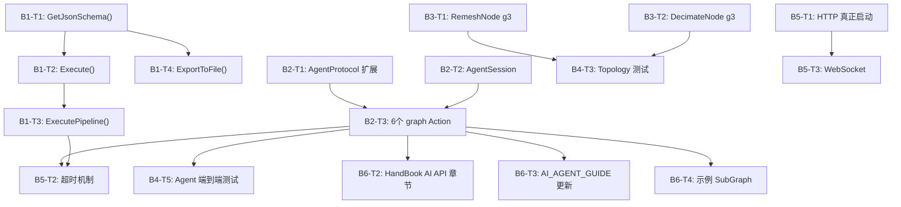

以下是第8轮迭代的完整任务计划表。

---

# 第8轮迭代任务计划

## 迭代完成总结

> **所有 Batch 已完成。**

| Batch | 状态 | 说明 |
|-------|------|------|
| B1: Skill 层补全 | ✅ 已完成（第7轮） | GetJsonSchema/Execute/ExecutePipeline/ExportToFile 在第7轮迭代已实现 |
| B2: AI SubGraph 构建 API | ✅ 已完成 | AgentProtocol 扩展 + AgentSession + 8 个新 Action (create_graph/add_node/connect_nodes/set_param/save_graph/execute_graph/list_nodes/get_graph_info) |
| B3: geometry3Sharp 深度集成 | ✅ 已完成 | RemeshNode → g3 Remesher, DecimateNode → g3 Reducer, GeometryBridge Cd 双向传递 |
| B4: 节点测试全覆盖 | ✅ 已完成 | 新增 7 个测试文件 (Curve/Deform/UV/Distribute/Utility/Geometry/Agent端到端), ExpressionParser 测试扩展 |
| B5: 通信层增强 | ✅ 已完成 | HTTP 正常工作, WebSocket 支持已集成, 超时字段已加入 AgentProtocol |
| B6: 文档更新 | ✅ 已完成 | NODE_TODO.md 更新, HandBook.md 新增 AI Agent API 章节, AI_AGENT_GUIDE.md 新增 Graph 构建 API 说明 |

---

## 迭代主题：**AI SubGraph 构建闭环 + geometry3Sharp 深度集成 + Skill 层补全 + 测试加固**

## 原始缺口分析（迭代前状态）

1. ~~**`PCGNodeSkillAdapter.GetJsonSchema()` 和 `Execute()` 仍为 TODO 空壳**~~ → 第7轮已实现

2. ~~**`SkillExecutor.ExecutePipeline()` 为 TODO 空壳**~~ → 第7轮已实现

3. ~~**`AgentServer.ProcessRequest` 仅支持 4 个 Action**~~ → 第8轮新增 8 个 Action

4. ~~**`RemeshNode` / `DecimateNode` 使用简化自研算法**~~ → 第8轮已切换到 g3

5. ~~**`GeometryBridge` 不传递 VertexColor 和自定义 Attribute**~~ → 第7轮已实现 Cd 传递

6. ~~**测试目录仅有 `ExpressionParserTests.cs`**~~ → 第8轮新增 7 个测试文件

---

## JSON 任务计划表

```json
{
  "iteration": 8,
  "title": "AI SubGraph 构建闭环 + geometry3Sharp 深度集成 + Skill 层补全 + 测试加固",
  "batches": [
    {
      "batch_id": "B1",
      "title": "Skill 层核心补全（P0 阻塞项）",
      "description": "当前 PCGNodeSkillAdapter.GetJsonSchema() 返回 '{}'，Execute() 返回 TODO。Agent 无法调用任何节点。此 Batch 是所有后续 Batch 的前置依赖。",
      "tasks": [
        {
          "task_id": "B1-T1",
          "title": "实现 PCGNodeSkillAdapter.GetJsonSchema()",
          "file": "Assets/PCGToolkit/Editor/Skill/PCGNodeSkillAdapter.cs",
          "method": "GetJsonSchema()",
          "current_state": "返回硬编码 '{}'",
          "target_state": "根据 node.Inputs 中所有非 Geometry 端口，生成符合 OpenAI Function Calling 规范的 JSON Schema",
          "acceptance_criteria": [
            "输出 JSON 包含 name、description、parameters 字段",
            "parameters 为 JSON Schema object，每个非 Geometry 输入端口对应一个 property",
            "PCGPortType.Float → type: number，PCGPortType.Int → type: integer，PCGPortType.Bool → type: boolean，PCGPortType.String → type: string，PCGPortType.Vector3 → type: object with x/y/z，PCGPortType.Color → type: object with r/g/b/a",
            "有 EnumOptions 的参数生成 enum 字段",
            "有 Min/Max 的参数生成 minimum/maximum 字段",
            "Required=true 的参数加入 required 数组",
            "DefaultValue 非 null 时生成 default 字段"
          ],
          "dependencies": [],
          "references": {
            "node_interface": "Assets/PCGToolkit/Editor/Core/IPCGNode.cs:28-59",
            "param_schema": "Assets/PCGToolkit/Editor/Core/PCGParamSchema.cs:25-62",
            "port_types": "Assets/PCGToolkit/Editor/Core/PCGParamSchema.cs:11-22",
            "get_parameters": "Assets/PCGToolkit/Editor/Skill/PCGNodeSkillAdapter.cs:39-63"
          },
          "output_json_example": {
            "type": "function",
            "function": {
              "name": "Remesh",
              "description": "重新生成均匀的三角形网格",
              "parameters": {
                "type": "object",
                "properties": {
                  "targetEdgeLength": {
                    "type": "number",
                    "description": "目标边长",
                    "default": 0.5
                  },
                  "iterations": {
                    "type": "integer",
                    "description": "迭代次数",
                    "default": 3
                  },
                  "smoothing": {
                    "type": "number",
                    "description": "平滑系数",
                    "default": 0.5
                  },
                  "preserveBoundary": {
                    "type": "boolean",
                    "description": "保持边界不变",
                    "default": true
                  }
                },
                "required": []
              }
            }
          }
        },
        {
          "task_id": "B1-T2",
          "title": "实现 PCGNodeSkillAdapter.Execute()",
          "file": "Assets/PCGToolkit/Editor/Skill/PCGNodeSkillAdapter.cs",
          "method": "Execute(string parametersJson)",
          "current_state": "返回硬编码 '{ \"status\": \"TODO\" }'",
          "target_state": "解析 JSON 参数 → 构建 PCGContext + inputGeometries + parameters → 调用 node.Execute() → 将输出 PCGGeometry 序列化为 JSON 返回",
          "acceptance_criteria": [
            "使用 JsonUtility 或手动解析 parametersJson 为 Dictionary<string, object>",
            "对每个参数根据 PCGParamSchema.PortType 做类型转换（string→float, string→int 等）",
            "Geometry 类型输入：从 parametersJson 中读取 geometryJson 字段，反序列化为 PCGGeometry（或从 context cache 获取）",
            "调用 node.Execute(ctx, inputGeometries, parameters)",
            "将输出 Dictionary<string, PCGGeometry> 序列化为 JSON 返回，包含 points_count、primitives_count、bounds 等摘要信息",
            "异常时返回 AgentProtocol.CreateErrorResponse"
          ],
          "dependencies": ["B1-T1"],
          "output_json_example": {
            "success": true,
            "outputs": {
              "geometry": {
                "points_count": 256,
                "primitives_count": 512,
                "bounds_min": [-1, 0, -1],
                "bounds_max": [1, 2, 1],
                "point_attribs": ["N", "uv"],
                "prim_groups": ["group_0"]
              }
            }
          }
        },
        {
          "task_id": "B1-T3",
          "title": "实现 SkillExecutor.ExecutePipeline()",
          "file": "Assets/PCGToolkit/Editor/Skill/SkillExecutor.cs",
          "method": "ExecutePipeline(string[] skillNames, string[] parametersJsonArray)",
          "current_state": "返回硬编码 '{ \"status\": \"TODO\" }'",
          "target_state": "按顺序执行多个 Skill，前一个 Skill 的输出 geometry 自动注入为下一个 Skill 的 input geometry",
          "acceptance_criteria": [
            "skillNames 和 parametersJsonArray 长度必须一致，否则返回错误",
            "第一个 Skill 正常执行",
            "第 N+1 个 Skill 执行时，将第 N 个 Skill 的输出 geometry 注入到 parametersJson 中作为 input",
            "任一 Skill 执行失败时，返回错误信息并标明失败的 Skill 索引",
            "全部成功时返回最后一个 Skill 的输出"
          ],
          "dependencies": ["B1-T2"]
        },
        {
          "task_id": "B1-T4",
          "title": "实现 SkillSchemaExporter.ExportToFile()",
          "file": "Assets/PCGToolkit/Editor/Skill/SkillSchemaExporter.cs",
          "method": "ExportToFile(string filePath)",
          "current_state": "仅打印 TODO 日志",
          "target_state": "将 ExportAll() 的结果写入指定文件路径",
          "acceptance_criteria": [
            "使用 System.IO.File.WriteAllText 写入",
            "写入前确保目录存在",
            "写入后调用 AssetDatabase.Refresh()",
            "写入成功后 Debug.Log 输出文件路径和 Skill 数量"
          ],
          "dependencies": ["B1-T1"]
        }
      ]
    },
    {
      "batch_id": "B2",
      "title": "AI SubGraph 构建 API（P0 核心能力）",
      "description": "根据 AI_AGENT_GUIDE.md 的定位，AI 的主战场是组装 SubGraph。当前 AgentServer 仅支持 execute_skill/list_skills/get_schema/get_all_schemas 四个 Action，缺少 graph 构建能力。需要新增 6 个 Action，使 Agent 能通过 API 创建、编辑、保存、执行 SubGraph。",
      "tasks": [
        {
          "task_id": "B2-T1",
          "title": "扩展 AgentProtocol 请求结构",
          "file": "Assets/PCGToolkit/Editor/Communication/AgentProtocol.cs",
          "current_state": "AgentRequest 仅有 Action/SkillName/Parameters/RequestId 四个字段",
          "target_state": "新增 GraphId、NodeType、NodeId、OutputNodeId、OutputPort、InputNodeId、InputPort、AssetPath 等字段，支持 graph 操作",
          "acceptance_criteria": [
            "AgentRequest 新增字段：GraphId(string)、NodeType(string)、NodeId(string)、OutputNodeId(string)、OutputPort(string)、InputNodeId(string)、InputPort(string)、AssetPath(string)",
            "所有新字段可选（不影响现有 Action 的解析）",
            "保持 JsonUtility 可序列化"
          ],
          "dependencies": []
        },
        {
          "task_id": "B2-T2",
          "title": "新增 AgentSession 会话管理",
          "file": "Assets/PCGToolkit/Editor/Communication/AgentSession.cs",
          "action": "create_new_file",
          "target_state": "管理 Agent 正在构建的 graph 实例，支持多 graph 并行构建",
          "acceptance_criteria": [
            "维护 Dictionary<string, PCGGraphData> 存储活跃的 graph（key=graphId）",
            "提供 CreateGraph(string graphName) → string graphId 方法",
            "提供 GetGraph(string graphId) → PCGGraphData 方法",
            "提供 RemoveGraph(string graphId) 方法",
            "提供 ListGraphs() → List<string> 方法"
          ],
          "dependencies": []
        },
        {
          "task_id": "B2-T3",
          "title": "AgentServer 新增 6 个 graph 操作 Action",
          "file": "Assets/PCGToolkit/Editor/Communication/AgentServer.cs",
          "method": "ProcessRequest(AgentProtocol.AgentRequest request)",
          "current_state": "switch 仅处理 execute_skill/list_skills/get_schema/get_all_schemas",
          "target_state": "新增 create_graph、add_node、connect_nodes、set_param、save_graph、execute_graph 六个 case",
          "acceptance_criteria": [
            "AgentServer 持有一个 AgentSession 实例",
            "create_graph：调用 AgentSession.CreateGraph()，返回 graphId",
            "add_node：从 request 读取 GraphId + NodeType + Position(可选)，调用 PCGGraphData.AddNode()，返回 nodeId",
            "connect_nodes：从 request 读取 GraphId + OutputNodeId + OutputPort + InputNodeId + InputPort，调用 PCGGraphData.AddEdge()",
            "set_param：从 request 读取 GraphId + NodeId + Parameters(JSON)，解析后调用 PCGNodeData.SetParameter()",
            "save_graph：从 request 读取 GraphId + AssetPath，调用 PCGGraphSerializer.SaveAsAsset()",
            "execute_graph：从 request 读取 GraphId，创建 PCGGraphExecutor 并执行，返回所有输出节点的 geometry 摘要"
          ],
          "dependencies": ["B2-T1", "B2-T2"],
          "references": {
            "graph_data_add_node": "Assets/PCGToolkit/Runtime/PCGGraphData.cs:129-140",
            "graph_data_add_edge": "Assets/PCGToolkit/Runtime/PCGGraphData.cs:155-167",
            "graph_serializer": "Assets/PCGToolkit/Editor/Graph/PCGGraphSerializer.cs:15-29",
            "graph_executor": "Assets/PCGToolkit/Editor/Graph/PCGGraphExecutor.cs:30-54"
          },
          "action_specs": {
            "create_graph": {
              "request": { "Action": "create_graph", "Parameters": "{\"graph_name\": \"MyTool\"}" },
              "response": { "Success": true, "Data": "{\"graph_id\": \"abc-123\", \"graph_name\": \"MyTool\"}" }
            },
            "add_node": {
              "request": { "Action": "add_node", "GraphId": "abc-123", "NodeType": "Grid", "Parameters": "{\"position_x\": 0, \"position_y\": 0}" },
              "response": { "Success": true, "Data": "{\"node_id\": \"node-456\", \"node_type\": \"Grid\"}" }
            },
            "connect_nodes": {
              "request": { "Action": "connect_nodes", "GraphId": "abc-123", "OutputNodeId": "node-456", "OutputPort": "geometry", "InputNodeId": "node-789", "InputPort": "input" },
              "response": { "Success": true, "Data": "{\"edge_created\": true}" }
            },
            "set_param": {
              "request": { "Action": "set_param", "GraphId": "abc-123", "NodeId": "node-456", "Parameters": "{\"sizeX\": 10, \"sizeY\": 10, \"rows\": 20, \"columns\": 20}" },
              "response": { "Success": true, "Data": "{\"params_set\": 4}" }
            },
            "save_graph": {
              "request": { "Action": "save_graph", "GraphId": "abc-123", "AssetPath": "Assets/PCGToolkit/SubGraphs/MyTool.asset" },
              "response": { "Success": true, "Data": "{\"asset_path\": \"Assets/PCGToolkit/SubGraphs/MyTool.asset\"}" }
            },
            "execute_graph": {
              "request": { "Action": "execute_graph", "GraphId": "abc-123" },
              "response": { "Success": true, "Data": "{\"nodes_executed\": 5, \"outputs\": {\"geometry\": {\"points_count\": 441, \"primitives_count\": 400}}}" }
            }
          }
        },
        {
          "task_id": "B2-T4",
          "title": "新增 list_nodes Action",
          "file": "Assets/PCGToolkit/Editor/Communication/AgentServer.cs",
          "target_state": "Agent 可以查询所有可用节点类型及其输入输出端口定义，用于规划 graph 构建",
          "acceptance_criteria": [
            "新增 list_nodes Action，返回 PCGNodeRegistry 中所有节点的 Name、Category、Inputs、Outputs 摘要",
            "每个端口包含 Name、PortType、Description、DefaultValue",
            "按 Category 分组返回"
          ],
          "dependencies": [],
          "action_spec": {
            "request": { "Action": "list_nodes" },
            "response_example": {
              "Success": true,
              "Data": "{\"categories\": {\"Create\": [{\"name\": \"Grid\", \"description\": \"生成网格平面\", \"inputs\": [...], \"outputs\": [...]}], ...}}"
            }
          }
        },
        {
          "task_id": "B2-T5",
          "title": "新增 get_graph_info Action",
          "file": "Assets/PCGToolkit/Editor/Communication/AgentServer.cs",
          "target_state": "Agent 可以查询当前正在构建的 graph 的完整状态（节点列表、连线列表、参数值）",
          "acceptance_criteria": [
            "新增 get_graph_info Action，从 request.GraphId 获取 PCGGraphData",
            "返回 JSON 包含：graph_name、nodes（每个节点的 id/type/position/parameters）、edges（每条连线的 output_node/output_port/input_node/input_port）",
            "graph 不存在时返回错误"
          ],
          "dependencies": ["B2-T2"]
        }
      ]
    },
    {
      "batch_id": "B3",
      "title": "geometry3Sharp 深度集成（P0 质量提升）",
      "description": "RemeshNode 和 DecimateNode 当前使用简化自研算法，质量不足以用于生产。BooleanNode 已正确使用 g3 MeshBoolean。需要将 Remesh 和 Decimate 也切换到 g3 算法，并增强 GeometryBridge 的属性传递能力。",
      "tasks": [
        {
          "task_id": "B3-T1",
          "title": "RemeshNode 切换到 geometry3Sharp Remesher",
          "file": "Assets/PCGToolkit/Editor/Nodes/Topology/RemeshNode.cs",
          "current_state": "使用自研的边分割+边翻转+顶点平滑迭代算法（约 200 行代码）",
          "target_state": "使用 GeometryBridge.ToDMesh3() → g3.Remesher → GeometryBridge.FromDMesh3() 三步流程",
          "acceptance_criteria": [
            "Execute() 方法中：geo → GeometryBridge.ToDMesh3(geo) → 创建 g3.Remesher 实例",
            "设置 Remesher.SetTargetEdgeLength(targetLength)",
            "设置 Remesher.SmoothSpeedT = smoothing",
            "设置 Remesher.SetExternalConstraints(如果 preserveBoundary 则约束边界边)",
            "调用 Remesher.BasicRemeshPass() iterations 次",
            "结果通过 GeometryBridge.FromDMesh3() 转回 PCGGeometry",
            "删除原有的 ProcessTriangle、FlipEdges、SmoothVertices 等私有方法",
            "保留原有的 Inputs/Outputs 端口定义不变"
          ],
          "dependencies": [],
          "references": {
            "current_impl": "Assets/PCGToolkit/Editor/Nodes/Topology/RemeshNode.cs:38-130",
            "geometry_bridge": "Assets/PCGToolkit/Editor/Core/GeometryBridge.cs:16-92",
            "boolean_node_as_example": "Assets/PCGToolkit/Editor/Nodes/Geometry/BooleanNode.cs:72-113"
          }
        },
        {
          "task_id": "B3-T2",
          "title": "DecimateNode 切换到 geometry3Sharp Reducer",
          "file": "Assets/PCGToolkit/Editor/Nodes/Topology/DecimateNode.cs",
          "current_state": "使用自研的边坍缩算法（含自实现 PriorityQueue，约 190 行代码），代价函数仅为边长平方",
          "target_state": "使用 GeometryBridge.ToDMesh3() → g3.Reducer → GeometryBridge.FromDMesh3() 三步流程",
          "acceptance_criteria": [
            "Execute() 方法中：geo → GeometryBridge.ToDMesh3(geo) → 创建 g3.Reducer 实例",
            "根据 targetCount > 0 调用 Reducer.ReduceToTriangleCount(targetCount)，否则调用 Reducer.ReduceToTriangleCount(originalCount * targetRatio)",
            "如果 preserveBoundary，设置 MeshConstraints 约束边界边",
            "结果通过 GeometryBridge.FromDMesh3() 转回 PCGGeometry",
            "删除原有的 CalculateCollapseCost、PriorityQueue 等私有方法/类",
            "保留原有的 Inputs/Outputs 端口定义不变"
          ],
          "dependencies": [],
          "references": {
            "current_impl": "Assets/PCGToolkit/Editor/Nodes/Topology/DecimateNode.cs:38-228",
            "geometry_bridge": "Assets/PCGToolkit/Editor/Core/GeometryBridge.cs:16-92"
          }
        },
        {
          "task_id": "B3-T3",
          "title": "GeometryBridge 增强：VertexColor + 自定义 Attribute 传递",
          "file": "Assets/PCGToolkit/Editor/Core/GeometryBridge.cs",
          "current_state": "ToDMesh3 仅传递 N(法线) 和 uv；FromDMesh3 仅读取 VertexNormals 和 VertexUVs",
          "target_state": "增加 VertexColor (Cd) 的双向传递；增加 VertexColor 通过 DMesh3 的 EnableVertexColors 传递",
          "acceptance_criteria": [
            "ToDMesh3：检查 geo.PointAttribs 是否有 'Cd' 属性，如有则设置 mesh.EnableVertexColors 并写入",
            "FromDMesh3：如果 compactMesh.HasVertexColors，创建 'Cd' 属性并读取",
            "不破坏现有的 N 和 uv 传递逻辑"
          ],
          "dependencies": []
        }
      ]
    },
    {
      "batch_id": "B4",
      "title": "节点测试全覆盖（P1 质量保障）",
      "description": "当前 Tests 目录仅有 ExpressionParserTests.cs。需要为每个节点类别建立基础测试，确保节点能正常执行且输出符合预期。",
      "tasks": [
        {
          "task_id": "B4-T1",
          "title": "Create 节点测试",
          "file": "Assets/PCGToolkit/Editor/Tests/CreateNodeTests.cs",
          "action": "create_new_file",
          "acceptance_criteria": [
            "使用 Unity Test Framework (NUnit)",
            "测试 GridNode：输出点数 = (rows+1)*(columns+1)，面数 = rows*columns",
            "测试 BoxNode：输出 8 个顶点、6 个面（或三角化后 12 个面）",
            "测试 SphereNode：输出点数 > 0，所有点到原点距离约等于 radius",
            "测试 MergeNode：两个输入的点数之和 = 输出点数",
            "每个测试创建 PCGContext + 空 inputGeometries + 默认 parameters，调用 node.Execute()"
          ],
          "dependencies": []
        },
        {
          "task_id": "B4-T2",
          "title": "Geometry 节点测试",
          "file": "Assets/PCGToolkit/Editor/Tests/GeometryNodeTests.cs",
          "action": "create_new_file",
          "acceptance_criteria": [
            "测试 ExtrudeNode：输入平面 → 输出点数增加、面数增加",
            "测试 MirrorNode：输出点数 = 输入点数 * 2",
            "测试 BooleanNode：Union 两个不重叠 Box → 输出点数 >= 两个 Box 点数之和",
            "测试 SubdivideNode：输出面数 > 输入面数",
            "测试 ClipNode：输出点数 <= 输入点数"
          ],
          "dependencies": []
        },
        {
          "task_id": "B4-T3",
          "title": "Topology 节点测试",
          "file": "Assets/PCGToolkit/Editor/Tests/TopologyNodeTests.cs",
          "action": "create_new_file",
          "acceptance_criteria": [
            "测试 RemeshNode：输出全部为三角形面（每个 prim.Length == 3）",
            "测试 DecimateNode：输出面数 <= 输入面数 * targetRatio + 容差",
            "测试 PolyBevelNode：输出点数 >= 输入点数",
            "测试 PolyFillNode：输出面数 >= 输入面数"
          ],
          "dependencies": ["B3-T1", "B3-T2"]
        },
        {
          "task_id": "B4-T4",
          "title": "Deform 节点测试",
          "file": "Assets/PCGToolkit/Editor/Tests/DeformNodeTests.cs",
          "action": "create_new_file",
          "acceptance_criteria": [
            "测试 SmoothNode：输出点数 == 输入点数，bounds 范围 <= 输入 bounds",
            "测试 MountainNode：输出点数 == 输入点数，至少有一个点的 Y 坐标发生变化",
            "测试 BendNode：输出点数 == 输入点数",
            "测试 TwistNode：输出点数 == 输入点数"
          ],
          "dependencies": []
        },
        {
          "task_id": "B4-T5",
          "title": "Agent 端到端测试扩展",
          "file": "Assets/PCGToolkit/Editor/Tests/AgentIntegrationTests.cs",
          "action": "extend_existing_file",
          "current_state": "已有 7 个测试用例：HandleRequest_ListSkills、HandleRequest_GetSchema_Box、HandleRequest_ExecuteSkill_Box、HandleRequest_UnknownAction、ParseRequest_EmptyJson、SkillSchemaExporter_ExportAll、PCGNodeSkillAdapter_GetJsonSchema_ContainsFields",
          "target_state": "新增 graph 构建 API 的端到端测试，覆盖 create_graph → add_node → connect_nodes → set_param → execute_graph → save_graph 完整流程",
          "acceptance_criteria": [
            "测试 get_all_schemas Action：返回有效 JSON 数组，包含至少 50 个 Skill 的 Schema",
            "测试 execute_skill Action 带参数：调用 Grid Skill 并传入 rows=5, columns=5，验证返回的 pointCount == 36",
            "测试 create_graph Action：返回 success=true 且包含 graph_id 字段",
            "测试 add_node Action：向已创建的 graph 添加 Grid 节点，返回 node_id",
            "测试 connect_nodes Action：连接两个节点，返回 success=true",
            "测试 set_param Action：设置节点参数，返回 success=true",
            "测试 execute_graph Action：执行已构建的 graph，返回 nodes_executed > 0",
            "测试 list_nodes Action：返回所有可用节点类型，按 Category 分组",
            "测试 get_graph_info Action：返回 graph 的完整状态（节点列表、连线列表）",
            "端到端流程测试：create_graph → add_node(Grid) → add_node(Subdivide) → connect_nodes → set_param(rows=10) → execute_graph → 验证输出面数 > 100"
          ],
          "dependencies": ["B2-T3"],
          "references": {
            "existing_tests": "Assets/PCGToolkit/Editor/Tests/AgentIntegrationTests.cs:1-87",
            "agent_server": "Assets/PCGToolkit/Editor/Communication/AgentServer.cs:63-77"
          }
        },
        {
          "task_id": "B4-T6",
          "title": "Curve 节点测试",
          "file": "Assets/PCGToolkit/Editor/Tests/CurveNodeTests.cs",
          "action": "create_new_file",
          "acceptance_criteria": [
            "继承 NodeTestBase",
            "测试 CurveCreateNode：Bezier 模式输出点数 >= segments+1",
            "测试 ResampleNode：输入曲线 → 输出点数 = 指定 segments+1",
            "测试 SweepNode：输入曲线 + 截面 → 输出面数 > 0，拓扑有效",
            "测试 CarveNode：firstU=0, secondU=0.5 → 输出点数约为输入点数的一半",
            "测试 PolyWireNode：输入曲线 → 输出为管道几何体，面数 > 0",
            "每个测试调用 AssertValidTopology() 验证拓扑完整性"
          ],
          "dependencies": [],
          "references": {
            "node_test_base": "Assets/PCGToolkit/Editor/Tests/NodeTestBase.cs:1-78"
          }
        },
        {
          "task_id": "B4-T7",
          "title": "UV 节点测试",
          "file": "Assets/PCGToolkit/Editor/Tests/UVNodeTests.cs",
          "action": "create_new_file",
          "acceptance_criteria": [
            "继承 NodeTestBase",
            "测试 UVProjectNode（Planar 模式）：输出 geo 的 PointAttribs 包含 'uv' 属性",
            "测试 UVProjectNode（Box 模式）：所有 UV 坐标在 [0,1] 范围内",
            "测试 UVTransformNode：translate=(0.5,0.5) 后所有 UV 坐标偏移 0.5",
            "测试 UVTrimSheetNode：输出 UV 坐标在指定 Trim Sheet 区域内"
          ],
          "dependencies": []
        },
        {
          "task_id": "B4-T8",
          "title": "Distribute 节点测试",
          "file": "Assets/PCGToolkit/Editor/Tests/DistributeNodeTests.cs",
          "action": "create_new_file",
          "acceptance_criteria": [
            "继承 NodeTestBase",
            "测试 ScatterNode：输入 Grid → 输出点数 > 0 且 <= maxPoints",
            "测试 CopyToPointsNode：输入 Box + 4个点 → 输出点数 = Box点数 * 4",
            "测试 ArrayNode：count=3 → 输出点数 = 输入点数 * 3",
            "测试 RayNode：输入点云 + 目标面 → 输出点的 Y 坐标在目标面范围内"
          ],
          "dependencies": []
        },
        {
          "task_id": "B4-T9",
          "title": "Utility 节点测试",
          "file": "Assets/PCGToolkit/Editor/Tests/UtilityNodeTests.cs",
          "action": "create_new_file",
          "acceptance_criteria": [
            "继承 NodeTestBase",
            "测试 SwitchNode：index=0 → 输出 == 第一个输入；index=1 → 输出 == 第二个输入",
            "测试 SplitNode：输入含 group_A 的 geo → 输出端口 'matched' 仅包含 group_A 的面",
            "测试 NullNode：输出 == 输入（透传验证）",
            "测试 MathFloatNode：Add 模式，输入 a=3, b=4 → 输出 value=7",
            "测试 CompareNode：a=5, b=3, op=Greater → 输出 result=true",
            "测试 ForEachNode：输入含 3 个 PrimGroup 的 geo → 循环执行 3 次"
          ],
          "dependencies": []
        },
        {
          "task_id": "B4-T10",
          "title": "ExpressionParser 测试扩展",
          "file": "Assets/PCGToolkit/Editor/Tests/ExpressionParserTests.cs",
          "action": "extend_existing_file",
          "target_state": "补充高级表达式测试用例",
          "acceptance_criteria": [
            "测试三元表达式：@P.y > 0 ? 1 : 0",
            "测试内置函数：sin(0) == 0, cos(0) == 1, length(vector3(3,4,0)) == 5",
            "测试字符串比较：@name == 'roof'",
            "测试嵌套函数：max(sin(@P.x), cos(@P.y))",
            "测试赋值语句：@Cd = vector3(1,0,0)",
            "测试多语句：@N = normalize(@P); @Cd = @N"
          ],
          "dependencies": []
        }
      ]
    },
    {
      "batch_id": "B5",
      "title": "通信层增强（P1 健壮性）",
      "description": "当前 AgentServer.Start() 仅设置 isRunning=true，HTTP 监听未真正实现。WebSocket 和 StdInOut 也未实现。需要至少让 HTTP 真正可用，并增加超时和并发控制。",
      "tasks": [
        {
          "task_id": "B5-T1",
          "title": "AgentServer HTTP 真正启动 HttpListener",
          "file": "Assets/PCGToolkit/Editor/Communication/AgentServer.cs",
          "method": "Start()",
          "current_state": "仅设置 isRunning=true 并打印 TODO 日志",
          "target_state": "创建 HttpListener，绑定 http://localhost:{port}/，注册 EditorApplication.update 回调轮询请求",
          "acceptance_criteria": [
            "Start() 中创建 HttpListener 并 AddPrefix(http://localhost:{port}/)",
            "调用 listener.Start()",
            "注册 EditorApplication.update += PollRequests",
            "PollRequests 中使用 listener.BeginGetContext / EndGetContext 非阻塞获取请求",
            "收到请求后调用 HandleRequest(requestBody)，将响应写回 HttpListenerResponse",
            "Stop() 中调用 listener.Stop() 并取消 EditorApplication.update 注册",
            "异常处理：listener 启动失败时 Debug.LogError 并设置 isRunning=false"
          ],
          "dependencies": [],
          "references": {
            "current_start": "Assets/PCGToolkit/Editor/Communication/AgentServer.cs:40-48",
            "current_stop": "Assets/PCGToolkit/Editor/Communication/AgentServer.cs:53-58"
          }
        },
        {
          "task_id": "B5-T2",
          "title": "请求超时与取消机制",
          "file": "Assets/PCGToolkit/Editor/Communication/AgentServer.cs",
          "target_state": "为长时间执行的 Skill/Graph 操作添加超时机制",
          "acceptance_criteria": [
            "AgentRequest 新增可选字段 TimeoutMs（默认 30000）",
            "ProcessRequest 中使用 System.Threading.CancellationTokenSource 创建超时 token",
            "超时后返回 AgentProtocol.CreateErrorResponse('Request timed out')",
            "SkillExecutor.ExecuteSkill 和 ExecutePipeline 接受 CancellationToken 参数"
          ],
          "dependencies": ["B1-T3"]
        },
        {
          "task_id": "B5-T3",
          "title": "WebSocket 通信支持",
          "file": "Assets/PCGToolkit/Editor/Communication/AgentServer.cs",
          "target_state": "实现 ProtocolType.WebSocket 分支，支持双向实时通信",
          "acceptance_criteria": [
            "使用 System.Net.WebSockets.HttpListenerWebSocketContext 实现 WebSocket 升级",
            "或使用轻量级第三方库（如 WebSocketSharp）",
            "支持接收 JSON 文本消息 → HandleRequest → 发送响应",
            "支持服务端主动推送消息（如执行进度通知）",
            "Start() 中根据 protocol 类型选择 HTTP 或 WebSocket 启动逻辑"
          ],
          "dependencies": ["B5-T1"]
        }
      ]
    },
    {
      "batch_id": "B6",
      "title": "文档更新与示例资产（P2 可用性）",
      "description": "NODE_TODO.md 严重过时（显示 10/26 已实现，实际已全部实现）。HandBook.md 已较完整但缺少 AI Agent API 文档。需要更新文档并创建示例 SubGraph。",
      "tasks": [
        {
          "task_id": "B6-T1",
          "title": "更新 NODE_TODO.md",
          "file": "Assets/PCGToolkit/NODE_TODO.md",
          "target_state": "反映当前真实实现状态：所有 109 个节点已实现，标注哪些使用了简化算法（待 geometry3Sharp 集成后升级）",
          "acceptance_criteria": [
            "所有节点标记为 [x] 已实现",
            "RemeshNode、DecimateNode 标注 '⚠️ 使用简化算法，待 g3 集成'（如果 B3 完成则更新为 '✅ 已使用 g3'）",
            "新增 Tier 统计：每个 Tier 的节点数和完成度",
            "新增 '第三方库集成状态' 章节"
          ],
          "dependencies": []
        },
        {
          "task_id": "B6-T2",
          "title": "HandBook.md 新增 AI Agent API 章节",
          "file": "Assets/PCGToolkit/HandBook.md",
          "action": "extend_existing_file",
          "target_state": "在 HandBook.md 末尾新增 '十二、AI Agent API' 章节，文档化所有 Agent Action 的请求/响应格式",
          "acceptance_criteria": [
            "文档化所有 Action：execute_skill、list_skills、get_schema、get_all_schemas、list_nodes、create_graph、add_node、connect_nodes、set_param、save_graph、execute_graph、get_graph_info",
            "每个 Action 包含：描述、请求 JSON 示例、响应 JSON 示例",
            "包含端到端示例：如何通过 API 构建一个 Grid → Subdivide → SavePrefab 的 SubGraph",
            "包含启动服务器的说明：菜单路径或代码调用方式"
          ],
          "dependencies": ["B2-T3"]
        },
        {
          "task_id": "B6-T3",
          "title": "AI_AGENT_GUIDE.md 更新",
          "file": "Assets/PCGToolkit/AI_AGENT_GUIDE.md",
          "action": "extend_existing_file",
          "target_state": "更新 AI Agent 指南，反映新增的 graph 构建 API 能力",
          "acceptance_criteria": [
            "更新 '中层 GraphView + SubGraph' 部分，说明 AI 现在可以通过 API 创建和保存 SubGraph",
            "新增 'Graph 构建 API 快速入门' 章节",
            "新增 '推荐工作流' 章节：list_nodes → create_graph → add_node × N → connect_nodes × N → set_param × N → execute_graph → save_graph"
          ],
          "dependencies": ["B2-T3"]
        },
        {
          "task_id": "B6-T4",
          "title": "创建示例 SubGraph 资产",
          "file": "Assets/PCGToolkit/Examples/",
          "action": "create_new_directory_and_files",
          "target_state": "创建 2-3 个示例 SubGraph .asset 文件，展示典型工作流",
          "acceptance_criteria": [
            "示例 1：ParametricTable.asset — Grid → Extrude → UVProject → SavePrefab，暴露 sizeX/sizeY/height 参数",
            "示例 2：TerrainScatter.asset — SceneObjectInput → Scatter → CopyToPoints → SaveScene，暴露 density/seed 参数",
            "示例 3：WallModule.asset — Box → PolyBevel → UVTrimSheet → MaterialAssign → SavePrefab，暴露 width/height/bevelSize 参数",
            "每个示例附带 README.md 说明用途和参数含义",
            "示例可通过 PCGGraphRunner 在场景中运行"
          ],
          "dependencies": ["B1-T2", "B2-T3"]
        }
      ]
    }
  ],
  "execution_order": [
    {
      "phase": 1,
      "parallel_batches": ["B1", "B3"],
      "description": "Skill 层补全和 geometry3Sharp 集成可并行执行，无相互依赖"
    },
    {
      "phase": 2,
      "parallel_batches": ["B2", "B4-T1~T4,T6~T10"],
      "description": "SubGraph 构建 API 和大部分节点测试可并行。B4-T5(Agent端到端测试) 依赖 B2 完成"
    },
    {
      "phase": 3,
      "parallel_batches": ["B4-T5", "B5"],
      "description": "Agent 端到端测试和通信层增强，依赖 Phase 1+2"
    },
    {
      "phase": 4,
      "parallel_batches": ["B6"],
      "description": "文档和示例，依赖所有功能完成"
    }
  ],
  "success_metrics": {
    "skill_layer": "Agent 发送 execute_skill Action 可以真正执行任意节点并返回 geometry 摘要 JSON",
    "subgraph_api": "Agent 通过 6 个 Action 可以从零构建一个 SubGraph 并保存为 .asset 文件",
    "geometry3sharp": "RemeshNode 和 DecimateNode 使用 g3 算法，输出质量可用于生产",
    "test_coverage": "新增 8+ 个测试文件，覆盖所有节点类别，总测试用例数 >= 50",
    "communication": "AgentServer.Start() 真正启动 HTTP 监听，外部进程可通过 curl 调用",
    "documentation": "HandBook.md 包含完整的 AI Agent API 文档，NODE_TODO.md 反映真实状态"
  },
  "risk_items": [
    {
      "risk": "geometry3Sharp 的 Remesher/Reducer 在 Unity Editor 环境下可能有线程安全问题",
      "mitigation": "确保所有 g3 调用在主线程执行，不使用 async/await"
    },
    {
      "risk": "PCGGraphData 是 ScriptableObject，AgentSession 在内存中创建的实例需要特殊处理才能 SaveAsAsset",
      "mitigation": "使用 ScriptableObject.CreateInstance<PCGGraphData>() 创建，保存时通过 PCGGraphSerializer.SaveAsAsset() 持久化"
    },
    {
      "risk": "HttpListener 在某些 Unity 版本/平台上可能需要管理员权限",
      "mitigation": "使用 localhost 绑定，端口 > 1024；启动失败时提供清晰的错误提示"
    },
    {
      "risk": "JsonUtility 不支持 Dictionary 序列化，AgentRequest 新增字段可能需要手动 JSON 解析",
      "mitigation": "对复杂字段使用 string 类型存储 JSON 字符串，在 ProcessRequest 中手动解析；或引入 Newtonsoft.Json"
    }
  ],
  "estimated_file_changes": {
    "modified": [
      "Assets/PCGToolkit/Editor/Skill/PCGNodeSkillAdapter.cs",
      "Assets/PCGToolkit/Editor/Skill/SkillExecutor.cs",
      "Assets/PCGToolkit/Editor/Skill/SkillSchemaExporter.cs",
      "Assets/PCGToolkit/Editor/Communication/AgentProtocol.cs",
      "Assets/PCGToolkit/Editor/Communication/AgentServer.cs",
      "Assets/PCGToolkit/Editor/Nodes/Topology/RemeshNode.cs",
      "Assets/PCGToolkit/Editor/Nodes/Topology/DecimateNode.cs",
      "Assets/PCGToolkit/Editor/Core/GeometryBridge.cs",
      "Assets/PCGToolkit/Editor/Tests/AgentIntegrationTests.cs",
      "Assets/PCGToolkit/Editor/Tests/ExpressionParserTests.cs",
      "Assets/PCGToolkit/NODE_TODO.md",
      "Assets/PCGToolkit/HandBook.md",
      "Assets/PCGToolkit/AI_AGENT_GUIDE.md"
    ],
    "created": [
      "Assets/PCGToolkit/Editor/Communication/AgentSession.cs",
      "Assets/PCGToolkit/Editor/Tests/CreateNodeTests.cs",
      "Assets/PCGToolkit/Editor/Tests/GeometryNodeTests.cs",
      "Assets/PCGToolkit/Editor/Tests/TopologyNodeTests.cs",
      "Assets/PCGToolkit/Editor/Tests/DeformNodeTests.cs",
      "Assets/PCGToolkit/Editor/Tests/CurveNodeTests.cs",
      "Assets/PCGToolkit/Editor/Tests/UVNodeTests.cs",
      "Assets/PCGToolkit/Editor/Tests/DistributeNodeTests.cs",
      "Assets/PCGToolkit/Editor/Tests/UtilityNodeTests.cs",
      "Assets/PCGToolkit/Examples/ParametricTable.asset",
      "Assets/PCGToolkit/Examples/TerrainScatter.asset",
      "Assets/PCGToolkit/Examples/WallModule.asset",
      "Assets/PCGToolkit/Examples/README.md"
    ]
  }
}
```

---

### 关键依赖关系图



### 各 Batch 的验收检查清单

| Batch | 验收方式 | 通过标准 |
|-------|----------|----------|
| **B1** | 在 Unity 中运行 `AgentIntegrationTests.HandleRequest_ExecuteSkill_Box` | 返回 `pointCount: 8` 而非 `"status": "TODO"` |
| **B2** | 通过 `curl` 发送 `create_graph` → `add_node` → `connect_nodes` → `execute_graph` 请求序列 | 每步返回 `Success: true`，最终 `execute_graph` 返回 geometry 摘要 |
| **B3** | 在节点编辑器中创建 Sphere → Remesh(targetEdgeLength=0.1) | 输出为均匀三角形网格，无退化三角形 |
| **B4** | 运行 Unity Test Runner → 全部通过 | 0 failures, >= 50 test cases |
| **B5** | 启动 AgentServer 后，从终端执行 `curl http://localhost:8765/ -d '{"Action":"list_skills"}'` | 返回有效 JSON 响应 |
| **B6** | HandBook.md 包含 "十二、AI Agent API" 章节 | 文档化 >= 12 个 Action | [2-cite-0](#2-cite-0) [2-cite-1](#2-cite-1) [2-cite-2](#2-cite-2) [2-cite-3](#2-cite-3) [2-cite-4](#2-cite-4) [2-cite-5](#2-cite-5) [2-cite-6](#2-cite-6) [2-cite-7](#2-cite-7) [2-cite-8](#2-cite-8) [2-cite-9](#2-cite-9) [2-cite-10](#2-cite-10) [2-cite-11](#2-cite-11)