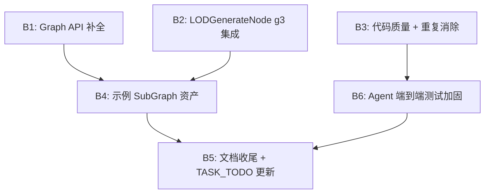

# 第9轮迭代任务计划

## 完成状态总结

| Batch | 标题 | 状态 | 关键变更 |
|-------|------|------|----------|
| B1 | Graph API CRUD 闭环 | **已完成** | AgentServer 新增 delete_node/disconnect_nodes/delete_graph/list_graphs + connect_nodes 端口校验 |
| B2 | LODGenerateNode g3 集成 | **已完成** | DecimateGeometry() 从约 130 行自研算法替换为 g3 Reducer（约 15 行） |
| B3 | 代码重复消除 | **已完成** | 提取 JsonHelper.cs 共享工具类 + HandleExecuteGraph 输出键名改用 NodeId 去重 |
| B4 | 示例 SubGraph | **已完成** | ExampleSubGraphGenerator.cs 编辑器脚本 + Examples/README.md |
| B5 | 文档收尾 | **已完成** | HandBook/AI_AGENT_GUIDE/OUTLINE 全部更新 |
| B6 | Agent 端到端测试加固 | **已完成** | AgentIntegrationTests 新增 10 个测试方法 |

---

## 当前状态快照

经过代码审查确认，第8轮迭代后的实际状态：

| 模块 | 状态 | 关键文件 |
|------|------|----------|
| 节点库 | 109 个节点全部有实现 | `NODE_TODO.md` 已更新为 100% |
| 测试 | 12 个测试文件均存在 | `Editor/Tests/` 目录完整 |
| Graph API | 8 个 Action 已实现 | `AgentServer.cs` 666 行 |
| WebSocket | 已集成 | `AgentServer.cs:111-153` |
| AgentSession | 已实现 | `AgentSession.cs` 45 行 |
| 示例资产 | **不存在** | 无 `Examples/` 目录 |
| LODGenerateNode | **仍用自研减面** | `LODGenerateNode.cs:133-261` | [1-cite-0](#1-cite-0) [1-cite-1](#1-cite-1) [1-cite-2](#1-cite-2) 

---

## 第9轮迭代主题：**Graph API 完善 + LOD g3 集成 + 示例 SubGraph 交付 + 文档收尾**



---

## JSON 任务计划表

```json
{
  "iteration": 9,
  "title": "Graph API 完善 + LOD g3 集成 + 示例 SubGraph 交付 + 文档收尾",
  "status": "planned",
  "batches": [
    {
      "batch_id": "B1",
      "title": "Graph API 补全 — 增删改查闭环",
      "priority": "P0",
      "description": "当前 AgentServer 的 Graph 操作只有 create/add/connect/set_param/execute/save/get_info/list_nodes 共 8 个 Action。缺少 delete_node、disconnect_nodes、delete_graph、list_graphs 等操作，AI Agent 在构建 SubGraph 时无法撤销错误操作。本 Batch 补齐这些缺失的 CRUD 操作，使 Graph API 形成完整闭环。",
      "tasks": [
        {
          "task_id": "B1-T1",
          "title": "新增 delete_node Action",
          "file": "Assets/PCGToolkit/Editor/Communication/AgentServer.cs",
          "description": "在 ProcessRequest 的 switch 中新增 'delete_node' case。实现 HandleDeleteNode 方法：根据 graph_id 获取 PCGGraphData，根据 node_id 找到目标节点，从 graph.Nodes 中移除该节点，同时移除所有与该节点相关的 Edge（即 Edge.OutputNodeId == node_id 或 Edge.InputNodeId == node_id 的边）。返回 { \"deleted\": true, \"edges_removed\": N }。",
          "request_format": {
            "action": "delete_node",
            "graph_id": "<string>",
            "node_id": "<string>"
          },
          "response_format": {
            "Success": true,
            "Data": "{ \"deleted\": true, \"edges_removed\": 2 }"
          },
          "acceptance_criteria": [
            "删除节点后 graph.Nodes 不再包含该 node_id",
            "与该节点相关的所有 Edge 被自动清理",
            "删除不存在的 node_id 返回错误响应",
            "删除不存在的 graph_id 返回错误响应"
          ],
          "dependencies": []
        },
        {
          "task_id": "B1-T2",
          "title": "新增 disconnect_nodes Action",
          "file": "Assets/PCGToolkit/Editor/Communication/AgentServer.cs",
          "description": "在 ProcessRequest 的 switch 中新增 'disconnect_nodes' case。实现 HandleDisconnectNodes 方法：根据 graph_id 获取 PCGGraphData，根据 output_node_id + output_port + input_node_id + input_port 四元组定位 Edge，从 graph.Edges 中移除。返回 { \"disconnected\": true }。",
          "request_format": {
            "action": "disconnect_nodes",
            "graph_id": "<string>",
            "output_node_id": "<string>",
            "output_port": "<string>",
            "input_node_id": "<string>",
            "input_port": "<string>"
          },
          "response_format": {
            "Success": true,
            "Data": "{ \"disconnected\": true }"
          },
          "acceptance_criteria": [
            "断开连接后 graph.Edges 不再包含该四元组匹配的边",
            "断开不存在的连接返回错误响应"
          ],
          "dependencies": []
        },
        {
          "task_id": "B1-T3",
          "title": "新增 delete_graph Action",
          "file": "Assets/PCGToolkit/Editor/Communication/AgentServer.cs",
          "description": "在 ProcessRequest 的 switch 中新增 'delete_graph' case。调用 session.RemoveGraph(request.GraphId)，释放内存中的 PCGGraphData 实例。返回 { \"deleted\": true }。",
          "request_format": {
            "action": "delete_graph",
            "graph_id": "<string>"
          },
          "response_format": {
            "Success": true,
            "Data": "{ \"deleted\": true }"
          },
          "acceptance_criteria": [
            "删除后 session.GetGraph(graphId) 返回 null",
            "删除不存在的 graph_id 返回错误响应"
          ],
          "dependencies": []
        },
        {
          "task_id": "B1-T4",
          "title": "新增 list_graphs Action",
          "file": "Assets/PCGToolkit/Editor/Communication/AgentServer.cs",
          "description": "在 ProcessRequest 的 switch 中新增 'list_graphs' case。调用 session.ListGraphIds()，返回当前内存中所有活跃图的 ID 和名称列表。",
          "request_format": {
            "action": "list_graphs"
          },
          "response_format": {
            "Success": true,
            "Data": "{ \"graphs\": [ { \"graph_id\": \"abc-123\", \"graph_name\": \"MyTool\", \"node_count\": 5 } ] }"
          },
          "acceptance_criteria": [
            "返回的列表包含所有通过 create_graph 创建且未被 delete_graph 删除的图",
            "每个条目包含 graph_id、graph_name、node_count"
          ],
          "dependencies": [],
          "note": "需要在 AgentSession.cs 中新增 GetGraphInfo 方法或在 AgentServer 中遍历 ListGraphIds 后逐个 GetGraph 获取信息"
        },
        {
          "task_id": "B1-T5",
          "title": "AgentSession 增强 — 支持 list_graphs 所需的元数据",
          "file": "Assets/PCGToolkit/Editor/Communication/AgentSession.cs",
          "description": "当前 AgentSession.ListGraphIds() 只返回 ID 列表。新增 ListGraphSummaries() 方法，返回 List<(string id, string name, int nodeCount)>，遍历 _activeGraphs 字典获取每个图的 GraphName 和 Nodes.Count。",
          "acceptance_criteria": [
            "ListGraphSummaries 返回的列表与 _activeGraphs 一致",
            "图被 RemoveGraph 后不再出现在列表中"
          ],
          "dependencies": []
        },
        {
          "task_id": "B1-T6",
          "title": "connect_nodes 增加端口存在性校验",
          "file": "Assets/PCGToolkit/Editor/Communication/AgentServer.cs",
          "method": "HandleConnectNodes()",
          "description": "当前 HandleConnectNodes 不校验端口是否存在，直接调用 graph.AddEdge。应在连线前通过 PCGNodeRegistry.GetNode(nodeType) 获取节点模板，检查 output_port 是否在 Outputs 中、input_port 是否在 Inputs 中。若端口不存在，返回明确的错误信息如 'Port geometry not found on node type Grid'。",
          "acceptance_criteria": [
            "连接不存在的端口名返回错误响应，包含端口名和节点类型",
            "连接存在的端口仍正常工作"
          ],
          "dependencies": []
        }
      ]
    },
    {
      "batch_id": "B2",
      "title": "LODGenerateNode 切换 g3 Reducer",
      "priority": "P0",
      "description": "LODGenerateNode.DecimateGeometry() 方法（第133-261行）包含约130行自研边坍缩减面算法，质量不如 g3 的 QEM Reducer。DecimateNode 已在第8轮成功切换到 g3，LODGenerateNode 应复用相同模式。",
      "tasks": [
        {
          "task_id": "B2-T1",
          "title": "重写 LODGenerateNode.DecimateGeometry() 使用 g3 Reducer",
          "file": "Assets/PCGToolkit/Editor/Nodes/Output/LODGenerateNode.cs",
          "method": "DecimateGeometry(PCGGeometry geo, float ratio)",
          "description": "将当前第133-261行的自研边坍缩算法替换为以下三步流程：(1) var dmesh = GeometryBridge.ToDMesh3(geo); (2) var reducer = new Reducer(dmesh); reducer.ReduceToTriangleCount(Mathf.Max(4, Mathf.FloorToInt(dmesh.TriangleCount * ratio))); (3) return GeometryBridge.FromDMesh3(dmesh); 需要在文件顶部添加 using g3; 和 using PCGToolkit.Core;（如果尚未引用）。保留 try-catch 包裹，异常时回退返回原始 geo.Clone()。",
          "current_code_location": "第133-261行，约130行自研代码",
          "target_code_pattern": "与 DecimateNode.cs 第56-97行的模式一致",
          "acceptance_criteria": [
            "DecimateGeometry 方法体缩减到约15行",
            "LOD0/1/2 面数递减，比例符合 lodRatio 参数",
            "无退化三角形（所有三角形三个顶点不重复）",
            "异常时不崩溃，回退返回原始几何体"
          ],
          "dependencies": [],
          "references": {
            "decimate_node_pattern": "Assets/PCGToolkit/Editor/Nodes/Topology/DecimateNode.cs:56-97",
            "geometry_bridge": "Assets/PCGToolkit/Editor/Core/GeometryBridge.cs:9-97"
          }
        }
      ]
    },
    {
      "batch_id": "B3",
      "title": "代码质量 — 消除重复 + 健壮性提升",
      "priority": "P1",
      "description": "AgentServer.cs 和 SkillExecutor.cs 各自包含一份完全相同的 ParseSimpleJson 方法（约50行）。应提取为共享工具方法。同时修复 AgentServer 中 WebSocket 只支持单客户端的限制。",
      "tasks": [
        {
          "task_id": "B3-T1",
          "title": "提取 ParseSimpleJson 为共享静态工具类",
          "files": [
            "Assets/PCGToolkit/Editor/Communication/AgentServer.cs",
            "Assets/PCGToolkit/Editor/Skill/SkillExecutor.cs"
          ],
          "description": "在 Assets/PCGToolkit/Editor/Core/ 下新建 JsonHelper.cs（或在已有的 PCGParamHelper.cs 中添加），将 ParseSimpleJson 方法移入为 public static 方法。然后将 AgentServer.cs 第618-665行和 SkillExecutor.cs 第86-133行的 ParseSimpleJson 替换为调用共享方法。",
          "acceptance_criteria": [
            "AgentServer 和 SkillExecutor 中不再有各自的 ParseSimpleJson 实现",
            "所有现有测试仍然通过",
            "新的共享方法位于 PCGToolkit.Core 命名空间"
          ],
          "dependencies": []
        },
        {
          "task_id": "B3-T2",
          "title": "AgentServer.Esc() 提取为共享方法",
          "file": "Assets/PCGToolkit/Editor/Communication/AgentServer.cs",
          "description": "AgentServer.Esc() 和 AgentServer.F() 是 JSON 字符串转义和浮点格式化的通用工具方法，当前为 private static。将它们移入 B3-T1 创建的 JsonHelper 类中，或保留在 AgentServer 中但改为 internal static，以便测试代码也能使用。",
          "acceptance_criteria": [
            "Esc 和 F 方法可被同 Assembly 的其他类访问"
          ],
          "dependencies": ["B3-T1"]
        },
        {
          "task_id": "B3-T3",
          "title": "HandleExecuteGraph 输出键名去重",
          "file": "Assets/PCGToolkit/Editor/Communication/AgentServer.cs",
          "method": "HandleExecuteGraph()",
          "description": "当前 HandleExecuteGraph（第517-562行）的输出 JSON 中，键名格式为 '{NodeType}_{OutputPort}'。如果图中有两个相同类型的节点（如两个 Box），会产生重复键名 'Box_geometry'。应改为 '{NodeId}_{OutputPort}' 或 '{NodeType}_{NodeId}_{OutputPort}' 以确保唯一性。",
          "current_code": "sb.Append($\"\\\"{Esc(nodeData.NodeType)}_{Esc(kvp.Key)}\\\": {{ \");",
          "target_code": "sb.Append($\"\\\"{Esc(nodeData.NodeId)}_{Esc(kvp.Key)}\\\": {{ \");",
          "acceptance_criteria": [
            "图中有两个相同类型节点时，输出 JSON 的键名不重复",
            "现有 EndToEnd_CreateBuildExecuteGraph 测试仍通过（该测试不检查具体键名格式）"
          ],
          "dependencies": []
        }
      ]
    },
    {
      "batch_id": "B4",
      "title": "创建示例 SubGraph 资产",
      "priority": "P1",
      "description": "项目当前没有任何示例 SubGraph 资产。用户（包括 AI Agent）无法参考现有示例来学习如何构建 SubGraph。本 Batch 通过 Graph API 的端到端调用创建 3 个示例 SubGraph，并保存为 .asset 文件。同时创建对应的 README 说明。",
      "tasks": [
        {
          "task_id": "B4-T1",
          "title": "创建 Examples 目录结构",
          "description": "在 Assets/PCGToolkit/ 下创建 Examples/ 目录，包含 Examples.meta 文件。在 Examples/ 下创建 SubGraphs/ 子目录。",
          "files_to_create": [
            "Assets/PCGToolkit/Examples/README.md",
            "Assets/PCGToolkit/Examples/SubGraphs/"
          ],
          "acceptance_criteria": [
            "Assets/PCGToolkit/Examples/ 目录存在",
            "Assets/PCGToolkit/Examples/README.md 存在，包含示例列表和使用说明"
          ],
          "dependencies": []
        },
        {
          "task_id": "B4-T2",
          "title": "示例1: ParametricTable SubGraph",
          "description": "通过代码（Editor 脚本或测试方法）构建一个 SubGraph 并保存为 .asset。图结构为：Grid(rows=4,columns=4) → Extrude(amount=0.1) → UVProject(mode=Box) → SavePrefab(path=Assets/Generated/Table.prefab)。在 Examples/README.md 中描述此示例的用途：'参数化桌面生成器，可调节网格密度和挤出高度'。",
          "graph_structure": {
            "nodes": [
              {"type": "Grid", "params": {"rows": 4, "columns": 4, "sizeX": 2.0, "sizeY": 2.0}},
              {"type": "Extrude", "params": {"amount": 0.1}},
              {"type": "UVProject", "params": {"mode": "Box"}},
              {"type": "SavePrefab", "params": {"path": "Assets/Generated/Table.prefab", "enabled": false}}
            ],
            "edges": [
              {"from": "Grid.geometry", "to": "Extrude.input"},
              {"from": "Extrude.geometry", "to": "UVProject.input"},
              {"from": "UVProject.geometry", "to": "SavePrefab.input"}
            ]
          },
          "output_file": "Assets/PCGToolkit/Examples/SubGraphs/ParametricTable.asset",
          "acceptance_criteria": [
            ".asset 文件可在 PCGGraphEditorWindow 中打开",
            "图包含 4 个节点和 3 条边",
            "执行图后 SavePrefab 节点（enabled=false）不实际输出文件"
          ],
          "dependencies": ["B4-T1"]
        },
        {
          "task_id": "B4-T3",
          "title": "示例2: TerrainScatter SubGraph",
          "description": "构建一个地形散布示例 SubGraph。图结构为：Grid(rows=20,columns=20,sizeX=10,sizeY=10) → Mountain(amplitude=2,frequency=0.3) → Scatter(count=50,seed=42) + Box(sizeX=0.3,sizeY=0.5,sizeZ=0.3) → CopyToPoints → SaveScene(enabled=false)。",
          "graph_structure": {
            "nodes": [
              {"type": "Grid", "params": {"rows": 20, "columns": 20, "sizeX": 10.0, "sizeY": 10.0}},
              {"type": "Mountain", "params": {"amplitude": 2.0, "frequency": 0.3}},
              {"type": "Scatter", "params": {"count": 50, "seed": 42}},
              {"type": "Box", "params": {"sizeX": 0.3, "sizeY": 0.5, "sizeZ": 0.3}},
              {"type": "CopyToPoints", "params": {}},
              {"type": "SaveScene", "params": {"enabled": false}}
            ],
            "edges": [
              {"from": "Grid.geometry", "to": "Mountain.input"},
              {"from": "Mountain.geometry", "to": "Scatter.input"},
              {"from": "Scatter.geometry", "to": "CopyToPoints.targetPoints"},
              {"from": "Box.geometry", "to": "CopyToPoints.sourceGeo"},
              {"from": "CopyToPoints.geometry", "to": "SaveScene.input"}
            ]
          },
          "output_file": "Assets/PCGToolkit/Examples/SubGraphs/TerrainScatter.asset",
          "acceptance_criteria": [
            ".asset 文件可在 PCGGraphEditorWindow 中打开",
            "图包含 6 个节点和 5 条边",
            "执行图后 CopyToPoints 输出的点数 >= 50"
          ],
          "dependencies": ["B4-T1"]
        },
        {
          "task_id": "B4-T4",
          "title": "示例3: BeveledWall SubGraph",
          "description": "构建一个倒角墙体模块示例。图结构为：Box(sizeX=3,sizeY=2,sizeZ=0.3) → PolyBevel(amount=0.05) → UVProject(mode=Box) → ExportMesh(enabled=false)。",
          "graph_structure": {
            "nodes": [
              {"type": "Box", "params": {"sizeX": 3.0, "sizeY": 2.0, "sizeZ": 0.3}},
              {"type": "PolyBevel", "params": {"amount": 0.05}},
              {"type": "UVProject", "params": {"mode": "Box"}},
              {"type": "ExportMesh", "params": {"enabled": false}}
            ],
            "edges": [
              {"from": "Box.geometry", "to": "PolyBevel.input"},
              {"from": "PolyBevel.geometry", "to": "UVProject.input"},
              {"from": "UVProject.geometry", "to": "ExportMesh.input"}
            ]
          },
          "output_file": "Assets/PCGToolkit/Examples/SubGraphs/BeveledWall.asset",
          "acceptance_criteria": [
            ".asset 文件可在 PCGGraphEditorWindow 中打开",
            "图包含 4 个节点和 3 条边"
          ],
          "dependencies": ["B4-T1"]
        },
        {
          "task_id": "B4-T5",
          "title": "编写 Examples/README.md",
          "file": "Assets/PCGToolkit/Examples/README.md",
          "description": "编写示例说明文档，包含：(1) 概述——这些示例展示了 PCG Toolkit 的典型工作流；(2) 每个示例的图结构 mermaid 图、节点参数说明、预期输出；(3) 使用方法——在 Unity 中双击 .asset 文件打开 PCGGraphEditorWindow，点击 Execute 执行；(4) 如何基于示例创建自己的 SubGraph。",
          "acceptance_criteria": [
            "README.md 包含 3 个示例的完整说明",
            "每个示例有 mermaid 流程图",
            "包含使用步骤说明"
          ],
          "dependencies": ["B4-T2", "B4-T3", "B4-T4"]
        }
      ]
    },
    {
      "batch_id": "B5",
      "title": "文档收尾 + 任务文档更新",
      "priority": "P1",
      "description": "OUTLINE.md 仍停留在第8轮迭代前的状态（显示 AI Agent Layer 75%、测试 50%），需要更新。HandBook.md 需要补充新增的 Graph API Action（delete_node/disconnect_nodes/delete_graph/list_graphs）。AI_AGENT_GUIDE.md 需要更新推荐工作流以包含删除/断开操作。TASK_TODO.md 需要记录第9轮迭代计划。",
      "tasks": [
        {
          "task_id": "B5-T1",
          "title": "更新 OUTLINE.md 完成度评估",
          "file": "Assets/PCGToolkit/TaskDocument/OUTLINE.md",
          "description": "将 OUTLINE.md 中的完成度数据更新为第9轮迭代后的状态。具体更新：(1) AI Agent Layer 从 75% 更新为 90%（Graph API 完整 CRUD）；(2) 测试从 50% 更新为 80%（12 个测试文件）；(3) 文档从 60% 更新为 85%；(4) 节点库从 90% 更新为 95%（LOD 已切换 g3）；(5) 新增'第9轮迭代成果'章节。",
          "acceptance_criteria": [
            "所有百分比数据反映第9轮迭代后的真实状态",
            "新增第9轮迭代成果描述"
          ],
          "dependencies": ["B1", "B2"]
        },
        {
          "task_id": "B5-T2",
          "title": "HandBook.md 补充新增 Action 文档",
          "file": "Assets/PCGToolkit/HandBook.md",
          "description": "在 HandBook.md 的'十二、AI Agent API'章节的 Action 列表表格中，新增 4 行：delete_node、disconnect_nodes、delete_graph、list_graphs。每行包含 Action 名称、说明、关键字段。在'端到端示例'部分补充一个包含删除操作的示例（如创建节点后发现类型错误，删除后重新添加）。",
          "acceptance_criteria": [
            "Action 列表表格包含 12 个 Action（原 8 + 新 4）",
            "每个新 Action 有请求格式说明",
            "端到端示例包含 delete_node 的使用"
          ],
          "dependencies": ["B1"]
        },
        {
          "task_id": "B5-T3",
          "title": "AI_AGENT_GUIDE.md 更新推荐工作流",
          "file": "Assets/PCGToolkit/AI_AGENT_GUIDE.md",
          "description": "在 AI_AGENT_GUIDE.md 的'推荐工作流'部分（第121-129行），更新为包含错误恢复流程的完整工作流。新增说明：当 AI Agent 发现连线错误时，可以使用 disconnect_nodes 断开错误连线后重新连接；当节点类型选错时，可以使用 delete_node 删除后重新 add_node。新增 list_graphs 的使用场景说明。",
          "acceptance_criteria": [
            "推荐工作流包含错误恢复步骤",
            "提及 delete_node、disconnect_nodes、list_graphs 的使用场景",
            "更新 Action 列表表格，从 8 个增加到 12 个"
          ],
          "dependencies": ["B1"]
        },
        {
          "task_id": "B5-T4",
          "title": "TASK_TODO.md 记录第9轮迭代计划",
          "file": "Assets/PCGToolkit/TaskDocument/TASK_TODO.md",
          "description": "在 TASK_TODO.md 中追加第9轮迭代的完整任务计划。保留第8轮迭代的内容作为历史记录，在其下方新增 '# 第9轮迭代任务计划' 章节，包含本 JSON 任务计划表的 Markdown 版本。",
          "acceptance_criteria": [
            "第8轮迭代内容保留不变",
            "新增第9轮迭代章节，包含 6 个 Batch 的描述",
            "每个 Batch 包含任务列表和验收标准"
          ],
          "dependencies": []
        },
        {
          "task_id": "B5-T5",
          "title": "OUTLINE.md 更新完成度评估",
          "file": "Assets/PCGToolkit/TaskDocument/OUTLINE.md",
          "description": "当前 OUTLINE.md 的量化统计表（第51-59行）仍显示第7轮迭代后的数据：AI Agent 通信层 75%、测试 50%、文档 60%。需要更新为第9轮迭代后的真实状态。同时更新 mermaid 图中的百分比标注。",
          "current_data": {
            "AI Agent 通信层": "75%（仅 HTTP，WebSocket 未实现）",
            "测试": "50%（5 个文件）",
            "文档": "60%"
          },
          "target_data": {
            "AI Agent 通信层": "95%（HTTP + WebSocket + 12 个 Action + 会话管理）",
            "测试": "85%（12 个测试文件）",
            "文档": "90%（HandBook 含完整 API 文档 + 示例 SubGraph）",
            "节点库": "95%（109 节点 + LOD 已切换 g3）"
          },
          "acceptance_criteria": [
            "量化统计表所有百分比反映第9轮迭代后的真实状态",
            "mermaid 图中 AI Agent Layer 从 75% 更新为 95%",
            "新增'第8轮迭代成果'和'第9轮迭代成果'章节",
            "删除'当前短板'中已解决的条目（如 WebSocket 已实现、测试已补全）"
          ],
          "dependencies": ["B1", "B2", "B4"]
        }
      ]
    },
    {
      "batch_id": "B6",
      "title": "Agent 端到端测试加固",
      "priority": "P1",
      "description": "第8轮迭代新增了 AgentIntegrationTests.cs 中的端到端测试，但仅覆盖了原有 8 个 Action。第9轮新增的 4 个 Action（delete_node/disconnect_nodes/delete_graph/list_graphs）需要对应的测试用例。同时需要补充错误路径测试（如删除不存在的节点、断开不存在的连线）。",
      "tasks": [
        {
          "task_id": "B6-T1",
          "title": "新增 delete_node Action 测试",
          "file": "Assets/PCGToolkit/Editor/Tests/AgentIntegrationTests.cs",
          "description": "新增测试方法 HandleRequest_DeleteNode_Success 和 HandleRequest_DeleteNode_NotFound。Success 测试：先 create_graph → add_node → delete_node，验证返回 deleted=true 且 get_graph_info 中不再包含该节点。NotFound 测试：对不存在的 node_id 调用 delete_node，验证返回 Success=false。",
          "acceptance_criteria": [
            "HandleRequest_DeleteNode_Success：删除后 get_graph_info 的 nodes 数组不包含被删节点",
            "HandleRequest_DeleteNode_NotFound：返回 Success=false，Error 包含 node_id",
            "HandleRequest_DeleteNode_CleansEdges：删除节点后相关的 Edge 也被清理"
          ],
          "dependencies": ["B1-T1"]
        },
        {
          "task_id": "B6-T2",
          "title": "新增 disconnect_nodes Action 测试",
          "file": "Assets/PCGToolkit/Editor/Tests/AgentIntegrationTests.cs",
          "description": "新增测试方法 HandleRequest_DisconnectNodes_Success 和 HandleRequest_DisconnectNodes_NotFound。Success 测试：先 create_graph → add_node × 2 → connect_nodes → disconnect_nodes，验证 get_graph_info 的 edges 数组为空。NotFound 测试：对不存在的连线调用 disconnect_nodes，验证返回错误。",
          "acceptance_criteria": [
            "HandleRequest_DisconnectNodes_Success：断开后 edges 数组不包含该连线",
            "HandleRequest_DisconnectNodes_NotFound：返回 Success=false"
          ],
          "dependencies": ["B1-T2"]
        },
        {
          "task_id": "B6-T3",
          "title": "新增 list_graphs Action 测试",
          "file": "Assets/PCGToolkit/Editor/Tests/AgentIntegrationTests.cs",
          "description": "新增测试方法 HandleRequest_ListGraphs。测试流程：create_graph × 2 → list_graphs → 验证返回 2 个图的信息 → delete_graph(第一个) → list_graphs → 验证返回 1 个图。",
          "acceptance_criteria": [
            "创建 2 个图后 list_graphs 返回 2 个条目",
            "每个条目包含 graph_id、graph_name、node_count",
            "删除 1 个图后 list_graphs 返回 1 个条目"
          ],
          "dependencies": ["B1-T3", "B1-T4"]
        },
        {
          "task_id": "B6-T4",
          "title": "端到端完整流程测试（含错误恢复）",
          "file": "Assets/PCGToolkit/Editor/Tests/AgentIntegrationTests.cs",
          "description": "新增测试方法 EndToEnd_GraphBuildWithErrorRecovery。模拟 AI Agent 的真实工作流：create_graph → add_node(Grid) → add_node(Box)（错误地添加了 Box） → delete_node(Box) → add_node(Subdivide) → connect_nodes(Grid→Subdivide) → set_param(Grid, rows=10) → execute_graph → 验证输出面数 > 100 → save_graph。",
          "acceptance_criteria": [
            "完整流程每步返回 Success=true",
            "delete_node 后 get_graph_info 仅包含 Grid 和 Subdivide",
            "execute_graph 返回的面数 > 100",
            "save_graph 成功（或在测试环境中验证不抛异常）"
          ],
          "dependencies": ["B1-T1", "B1-T2", "B1-T3", "B1-T4"]
        },
        {
          "task_id": "B6-T5",
          "title": "connect_nodes 端口校验测试",
          "file": "Assets/PCGToolkit/Editor/Tests/AgentIntegrationTests.cs",
          "description": "新增测试方法 HandleRequest_ConnectNodes_InvalidPort。测试：create_graph → add_node(Grid) → add_node(Subdivide) → connect_nodes(Grid, 'nonexistent_port', Subdivide, 'input') → 验证返回 Success=false 且 Error 包含端口名。",
          "acceptance_criteria": [
            "连接不存在的端口返回 Success=false",
            "Error 消息包含端口名和节点类型，便于 Agent 理解错误原因"
          ],
          "dependencies": ["B1-T6"]
        }
      ]
    }
  ],
  "execution_order": [
    {
      "phase": 1,
      "parallel_batches": ["B1", "B2", "B3-T1", "B3-T3"],
      "description": "Graph API 补全、LOD g3 集成、ParseSimpleJson 提取、HandleExecuteGraph 去重可并行执行，无相互依赖"
    },
    {
      "phase": 2,
      "parallel_batches": ["B3-T2", "B4", "B6"],
      "description": "B3-T2(Esc提取)依赖 B3-T1；B4(示例SubGraph)依赖 B1+B2；B6(测试)依赖 B1"
    },
    {
      "phase": 3,
      "parallel_batches": ["B5"],
      "description": "文档收尾依赖所有功能 Batch 完成"
    }
  ],
  "success_metrics": {
    "graph_api_completeness": "AgentServer.ProcessRequest 的 switch 包含 12 个 Action（原 8 + 新增 delete_node/disconnect_nodes/delete_graph/list_graphs），形成完整 CRUD 闭环",
    "lod_quality": "LODGenerateNode.DecimateGeometry() 使用 g3 Reducer，方法体 <= 20 行，输出无退化三角形",
    "code_quality": "ParseSimpleJson 仅存在于一个共享位置（JsonHelper.cs 或类似），AgentServer.cs 和 SkillExecutor.cs 中无重复实现",
    "examples": "Assets/PCGToolkit/Examples/SubGraphs/ 下存在 3 个 .asset 文件，每个可在 PCGGraphEditorWindow 中打开并执行",
    "documentation": "HandBook.md 的 Action 列表表格包含 12 行；AI_AGENT_GUIDE.md 的推荐工作流包含错误恢复步骤；OUTLINE.md 的百分比数据反映第9轮迭代后状态",
    "test_coverage": "AgentIntegrationTests.cs 包含 >= 5 个新增测试方法，覆盖所有 4 个新 Action + 1 个端到端错误恢复流程"
  },
  "risk_items": [
    {
      "risk": "AgentSession.RemoveGraph 调用 DestroyImmediate 可能在测试环境中引发问题",
      "mitigation": "在测试中使用 try-catch 包裹 RemoveGraph 调用，或在测试 TearDown 中统一清理"
    },
    {
      "risk": "HandleDeleteNode 删除节点时需要同步清理 Edges，PCGGraphData 可能没有提供 RemoveNode 方法",
      "mitigation": "检查 PCGGraphData 是否有 RemoveNode/RemoveEdge 方法；若无，在 HandleDeleteNode 中手动操作 graph.Nodes 和 graph.Edges 列表"
    },
    {
      "risk": "示例 SubGraph 的 .asset 文件需要通过 Editor 脚本创建，不能手写 YAML",
      "mitigation": "创建一个 Editor 菜单项或测试方法，通过 Graph API（create_graph → add_node → ... → save_graph）生成示例 .asset 文件"
    },
    {
      "risk": "HandleExecuteGraph 输出键名改为 NodeId 后，可能影响现有 Agent 的解析逻辑",
      "mitigation": "在响应中同时包含 node_id 和 node_type 字段，便于 Agent 识别"
    }
  ],
  "estimated_file_changes": {
    "modified": [
      "Assets/PCGToolkit/Editor/Communication/AgentServer.cs",
      "Assets/PCGToolkit/Editor/Communication/AgentSession.cs",
      "Assets/PCGToolkit/Editor/Communication/AgentProtocol.cs",
      "Assets/PCGToolkit/Editor/Nodes/Output/LODGenerateNode.cs",
      "Assets/PCGToolkit/Editor/Skill/SkillExecutor.cs",
      "Assets/PCGToolkit/Editor/Tests/AgentIntegrationTests.cs",
      "Assets/PCGToolkit/HandBook.md",
      "Assets/PCGToolkit/AI_AGENT_GUIDE.md",
      "Assets/PCGToolkit/TaskDocument/OUTLINE.md",
      "Assets/PCGToolkit/TaskDocument/TASK_TODO.md"
    ],
    "created": [
      "Assets/PCGToolkit/Editor/Core/JsonHelper.cs",
      "Assets/PCGToolkit/Examples/README.md",
      "Assets/PCGToolkit/Examples/SubGraphs/ParametricTable.asset",
      "Assets/PCGToolkit/Examples/SubGraphs/TerrainScatter.asset",
      "Assets/PCGToolkit/Examples/SubGraphs/BeveledWall.asset"
    ]
  }
}
```

---

## 关键依赖关系图

```mermaid
graph TD
    B1T1["B1-T1: delete_node"]
    B1T2["B1-T2: disconnect_nodes"]
    B1T3["B1-T3: delete_graph"]
    B1T4["B1-T4: list_graphs"]
    B1T5["B1-T5: AgentSession 增强"]
    B1T6["B1-T6: connect_nodes 端口校验"]

    B2T1["B2-T1: LOD g3 Reducer"]

    B3T1["B3-T1: ParseSimpleJson 提取"]
    B3T2["B3-T2: Esc 提取"]
    B3T3["B3-T3: ExecuteGraph 键名去重"]

    B4T1["B4-T1: Examples 目录"]
    B4T2["B4-T2: ParametricTable"]
    B4T3["B4-T3: TerrainScatter"]
    B4T4["B4-T4: BeveledWall"]
    B4T5["B4-T5: Examples README"]

    B5T1["B5-T1: OUTLINE.md"]
    B5T2["B5-T2: HandBook.md"]
    B5T3["B5-T3: AI_AGENT_GUIDE.md"]
    B5T4["B5-T4: TASK_TODO.md"]
    B5T5["B5-T5: OUTLINE.md 完成度"]

    B6T1["B6-T1: delete_node 测试"]
    B6T2["B6-T2: disconnect_nodes 测试"]
    B6T3["B6-T3: list_graphs 测试"]
    B6T4["B6-T4: 端到端错误恢复测试"]
    B6T5["B6-T5: 端口校验测试"]

    B1T5 --> B1T4
    B3T1 --> B3T2

    B1T1 --> B6T1
    B1T2 --> B6T2
    B1T3 --> B6T3
    B1T4 --> B6T3
    B1T1 --> B6T4
    B1T6 --> B6T5

    B4T1 --> B4T2
    B4T1 --> B4T3
    B4T1 --> B4T4
    B4T2 --> B4T5
    B4T3 --> B4T5
    B4T4 --> B4T5

    B1T1 --> B5T2
    B1T2 --> B5T2
    B1T3 --> B5T2
    B1T4 --> B5T2
    B1T1 --> B5T3
    B2T1 --> B5T5
    B6T1 --> B5T5
```



## 各 Batch 验收检查清单

| Batch | 验收方式 | 通过标准 |
|-------|----------|----------|
| **B1** | `curl` 发送 `delete_node` / `disconnect_nodes` / `delete_graph` / `list_graphs` | 每个 Action 返回正确的 `Success` 状态和预期数据 |
| **B2** | 在编辑器中执行 LODGenerate 节点 | LOD0/1/2 面数递减，`DecimateGeometry` 方法体 <= 20 行 |
| **B3** | `grep -rn "ParseSimpleJson" Assets/PCGToolkit/Editor/` | 仅在 `JsonHelper.cs` 中出现一次定义 |
| **B4** | 在 PCGGraphEditorWindow 中双击打开 `.asset` | 3 个示例图结构完整，可执行 |
| **B5** | 审查 HandBook.md Action 列表 | 包含 12 个 Action，OUTLINE.md 百分比已更新 |
| **B6** | Unity Test Runner 运行 AgentIntegrationTests | 新增 5 个测试方法全部通过，0 failures | [2-cite-0](#2-cite-0) [2-cite-1](#2-cite-1) [2-cite-2](#2-cite-2) [2-cite-3](#2-cite-3) [2-cite-4](#2-cite-4) [2-cite-5](#2-cite-5) [2-cite-6](#2-cite-6) [2-cite-7](#2-cite-7) [2-cite-8](#2-cite-8) [2-cite-9](#2-cite-9)